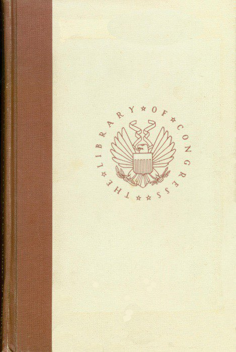

.. -*- encoding: utf-8 -*-

.. meta::
   :PG.Id: 36021
   :PG.Title: The Negro in the United States; a selected bibliography. Compiled by Dorothy B. Porter
   :PG.Released: 2011-05-02
   :PG.Rights: Public Domain
   :PG.Producer: Suzanne Shell and the Online Distributed Proofreading Team at http://www.pgdp.net
   :DC.Creator: Dorothy B. Porter
   :DC.Title: The Negro in the United States; a selected bibliography. Compiled by Dorothy B. Porter
   :DC.Language: en
   :DC.Created: 1970

==============================
THE NEGRO IN THE UNITED STATES
==============================

.. _pg-header:

.. container::
   :class: pgheader

   .. style:: paragraph
      :class: noindent

   This eBook is for the use of anyone anywhere at no cost and with
   almost no restrictions whatsoever. You may copy it, give it away or
   re-use it under the terms of the `Project Gutenberg License`_
   included with this eBook or online at
   http://www.gutenberg.org/license.

   

   |

   .. _pg-machine-header:

   .. container::

      Title: The Negro in the United States; a selected bibliography. Compiled by Dorothy B. Porter
      
      Author: Dorothy B. Porter
      
      Release Date: May 02, 2011 [EBook #36021]
      
      Language: English
      
      Character set encoding: UTF-8

      |

      .. _pg-start-line:

      \*\*\* START OF THIS PROJECT GUTENBERG EBOOK THE NEGRO IN THE UNITED STATES; A SELECTED BIBLIOGRAPHY. COMPILED BY DOROTHY B. PORTER \*\*\*

   |
   |
   |
   |

   .. _pg-produced-by:

   .. container::

      Produced by Suzanne Shell and the Online Distributed Proofreading Team at http://www.pgdp.net.

      |

      


   | *A Selected Bibliography*
   |
   | *Compiled by* DOROTHY B. PORTER
   |
   | *Librarian of the Negro Collection, Howard University*
   |
   | LIBRARY OF CONGRESS · WASHINGTON · 1970
   |
   | L.C. Card 78-606085
   |
   | For sale by the Superintendent of Documents,
     U.S. Government Printing Office, Washington D.C. 20402.
   |
   | Price $3.25



.. contents:: CONTENTS
   :backlinks: entry

.. class:: center larger

   THE NEGRO IN THE UNITED STATES

   BIBLIOGRAPHY

PREFACE
=======

The career of Daniel Alexander Payne Murray, who served as a member of
the staff in various capacities "up to an assistant librarian" from 1871
to 1922, is a natural starting point for a discussion of Negro materials
in the Library of Congress. While serving in his first position in the
Library, as a personal assistant to the Librarian, Ainsworth R.
Spofford, Mr. Murray undertook the systematic study of "the origin and
historical growth of the colored race throughout the civilized world,"
which he hoped would result in an encyclopedic history of his race.
Almost 30 years later, he was chosen by Herbert Putnam, then just
beginning his career as Librarian, to respond to a request from
Ferdinand W. Peck, Commissioner General of the United States to the
Paris exposition of 1900, that a collection of books and pamphlets by
Afro-American authors be made a feature of the American exhibit at the
exposition. Within a period of 2 weeks, Mr. Murray prepared a
preliminary list of 223 works written by 152 Negro authors. The purpose
of this list was to aid in securing a copy of "every book and pamphlet
in existence, by a Negro Author, the same to be used in connection with
the exhibit of Negro Authorship in the Paris Exposition of 1900, and
later placed in the Library of Congress."

It was soon discovered that, owing to Dr. Spofford's foresight, the
Library of Congress was "uncommonly rich in such books and pamphlets,"
but "no little difficulty was encountered then and subsequently in
identifying them." By the time the world exposition at Paris opened in
May 1900, however, Mr. Murray had located 1,100 titles written by Negro
authors, of which about 500 were forwarded to the exposition. Thomas J.
Calloway, special agent for the U.S. Commission at the exposition, wrote
that "the most creditable showing in the exhibit is by Negro authors
collected by Mr. Daniel Murray of the library of Congress."

After the close of the Paris exposition, Mr. Murray continued to collect
works by Afro-American, Afro-European, and West Indian authors and to
amass a varied collection of Afro-Americana. At his death in 1925, the
library of Congress received by provision of his will a unique
collection of some "1,448 volumes and pamphlets, 14 broadsides, and 1
map, with the idea that it should form part of the material especially
selected by him for exhibit purposes." The books that had been sent to
the Paris exposition were kept together upon their return to the
Library. This small collection, along with Mr. Murray's bequest and a
few volumes presented to the library by Mrs. Anna Murray after her
husband's death, became the "Colored Author Collection." Many of the
titles have since been cataloged and added to the general collections.

*The Preliminary List of Books and Pamphlets by Negro Authors, for
Paris Exposition and Library of Congress* (1900), compiled by Daniel
Murray, appears to have been the first effort on the part of the Library to
draw attention to works by and about Negroes.

In 1906 Appleton Prentiss Clark Griffin, chief of the Division of
Bibliography, directed the compilation of a *Select List of References
on the Negro Question*, published by the library. It contained entries
for 232 books and 286 periodical articles published during the period
1879-1906. The library also published in the same year a *List of
Discussions of the Fourteenth and Fifteenth Amendments*, which comprised
103 entries. Both bibliographies included titles relating primarily to
Negro suffrage and the Negro in the South and were compiled to "meet
requests by letter upon topics of current interest."

In 1940, for the 75th anniversary of the proclamation of the 13th
amendment to the Constitution of the United States, which abolished
slavery, the Library prepared and issued a bibliography of its special
materials on the Negro. In connection with this anniversary, the Library
also mounted an exhibition of books, manuscripts, and works of art and
arranged a series of concerts. The festival of music and the exhibits
that opened on December 18, 1940, vividly presented the contribution of
the American Negro to American culture.

Without question both scholars and the general public are aware that the
Library of Congress has extensive holdings on the Negro, not only
printed books and periodicals but also manuscripts, music, prints,
photographs, motion pictures, and sound recordings. This awareness is
reflected in the steady flow of requests for bibliographies and other
guides to Negro studies that the Library receives. The factors that
stimulate such requests are rooted in the national—indeed, the
worldwide—interest in the American Negro which recent social and
cultural events in this country have intensified. For many years the
Library has responded to this interest by issuing from time to time
typed lists relating to various aspects of Negro life.

The mounting interest in Negro history and culture, manifested particularly
by the introduction of courses in these subjects in high school,
college, and university curricula, has given rise to a demand for lists of
books that can be used to support such studies. The present bibliography
is designed to meet the current needs of students, teachers, librarians,
researchers, and the general public for introductory guidance to the study
of the Negro in the United States.

This bibliography is selective rather than exhaustive. Among the topics
covered are the urban Negro, relations between the races, discriminatory
practices in all areas, and efforts to obtain political and economic
freedom, as well as the education and cultural history of the Negro, his
religious life, the social conditions under which he lives, and his
historical past. Included are works depicting the lives of outstanding
Negroes—abolitionists, fugitive slaves, educators, civil rights leaders,
scientists, journalists, religious leaders, artists, athletes, and
literary figures.

The selection of many of the titles, especially in the fields of
literature and history, was based on the frequency of requests for
particular works in large library collections on the Negro and on their
inclusion in the numerous bibliographies and reading lists now being
compiled for use in junior colleges, colleges, and universities. In
addition, bibliographic lists and essays appended to such works as *From
Slavery to Freedom*, by John Hope Franklin; *North of Slavery*, by Leon
F. Litwack; *The Burden of Race: a Documentary History of Negro-White
Relations in America*, by Gilbert Osofsky; *The Negro in the Civil War*,
by Benjamin Quarles; *The Black Power Revolt*, edited by Floyd B.
Barbour; and *The Negro in the United States*, by E. Franklin Frazier,
were consulted. Use was also made of previously published bibliographies
such as Monroe Work's *Bibliography of the Negro in Africa and America*
and Erwin A. Salk's *A Layman's Guide to Negro History*.

While some books written especially for children and young people are
included, and some of the other publications cited are well adapted to
their use, no systematic effort was made to represent material of this
type. Lists such as Miles M. Jackson's *Bibliography of Negro History &
Culture for Young Readers* may be used as guides in this field.

Identification of writers by race has not been attempted except in the
section on fiction, which lists only novels and short stories written by
representative Negro authors. While the writings of white novelists are
not cited, the importance of the treatment of Negro characters and the
educational, moral, and artistic value of works by such authors as
Howard Fast, William Faulkner, Harper Lee, Du Bose Heyward, Julia
Peterkin, Lillian Smith, Harriet Beecher Stowe, T. S. Stribling, and
Mark Twain are undisputed. Apart from fiction, the publications of both
white and Negro writers are included throughout the bibliography.

The compiler gratefully acknowledges the invaluable editorial assistance
of Mary Jane Gibson, assistant head of the Bibliography and Reference
Correspondence Section, General Reference and Bibliography Division,
Library of Congress. Miss Gibson also prepared the index. The compiler
wishes to express her appreciation as well to Ruth S. Freitag, head of the
Bibliography and Reference Correspondence Section, for helpful suggestions
and for assistance in indexing and proofreading, and to Robert H.
Land, chief of the General Reference and Bibliography Division, for
emphasizing the need for the bibliography and offering encouragement
while the work was in progress.

.. class:: right

   Dorothy B. Porter

*April 1969*

NOTE TO THE USER
================

*Scope.* The emphasis of this bibliography is on recent monographs in
the collections of the library of Congress, although a number of
important older works, a few periodicals, and several titles from the
holdings of other American libraries are included.

*Arrangement.* Entries are arranged alphabetically by author under broad
subject headings that reveal the Negro's part in numerous aspects of
American life, culture, and history. An index of names and subjects is
provided.

*Annotations.* Entries have been given brief annotations where
clarification seemed necessary. Because of the increasing importance for
the building of library collections of scholarly reprints of long
unavailable classics in Negro literature and history, indication of
reprint editions has been made where possible.

.. _`call numbers`:

*Call numbers and location symbols.* Location of items is indicated either
by a Library_ of Congress call number or location symbol, or, for material
in another library, by the National Union Catalog symbol for that library.
A key to the symbols used is given on the next page.

KEY TO SYMBOLS
==============

::

    DHU  Howard University, Washington, D.C.

    DLC  Library of Congress (uncataloged)

    DLC-LL  Library of Congress, Law Library (unclassified)

    FU  University of Florida, Gainesville

    ICN  Newberry Library, Chicago, Ill.

    ICU  University of Chicago

    MH  Harvard University, Cambridge, Mass.

    NNC  Columbia University, New York, N.Y.

    NcD  Duke University, Durham, N.C.

    NcU  University of North Carolina, Chapel Hill

    PSt  Pennsylvania State University, University Park

    TxU  University of Texas, Austin

    Vi  Virginia State Library, Richmond

.. class:: center larger

   **BIBLIOGRAPHY**

01—REFERENCE SOURCES—Bibliographies, Guides, Indexes
====================================================

.. _1:

  |   1
  | Abrahamson, Julia. Race relations; a selected list of readings on
    racial and cultural minorities in the United States, with special
    emphasis on Negroes, by Julia Waxman. Chicago, Julius Rosenwald
    Fund, 1945. 47 p. [Z1361.N39A3] [TR: Waxman, Julia. (New York
    State Library C, 016.3231, W35).]


.. _2:

  |   2
  | Baker, Augusta. Books about Negro life for children. Rev. New York,
    New York Public Library, 1963. 33 p. Z1361.N39B2 1963
  |   A new edition is in preparation.

.. _3:

  |   3
  | Bennett, Elaine C. Calendar of Negro-related documents in the
    records of the Committee for Congested Production Areas in the
    National Archives. Prepared for the Committee on Negro Studies of
    the American Council of Learned Societies: Washington, American
    Council of Learned Societies, 1949. 100 leaves. E185.6.B47

.. _`3a`:

  |   3a
  | Bibliographic survey: the Negro in print, v. 1+ May 1965+
    Washington, Negro Bibliographic and Research Center, bimonthly.
    Z1361.N39N39
  |   At head of title, May 1965-Mar. 1968: Bibliographic Survey.
  |   Title varies: May 1965-Mar. 1968, *The Negro in Print*.
  |   An annotated list of fiction and nonfiction, paperbacks, and books
      for young readers, with occasional periodical articles and
      references on poetry and art.

.. _4:

  |   4
  | Brooks, Alexander D. Civil rights and liberties in the United
    States, an annotated bibliography. With a selected list of fiction
    and audio-visual materials collected by Albert A. Alexander and
    Virginia H. Ellison. New York, Civil Liberties Educational
    Foundation, c1962. 151 p. Z7164.L6B7

.. _5:

  |   5
  | Brown, Warren H. Check list of Negro newspapers in the United
    States (1827-1946). Jefferson City, Mo., School of Journalism,
    Lincoln University, 1946. 37 p. (Lincoln University journalism
    series, no. 2) [Z6951.B88] Z6944.N39B7


.. _6:

  |   6
  | Chapman, Abraham. The Negro in American literature, and a
    bibliography of literature by and about Negro Americans. Stevens
    Point, Wisconsin State University [c1966] 135 p. (Wisconsin Council
    of Teachers of English. Special publication, no. 15) DHU; TxU

.. _7:

  |   7
  | Dickinson, Donald C. A bio-bibliography of Langston Hughes,
    1902-1967. With a preface by Arna Bontemps. [Hamden, Conn.]
    Archon Books, 1967. 267 p. port. PS3515.U274Z62
  |   An expansion of the author's dissertation, University of Michigan.
  |   Bibliography: p. 257-262.

.. _8:

  |   8
  | Dodds, Barbara. Negro literature for high school students.
    [Champaign, Ill.] National Council of Teachers of English [1968]
    157 p. Z1361.N39D62 [TR: Stanford, Barbara Dodds.]

.. _9:

  |   9
  | DuBois, William E. B., *ed.* A select bibliography of the Negro
    American. A compilation made under the direction of Atlanta
    University, together with the Proceedings of the Tenth Conference
    for the Study of the Negro Problems, held at Atlanta University,
    on May 30, 1905. 3d ed. Atlanta, Atlanta University Press, 1905.
    71 p. (Atlanta University publications, no. 10) E185.5.A88 v. 10
    [Z1361.N39D85]

.. _10:

  |   10
  | Dumond, Dwight L. A bibliography of antislavery in America. Ann
    Arbor, University of Michigan Press [1961] 119 p. Z1249.S6D8

.. _11:

  |   11
  | Ellis, Ethel M. V., *comp.* The American Negro: a selected
    checklist of books. Washington, Negro Collection, Howard
    University Library, 1968. 46 leaves. Z1361.N39E4 [TR: Ellis, Ethel
    M. Vaughan.]


.. _12:

  |   12
  | Guzman, Jessie P. George Washington Carver, a classified
    bibliography. Tuskegee Institute, Ala. Dept. of Records and
    Research, Tuskegee Institute, 1953 [i.e. 1954] 26 p. (Records and
    research pamphlet no. 3) Z8150.7.G8 [TR: Guzman, Jessie Parkhurst]

.. _13:

  |   13
  | Hall, Woodrow W. A bibliography of the Tuskegee gerrymander
    protest; pamphlets, magazine and newspaper articles
    chronologically arranged. Tuskegee Institute, Ala., Dept. of
    Records and Research, Tuskegee Institute, 1960. 54 leaves.
    (Records and research pamphlet no. 8) DLC [TR: Z7164.R4H28]


.. _14:

  |   14
  | Hampton Institute, *Hampton, Va. Collis P. Huntington Library.* A
    classified catalogue of the Negro collection in the Collis P.
    Huntington Library, Hampton Institute. Compiled by workers of the
    Writers' Program of the Works Projects Administration in the State
    of Virginia. Sponsored by Hampton Institute. [n.p.] 1940. 255, [35]
    p. Z1361.N39H3 [TR: Collis P. Huntington Library (Hampton
    Institute) 1971]


.. _15:

  |   15
  | Haywood, Charles. A bibliography of North American folklore and
    folksong. 2d rev. ed. v. 1. The American people north of Mexico,
    including Canada. New York, Dover Publications [1961] xxx, 748 p.
    maps (on lining papers) Z5984.U5H32 v. 1
  |   Section on the Negro: p. 430-560.

.. _16:

  |   16
  | Heartman, Charles F. Phillis Wheatley (Phillis Peters); a critical
    attempt and a bibliography of her writings. New York, For the
    author, 1915. 44 p. facsims. (part fold.), port. (Heartman's
    historical series, no. 7) PS866.W5Z6
  |   "The following essay was written by me originally in German ... now
      translated by another person."
  |   "A short list of books with contents relating to Phillis Wheatley":
      [1] p. at end.

.. _17:

  |   17
  | Historical Records Survey. *District of Columbia.* Calendar of the
    writings of Frederick Douglass in the Frederick Douglass memorial
    home, Anacostia, D. C. Prepared by District of Columbia Historical
    Records Survey, Division of Professional and Service Projects, Work
    Projects Administration. Sponsored by the Board of Commissioners of
    the District of Columbia. Washington, District of Columbia
    Historical Records Survey, 1940.93 leaves. Z6616.D7H57

.. _18:

  |   18
  | Howard University, *Washington, D. C. Library. Moorland
    Foundation*. The Arthur B. Spingarn collection of Negro authors.
    Washington [1948] [12] p. facsim. Z733.W31M6

.. _`18a`:

  |   18a
  | Hussey, Edith L., Mary Henderson, *and* Barbara Marx. The Negro
    American; a reading list. [New York, Dept. of Racial and Cultural
    Relations, National Council of Churches of Christ in the USA, 1957]
    40 p. (Interracial publication, no. 96) Z1361.N39I5 no. 96

.. _`18b`:

  |   18b
  | Index to periodical articles by and about Negroes. Mar. 1950+
    Boston, G. K. Hall, quarterly. A13.O4 [TR: E185.5.I55M]
  |   Vols. for 1961+ called v. 2+
  |   Title varies: Mar. 1950-summer 1954, *Index to Selected Negro
      Periodicals*.—Fall 1954-fall 1965, *Index to Selected
      Periodicals*.
  |   Vols. for 1960+ compiled by Hallie Q. Brown Memorial Library,
      Central State College, Wilberforce, Ohio, and the Schomburg
      Collection, New York Public Library.
  |   Vols. for Mar. 1950-fall 1959 issued by the Library, Central
      State College (called Mar.-Dec. 1950 College of Education and
      Industrial Arts).
  |   Decennial cumulation, 1950-59; annual cumulation, 1960+

.. _19:

  |   19
  | Jackson, Miles M. A bibliography of Negro history & culture for
    young readers. Assisted by Mary W. Cleaves and Alma L. Gray.
    [Pittsburgh] University of Pittsburgh Press, published for Atlanta
    University [c1969] xxxi, 134 p. Z1361.N39J3

.. _20:

  |   20
  | Johnson, Clifton H., *and* Carroll G. Barber. The Negro American, a
    selected and annotated bibliography for high schools and junior
    colleges. Nashville, Tenn., Amistad Research Center [c1968] 113 p.
    DHU

.. _21:

  |   21
  | Kaplan, Louis. A bibliography of American autobiographies, compiled
    by Louis Kaplan in association with James Tyler Cook, Clinton E.
    Colby, Jr. [and] Daniel C. Haskell. Madison, University of
    Wisconsin Press, 1961. 372 p. Z1224.K3
  |   See the index for autobiographies relating to the Negro.

.. _22:

  |   22
  | Koblitz, Minnie W. The Negro in schoolroom literature; resource
    materials for the teacher of kindergarten through the sixth grade.
    [New York, Center for Urban Education, 1967?] 67 p. Z1037.K6
  |   "Research ... was performed pursuant to a contract with the United
      States Department of Health, Education, and Welfare, Office of
      Education."

.. _23:

  |   23
  | Lancaster, Emmer M. A guide to Negro marketing information.
    [Washington] U.S. Dept. of Commerce, Business and Defense Services
    Administration; [for sale by the Supt. of Docs., U.S. Govt. Print.
    Off.] 1966. 50 p. illus. HC110.C6L3
  |   Bibliography: p. 7-20.

.. _24:

  |   24
  | Lewinson, Paul. A guide to documents in the National Archives: for
    Negro studies, compiled for the Committee on Negro Studies of the
    American Council of Learned Societies. Washington, 1947. 28 p.
    (American Council of Learned Societies Devoted to Humanistic
    Studies. Committee on Negro Studies. Publications, no. 1) NNC

.. _25:

  |   25
  | McNamee, Lawrence F. Dissertations in English and American
    literature; theses accepted by American, British, and German
    universities, 1865-1964. New York, Bowker, 1968. 1124 p. Z5O53.M32
  |   Chapter 32 is on Negro literature.

.. _26:

  |   26
  | Merriam, Alan P. A bibliography of jazz. With the assistance of
    Robert J. Brenford. Philadelphia, American Folklore Society, 1954.
    145 p. (Publications of the American Folklore Society.
    Bibliographical series, v. 4, 1954) ML128.J3M4

.. _27:

  |   27
  | Miller, Elizabeth W. The Negro in America; a bibliography compiled
    for the American Academy of Arts and Sciences. With a foreword by
    Thomas F. Pettigrew. Cambridge, Harvard University Press, 1966.
    xvii, 190 p. Z1361.N39M5

.. _28:

  |   28
  | Murray, Daniel A. P. Preliminary list of books and pamphlets by
    Negro authors, for Paris Exposition and Library of Congress.
    [Washington, U.S. Commission to the Paris Exposition, 1900] 8 p.
    Z1361.N39M9

.. _29:

  |   29
  | National Association for the Advancement of Colored People.
    *Education Dept.* Integrated school books; a descriptive
    bibliography of 399 pre-school and elementary school texts and
    story books. New York, NAACP Special Contribution Fund, 1967. 55 p.
    Z5814.D5N3

.. _30:

  |   30
  | National Council of the Churches of Christ in the United States of
    America. *Division of Christian Education.* Negro heritage resource
    guide; a bibliography of the Negro in contemporary America. [New
    York, Council Press, c1967] 21 p. Z1361.N39N16

.. _31:

  |   31
  | National Urban League. *Dept. of Research and Community Projects.*
    Selected bibliography on the Negro. New York, Dept. of Research,
    National Urban League, 1937. 13 leaves. Z1361.N39N18
  |   —— —— Supplement, no. 1. Compiled by the Dept. of Research,
      National Urban League. [New York, 1938] 13 leaves. Z1361.N39N18
      Suppl.

.. _32:

  |   32
  | New Jersey Library Association. *Bibliography Committee.* New
    Jersey and the Negro; a bibliography, 1715-1966. [Trenton] 1967.
    196 p. Z1361.N39N45

.. _33:

  |   33
  | New York Public Library. The Negro; a list of significant books.
    Compiled by Dorothy R. Homer. 8th rev. ed. New York, 1960. 25 p.
    DHU [TR: Z1361.N39N52 1965]

.. _34:

  |   34
  | New York. Public Library. *Schomburg Collection of Negro Literature
    and History.* Dictionary catalog. Boston, G.K. Hall, 1962. 9 v.
    (8473 p.) Z881.N592S35
  |   A first supplement (2 v.) was published in 1968.


.. _35:

  |   35
  | Oberlin College. *Library.* A classified catalogue of the
    collection of anti-slavery propaganda in the Oberlin College
    Library, compiled by Geraldine Hopkins Hubbard, edited by Julian
    S. Fowler. [Oberlin] 1932. 84 p. (*Its* Bulletin, v. 2, no. 3)
    Z1249.S6O2
  |   "Formed the bibliographical portion of a thesis submitted in June,
      1932, in partial fulfillment of the requirements for the degree of
      master of arts at Oberlin College."—Preface.
  |   "The main list contains all printed items ... which can be classed
      as American anti-slavery propaganda published before January 1,
      1863....
  |   An appendix describes the smaller collections of pro-slavery
      literature and of the British anti-slavery propaganda."

.. _36:

  |   36
  | Porter, Dorothy B. Early American Negro writings: a bibliographical
    study. *In* Bibliographical Society of America. Papers, v. 39, 3d
    quarter 1945: 192-268. Z1008.B51P, v. 39 [TR: Wesley, Dorothy
    Porter, 1905-1995.]


.. _37:

  |   37
  | Porter, Dorothy B. North American Negro poets, a bibliographical
    check-list of their writings, 1760-1944. Hattiesburg, Miss., Book
    Farm, 1945. 90 p. ([Heartman's historical series, no. 70])
    Z1361.N39P6 [TR: Wesley, Dorothy Porter, 1905-1995.]
  |   A new edition is in preparation.

.. _`37a`:

  |   37a
  | Porter, Dorothy B., *and* Ethel M. V. Ellis, *comps.* The journal
    of Negro education. Index to vols. 1-31, 1932-1962. Washington,
    Howard University Press, 1963. 82 p. DHU

.. _38:

  |   38
  | [Pride, Armistead S.] Negro newspapers on microfilm; a selected
    list. Washington, Library of Congress, Photoduplication Service,
    1953. 8 p. Z6944.N39P7

.. _39:

  |   39
  | Princeton University. *Program in American Civilization.* The Negro
    in America; bibliographies, conference 1966. [Lincoln University,
    Pa., American Studies Institute, c1966] 90 p. DLC

.. _40:

  |   40
  | Reid, Ira De A. Negro youth, their social and economic backgrounds;
    a selected bibliography of unpublished studies, 1900-1938.
    Washington, American Youth Commission of the American Council on
    Education [c1939] 71 leaves. Z1361.N39R35
  |   Largely unpublished theses of a selected list of colleges and
      universities in the United States.

.. _41:

  |   41
  | Reisner, Robert G. The literature of jazz, a selective
    bibliography. With an introduction by Marshall W. Stearns. [2d ed.
    rev. and enl.] New York, New York Public Library, 1959. 63 p.
    ML128.J3R4 1959

.. _42:

  |   42
  | Rollins, Charlemae H., *ed.* We build together; a reader's guide to
    Negro life and literature for elementary and high school use.
    Contributors: Augusta Baker [and others] 3d ed. [Champaign, Ill.,
    National Council of Teachers of English, 1967] xxviii, 71 p.
    Z1361.N39R77 1967 [TR: [1941?]]


.. _43:

  |   43
  | Ross, Frank A., *and* Louise V. Kennedy. A bibliography of Negro
    migration. New York, Columbia University Press, 1935. 251 p.
    Z1361.N39R8
  |   Annotated.
  |   "The fifth volume produced under the project, Negro Migration,
      conducted in the Department of Sociology at Columbia University,
      under subsidy by the Social Science Research Council, and the
      Columbia University Council for Research in the Social
      Sciences."—Preface.
  |   "Bibliographies": p. [191]-194.

.. _44:

  |   44
  | Salk, Erwin A. A layman's guide to Negro history. Chicago,
    Quadrangle Books, 1966. xviii, 170 p. port. Z1361.N39S23

.. _45:

  |   45
  | Scally, Mary Anthony, *Sister*. Negro Catholic writers, 1900-1943,
    bio-bibliography. Detroit, W. Romig [1945] 152 p. Z1361.N39S35
  |   "Sources": p. 11-12.

.. _46:

  |   46
  | Schomburg, Arthur A., *comp.* A bibliographical checklist of
    American Negro poetry. New York, L. F. Heartman, 1916. 57 p.
    (Bibliographica americana; a series of monographs, v. 2)
    Z1231.P7S3  [TR: Z1361.N39S37]
  |   "Bibliography of the poetical works of Phillis Wheatley
      (copyrighted by Charles F. Heartman) [reprinted from Heartman's
      'Phillis Wheatley (Phillis Peters)']": p. 47-57.

.. _47:

  |   47
  | Sieg, Vera. The Negro problem: a bibliography. Madison, Wis., 1908.
    22 p. (Wisconsin Free Library Commission. American social
    questions, no. 1) Z7164.S66A5, no. 1 [Z1361.N39S5]
  |   Prepared in fulfillment of requirements for graduation, Wisconsin
      Library School.

.. _48:

  |   48
  | Spangler, Earl. Bibliography of Negro history: selected and
    annotated entries, general and Minnesota. Minneapolis, Ross and
    Haines, 1963. 101 p. Z1361.N39S65

.. _49:

  |   49
  | Texas. Southern University, *Houston. Library*. Heartman Negro
    collection; catalogue, v. 1. Houston [1955?] 1 v. (unpaged)
    [Z881.H84]

.. _50:

  |   50
  | Thompson, Edgar T., *and* Alma M. Thompson. Race and region, a
    descriptive bibliography compiled with special reference to the
    relations between whites and Negroes in the United States. Chapel
    Hill, University of North Carolina Press, 1949. 194 p. Z1361.N39T5
  |   Material in the libraries of Duke University, the University of
      North Carolina, and North Carolina College.

.. _51:

  |   51
  | Treworgy, Mildred L., *and* Paul B. Foreman. Negroes in the United
    States; a bibliography of materials for schools, approvable for
    purchase in Pennsylvania under NDEA provisions. With a supplement
    of recent materials on other American minority peoples. University
    Park, Pa. [Available from the Office of the Director of Libraries,
    Pennsylvania State University] 1967. 93 p. (Pennsylvania. State
    University. Libraries. School series, no. 1) PSt

.. _52:

  |   52
  | Tuskegee Institute. *Dept. of Records and Research.* A bibliography
    of the student movement protesting segregation and discrimination,
    1960. Tuskegee Institute, Ala., 1961. 10 leaves. (*Its* Records and
    research pamphlet no. 9) Z7164.R12T8

.. _53:

  |   53
  | Tuskegee Institute. *Dept. of Records and Research.* A selected
    list of references relating to the elementary, secondary, and
    higher education of Negroes, 1949 to June 1955. [Tuskegee
    Institute, Ala.] 1955. 18 leaves. (*Its* Records and research
    pamphlet no. 5) Z1361.N39T8

.. _54:

  |   54
  | Tuskegee Institute. *Dept. of Records and Research.* A selected
    list of references relating to the Negro teacher, 1949 to June
    1955. [Tuskegee Institute, Ala.] 1955. 3 leaves. (*Its* Records
    and research pamphlet no. 7) Z1361.N39T83

.. _55:

  |   55
  | U.S. *Dept. of Housing and Urban Development. Library.*
    Bibliography of Robert C. Weaver. [Washington, 1966] 9 leaves.
    Z7164.H8U446

.. _56:

  |   56
  | U.S. *Library of Congress.* 75 years of freedom; commemoration of
    the 75th anniversary of the proclamation of the 13th amendment to
    the Constitution of the United States. The Library of Congress.
    [Washington, U.S. Govt. Print. Off., 1943] 108 p. col. plates.
    E185.6.U597
  |   "The contribution of the American Negro to American culture was the
      theme of a series of exhibits and concerts in the Library of
      Congress commencing on December 18th, the 75th anniversary of the
      proclamation of the Thirteenth amendment, which ended slavery in
      the United States."—p. v.

.. _57:

  |   57
  | U.S. *Library of Congress. Division of Bibliography.* List of
    discussions of the fourteenth and fifteenth amendments with special
    reference to Negro suffrage. Compiled under the direction of
    Appleton Prentiss Clark Griffin. Washington, Govt. Print. Off.,
    1906. 18 p. [Z881.U5] Z1361.N39U5

.. _58:

  |   58
  | U.S. *Library of Congress. Division of Bibliography.* Select list
    of references on the Negro question. Compiled under the direction
    of Appleton Prentiss Clark Griffin. 2d issue, with additions.
    Washington, Govt. Print. Off., 1906. 61 p. [Z881.U5] Z1361.N39U6
    1906

.. _59:

  |   59
  | Weinberg, Meyer. School integration; a comprehensive classified
    bibliography of 3,100 references. Chicago, Integrated Education
    Associates, 1967. 137 p. Z5814.D5W4

.. _60:

  |   60
  | Welsch, Erwin K. The Negro in the United States; a research guide.
    Bloomington, Indiana University Press, 1965. 142 p.
    Z1361.N39W4 1965
  |   Bibliography: p. 108-138.

.. _61:

  |   61
  | Whiteman, Maxwell. A century of fiction by American Negroes,
    1853-1952; a descriptive bibliography. Philadelphia, 1955. 64 p.
    Z1361.N39W5

.. _62:

  |   62
  | Williams, Daniel T., *and* Carolyn L. Redden. The Black Muslims in
    the United States: a selected bibliography. [Tuskegee, Ala.] Hollis
    Burke Frissell Library, Tuskegee Institute, 1964. 19 leaves.
    Z7835.B5W5

.. _63:

  |   63
  | Work, Monroe N. A bibliography of the Negro in Africa and America.
    New York, Argosy-Antiquarian, 1965. xxi, 698 p. Z5118.N4W6 1965
  |   Reprint of the 1928 ed.
  |   "A bibliography of bibliographies on the Negro in the United
      States": pt. 2, p. [630]-636.

02—REFERENCE SOURCES—Encyclopedias, Biographical Dictionaries, Annuals
======================================================================

.. _64:

  |   64
  | Bicknell, Marguerite E., *and* Margaret C. McCulloch. Guide to
    information about the Negro and Negro-white adjustment. [Memphis,
    Brunner Print. Co.] 1943. 39 p. E185.61.B5

.. _65:

  |   65
  | Davis, John P., *ed.* The American Negro reference book. Englewood
    Cliffs, N.J., Prentice-Hall [1966] xxii, 969 p. illus. E185.D25
  |   Includes bibliographical references.

.. _66:

  |   66
  | Directory of U.S. Negro newspapers, magazines & periodicals. 1966.
    [New York] U.S. Negro World. 30 leaves. Z6944.N39D5
  |   Editor: F. B. Sawyer.

.. _67:

  |   67
  | Ebony. The Negro handbook, compiled by the editors of Ebony.
    Chicago, Johnson Pub. Co., 1966. 535 p. E185.E2
  |   Includes bibliographies.

.. _68:

  |   68
  | Encyclopedia of the Negro, preparatory volume with reference lists
    and reports, by W. E. B. DuBois and Guy B. Johnson; prepared with
    the cooperation of E. Irene Diggs, Agnes C. L. Donohugh, Guion
    Johnson [and others]. Introduction by Anson Phelps Stokes. Rev. and
    enl. ed. New York, Phelps-Stokes Fund, 1946. 215 p. group port.
    HT1581.E5 1946
  |   "Bibliography of bibliographies": p. [191]-198.

.. _69:

  |   69
  | Fleming, George J., *and* Christian E. Burckel. Who's who in
    colored America. An illustrated biographical dictionary of notable
    living persons of African descent in the United States. 7th ed. New
    York, C. E. Burckel, 1950. 648 p. illus. DHU
  |   —— —— Supplement. New York, C. E. Burckel, 1950. 34 p. DHU

.. _70:

  |   70
  | [Gibson, John W.] Progress of a race; or, The remarkable
    advancement of the American Negro, from the bondage of slavery,
    ignorance, and poverty to the freedom of citizenship, intelligence,
    affluence, honor and trust. Rev. and enl. by J. L. Nichols and
    William H. Crogman, with special articles by well known
    authorities, Mrs. Booker T. Washington, Charles M. Melden,
    M. W. Dogan, Albon L. Holsey, and an introduction by Robert R.
    Moton. Naperville, Ill., J. L. Nichols [1929] 480 p. illus., ports.
    E185.G453
  |   Cover title: *The New Progress of a Race.*
  |   1901 ed. by J. W. Gibson and W. H. Crogman, published under title:
      *The Colored American.*

.. _71:

  |   71
  | Haley, James T., *comp.* Afro-American encyclopedia; or, The
    thoughts, doings, and sayings of the race, embracing addresses,
    lectures, biographical sketches, sermons, poems, names of
    universities, colleges, seminaries, newspapers, books ... as
    discussed by more than 100 of their wisest and best men and women.
    Nashville, Haley & Florida, 1895. 639 p. illus. DHU

.. _72:

  |   72
  | Julius Rosenwald Fund. Directory of agencies in race relations,
    national, State and local. Chicago, 1945. 124 p. E184.A1J8
  |   "The burden of the responsibility for compilation and editing ...
      has been upon Elizabeth Linn Allen."—Introduction.

.. _73:

  |   73
  | The National cyclopedia of the colored race. Montgomery, Ala.,
    National Pub. Co., 1919. [622] p. illus., ports. E185.N27
  |   Editor: Clement Richardson.

.. _74:

  |   74
  | The Negro handbook. 1942-49. New York, Malliet. tables.
    E185.5.N382
  |   Editor: 1942-49, Florence Murray.
  |   "Books and periodicals, a list of books by and about Negroes":
      1942, p. 194-200.
  |   Ceased publication with 1949.

.. _75:

  |   75
  | Negro year book. New York, W. H. Wise, 1912-52. illus., diagrs.,
    maps. E185.5.N41
  |   No editions were published for 1920-21, 1923/24, 1927/28-1929/30.
  |   Editor: 1912-38, M. N. Work.
  |   Vols. for 1912-47 issued by Tuskegee Institute.
  |   Ceased publication with 1952.

.. _76:

  |   76
  | Plans for Progress. Directory of Negro colleges and universities,
    March, 1967. Washington [1967] 103 p. LC2801.P55 1967

.. _77:

  |   77
  | Ploski, Harry A., *and* Roscoe C. Brown, *comps.* The Negro
    almanac. New York, Bellwether Pub. Co. [1967] 1012 p. illus., maps,
    ports. [E185.P55] [TR: E185.N385]
  |   Bibliography: p. 946-965.

.. _78:

  |   78
  | Who's who in colored America; a biographical dictionary of notable
    living persons of Negro descent in America. 1927-1938-40. New York,
    T. Yenser. ports. E185.96.W54
  |   Ceased publication with 1938-40.

.. _79:

  |   79
  | Who's who of the colored race; a general biographical dictionary of
    men and women of African descent. Chicago, 1915. 296 p. illus.
    E185.96.W6
  |   Edited by Frank Lincoln Mather.
  |   Memento ed., "Half-Century Anniversary of Negro Freedom in U.S."

.. _80:

  |   80
  | Williams, Ethel L. Biographical directory of Negro ministers. New
    York, Scarecrow Press, 1965. 421 p. BR563.N4W5
  |   Bibliography: p. 407-412.

.. _81:

  |   81
  | Wright, Richard R., *ed.* The encyclopaedia of the African
    Methodist Episcopal Church, containing principally the biographies
    of the men and women, both ministers and laymen, whose labors
    during a hundred and sixty years, helped make the AME Church what
    it is; ... and other matters concerning African Methodism and the
    Christian church in general. Compiled by R. R. Wright, Jr.,
    assisted by associate editors, W. A. Fountain [and others].
    Introduction by William A. Fountain, foreword by Reverdy Cassius
    Ransom. 2d ed. Philadelphia, 1947 [i.e. 1948] 688 p. illus., maps,
    ports. BX8443.W8 1948
  |   First ed., 1916, has title: *Centennial Encyclopedia of the African
      Methodist Episcopal Church*.

03—ART
======

.. _82:

  |   82
  | Albany Institute of History and Art, *Albany*. The Negro artist
    comes of age; a national survey of contemporary American artists.
    Albany Institute of History and Art, January 3rd through February
    11th, 1945. [Albany, 1945] [77] p. illus., ports. MH
  |   Foreword signed: John Davis Hatch, Jr.
  |   "Up till now" (p. iii-vii) signed: Alain Locke.
  |   Contains biographies.

.. _83:

  |   83
  | Bowdoin College. *Museum of Fine Arts.* The portrayal of the Negro
    in American painting; [exhibition] the Bowdoin College Museum of
    Art. [Catalogue. Brunswick? Me.] 1964. 1 v. (unpaged) illus.,
    ports. N8232.B6

.. _84:

  |   84
  | Dover, Cedric. American Negro art. [Greenwich, Conn.] New York
    Graphic Society [1960] 186 p. illus., col. plates, ports.
    N6538.N5D6 1960
  |   "Bibliography by Maureen Dover": p. 57-60.

.. _85:

  |   85
  | Harmon Foundation. Negro artists, an illustrated review of their
    achievements. New York [1935] 59 p. illus., ports. N6538.N5H34
  |   Includes exhibition of paintings by Malvin Gray Johnson and
      sculptures by Richmond Barthé and Sargent Johnson, presented by the
      Harmon Foundation in cooperation with the Delphic Studios, April
      22-May 4, 1935, inclusive.

.. _86:

  |   86
  | Locke, Alain L. Negro art: past and present. Washington, Associates
    in Negro Folk Education, 1936. 122 p. (Bronze booklet no. 3)
    [E185.5.B85 no. 3] [TR: Call number of original: E185.82.L74]
  |   "Reading references" at end of each chapter.

.. _87:

  |   87
  | Locke, Alain L. The Negro in art; a pictorial record of the Negro
    artist and of the Negro theme in art; edited and annotated by Alain
    Locke. Washington, Associates in Negro Folk Education, 1940. 224 p.
    illus., plates. N6538.N5L6
  |   "Selected bibliography": p. 224.

.. _88:

  |   88
  | Murray, Freeman H. M. Emancipation and the freed in American
    sculpture; a study in interpretation. Introduction by John Wesley
    Cromwell. Washington, The author, 1916. xxviii, 239 p. plates.
    (Black folk in art series) E185.89.I2M9
  |   "This monograph is chiefly the expansion of papers which were read
      as lectures ... at the Summer School and Chautauqua of the National
      Religious Training School at Durham, N.C., in 1913. Some of the
      matter has also appeared in the *A.M.E. Church Review.*"—Preface.

.. _89:

  |   89
  | The Negro in American art. An exhibition co-sponsored by the
    California Arts Commission, UCLA Art Galleries, September 11 to
    October 16, 1966; University of California, Davis, November 1 to
    December 15, 1966; Fine Arts Gallery of San Diego, January 6 to
    February 12, 1967; Oakland Art Museum, February 24 to March 19,
    1967. [Los Angeles?] UCLA Art Galleries, Dickson Art Center [1967?]
    63 p. DLC [TR: N6538.N5N35]


.. _90:

  |   90
  | New York (City) City University of New York. The evolution of
    Afro-American artists, 1800-1950. New York, 1967. 70 p. illus.
    N6538.N5N4
  |   Catalog of an exhibition organized by the City University of New
      York in cooperation with the Harlem Cultural Council and the New
      York Urban League, and held at Great Hall, the City College.

.. _91:

  |   91
  | Porter, James A. Modern Negro art. With eighty-five halftone
    plates. New York, Dryden Press, 1943. 272 p. illus. N6538.N5P6
  |   Bibliography: p. 183-192.
  |   Reprint issued by Arno Press, 1969.

.. _92:

  |   92
  | Porter, James A. Ten Afro-American artists of the nineteenth
    century. Washington, Gallery of Art, Howard University [1967] 33 p.
    illus. N6538.N5P62
  |   Catalog, prepared by J. A. Porter, of an exhibition commemorating
      the centennial of Howard University held Feb. 3-Mar. 30, 1967,
      Gallery of Art, Howard University.
  |   Bibliography: p. 32-33.

.. _93:

  |   93
  | Rodman, Selden. Horace Pippin, a Negro painter in America. New
    York, Quadrangle Press, 1947. 88 p. illus., plates (part mounted
    col.), ports. ND237.P65R6

.. _94:

  |   94
  | Roelof-Lanner, T. V., *ed.* Prints by American Negro artists. Los
    Angeles, Cultural Exchange Center [1965] [11] p., [51] illus. (part
    col.) NE508.R6

.. _95:

  |   95
  | Schoener, Allon, *comp.* Harlem on my mind; cultural capital of
    Black America, 1900-1968. Preface by Thomas P. F. Hoving.
    Introduction by Candice Van Ellison. New York, Random House [1969,
    c1968] 255 p. illus., ports. F128.68.H3S3
  |   Supplements an exhibition held at the Metropolitan Museum of Art in
      1969 and organized by the museum in association with the New York
      State Council on the Arts.

.. _96:

  |   96
  | United States Committee for the First World Festival of Negro Arts.
    Dix artistes nègres des États-Unis; premier Festival mondial des
    arts nègres, Dakar, Sénégal, 1966. Ten Negro artists from the
    United States; first World Festival of Negro Arts, Dakar, Senegal,
    1966. An exhibition produced and sponsored by the United States
    Committee for the First World Festival of Negro Arts, Inc., and the
    National Collection of Fine Arts, Smithsonian Institution. [Text
    translation prepared by Denise and Michel Berthier. New York,
    Distributed by October House, 1966] 1 v. (unpaged) illus., ports.
    N6538.N5U513
  |   "The exhibition will be circulated in the United States by the
      American Federation of Arts."
  |   English and French.

.. _97:

  |   97
  | White, Charles. Images of dignity: the drawings of Charles White.
    Foreword by Harry Belafonte. Introduction by James Porter.
    Commentary by Benjamin Horowitz. [Los Angeles] W. Ritchie Press
    [1967] 121 p. illus., port. [NC1075.W55H6] [TR: NC139.W454A4 1967]

04—BIOGRAPHY AND AUTOBIOGRAPHY—Collective
=========================================

.. _98:

  |   98
  | Adams, Russell L. Great Negroes, past and present. Illustrations by
    Eugene Winslow. David P. Ross, Jr., editor. Chicago, Afro-Am Pub.
    Co. [c1963] 182 p. illus. (part col.), maps (part col.), ports.
    (part col.) E185.96.A4
  |   Bibliography: p. 178-179.

.. _99:

  |   99
  | Bardolph, Richard. The Negro vanguard. New York, Rinehart [1959]
    388 p. E185.96.B28
  |   Bibliography: p. 343-369.

.. _`99a`:

  |   99a
  | Barton, Rebecca C. Witnesses for freedom; Negro Americans in
    autobiography. Foreword by Alain Locke. New York, Harper [1948] 294
    p. E185.96.B3
  |   Bibliography: p. 286-287.

.. _100:

  |   100
  | Bennett, Lerone. Pioneers in protest. Chicago, Johnson Pub. Co.,
    1968. 267 p. ports. E185.96.B4

.. _101:

  |   101
  | Bontemps, Arna W. Famous Negro athletes. New York, Dodd, Mead
    [1964] 155 p. ports. (Famous biographies for young people)
    GV697.A1B575

.. _102:

  |   102
  | Bontemps, Arna W., *and* Jack Conroy. Anyplace but here. New York,
    Hill and Wang [1966] 372 p. E185.6.B75 1966
  |   "A revised and expanded version of *They Seek a City*."—Dust
      jacket.
  |   Bibliography: p. 349-360.

.. _103:

  |   103
  | Bontemps, Arna W. We have tomorrow. Illustrated with photographs by
    Marian Palfi. Boston, Houghton Mifflin Co., 1945. 131 p. ports.
    E185.96.B6
  |   Biographical sketches of 12 young Negro men and women.

.. _104:

  |   104
  | Brawley, Benjamin G. Negro builders and heroes. Chapel Hill,
    University of North Carolina Press, 1937. 315 p. ports.
    E185.96.B797
  |   "Bibliographical notes": p. 293-304.

.. _105:

  |   105
  | Brown, Hallie Q., *comp.* Homespun heroines and other women of
    distinction. Foreword by Mrs. Josephine Turpin Washington. [Xenia,
    Ohio, Aldine Pub. Co., c1926] 248 p. ports. E185.96.B84

.. _106:

  |   106
  | Brown, William W. The black man, his antecedents, his genius, and
    his achievements. New York, T. Hamilton, 1863. 288 p. E185.96.B86
  |   "Memoir of the author": p. 11-29.

.. _107:

  |   107
  | Bruce, John E., *comp.* Short biographical sketches of eminent
    Negro men and women in Europe and the United States, with brief
    extracts from their writings and public utterances. Yonkers, N.Y.
    [Gazette Press] 1910. 103 p. E185.96.B88

.. _108:

  |   108
  | Bryant, Lawrence C. Negro lawmakers in the South Carolina
    Legislature, 1869-1902. Orangeburg, School of Graduate Studies,
    South Carolina State College [1968] 142 p. E185.93.S7B75
  |   Bibliographical footnotes.

.. _109:

  |   109
  | Bryant, Lawrence C. Negro senators and representatives in the South
    Carolina Legislature, 1868-1902. Orangeburg, S. C.[1968] 199 p.
    E185.93.S7B76
  |   Bibliographical footnotes.

.. _110:

  |   110
  | Bullock, Ralph W. In spite of handicaps; brief biographical
    sketches with discussion outlines of outstanding Negroes now living
    who are achieving distinction in various lines of endeavor. With a
    foreword by Channing H. Tobias. Freeport, N.Y., Books for Libraries
    Press [1968] 140 p. ports. (Essay index reprint series) E185.96.B93
    1968
  |   Reprint of the 1927 ed.
  |   Bibliography: p. 131-140.

.. _111:

  |   111
  | Cherry, Gwendolyn, Ruby Thomas, *and* Pauline Willis. Portraits in
    color; the lives of colorful Negro women. New York, Pageant Press
    [1962] 224 p. illus. E185.96.C45
  |   Bibliography: p. 207-224.

.. _112:

  |   112
  | Child, Lydia M. F. The freedmen's book. New York, Arno Press, 1968.
    277 p. (The American Negro, his history and literature) E185.86.C46
    1968
  |   Reprint of the 1865 ed.

.. _113:

  |   113
  | Christmas, Walter, *ed.* Negroes in public affairs and government.
    Contributors: Clifford A. Bradshaw [and others] Photographic
    editor: Roland Mitchell. Preface: Alfred E. Cain. v. 1. Yonkers
    [N.Y.] Educational Heritage [1966] 352 p. illus., ports. (Negro
    heritage library) E185.96.C47
  |   Bibliography: p. 342-345.

.. _114:

  |   114
  | Daniel, Sadie I. Women builders. Washington, Associated Publishers
    [c1931] xviii, 187 p. plates, ports. E185.96.D23
  |   Contents.—Lucy Craft Laney.—Maggie Lena Walker.—Janie Porter
      Barrett.—Mary McLeod Bethune.—Nannie Helen Burroughs.—Charlotte
      Hawkins Brown.—Jane Edna Hunter.

.. _115:

  |   115
  | Dannett, Sylvia G. L. Profiles of Negro womanhood. Illustrations:
    Horace Varela. Roll of honor portraits: Tom Feelings. Yonkers,
    N.Y., Educational Heritage [1964-66] 2 v. illus., facsims., ports.
    (Negro heritage library) E185.96.D25
  |   Includes bibliographies.
  |   Contents.—v. 1. 1619-1900.—v. 2. 20th century.

.. _116:

  |   116
  | David, Jay, *comp.* Growing up black. New York, Morrow, 1968. 256
    p. [E185.96.D283] [TR: E185.96.G76 1992]
  |   Includes well-known personalities such as Ethel Waters, Richard
      Wright, Dick Gregory, and Booker T. Washington.

.. _117:

  |   117
  | Dobler, Lavinia G., *and* Edgar A. Toppin. Pioneers and patriots:
    the lives of six Negroes of the Revolutionary era. Illustrated by
    Colleen Browning. Garden City, N.Y., Doubleday, 1965. 118 p.
    illus., facsims., ports. (Zenith books) E185.96.D6

.. _118:

  |   118
  | Embree, Edwin R. 13 against the odds. New York, Viking Press, 1944.
    261 p. ports. E185.96.E4
  |   Contents.—Mary McLeod Bethune, Amazon of God.—Richard Wright,
      native son.—Charles S. Johnson, a scholar and a gentleman.—Walter
      White, little David.—George Washington Carver, sweet potato
      wizard.—Langston Hughes, Shakespeare in Harlem.—Marian Anderson,
      deep river of song.—W. E. B. DuBois, elder statesman.—Mordecai W.
      Johnson, Lord high chancellor.—William Grant Still, music
      maker.—A. Philip Randolph, Saint Philip of the Pullman
      porters.—Joe Louis, champion of the world.—Paul Robeson, voice of
      freedom.

.. _119:

  |   119
  | Foley, Albert S. God's men of color; the colored Catholic priests
    of the United States, 1854-1954. With a foreword by Richard J.
    Cushing, Archbishop of Boston. New York, Farrar, Straus [1955] 322
    p. BX4670.F6
  |   Reprint issued by Arno Press, 1969.

.. _120:

  |   120
  | Haynes, Elizabeth R. Unsung heroes. New York, DuBois and Dill,
    1921. 270 p. illus., ports. E185.96.H4
  |   Contents.—Frederick Douglass.—Paul Laurence Dunbar.—Booker T.
      Washington.—Harriet Tubman.—Alexander S. Pushkin.—Blanche Kelso
      Bruce.—Samuel Coleridge-Taylor.—Benjamin Banneker.—Phillis
      Wheatley.—Toussaint L'Ouverture.—Josiah Henson.—Sojourner
      Truth.—Crispus Attucks.—Alexandre Dumas.—Paul Cuffé.—Alexander
      Crummell.—John Mercer Langston.

.. _121:

  |   121
  | Hill, Roy L. Who's who in the American Negro press. Dallas, Royal
    Pub. Co. [1960] 80 p. PN4888.N4H5
  |   Bibliography: p. 70.

.. _122:

  |   122
  | Hughes, Langston. Famous Negro heroes of America. Illustrated by
    Gerald McCann. New York, Dodd, Mead, 1958. 202 p. illus. (Famous
    biographies for young people) E185.96.H82

.. _123:

  |   123
  | Hughes, Langston. Famous Negro music makers: illustrated with
    photographs. New York, Dodd, Mead, 1955. 179 p. illus. (Famous
    biographies for young people) ML3556.H9

.. _124:

  |   124
  | Huie, William B. Three lives for Mississippi. With an introduction
    by Martin Luther King, Jr. [New York] New American Library [1968]
    160 p. illus., maps, plans, ports. (A Signet book) F347.N4H8 1968
  |   Concerns civil rights workers Andrew Goodman, James E. Chaney,
      and Michael H. Schwerner.

.. _125:

  |   125
  | Lomax, Louis E. To kill a black man. Los Angeles, Holloway House
    Pub. Co.; [distributed by: All America Distributors Corp., 1968]
    256 p. E185.97.L5L6
  |   Malcolm X and Martin Luther King are the subjects of this study.

.. _126:

  |   126
  | Majors, Monroe A. Noted Negro women, their triumphs and activities.
    Chicago, Donohue & Henneberry [c1893] xvi, 365 p. illus., ports.
    E185.96.M23

.. _127:

  |   127
  | Metcalf, George R. Black profiles. New York, McGraw-Hill [1968] 341
    p. E185.96.M48
  |   Bibliographical references included in "A note on sources" (p.
      337-340).
  |   Contents.—Martin Luther King, Jr.—William E. B. DuBois.—Roy
      Wilkins.—Thurgood Marshall.—Jackie Robinson.—Harriet Tubman.—Medgar
      Wiley Evers.—James H. Meredith.—Rosa Parks.—Edward W.
      Brooke.—Whitney Moore Young, Jr.

.. _128:

  |   128
  | Moseley, J. H. Sixty years in Congress and twenty-eight out. New
    York, Vantage Press [1960] 99 p. illus. [JK1021.M75]
    [TR: E185.96.M84]

.. _129:

  |   129
  | [Mott, Abigail F., *and* M. S. Wood], *comps.* Narratives of
    colored Americans. Printed by order of the Trustees of the
    residuary estate of Lindley Murray. New York, W. Wood & co., 1877.
    E185.96.M92

.. _130:

  |   130
  | Murray, Pauli. Proud shoes; the story of an American family. New
    York, Harper [1956] 276 p. E185.97.M95

.. _131:

  |   131
  | The National register; pertinent facts about colored Americans.
    Louisville, Ky., Register Publications, 1952. 632 p. E185.96.N37
  |   Editor: T. J. Johnson.

.. _132:

  |   132
  | Newbold, Nathan C., *ed.* Five North Carolina Negro educators;
    prepared under the direction of N. C. Newbold. Chapel Hill,
    University of North Carolina Press, 1939. 142 p. ports. LC2802.N8N4
  |   Biographical sketches composed by committees organized in nine
      North Carolina colleges, each committee consisting of one faculty
      adviser and one or more students.
  |   "Published under the auspices of the Division of Cooperation in
      Education and Race Relations; cooperating organizations: State
      Department of Public Instruction, University of North Carolina
      [and] Duke University."
  |   Contents.—Simon Green Atkins.—James Benson Dudley.—Annie Wealthy
      Holland.—Peter Weddick Moore.—Ezekiel Ezra Smith.

.. _133:

  |   133
  | Nichols, Charles H. Many thousand gone; the ex-slaves' account of
    their bondage and freedom. Leiden, Brill, 1963. xvi, 229 p.
    (Studies in American literature and history, 1) E444.N5
  |   Bibliography: p. [213]-224.

.. _134:

  |   134
  | Ovington, Mary W. Portraits in color. New York, Viking Press, 1927.
    241 p. E185.96.O96
  |   Contents.—James Weldon Johnson.—Marcus Garvey.—Max
      Yergan.—Mordecai W. Johnson.—Lucy Laney.—Robert Russa Moton.—W.
      E. Burghardt DuBois.—Scipio Africanus Jones.—Walter White.—Robert
      S. Abbott.—Maggie Lena Walker.—Eugene Kinckle Jones.—Louis
      Tompkins Wright.—Ernest Everett Just.—George Washington
      Carver.—Janie Porter Barrett.—Langston Hughes.—Paul Robeson.—Meta
      Vaux Warrick Fuller.—Roland Hayes.

.. _135:

  |   135
  | Redding, Jay Saunders. The lonesome road; the story of the Negro's
    part in America. New York, Doubleday, 1958. 355 p. (Mainstream of
    America series) E185.61.R298
  |   Bibliography: p. 335-340.
  |   The lives of 12 Negro men and women and their struggle for equal
      rights.

.. _136:

  |   136
  | Richardson, Ben A. Great American Negroes; rev. by William A.
    Fahey, illustrated by Robert Hallock. New York, Crowell [1956] 339
    p. illus. E185.96.R5 1956

.. _137:

  |   137
  | Robinson, Wilhelmena S. Historical Negro biographies. New York,
    Publishers Co. [1967] 291 p. ports. (International library of Negro
    life and history) DT18.R57
  |   Published under the auspices of the Association for the Study of
      Negro Life and History.
  |   Bibliography: p. 271-281.

.. _138:

  |   138
  | Rogers, Joel A. World's great men of color. New York, J. A. Rogers
    [1946-47] 2 v. illus., ports. DT18.R59
  |   On cover: 3000 B.C. to 1946 A.D.
  |   Paged continuously.
  |   Includes bibliographies.

.. _139:

  |   139
  | Rollins, Charlemae H. Famous American Negro poets. New York, Dodd,
    Mead [1965] 95 p. ports. (Famous biographies for young people)
    PS153.N5R6

.. _140:

  |   140
  | Rollins, Charlemae H. Famous Negro entertainers of stage, screen,
    and TV. New York, Dodd, Mead [1967] 122 p. ports. (Famous
    biographies for young people) PN2286.R6
  |   Contents.—Ira Aldridge.—Marian Anderson.—Louis "Satchmo"
      Armstrong.—Josephine Baker.—Harry Belafonte.—Nat "King"
      Cole.—Sammy Davis, Jr.—"Duke" Ellington.—Lena Horne.—Eartha
      Kitt.—Sidney Poitier.—Leontyne Price.—Paul Robeson.—-Bill
      "Bojangles" Robinson.—"Bert" Williams.—Thomas "Fats" Waller.

.. _141:

  |   141
  | Rollins, Charlemae H. They showed the way; forty American Negro
    leaders. New York, Crowell [1964] 165 p. E185.96.R6

.. _142:

  |   142
  | Scruggs, Lawson A. Women of distinction: remarkable in works and
    invincible in character. Introduction by Mrs. Josephine Turpin
    Washington. Special contributions by T. Thomas Fortune, William
    Still. Raleigh, L. A. Scruggs, 1893. xxiii, 382 p. illus., ports.
    E185.96.S4

.. _143:

  |   143
  | Simmons, William J. Men of mark; eminent, progressive and rising.
    New York, Arno Press, 1968. 1141 p. ports. (The American Negro, his
    history and literature) E185.96.S45 1968
  |   Reprint of the 1887 ed.

.. _144:

  |   144
  | Spellman, A. B. Four lives in the bebop business. New York,
    Pantheon Books [1966] xiv, 241 p. ML394.S74

.. _145:

  |   145
  | Sterne, Emma G. I have a dream. Illustrated by Tracy Sugarman. New
    York, Knopf [1965] x, 229, iv p. illus. E185.96.S79
  |   Bibliography: p. [i]-iv (3d group).
  |   Contents.—Lift every voice and sing: Marian Anderson.—For life,
      liberty, and the pursuit of jobs: Asa Philip Randolph.—Freedom on
      the seas: Hugh Mulzac.—Hammer of justice: Thurgood
      Marshall.—Tired feet and rested hearts: Rosa Lee Parks.—At the
      point of the bayonet: Daisy Bates.—When freedom is a cup of
      coffee: James Farmer.—The man with the bulletproof soul: Fred
      Shuttlesworth.—We shall overcome: John Lewis.—One day out of a
      long tomorrow.

.. _146:

  |   146
  | Styles, Fitzhugh L. The Negro lawyers' contribution to seventy-one
    years of our progress. 71st anniversary celebration of Negro
    progress, Philadelphia, 1863-1934. [Philadelphia, Summer Press,
    c1934] [13] p. ports. E185.96.S83

.. _147:

  |   147
  | Troup, Cornelius V. Distinguished Negro Georgians. Dallas, Royal
    Pub. Co. [1962] 203 p. E185.93.G4T7
  |   Bibliography: p. 195-199.

.. _148:

  |   148
  | Washington, John E. They knew Lincoln. With an introduction by Carl
    Sandburg. New York, E. P. Dutton, 1942. 244, [21] p. facsims.,
    plates, ports. E457.15.W32
  |   "Personal narrative of a Negro boy and man who sought all that
      could be possibly known about Abraham Lincoln from Negroes having
      impressions or facts he considered worth record."—Introduction.

.. _149:

  |   149
  | Wright, Richard R. The bishops of the African Methodist Episcopal
    Church. [Nashville] Printed by the A.M.E. Sunday School Union,
    1963. 389 p. BX8442.W7

.. _150:

  |   150
  | Young, Andrew S. N. Great Negro baseball stars, and how they made
    the major leagues.     New York, A. S. Barnes [1953] 248 p. illus.
    [GV865.Y6A3] [TR:  GV865.A1Y6]

05—BIOGRAPHY AND AUTOBIOGRAPHY—Individual
=========================================

.. _151:

  |   151
  | Allen, Walter C., *and* Brian A. L. Rust. King Joe Oliver. London,
    Sidgwick and Jackson [1958] 224 p. illus. ML419.O4A6 1958
  |   Biography of a great jazz musician.

.. _152:

  |   152
  | Anderson, Marian. My Lord, what a morning; an autobiography. New
    York, Viking Press, 1956. 312 p. illus. ML420.A6A3

.. _153:

  |   153
  | Armstrong, Henry. Gloves, glory, and God; an autobiography.
    [Westwood, N.J.] F. H. Revell Co. [1956] 256 p. illus. GV1132.A7A3

.. _154:

  |   154
  | Ashe, Arthur. Advantage Ashe, by Arthur Ashe, Jr., as told to
    Clifford George Gewecke, Jr. New York, Coward-McCann [1967] 192 p.
    illus. GV994.A7A3
  |   The achievements to date of an outstanding tennis player.

.. _155:

  |   155
  | Aunt Sally; or, The cross the way to freedom. A narrative of the
    slave-life and purchase of the mother of Rev. Isaac Williams, of
    Detroit, Michigan. Cincinnati, American Reform Tract and Book
    Society, 1862. 216 p. illus., ports. E444.W79
  |   Slave life in North Carolina and Alabama.

.. _156:

  |   156
  | Bailey, Pearl. The raw Pearl. New York, Harcourt, Brace & World
    [1968] 206 p. ports. ML420.B123A3

.. _157:

  |   157
  | [Ball, Charles] Fifty years in chains; or, The life of an American
    slave. New York, H. Dayton, 1859. 430 p. E444.B184
  |   Prepared by —— Fisher from the verbal narrative of Ball, a
      slave.
  |   Earlier editions published under title: *Slavery in the United
      States.*

.. _158:

  |   158
  | Bartlett, Irving H. Wendell Phillips, Brahmin radical. Boston,
    Beacon Press [1961] 438 p. E449.P5594
  |   Bibliographical references included in "Notes" (p. 402-432).
  |   An abolitionist leader.

.. _159:

  |   159
  | Beckwourth, James P. The life and adventures of James P. Beckwourth
    [edited by] T. D. Bonner. New York, Arno Press, 1969. 537 p. illus.
    (The American Negro, his history and literature) F592.B388 1969
  |   Reprint of the 1856 ed.

.. _160:

  |   160
  | Bennett, Lerone. What manner of man; a biography of Martin Luther
    King, Jr. With an introduction by Benjamin E. Mays. [3d rev. ed.]
    Chicago, Johnson Pub. Co., 1958. 251 p. illus., ports.
    E185.97.K5B4 1968

.. _161:

  |   161
  | Bernard, Jacqueline. Journey toward freedom; the story of Sojourner
    Truth. New York, Norton [1967] xiv, 265 p. illus., ports.
    E185.97.T82
  |   Bibliography: p. [255]-259.
  |   Upon gaining her freedom in 1828, Sojourner Truth became a
      lecturer advocating immediate emancipation for her people and the
      right to vote for women.

.. _162:

  |   162
  | Bibb, Henry. Narrative of the life and adventures of Henry Bibb, an
    American slave, written by himself. With an introduction by Lucius
    C. Matlack. New York, The author, 1949. 204 p. illus. E444.B58

.. _163:

  |   163
  | Bleiweiss, Robert M., Jacqueline L. Harris, *and* Joseph R.
    Marfuggi. Marching to freedom; the life of Martin Luther King, Jr.
    Middletown, Conn., American Education Publications [1968] 152 p.
    illus., ports. E185.97.K5B55

.. _164:

  |   164
  | Bradford, Sarah E. H. Harriet Tubman, the Moses of her people.
    Introduction by Butler A. Jones. New York, Corinth Books [1961] 149
    p. illus. (The American experience series) [E444.T894] [TR:
    E444.T82B73 1993]
  |   First ed. published in 1869 under title: *Scenes in the Life of
      Harriet Tubman.*
  |   "Reprint of the expanded second edition of 1886."

.. _165:

  |   165
  | Branch, Hettye W. The story of "80 John," a biography of one of the
    most respected Negro ranchmen in the Old West. New York, Greenwich
    Book Publishers [1960] 59 p. F392.M6B7
  |   A brief story of Daniel Webster Wallace, a Negro rancher.

.. _166:

  |   166
  | Brawley, Benjamin G. Paul Laurence Dunbar, poet of his people.
    Chapel Hill, University of North Carolina Press, 1936. 159 p. port.
    PS1557.B7
  |   "Appendix. The Praise of Dunbar": p. 127-140.
  |   Bibliography: p. 141-151.

.. _167:

  |   167
  | Broderick, Francis L. W. E. B. DuBois, Negro leader in a time of
    crisis. Stanford, Calif., Stanford University Press, 1959. 259 p.
    illus. E185.97.D73B7
  |   Bibliography: p. [233]-236.

.. _168:

  |   168
  | Brown, Claude. Manchild in the promised land. New York, Macmillan
    [1965] 415 p. E185.97.B86A3
  |   Autobiographical study of life in Harlem.

.. _169:

  |   169
  | Brown, John. Slave life in Georgia: a narrative of the life,
    sufferings, and escape of John Brown, a fugitive slave, now in
    England. Edited by L. A. Chamerovzow. London [W. M. Watts] 1855.
    250 p. port. E444.B87

.. _170:

  |   170
  | Buckle, Richard, *ed.* Katherine Dunham, her dancers, singers,
    musicians. Illustrations by Roger Wood and other photographers.
    London, Ballet Publications [1949] xvi, 79 p. (chiefly illus.)
    GV1631.B8
  |   English and French.

.. _171:

  |   171
  | Buckler, Helen. Doctor Dan, pioneer in American surgery. Boston,
    Little, Brown [1954] 381 p. illus. R154.W5225B8
  |   Daniel Hale Williams was the first surgeon to operate on the heart.
  |   2d ed. published in 1968 under title: *Daniel Hale Williams, Negro
    Surgeon.*

.. _172:

  |   172
  | Byrd, James W. J. Mason Brewer, Negro folklorist. Austin, Tex.,
    Steck-Vaughn Co. [1967] 44 p. (Southwest writers series, no. 12)
    GR55.B7B9
  |   Bibliography: p. 43-44.

.. _173:

  |   173
  | Cade, John B. Holsey, the incomparable. New York, Pageant Press
    [1964] 221 p. BX8473.H58C3
  |   Bibliography: p. 208-211.
  |   Lucius Henry Holsey was a bishop in the Colored Methodist
      Episcopal Church in America.

.. _174:

  |   174
  | Campanella, Roy. It's good to be alive. Boston, Little, Brown
    [1959] 306 p. illus. GV865.C3A3
  |   Life of one of the greatest baseball catchers.

.. _175:

  |   175
  | Chesnutt, Helen M. Charles Waddell Chesnutt, pioneer of the color
    line. Chapel Hill, University of North Carolina Press [1952] 324 p.
    port. PS1292.C6Z68
  |   See Fiction section for his novels.

.. _176:

  |   176
  | Christian, Malcolm H. My country and I; the interracial experiences
    of an American Negro. With essays on interracial understanding. New
    York, Exposition Press [1963] 96 p. E185.97.C5A3

.. _177:

  |   177
  | Clark, Septima P., *and* LeGette Blythe. Echo in my soul. Foreword
    by Harry Golden. New York, Dutton, 1962. 243 p. illus.
    E185.97.C59A3
  |   An autobiography of Septima Clark.

.. _`177a`:

  |   177a
  | Conrad, Earl. Harriet Tubman. Washington, Associated Publishers
    [1943] xiv, 248 p. E444.T896
  |   "Documentation": p. 227-238.

.. _178:

  |   178
  | Cotton, Ella E. A spark for my people; the sociological
    autobiography of a Negro teacher. New York, Exposition Press [1954]
    288 p. LA2317.C64A3

.. _179:

  |   179
  | Cronon, Edmund D. Black Moses; the story of Marcus Garvey and the
    Universal Negro Improvement Association. Madison, University of
    Wisconsin Press, 1955. 278 p. illus. E185.97.G3C7

.. _180:

  |   180
  | Cunningham, Virginia. Paul Laurence Dunbar and his song;
    illustrated with photographs. New York, Dodd, Mead, 1947. 283 p.
    illus. PS1557.C8
  |   Bibliography: p. 267-283.

.. _181:

  |   181
  | Daly, John J. A song in his heart. Introduction by Harry F. Byrd;
    illustrated by Marian L. Larer. Philadelphia, Winston [1951] 102 p.
    illus. ML410.B627D3
  |   Songs: p. 71-102.
  |   Biography of James A. Bland, composer of "Carry Me Back to Old
      Virginny."

.. _182:

  |   182
  | Dancy, John C. Sand against the wind; the memoirs of John C. Dancy.
    With a foreword by Frank Angelo. Detroit, Wayne State University
    Press, 1966. 249 p. illus., ports. E185.97.D22A3
  |   The author was a political leader in Detroit.

.. _183:

  |   183
  | Davis, Edwin A., *and* William R. Hogan. The barber of Natchez,
    wherein a slave is freed and rises to a very high standing; wherein
    the former slave writes a two-thousand-page journal about his town
    and himself; wherein the free Negro diarist is appraised in terms
    of his friends, his code, and his community's reaction to his
    wanton murder. Baton Rouge, Louisiana State University Press [1954]
    272 p. illus., facsim., port. E185.97.J697D3
  |   A memoir of William Johnson.

.. _184:

  |   184
  | Davis, Sammy, Jane Boyar, *and* Burt Boyar. Yes I can; [the story
    of Sammy Davis, Jr. New York, Farrar, Straus & Giroux, 1965] 612 p.
    ports. PN2287.D322A3

.. _185:

  |   185
  | Douglass, Frederick. Life and times of Frederick Douglass: his
    early life as a slave, his escape from bondage, and his complete
    history, written by himself. With a new introduction by Rayford W.
    Logan. New York, Collier Books [1962] 640 p. (Collier books, BS74)
    E449.D744 1962
  |   Reprinted from the rev. ed. of *My Bondage and My Freedom*,
    published in 1892.
  |   Includes bibliography.

.. _186:

  |   186
  | Douglass, Frederick. Narrative of the life of Frederick Douglass,
    an American slave, written by himself. Edited by Benjamin Quarles.
    Cambridge, Mass., Belknap Press, 1960. xxvi, 163 p. map, port. (The
    John Harvard library) E449.D74905

.. _187:

  |   187
  | Douty, Esther M. Forten, the sailmaker; pioneer champion of Negro
    rights. Chicago, Rand McNally [1968] 208 p. illus., ports.
    E185.97.F717D6
  |   Bibliography: p. 200-201.
  |   James Forten, an inventor and sailmaker, fought for civil rights
      of the Negro in the eighteenth century. He was a prominent
      Philadelphia Negro leader.

.. _188:

  |   188
  | DuBois, William E. B. The autobiography of W. E. B. DuBois; a
    soliloquy on viewing my life from the last decade of its first
    century. [New York] International Publishers [1968] 448 p. ports.
    E185.97.D73A3
  |   A selected bibliography of the published writings of W. E. B.
      DuBois: p. 431-437.

.. _189:

  |   189
  | DuBois, William E. B. John Brown. Centennial ed. New York,
    International Publishers [1962] 414 p. illus. E451.D81 1962
  |   First published in 1909.
  |   Bibliography: p. [405]-408.

.. _190:

  |   190
  | Dunham, Katherine. A touch of innocence. New York, Harcourt, Brace
    [1959] 312 p. GV1785.D82A3
  |   A well-known dancer and choreographer relates her experiences.

.. _191:

  |   191
  | Elliott, Lawrence. George Washington Carver: the man who overcame.
    Englewood Cliffs, N.J., Prentice-Hall [1966] 256 p. port. S417.C3E4
  |   Bibliography: p. 255-256.

.. _192:

  |   192
  | Emanuel, James A. Langston Hughes. New York, Twayne Publishers
    [1967] 192 p. (Twayne's United States authors series, TUSAS 123)
    PS3515.U274Z64
  |   Bibliography: p. 184-188.

.. _193:

  |   193
  | English, James W. Handyman of the Lord: the life and ministry of
    the Rev. William Holmes Borders. New York, Meredith Press [1967]
    177 p. BX6455.B63E5

.. _194:

  |   194
  | Farr, Finis. Black champion; the life and times of Jack Johnson.
    New York, Scribner [1964] 245 p. ports. GV1132.J73F3
  |   The first Negro heavyweight champion of the world.

.. _195:

  |   195
  | Feldman, Eugene P. R. Black power in old Alabama; the life and
    stirring times of James T. Rapier, Afro-American Congressman from
    Alabama, 1839-1883. Illustrations by Margaret T. Burroughs [and]
    Jennie Washington. [Chicago] Museum of African American History
    [1968] 69 p. illus., map, port. E185.97.R3F4
  |   Bibliographical references included in "Footnotes" (p.
      [70]-[72]).
  |   Bibliography (annotated): p. [73]-[74].

.. _196:

  |   196
  | Fisher, Miles M. The Master's slave, Elijah John Fisher; a
    biography, by his son, Miles Mark Fisher. With an introduction by
    the Rev. Lacey Kirk Williams, and an appreciation by the Hon.
    Martin B. Madden. Philadelphia, Judson Press [1922] 194 p. plates,
    ports. BX6455.F5F5

.. _197:

  |   197
  | Flipper, Henry O. The colored cadet at West Point. New York, Arno
    Press, 1969. 322 p. illus. (The American Negro, his history and
    literature.) U410.P1F6 1969
  |   Reprint of the 1878 ed.

.. _198:

  |   198
  | Flipper, Henry O. Negro frontiersman: the Western memoirs of Henry
    O. Flipper, first Negro graduate of West Point. Edited with an
    introduction by Theodore D. Harris. El Paso, Texas Western College
    Press, 1963. 54 p. ports. E185.97.F5 1963
  |   "Sequel to ... *The Colored Cadet at West Point* ... published in
      1878."

.. _199:

  |   199
  | Foley, Albert S. Bishop Healy: beloved outcaste; the story of a
    great priest whose life has become a legend. New York, Farrar,
    Straus and Young [1954] 243 p. illus. BX4705.H37F6
  |   The life of James Augustine Healy, a bishop in the Catholic Church.

.. _200:

  |   200
  | Foner, Philip S. Frederick Douglass, a biography. New York, Citadel
    Press [1964] 444 p. port. E449.D755
  |   "Reference notes": p. [377]-434.

.. _201:

  |   201
  | Forman, James. Sammy Younge, Jr.: the first black college student
    to die in the black liberation movement. New York, Grove Press
    [1968] 282 p. illus., map, ports. E185.97.Y64F6

.. _202:

  |   202
  | Garvey, Amy J. Garvey and Garveyism. [Kingston, Jamaica, c1963] 287
    p. ports. E185.97.G3G3
  | Biography of Marcus Garvey.

.. _203:

  |   203
  | Garvey, Marcus. Philosophy and opinions. New York, Arno Press,
    1968. 102 p. (The American Negro, his history and literature)
    [E185.97.G3A25] [TR: E185.97.G3A249]
  |   Reprint of 1923 ed. with a new introduction.

.. _204:

  |   204
  | Gibson, Althea. I always wanted to be somebody. Edited by Ed
    Fitzgerald. New York, Harper [1958] 176 p. illus. GV994.G5A3
  |   The story of the rise to fame of a Negro woman tennis star.

.. _205:

  |   205
  | Gilbert, Olive. Narrative of Sojourner Truth. New York, Arno Press,
    1968. 320 p. illus., facsims., ports. (The American Negro; his
    history and literature) E185.97.T882
  |   First published in 1850.
  |   Reprint of the 1878 ed.
  |   "Book of life [by Frances W. Titus]": p. [127]-320.
  |   Life of one of the few Negro women abolitionists.

.. _206:

  |   206
  | Graham, Shirley. Paul Robeson, citizen of the world. Foreword by
    Carl Van Doren. New York, J. Messner [1946] 264 p. ports.
    E185.97.R64 [TR: Du Bois, Shirley Graham E185.97.R635 1971]
  |   Bibliography: p. 259.
  |   The story of an all-American football star who became an
      internationally famous singer and actor.

.. _207:

  |   207
  | Graham, Shirley. Your most humble servant. New York, Messner [1949]
    235 p. [QB36.B22G7] [TR: Du Bois, Shirley Graham QB36.B22D82]
  |   "Notes on sources": p. 227-235.
  |   The story of Benjamin Banneker, mathematician and astronomer, who
      helped L'Enfant plan the city of Washington.

.. _208:

  |   208
  | Gregory, Dick. Nigger; an autobiography, by Dick Gregory with
    Robert Lipsyte. New York, Dutton, 1964. 224 p. illus., ports.
    PN2287.G68A3

.. _209:

  |   209
  | Hammon, Briton. A narrative of the uncommon sufferings, and
    surprizing deliverance of Briton Hammon, a Negro man ... servant to
    General Winslow, of Marshfield, in New-England; who returned to
    Boston, after having been absent almost thirteen years. Containing
    an account of the many hardships he underwent from the time he left
    his master's house, in the year 1747, to the time of his return to
    Boston.—How he was cast away in the capes of Florida; ... the
    horrid cruelty ... of the Indians in murdering the whole ship's
    crew; ... the manner of his being carried by them into captivity.
    Also, an account of his being confined four years and seven months
    in a close dungeon. Boston, Printed and sold by Green & Russell,
    1760. 14 p. F314.H22
  |   Probably the earliest imprint by an American Negro.

.. _210:

  |   210
  | Handy, William C. Father of the blues; an autobiography of W. C.
    Handy, edited by Arna Bontemps, with a foreword by Abbe Niles. New
    York, Macmillan, 1941. xiv, 317 p. plate, port. ML410.H18B6
  |   Includes music.
  |   "Compositions, arrangements and books by W. C. Handy": p.
      3O5-3O8.

.. _211:

  |   211
  | Hardwick, Richard. Charles Richard Drew, pioneer in blood research.
    New York, Scribner [1967] 144 p. QP26.D7H3

.. _212:

  |   212
  | Hare, Maud C. Norris Wright Cuney: a tribune of the Black people.
    Introduction by Robert C. Cotner. Austin, Tex., Steck-Vaughn
    [c1968] xv, 230 p. illus., ports. (Steck-Vaughn's Life and
    adventure series) E185.97.C97H3 1913a
  |   A facsimile reproduction of the 1913 edition with new
      introduction.
  |   The story of a prominent Texas politician in the 1870's.

.. _213:

  |   213
  | Harrison, Deloris. We shall live in peace: the teachings of Martin
    Luther King, Jr. Edited, and with commentary, by Deloris Harrison.
    Illustrated by Ernest Crichlow. New York, Hawthorn Books [1968] 64
    p. illus. E185.97.K5H3

.. _214:

  |   214
  | Hawkins, Hugh, *ed.* Booker T. Washington and his critics; the
    problem of Negro leadership. Boston, Heath [1962] 113 p. (Problems
    in American civilization) E185.97.W235
  |   Includes bibliography.

.. _215:

  |   215
  | Hawkins, William G. Lunsford Lane; or, Another helper from North
    Carolina. Boston, Crosby & Nichols, 1863. 305 p. port. E444.L26
  |   Lane, an antislavery lecturer, spent 32 years in slavery. He
      served as "waiter and messenger" to two Governors of the State of
      North Carolina.

.. _216:

  |   216
  | Hayden, William. Narrative of William Hayden, containing a faithful
    account of his travels for a number of years, whilst a slave, in
    the South. Cincinnati [Published for the author] 1846. 156 p.
    plates, port. E444.H41

.. _217:

  |   217
  | Henson, Josiah. Father Henson's story of his own life. Introduction
    by Walter Fisher. New York, Corinth Books [1962] 212 p. illus. (The
    American experience series, AE18) E444.H523 1962
  |   First published in 1858 under title: *Truth Stranger than
      Fiction: Father Henson's Story of His Own Life.*

.. _218:

  |   218
  | Henson, Matthew A. A Negro explorer at the North Pole. With a
    foreword by Robert E. Peary and an introduction by Booker T.
    Washington; with illustrations from photographs. New York, F. A.
    Stokes Co. [1912] xx, 200 p. illus., plates, ports. G670.1909.H5
  |   Reprint issued by Arno Press, 1969.

.. _219:

  |   219
  | Hickey, Neil, *and* Ed Edwin. Adam Clayton Powell and the politics
    of race. New York, Fleet Pub. Corp. [1965] 308 p. illus., ports.
    E748.P86H5
  |   Bibliography: p. 299-300.

.. _220:

  |   220
  | Holdredge, Helen O. Mammy Pleasant's partner. New York, Putnam
    [c1954] 300 p. illus. F869.S3B4 1954
  |   The story of Thomas Frederick Bell in San Francisco.

.. _221:

  |   221
  | Holt, Rackham. George Washington Carver, an American biography.
    Rev. ed. Garden City, N.Y., Doubleday [1963] 360 p. illus.
    S417.C3H6 1963

.. _222:

  |   222
  | Holt, Rackham. Mary McLeod Bethune; a biography. Garden City, N.Y.,
    Doubleday, 1964. 306 p. illus., ports.      E185.97.B34H6
  |   An outstanding educator and political figure.

.. _223:

  |   223
  | Horne, Lena, *and* Richard Schickel. Lena. Garden City, N.Y.,
    Doubleday, 1965. 300 p. illus., ports. ML420.H65A35

.. _224:

  |   224
  | Hoyt, Edwin P. Paul Robeson, the American Othello. Cleveland, World
    Pub. Co. [1967] 228 p. ML420.R73H7
  |   Bibliographical footnotes.

.. _225:

  |   225
  | Hughes, Langston. The big sea, an autobiography. New York, Hill and
    Wang [1963, c1940] 335 p. (American century series) PS3515.U274Z5
    1963
  |   "AC65."

.. _226:

  |   226
  | Hughes, Langston. I wonder as I wander; an autobiographical
    journey. New York, Rinehart [1956] 405 p. PS3515.U274Z58

.. _227:

  |   227
  | Hughes, William H., *and* Frederick D. Patterson, *eds.* Robert
    Russa Moton of Hampton and Tuskegee. Chapel Hill, University of
    North Carolina Press [1956] 238 p. illus. E185.97.M92H8
  |   "Volume of tributes to the life of Dr. Robert Russa Moton."

.. _228:

  |   228
  | Huie, William B. Ruby McCollum; woman in the Suwannee jail. Rev.
    ed. [New York] New American Library [1964] 190 p. illus., port. (A
    Signet book) DLC-LL [TR: LAW]

.. _229:

  |   229
  | Hunton, George K. All of which I saw, part of which I was; the
    autobiography of George K. Hunton as told to Gary MacEóin.
    Introduction by Roy Wilkins. Garden City, N.Y., Doubleday, 1967.
    283 p. E185.61.H96
  |   A crusader for racial justice.

.. _230:

  |   230
  | Jackson, Mahalia. Movin' on up. With Evan McLeod Wylie. New York,
    Hawthorn Books [1966] 212 p. illus., ports. ML420.J17A3
  |   Discography: p. [215], [218]-[219].
  |   Probably the best known gospel singer.

.. _`230a`:

  |   230a
  | Jefferson, Isaac. Memoirs of a Monticello slave, as dictated to
    Charles Campbell in the 1840's by Isaac, one of Thomas Jefferson's
    slaves. Edited by Rayford W. Logan. Charlottesville, Published by
    the University of Virginia Press for the Tracy W. McGregor Library,
    1951. 45 p. port. E444.J4
  |   "Appeared simultaneously in the autumn 1951 *William and Mary
      Quarterly*."
  |   "Bibliographical note": p. 37-38.

.. _231:

  |   231
  | Johnson, James W. Along this way; the autobiography of James Weldon
    Johnson. New York, Viking Press, 1933. 418 p. plates, ports.
    [E185.97.J69] [TR: PS3519.O2625Z463 1933]
  |   Life of a diplomat, poet, and anthologist.

.. _232:

  |   232
  | Keckley, Elizabeth H. Behind the scenes; or, Thirty years a slave,
    and four years in the White House. New York, G. W. Carleton, 1868.
    xvi, 371 p. port. E457.15.K26
  |   An unusual portrait of Mary Todd Lincoln by her dressmaker and
      "confidante" who served her while in the White House.
  |   Reprint issued by Arno Press, 1968.

.. _233:

  |   233
  | Kitt, Eartha. Thursday's child. New York, Duell, Sloan and Pearce
    [1956] 250 p. illus. ML420.K5A3
  |   Autobiographical.

.. _234:

  |   234
  | Kytle, Elizabeth L. Willie Mae. New York, Knopf, 1958. 243 p.
    E185.97.W62K9
  |   Story of a Negro servant by one of her white employers.

.. _235:

  |   235
  | Lee, Reba, *pseud.* I passed for white, by Reba Lee as told to Mary
    Hastings Bradley. New York, Longmans, Green, 1955. 274 p.
    E185.97.Z9L4

.. _236:

  |   236
  | Lewis, Claude. Adam Clayton Powell. Greenwich, Conn., Fawcett
    Publications [1963] 127 p. (Gold medal books) E748.P86L4
  |   "K1361."

.. _237:

  |   237
  | Lichello, Robert. Pioneer in blood plasma: Dr. Charles Richard
    Drew. New York, J. Messner [1968] 190 p. R154.D75L5
  |   Bibliography: p. 185.

.. _`237a`:

  |   237a
  | Little, Malcolm. The autobiography of Malcolm X. With the
    assistance of Alex Haley. Introduction by M. S. Handler.
    Epilogue by Alex Haley. New York, Grove Press [1965] xvi, 455 p.
    illus., ports. [E185.61.L58] [TR: E185.97.L5A3]

.. _238:

  |   238
  | Lokos, Lionel. House divided; the life and legacy of Martin Luther
    King. New Rochelle, N.Y., Arlington House [1968] 567 p.
    E185.97.K5L6
  |   Bibliographical references included in "Notes" (p. [505]-555).

.. _239:

  |   239
  | Louis, Joe. The Joe Louis story. [Written with the editorial aid of
    Chester L. Washington and Haskell Cohen] New York, Grosset & Dunlap
    [1953] 197 p. illus. GV1132.L6A3 1953
  |   First ed. published in 1947 under title: *My Life Story.*

.. _240:

  |   240
  | Love, Nat. The life and adventures of Nat Love. New York, Arno
    Press, 1968. 162 p. illus., ports. (The American Negro, his history
    and literature) F594.L89 1968
  |   Reprint of the 1907 ed., with new introduction by W. L. Katz.
  |   A pioneer in the westward movement.

.. _241:

  |   241
  | McFeely, William S. Yankee stepfather: General O. O. Howard and the
    freedmen. New Haven, Yale University Press, 1968. 351 p. port.
    (Yale publications in American studies, 15) E467.1.H8M3
  |   Bibliography: p. [329]-346.
  |   Oliver Otis Howard was one of the founders of Howard University.

.. _242:

  |   242
  | Magdol, Edward. Owen Lovejoy, abolitionist in Congress. New
    Brunswick, N.J., Rutgers University Press [1967] 493 p. facsims.,
    map, port. E415.9.L89M3
  |   Bibliography: p. [457]-468.

.. _243:

  |   243
  | Magoun, F. Alexander. Amos Fortune's choice; the story of a Negro
    slave's struggle for self-fulfillment. Photographs by the author.
    Freeport, Me., Bond Wheelwright Co. [1964] 237 p. illus., facsims.,
    maps. E185.97.F73M3
  |   Bibliographical footnotes.

.. _244:

  |   244
  | Malvin, John. North into freedom; the autobiography of John Malvin,
    free Negro, 1795-1880. Edited and with an introduction by Allan
    Peskin. Cleveland, Press of Western Reserve University, 1966. 87 p.
    E185.97.M26A3 1966
  |   "A book from Cleveland State University."
  |   Bibliographical references included in "Notes to the
      introduction" (p. 22-24).

.. _245:

  |   245
  | Mann, Arthur W. The Jackie Robinson story. New York, Grosset &
    Dunlap [1951] 224 p. ports. (The Big league baseball library)
    GV865.R6M3 1951

.. _246:

  |   246
  | Marrant, John. A narrative of the life of John Marrant, of New
    York, in North America: giving an account of his conversion when
    only fourteen years of age: his leaving his mother's house from
    religious motives ... and being at last taken by an Indian hunter
    among the Cherokees. Leeds, Printed by Davies, 1810. 24 p.
    E99.C5M35
  |   Preface signed: W. Aldridge. London, July 19, 1786.

.. _247:

  |   247
  | Marshall, Herbert, *and* Mildred Stock. Ira Aldridge, the Negro
    tragedian. London, Rockliff [1958] 355 p. illus. PN2598.A52M3
  |   Includes bibliographies.

.. _248:

  |   248
  | Martin Luther King, Jr.; man and teacher. [Baltimore, Printed by
    Vinmar Lithographing Co., 1968] 1 v. (unpaged) illus., ports.
    E185.97.K5M34

.. _249:

  |   249
  | Mays, Willie. Born to play ball, by Willie Mays, as told to Charles
    Einstein. New York, Putnam [1955] 168 p. illus. GV865.M38A3

.. _250:

  |   250
  | Mays, Willie. Willie Mays: My life in and out of baseball, as told
    to Charles Einstein. New York, Dutton, 1966. 320 p. illus., ports.
    GV865.M38A32

.. _251:

  |   251
  | Melbourn, Julius. Life and opinions of Julius Melbourn; with
    sketches of the lives and characters of Thomas Jefferson, John
    Quincy Adams, John Randolph, and several other eminent American
    statesmen. Edited by a late member of Congress. Syracuse, Hall &
    Dickson, 1847. 239 p. port. E338.M51

.. _252:

  |   252
  | Meltzer, Milton. Langston Hughes; a biography. New York, Crowell
    [1968] 281 p. PS3515.U274Z68 1968
  |   Bibliography: p. 269-274.


.. _253:

  |   253
  | Miller, Floyd. Ahdoolo: The biography of Matthew A. Henson. New
    York, Dutton, 1963. 221 p. illus. G635.H4M5 1963

.. _254:

  |   254
  | Miller, Margery. Joe Louis: American. New York, Current Books, A.
    A. Wyn [1945] 181 p. plates, ports. GV1132.L6M5

.. _255:

  |   255
  | Moore, Archie. The Archie Moore story. New York, McGraw-Hill [1960]
    240 p. illus. GV1132.M75A3

.. _256:

  |   256
  | Morrow, Everett F. Black man in the White House; a diary of the
    Eisenhower years by the administrative officer for special
    projects, the White House, 1955-1961. New York, Coward-McCann
    [1963] 308 p. E835.M58

.. _257:

  |   257
  | Moton, Robert R. Finding a way out; an autobiography. Garden City,
    N.Y., Doubleday, Page, 1920. 295 p. E185.97.M9
  |   While president of Tuskegee Institute, Moton raised the standard
      of its secondary academic work to that of an accredited college.

.. _258:

  |   258
  | Mulzac, Hugh. A star to steer by; by Hugh Mulzac, as told to Louis
    Burnham and Norval Welch. New York, International Publishers [1963]
    251 p. illus. E185.63.M8
  |   Life of a member of the merchant marine.

.. _259:

  |   259
  | Newman, Shirlee P. Marian Anderson: lady from Philadelphia.
    Philadelphia, Westminster Press [c1965] 175 p. ports. ML420.A6N5
  |   Bibliography: p. 163-165.

.. _260:

  |   260
  | Olsen, Otto H. Carpetbagger's crusade; the life of Albion Winegar
    Tourgée. Baltimore, Johns Hopkins Press, 1965. xiv, 395 p. illus.,
    facsims., ports. PS3088.O5
  |   "Bibliography of Tourgée's writings": p. 355-362. "General
       bibliography": p. 363-382.

.. _261:

  |   261
  | Ottley, Roi. The lonely warrior: the life and times of Robert S.
    Abbott. Chicago, H. Regnery Co., 1955. 381 p. illus. PN4874.A23O7
  |   Bibliography: p. 369-370.
  |   Abbott was editor for many years of the *Chicago Defender*, a
      major Negro newspaper.

.. _262:

  |   262
  | Parker, Robert A. The incredible messiah; the deification of Father
    Divine. Boston, Little, Brown, 1937. 323 p. port. BX7350.P3
  |   Bibliography: p. 321-323.
  |   Self-named Father Divine, George Baker was the leader for many
      years of a religious sect.

.. _263:

  |   263
  | Parks, Gordon. A choice of weapons. New York, Harper & Row [1966]
    274 p. PS3566.A73C5
  |   The story of a successful photographer-historian for *Life*
      magazine.

.. _264:

  |   264
  | Parks, Lillian R. My thirty years backstairs at the White House
    [by] Lillian Rogers Parks in collaboration with Frances Spatz
    Leighton. New York, Fleet Pub. Corp. [1961] 346 p. E176.1.P37

.. _265:

  |   265
  | Patterson, Floyd. Victory over myself. With Milton Gross. [New
    York] B. Geis Associates; distributed by Random House [1962] 244 p.
    illus. GV1132.P3A3

.. _266:

  |   266
  | Pauli, Hertha E. Her name was Sojourner Truth. New York,
    Appleton-Century-Crofts [1962] 250 p. E185.97.T89
  |   Bibliography: p. 242-244.
  |   An abolitionist and lecturer until her death in 1883.

.. _267:

  |   267
  | Pennington, James W. C. The fugitive blacksmith; or, Events in the
    history of James W. C. Pennington ... formerly a slave in the state
    of Maryland, United States. 3d ed. London, C. Gilpin, 1850. xix, 84
    p. E444.P41

.. _268:

  |   268
  | Preston, Edward. Martin Luther King: fighter for freedom. Garden
    City, N.Y., Doubleday [1968] 142 p. illus., ports. (Doubleday
    signal books) E185.97.K5P7

.. _269:

  |   269
  | Quarles, Benjamin, *comp.* Frederick Douglass. Englewood Cliffs,
    N.J., Prentice-Hall [1968] 184 p. (Great lives observed) E449.Q18
  |   A Spectrum book.
  |   "Bibliographical note": p. 179-181. Bibliographical footnotes.

.. _270:

  |   270
  | Reddick, Lawrence D. Crusader without violence; a biography of
    Martin Luther King, Jr. New York, Harper [1959] 243 p. illus.
    E185.97.K5R4

.. _271:

  |   271
  | Reisner, Robert G. Bird: the legend of Charlie Parker, New York,
    Citadel Press [1962] 256 p. ports.  ML419.P4R4
  |   Discography: p. 241-256.

.. _272:

  |   272
  | Robeson, Eslanda G. Paul Robeson, Negro. New York, Harper, 1930.
    178 p. ports. E185.97.R65

.. _273:

  |   273
  | Robeson, Paul. Here I stand. New York, Othello Associates [1958]
    128 p. E185.97.R62

.. _274:

  |   274
  | Robinson, James H. Road without turning, the story of Reverend
    James H. Robinson; an autobiography. New York, Farrar, Straus
    [1950] 312 p. BX9225.R715A3
  |   The founder of "Crossroads Africa" and religious leader of today.

.. _275:

  |   275
  | Robinson, John R. Jackie Robinson, my own story, as told to Wendell
    Smith; foreword by Branch Rickey. New York, Greenberg [1948] 170p.
    illus., ports. GV865.R6A3

.. _276:

  |   276
  | Robinson, John R., *and* Alfred Duckett. Breakthrough to the big
    league; the story of Jackie Robinson. New York, Harper & Row [1965]
    178 p. ports. (A Breakthrough book) GV865.R6A27

.. _277:

  |   277
  | Roper, Moses. A narrative of the adventures and escape of Moses
    Roper, from American slavery; with a preface, by the Rev. T. Price.
    4th ed. London, Harvey and Darton, 1840. 120 p. illus., port.
    E444.R785

.. _278:

  |   278
  | Rowan, Carl T. Wait till next year; the life story of Jackie
    Robinson, by Carl T. Rowan with Jackie Robinson. New York, Random
    House [1960] 339 p. illus. GV865.R6R64

.. _279:

  |   279
  | Rowland, Mabel, *ed.* Bert Williams, son of laughter; a symposium
    of tribute to the man and to his work, by his friends and
    associates, with a preface by David Belasco. New York, English
    Crafters [c1923] xvii, 218 p. illus., facsims., plates, ports.
    PN2287.W46R6
  |   Egbert Austin Williams was a comedian loved by theatergoers of
      the last generation.

.. _280:

  |   280
  | Rudwick, Elliott M. W. E. B. DuBois; a study in minority group
    leadership. Philadelphia, University of Pennsylvania Press [1960]
    382 p. E185.97.D73R8
  |   Bibliography: p. 350-368.

.. _281:

  |   281
  | Rudwick, Elliott M. W. E. B. DuBois, propagandist of the Negro
    protest. With a new preface by Louis Harlan and an epilogue by the
    author. New York, Atheneum, 1968. 390 p. (Studies in American Negro
    life, NL6) E185.97.D73R8 1968
  |   Atheneum paperbacks.
  |   Bibliographical references included in "Notes": p. 319-376.

.. _282:

  |   282
  | Schuyler, George S. Black and conservative; the autobiography of
    George S. Schuyler. New Rochelle, N.Y., Arlington House [1966] 362
    p. PN4874.S35A3
  |   Long-time columnist for the *Pittsburgh Courier*, a Negro
      newspaper.

.. _283:

  |   283
  | Schuyler, Philippa D. Adventures in black and white. Foreword by
    Deems Taylor. New York, R. Speller [1960] 302 p. illus. ML417.S42A3
  |   An account of the author's travels in sixty countries. This child
      prodigy, musician, and composer, died in Vietnam while on a visit
      to  entertain the troops.

.. _284:

  |   284
  | Singleton, George A. The autobiography of George A. Singleton.
    Boston, Forum Pub. Co. [1964] 272 p. illus., ports. [BX8449.S5A3]
  |   The story of a minister in the African Methodist Episcopal
      Church.

.. _285:

  |   285
  | Smith, Amanda B. An autobiography; the story of the Lord's dealings
    with Mrs. Amanda Smith, the colored evangelist; containing an
    account of her life work of faith, and her travels in America,
    England, Ireland, Scotland, India and Africa, as an independent
    missionary. With an introduction by Bishop Thoburn. Chicago, Meyer,
    1893. xvi, 506 p. plates, ports. BV3785.S56A3 1893

.. _286:

  |   286
  | Somerville, John A. Man of colour; an autobiography. With a
    foreword by P. M. Sherlock. Kingston, Jamaica, Pioneer Press [1951]
    134 p. illus. E185.97.S65 1951

.. _287:

  |   287
  | Spencer, Samuel R. Booker T. Washington and the Negro's place in
    American life. Boston, Little, Brown [1955] 212 p. (The Library of
    American biography) E185.97.W272

.. _288:

  |   288
  | Sterling, Dorothy. Captain of the Planter; the story of Robert
    Smalls. Illustrated by Ernest Crichlow. Garden City, N.Y.,
    Doubleday, 1958. 264 p. illus. E185.97.S6S8
  |   Bibliography: p. 247-264.
  |   The *Planter* was a Confederate gunboat seized and turned over to
      the Union by Smalls, a slave crewman.

.. _289:

  |   289
  | Steward, Austin. Twenty-two years a slave, and forty years a
    freeman; embracing a correspondence of several years, while
    president of Wilberforce Colony, London, Canada West. 3d ed.
    Rochester, N.Y., Allings & Cory, 1861. 360 p. plates, port.
    E444.S845

.. _290:

  |   290
  | Still, James. Early recollections and life of Dr. James Still.
    [Philadelphia] Printed for the author by J. B. Lippincott, 1877.
    274 p. port. E185.97.S85
  |   James Still was the brother of William Still, the author of *The
      Underground Railroad*.

.. _291:

  |   291
  | Tarry, Ellen. The third door; the autobiography of an American
    Negro woman. New York, D. McKay Co. [1955] 304 p. E185.97.T37A3

.. _292:

  |   292
  | Tarry, Ellen. Young Jim; the early years of James Weldon Johnson.
    New York, Dodd, Mead [1967] 230 p. facsims., ports. PS3519.O2625Z89

.. _293:

  |   293
  | Tatum, E. Ray. Conquest or failure? Biography of J. Frank Norris.
    Dallas, Baptist Historical Foundation [1966] 295 p. illus., ports.
    BX6495.N59T3
  |   Bibliographical footnotes.

.. _294:

  |   294
  | Terrell, Mary C. A colored woman in a white world. Washington,
    Ransdell [c1940] 436 p. port. E185.97.T47

.. _295:

  |   295
  | Thomas, Jesse O. My story in black and white; the autobiography of
    Jesse O. Thomas. Foreword by Whitney M. Young, Jr. New York,
    Exposition Press [1967] 300 p. (An Exposition-banner book)
    E185.97.T49A3

.. _296:

  |   296
  | Thomas, Piri. Down these mean streets. New York, Knopf, 1967. 333
    p. F128.9.P8T5
  |   Autobiographical account of life among the Puerto Ricans and
      Negroes in New York City.

.. _297:

  |   297
  | Thomas, Will. The seeking. New York, A. A. Wyn [1953] 290 p.
    E185.97.T52A3
  |   Autobiographical; the author is a journalist and writer from
      Vermont.

.. _`297a`:

  |   297a
  | Thompson, Era B. American daughter. Chicago, University of Chicago
    Press [1946] 300 p. E185.97.T53
  |   Autobiographical.

.. _298:

  |   298
  | Thompson, John. The life of John Thompson, a fugitive slave;
    containing his history of 25 years in bondage, and his providential
    escape. Worcester, J. Thompson, 1856. 143 p. E444.T47

.. _299:

  |   299
  | Thornbrough, Emma L., *comp.* Booker T. Washington. Englewood
    Cliffs, N.J., Prentice-Hall [c1969] 184 p. (Great lives observed)
    E185.97.W277
  |   A Spectrum book.
  |   "Bibliographical note": p. 178-182.

.. _300:

  |   300
  | Ward, Samuel R. Autobiography of a fugitive Negro: his anti-slavery
    labours in the United States, Canada, & England. New York, Arno
    Press, 1968. 412 p. port. (The American Negro: his history and
    literature) E449.W27 1968
  |   Reprint of the 1855 ed.

.. _301:

  |   301
  | Washington, Booker T. Up from slavery; an autobiography. New York,
    Doubleday, Page, 1901. 330 p. port. E185.97.W3
  |   Originally published in the *Outlook*.
  |   An illustrated edition with an introduction by Langston Hughes
      was published by Dodd, Mead, New York, in 1965.

.. _302:

  |   302
  | Webb, Constance. Richard Wright; a biography. New York, Putnam
    [1968] 443 p. illus. PS3545.R815Z9
  |   Bibliography: p. 423-429.

.. _303:

  |   303
  | Wesley, Charles H. Richard Allen, apostle of freedom. Washington,
    Associated Publishers [c1935] 300 p. port. BX8449.A6W4
  |   Bibliography: p. 277-285.
  |   The first bishop of the African Methodist Episcopal Church.

.. _304:

  |   304
  | White, Walter F. A man called White, the autobiography of Walter
    White. New York, Viking Press, 1948. 382 p. E185.97.W6A3
  |   Writer and former director of the NAACP.

.. _305:

  |   305
  | Wright, Richard. Black boy; a record of childhood and youth.
    Illustrated by Ashley Bryan. Introductory note by Dorothy Canfield
    Fisher. Cleveland, World Pub. Co. [1950] 298 p. illus. (The Living
    library [L22]) PS3545.R815Z5 1950

.. _306:

  |   306
  | Wright, Richard R. 87 years behind the black curtain; an
    autobiography. Philadelphia, Rare Book Co., 1965. 351 p.
    [BX8449.W7A3]
  |   Richard Robert Wright was a leader in the African Methodist
  |   Episcopal Church.

.. _307:

  |  307
  | Yates, Elizabeth. Howard Thurman, portrait of a practical dreamer.
    New York, John Day Co. [1964] 249 p. port. BX6455.T5Y3
  |   "Chronological bibliography of works by Howard Thurman": p.
      241-242.
  |   A Negro philosopher, author, and religious leader.

.. _308:

  |   308
  | Young, Andrew S. N. Sonny Liston, the champ nobody wanted. Chicago,
    Johnson Pub. Co. [1963] 224 p. illus. GV1132.L5Y6

06—CIVIL RIGHTS
===============

.. _309:

  |   309
  | Ames, William C. The Negro struggle for equality in the twentieth
    century. [Teachers ed.] Boston, Heath [1965] 182, 16 p. illus.,
    maps. (New dimensions in American history) E185.61.A49
  |   Bibliography: p. 177-179.

.. _310:

  |   310
  | Barbour, Floyd B., *comp.* The Black Power revolt; a collection of
    essays. Editor: Floyd B. Barbour. Boston, P. Sargent [1968] 287 p.
    (Extending horizons books) E185.615.B3
  |   Includes bibliographies.

.. _311:

  |   311
  | Belfrage, Sally. Freedom summer. New York, Viking Press [1965] 246
    p. E185.93.M6B4
  |   A personal account of a civil rights worker who spent the summer
      of 1964 in Mississippi.

.. _312:

  |   312
  | Blaustein, Albert P., *and* Robert L. Zangrando, *comps.* Civil
    rights and the American Negro; a documentary history. New York,
    Trident Press [1968] xv, 671 p. E185.61.B665

.. _313:

  |   313
  | Brink, William J., *and* Louis Harris. Black and white; a study of
    U.S. racial attitudes today. New York, Simon and Schuster [1967]
    285 p. E185.615.B7

.. _314:

  |   314
  | Bureau of National Affairs, *Washington, D.C.* The Civil Rights Act
    of 1964: text, analysis, legislative history; what it means to
    employers, businessmen, unions, employees, minority groups.
    Washington [1964] 424 p. forms. (A BNA operations manual) DLC-LL

.. _315:

  |  315
  | Burns, William H. The voices of Negro protest in America. With a
    foreword by John Hope Franklin. New York, Oxford University Press
    [1963] 85 p. E185.61.B96 1963b
  |   "Issued under the auspices of the Institute of Race Relations,
      London."
  |   Bibliography: p. [87]-[89].

.. _316:

  |   316
  | Cable, George W. The Negro question; a selection of writings on
    civil rights in the South. Edited by Arlin Turner. Garden City,
    N.Y., Doubleday, 1958. 286 p. (Doubleday anchor books)
    E185.61.C19 1958a

.. _317:

  |   317
  | Cable, George W. A southerner looks at Negro discrimination;
    selected writings of George W. Cable, edited, with a biographical
    sketch, by Isabel Cable Manes. With an introduction by Professor
    Alva W. Taylor. [New York, 1946] 48 p. E185.61.C197
  |   "References": p. 48.

.. _318:

  |   318
  | Carmichael, Stokely, *and* Charles V. Hamilton. Black Power: the
    politics of liberation in America. New York, Random House [1967]
    xii, 198 p. E185.615.C32
  |   Bibliography: p. 187-189.

.. _319:

  |   319
  | Carter, Wilmoth A. The new Negro of the South; a portrait of
    movements and leadership. New York, Exposition Press [1967] 58 p.
    (An Exposition-university book) E185.61.C285
  |   Bibliography: p. [57]-58.

.. _320:

  |   320
  | Chambers, Bradford, *comp.* Chronicles of Negro protest; a
    background book for young people, documenting the history of black
    power, compiled and edited with a commentary by Bradford Chambers.
    New York, Parents' Magazine Press [1968] 319 p. illus., facsims.,
    ports. (Background books) E185.61.C5

.. _321:

  |   321
  | Clark, Mary T. Discrimination today; guidelines for civic action.
    Foreword by John J. Wright. New York, Hobbs, Dorman [1966] 372 p.
    [E185.61.C63] [TR: E185.615.C595]
  |   Includes bibliographies.

.. _322:

  |   322
  | Clarke, Jacquelyne J. These rights they seek; a comparison of goals
    and techniques of local civil rights organizations. Washington,
    Public Affairs Press [1962] 85 p. E185.93.A3C55 [TR: Clarke,
    Jacquelyne Mary Johnson]
  |   Bibliographical references included in "References" (p. 78-85).

.. _323:

  |   323
  | Commager, Henry S., *comp.* The struggle for racial equality: a
    documentary record, selected and edited by Henry Steele Commager.
    New York, Harper & Row [1967] 260 p. (Harper torchbooks. The
    Academy library, TB1300) E185.61.C72
  |   "Originally published as part 4, chapter 14, of *Living Ideas
      in America ...* revised and greatly expanded."

.. _324:

  |   324
  | Congressional Quarterly Service, *Washington, D.C.* Revolution in
    civil rights. 4th ed. Washington, 1968. 119 p. (CQ background)
    KF4757.Z9C6 1968

.. _325:

  |   325
  | Cooke, Paul P. Civil rights in the United States. [Washington]
    Meridian House Foundation [1966] 32 p. illus., ports.
    E185.61.C775

.. _`325a`:

  |   325a
  | Cox, Archibald, Mark D. Howe, *and* James R. Wiggins. Civil rights,
    the Constitution, and the courts, Cambridge, Harvard University
    Press, 1967. 76 p. KF4757.A5C6
  |   "Papers ... originally presented in 1965-1966 as a series of
      evening lectures at the Massachusetts Historical Society."
  |   Bibliographical footnotes.

.. _326:

  |   326
  | Dorman, Michael. We shall overcome. [New York, Delacorte Press];
    distributed by the Dial Press [1964] 340 p. E185.61.D69

.. _327:

  |   327
  | Dumond, Dwight L. America's shame and redemption. Marquette,
    Northern Michigan University Press [1965] xvi, 171 p. port.
    E185.D9

.. _328:

  |   328
  | Facts on File, *New York*. Civil rights, 1960-63; the Negro
    campaign to win equal rights and opportunities in the United
    States, compiled by the editors of Facts on file and News year.
    New York [1964] 152 p. illus., ports. (Interim history)
    E185.61.F16
  |   A Facts on File publication.

.. _329:

  |   329
  | Farmer, James. Freedom, when? With an introduction by Jacob Cohen.
    New York, Random House [1966, c1965] xxiv, 197 p. E185.61.F19

.. _330:

  |   330
  | Fleishman, Stanley, *and* Sam Rosenwein. The new Civil Rights Act,
    what it means to you! [Los Angeles, Blackstone Book Co., 1964] 191
    p. DLC-LL [TR: KF4750.F53]

.. _331:

  |   331
  | Franklin, John H., *and* Isidore Starr, *comps.* The Negro in
    twentieth century America; a reader on the struggle for civil
    rights. New York, Vantage Books [1967] xxii, 542 p. illus.
    E185.61.F79
  |   Bibliography: p. [539]-542.

.. _332:

  |   332
  | Friedman, Leon, *comp.* The civil rights reader; basic documents of
    the civil rights movement. Foreword by Martin Duberman. New York,
    Walker [1967] xxi, 348 p. E185.61.F857
  |   Bibliography: p. [347]-348.

.. _333:

  |   333
  | Golden, Harry L. Mr. Kennedy and the Negroes. Cleveland, World Pub.
    Co. [1964] 319 p. group port. E185.61.G58
  |   Bibliography: p. 309-314.

.. _334:

  |   334
  | Grant, Joanne, *comp.* Black protest; history, documents, and
    analyses, 1619 to the present, edited with introduction and
    commentary by Joanne Grant. [New York, Fawcett World Library, 1968]
    505 p. (The Political perspectives series) E185.G75
  |   A Fawcett premier book.
  |   Bibliography: p. [506]-[507].

.. _335:

  |   335
  | Gregory, Dick. The shadow that scares me. Edited by James R.
    McGraw. Garden City, N.Y., Doubleday, 1968. 213 p. E185.615.G7

.. _336:

  |   336
  | Handlin, Oscar. Fire-bell in the night; the crisis in civil rights.
    Boston, Little, Brown [1964] 110 p. E185.61.H23

.. _337:

  |   337
  | Hansberry, Lorraine. The movement; documentary of a struggle for
    equality. New York, Simon and Schuster, 1964. 127 p. (chiefly
    illus., ports) E185.61.H24

.. _338:

  |   338
  | Harris, Janet. The long freedom road; the civil rights story.
    Foreword by Whitney M. Young, Jr. New York, McGraw-Hill [1967] 150
    p. E185.61.H27
  |   Bibliography: p. 147.

.. _339:

  |   339
  | Hedgeman, Anna A. The trumpet sounds; a memoir of Negro leadership.
    New York, Holt, Rinehart and Winston [1964] 202 p. E185.97.H44

.. _340:

  |   340
  | Holt, Len. The summer that didn't end. New York, Morrow, 1965. 351
    p. E185.61.H75
  |   The struggle for civil rights in Mississippi.

.. _341:

  |   341
  | Imari, *Brother*. War in America; the Malcolm X doctrine. Detroit,
    Malcolm X Society [1968] 64 p. port. E185.615.I45

.. _342:

  |   342
  | Isaacs, Harold R. The new world of Negro Americans. A study from
    the Center for International Studies, Massachusetts Institute of
    Technology. New York, John Day Co. [1963] 366 p. E185.61.I75
  |   Includes bibliography.

.. _343:

  |   343
  | Jackson, Joseph H. Unholy shadows and freedom's holy light.
    Nashville, Townsend Press [1967] 270 p. group ports. E185.61.J15
  |   Bibliography: p. 264-266.

.. _344:

  |   344
  | Jacobs, Paul. Prelude to riot; a view of urban America from the
    bottom. New York, Random House [1968, c1967] 298 p. E185.615.J3
    1968
  |   "Sponsored by the Center for the Study of Democratic
      Institutions."

.. _345:

  |   345
  | Kahn, Tom. Unfinished revolution. [With forewords by Norman Thomas
    and James Lawson] New York [Socialist Party-Social Democratic
    Federation] 1960. 64 p. illus. E185.61.K335
  |   Bibliography: p. 60-63.

.. _346:

  |   346
  | Kalven, Harry. The Negro and the First amendment. Chicago,
    University of Chicago Press [1966, c1965] 244 p. (Phoenix books,
    P240) DLC-LL
  |   "Lectures ... originally given for the Ohio State law Forum on
      April 7, 8, and 9, 1964."
  |   Bibliographical references included in "Notes" (p. [215]-244).

.. _347:

  |   347
  | Kennedy, Robert F. Rights for Americans; the speeches of Robert F.
    Kennedy. Edited and with commentary by Thomas A. Hopkins.
    Indianapolis, Bobbs-Merrill [1964] 262 p. E185.61.K367

.. _348:

  |   348
  | Killian, Lewis M. The impossible revolution? Black power and the
    American dream. New York, Random House [1968] xx, 198 p. (Studies
    in sociology, SS40) E185.615.K48
  |   Bibliography: p. [189]-191.

.. _349:

  |   349
  | Killian, Lewis M., *and* Charles Grigg. Racial crisis in America;
    leadership in conflict. Englewood Cliffs, N.J., Prentice-Hall
    [1964] 144 p. (A Spectrum book) E185.61.K49
  |   Includes bibliographies.

.. _350:

  |   350
  | King, Martin Luther. A Martin Luther King treasury. Photographs by
    Roland Mitchell. Yonkers, N.Y., Educational Heritage [1964] 352 p.
    illus., ports. (Negro heritage library) E185.61.K535
  |   Bibliographical references included in "Notes" (p. 338-348).
  |   Contents.—Stride toward freedom; the Montgomery story.—Strength
      to love.—The days of Martin Luther King, Jr.: a photographic
      diary.—An appeal to the President of the United States.

.. _351:

  |   351
  | King, Martin Luther. Where do we go from here: *Chaos or
    community*? New York, Harper & Row [1967] 209 p. E185.615.K5
  |   Bibliographical references included in "Notes" (p. 203-204).
  |   London ed. (Hodder & Stoughton) has title: *Chaos or Community?*

.. _352:

  |   352
  | King, Martin Luther. Why we can't wait. New York, Harper & Row
    [1964] 178 p. illus., ports. E185.61.K54

.. _353:

  |   353
  | Konvitz, Milton R. A century of civil rights. With a study of State
    law against discrimination, by Theodore Leskes. New York, Columbia
    University Press, 1961. 293 p. DLC-LL [TR: KF4749.K626]
  |   "Table of statutes": p. [278]-280.
  |   Bibliographical footnotes.

.. _354:

  |   354
  | Kunstler, William M. Deep in my heart. Forewords by James Forman
    and Martin Luther King, Jr. New York, Morrow, 1966. xxvi, 384 p.
    DLC-LL [TR: KF373.K8A3]
  |   Autobiographical.

.. _355:

  |   355
  | Leinwand, Gerald, *comp.* The Negro in the city. New York,
    Washington Square Press [1968] 191 p. illus. (Problems of American
    society) E185.61.L513
  |   Bibliographical references included in "Notes" (p. 179-182).

.. _356:

  |   356
  | Levy, Charles J. Voluntary servitude; whites in the Negro movement.
    New York, Appleton-Century-Crofts [1968] 125 p. E185.92.L46
  |   Bibliographical footnotes.

.. _357:

  |   357
  | Lewis, Anthony. Portrait of a decade; the second American
    revolution [by] Anthony Lewis and the New York times. New York,
    Random House [1964] 322 p. illus. E185.61.L52 1964
  |   London ed. (Faber) has title: *The Second American Revolution: a
      First-hand Account of the Struggle for Civil Rights.*

.. _358:

  |   358
  | Lincoln, Charles Eric, *comp.* Is anybody listening to black
    America? New York, Seabury Press [1968] 280 p. (A Seabury paperback
    SP-54) E185.615.L48
  |   Includes bibliographical references.

.. _359:

  |   359
  | Lomax, Louis E. The Negro revolt. New York, Harper [1962] 271 p.
    E185.61.L668
  |   Includes bibliography.

.. _360:

  |   360
  | Mendelsohn, Jack. The martyrs: sixteen who gave their lives for
    racial justice. New York, Harper & Row [1966] 227 p. ports.
    E185.61.M54

.. _361:

  |   361
  | Moral crisis; the case for civil rights, as stated by John F.
    Kennedy [and others] Minnesota, Gilbert Pub. Co. [1964] 185 p.
    illus., ports. E185.61.M79
  |   On spine: *The Case for Civil Rights.*

.. _362:

  |   362
  | Muse, Benjamin. The American Negro revolution; from nonviolence to
    black power, 1963-1967. Bloomington, Indiana University Press
    [1968] 345 p. E185.615.M83

.. _363:

  |   363
  | Nelson, Bernard H. The Fourteenth amendment and the Negro since
    1920. New York, Russell & Russell [1967, c1946] 185 p.
    E185.61.N44 1967
  |   Bibliography: p. 172-181.

.. _`363a`:

  |   363a
  | Nye, Russel B. Fettered freedom; civil liberties and the slavery
    controversy, 1830-1860. [Rev. ed. East Lansing] Michigan State
    University Press [1964, c1963] 353 p. JC599.U5N9 1964
  |   Bibliography: p. 319-[343].

.. _364:

  |   364
  | Pain, William. To do justice, by the photographers and editors of
    Black star. [New York] Pyramid Publications, c1965. 104 p. illus.,
    ports. (A Pyramid publication) E185.615.P3
  |   On cover: *To Do Justice; the Heroic Struggle for Human Rights.*

.. _365:

  |   365
  | Pettigrew, Thomas F. Epitaph for Jim Crow. New York,
    Anti-Defamation League of B'nai B'rith [1964] 59 p. illus.
    E185.61.P48
  |   "G415."

.. _366:

  |   366
  | Proctor, Samuel D. The young Negro in America, 1960-1980. New York,
    Association Press [1966] 160 p. E185.61.P76
  |   Bibliographical references included in "Notes by chapters" (p.
      159-160).

.. _367:

  |   367
  | Saunders, Doris E., *ed.* The Kennedy years and the Negro, a
    photographic record. Introduction by Andrew T. Hatcher. Designed by
    Herbert Temple. Chicago, Johnson Pub. Co., 1964. 143 p. illus.,
    ports. E185.6.S3

.. _368:

  |   368
  | Segal, Ben D., William Korey, *and* Charles N. Mason, *eds.* Civil
    rights in the Nation's Capital: a report on a decade of progress.
    [New York] National Association of Intergroup Relations Officials,
    1959. 90 p. illus. E185.93.D6S4
  |   "Appeared originally as volume 1, no. 5, of the *Journal of
      Inter-group Relations*."

.. _369:

  |   369
  | Smith, Lillian E. Our faces, our words. New York, W. W. Norton
    [1964] 128 p. illus. E185.61.S647

.. _370:

  |   370
  | Sobel, Lester A., *ed.* Civil rights, 1960-66. New York, Facts on
    File [1967] 504 p. (Interim history) E185.61.S66
  |   A Facts on File publication.

.. _371:

  |   371
  | Southern, David W. The malignant heritage; Yankee progressives and
    the Negro question, 1901-1914. Chicago, Loyola University Press,
    1968. 116 p. (William P. Lyons master's essay award, 1967)
    E185.61.S685
  |   Bibliography: p. 101-111.

.. _372:

  |   372
  | Stahl, David, Frederick B. Sussmann, *and* Neil J. Bloomfield,
    *eds.* The community and racial crises. New York, Practising Law
    Institute [1966] xvii, 364 p. E185.615.S7
  |   Outgrowth of a forum devoted to the community and racial crisis,
      held in New York City in December 1964.

.. _373:

  |   373
  | Sterling, Dorothy. Tear down the walls! A history of the American
    civil rights movement. Garden City, N.Y., Doubleday [1968] 259 p.
    illus., facsims., ports. E185.6.S76
  |   Bibliography: p. [251]-252.

.. _374:

  |   374
  | Sugarman, Tracy. Stranger at the gates; a summer in Mississippi.
    Illustrated by the author. Foreword by Fannie Lou Hamer. New York,
    Hill and Wang [1966] xiv, 240 p. E185.93.M6S88

.. _375:

  |   375
  | Thomas, Howard E., *and* Sister Mary Peter. Organizing for human
    rights; a handbook for teachers and students. Dayton, Ohio, G. A.
    Pflaum [c1966] 64 p. illus. E185.615.T5
  |   "Resource section": p. 39-58.

.. _376:

  |   376
  | U.S. *Commission on Civil Rights*. Freedom to the free: century of
    emancipation, 1863-1963; a report to the President. [Washington,
    For sale by the Supt. of Docs., U.S. Govt. Print. Off., 1963] 246
    p. E185.61.U582
  |   Bibliography: p. 209-240.

.. _377:

  |   377
  | U.S. *Commission on Civil Rights.* Hearing held in Cleveland, Ohio,
    April 1-7, 1966. Washington, For sale by the Supt. of Docs., U.S.
    Govt. Print. Off., 1966. 888 p. illus., maps. F499.C6A43

.. _378:

  |   378
  | U.S. *President, 1961-1963* (*Kennedy*) Civil rights. Message
    relative to civil rights, and a draft of a bill to enforce the
    constitutional right to vote, to confer jurisdiction upon the
    District Courts of the United States to provide injunctive relief
    against discrimination in public accommodations, to authorize the
    Attorney General to institute suits to protect constitutional
    rights in education, to establish a community relations service,
    to extend for four years the Commission on Civil Rights, to
    prevent discrimination in Federally assisted programs, to establish
    a Commission on Equal Employment Opportunity, and for other
    purposes. [Washington, U.S. Govt. Print. Off., 1963] 24 p. (88th
    Congress, 1st session. House of Representatives. Document no. 124)
    E185.61.U5865

.. _379:

  |   379
  | Warren, Robert Penn. Who speaks for the Negro? New York, Vintage
    Books [1966] 454 p. E185.61.W22 1966

.. _380:

  |   380
  | Williams, Robert F. Negroes with guns. Edited by Marc Schleifer.
    New York, Marzani & Munsell [c1962] 128 p. illus. F264.M75W5
  |   Concerns the Monroe, North Carolina, confrontation.

.. _381:

  |   381
  | Wright, Nathan. Black power and urban unrest; creative
    possibilities. New York, Hawthorn Books [1967] 200 p. E185.615.W7
  |   Bibliographical references included in "Notes" (p. 195).

.. _382:

  |   382
  | Young, Whitney M. To be equal. New York, McGraw-Hill [1964] 254 p.
    E185.61.Y73

07—COOKERY
==========

.. _383:

  |   383
  | Bivins, S. Thomas. The southern cookbook; a manual of cooking and
    list of menus, including recipes used by noted colored cooks and
    prominent caterers. Hampton, Va., Press of the Hampton Institute,
    1912. 239 p. TX715.B5

.. _384:

  |   384
  | Bowers, Lessie. Plantation recipes. [New York] R. Speller, 1959.
    194 p.  TX715.B76

.. _385:

  |   385
  | Campbell, Tunis G. Hotel keepers, head waiters, and housekeepers'
    guide. Boston, Printed by Coolidge and Wiley, 1848. 192 p. illus.
    TX925.C3

.. _386:

  |   386
  | De Knight, Freda. The Ebony cookbook: a date with a dish; a
    cookbook of American Negro recipes. With a foreword by Gertrude
    Blair. Chicago, Johnson Pub. Co., 1962. 390 p. illus. TX715.D326

.. _387:

  |   387
  | Gaskins, Ruth L. A good heart and a light hand; Ruth L. Gaskins'
    collection of traditional Negro recipes. [Alexandria, Va., Fund for
    Alexandria, c1968] 110 p. illus. TX715.G243

.. _388:

  |   388
  | Kaiser, Inez Y. Soul food cookery. New York, Pitman Pub. Co., 1968.
    90 p. DHU

.. _389:

  |   389
  | Kaufman, William I., *and* Mary U. Cooper. The art of Creole
    cookery. Illustrated by Margot Tomes. Garden City, N.Y., Doubleday,
    1962. 227 p. illus. TX725.K333

.. _390:

  |   390
  | [Mahammitt, Sarah H. T.] Recipes and domestic service; the
     Mahammitt School of Cookery. [Omaha, c1939] 160 p. TX715.M246
  |   "Copyright ... by Mrs. T. P. Mahammitt."

.. _391:

  |   391
  | National Council of Negro Women. The historical cookbook of the
    American Negro. Published under the auspices of the Council's
    Archives and Museum Dept. Compiled and edited by Sue Bailey
    Thurman, chairman. [Washington] Corporate Press, c1958. 144 p.
    illus. TX715.N326

.. _392:

  |   392
  | Negro Culinary Art Club of Los Angeles. Eliza's cook book; favorite
    recipes. Los Angeles, Wetzel Pub. Co. [c1936] 101 p. TX715.N387

.. _393:

  |   393
  | Ott, Eleanore. Plantation cookery of old Louisiana. With
    decorations by Mary Evans Isom. New Orleans, Harmanson [c1938] 96
    p. illus., facsim.  TX715.O85

.. _394:

  |   394
  | Porter, *Mrs*. M. E. Mrs. Porter's new southern cookery book, and
    companion for frugal and economical housekeepers; containing
    carefully prepared and practically tested recipes for all kinds of
    plain and fancy cooking. Philadelphia, J. E. Potter [c1871] 416 p.
    TX715.P844

.. _395:

  |  395
  | Smith, Myrtle E. A Civil War cook book; typical of the times but
    timely for today. Harrogate, Tenn., Priv. print., Lincoln Memorial
    University [1961] 268 p. illus. TX715.S666
  |  Bibliography: p. 267-268.

08—ECONOMIC CONDITIONS
======================

.. _396:

  |   396
  | Bell, William K. Fifteen million Negroes and fifteen billion
    dollars. New York, W. K. Bell Publications [1956] 147 p.
     E185.8.B46

.. _397:

   |   397
   | Blair, Lewis H. A Southern prophecy: The prosperity of the South
     dependent upon the elevation of the Negro (1889). Edited, with an
     introduction by C. Vann Woodward. Boston, Little, Brown [1964]
     xlvi, 201 p. facsim., port. E185.61.B66 1964
   |   Bibliographical footnotes.

.. _398:

  |   398
  | Bradford, Amory. Oakland's not for burning. New York, D. McKay Co.
    [1968] 248 p. HD5726.O22B7

.. _399:

  |   399
  | Bullock, Henry A. Pathways to the Houston Negro market. [Ann Arbor,
    Mich., Distributed by J. W. Edwards, 1957] 232 p. illus. F394.H8B9

.. _400:

  |   400
  | Davis, Robert E. The American Negro's dilemma; the Negro's
    self-imposed predicament. New York, Philosophical Library [1954]
    147 p. E185.6.D35

.. _401:

  |   401
  | De Mond, Albert L. Certain aspects of the economic development of
    the American Negro, 1865-1900. Washington, Catholic University of
    America Press, 1945. 187 p. (Catholic University of America.
    Studies in economics, v. 18) E185.8.D4
  |   Thesis (Ph. D.)—Catholic University of America, 1945.
  |   Bibliography: p. 163-183.

.. _402:

  |   402
  | District of Columbia. *Dept. of Public Welfare*. The improving
    economic status of the Negro in the District of Columbia. Rev.
    Washington, Division of Research and Statistics, Dept. of Public
    Welfare, 1954. 1 v. (unpaged) illus. E185.93.D6A5 1954c

.. _403:

  |   403
  | DuBois, William E. B., *ed.* Economic co-operation among Negro
    Americans. Report of a social study made by Atlanta University
    under the patronage of the Carnegie Institution of Washington,
    D.C., together with the proceedings of the 12th Conference for the
    Study of the Negro Problems, held at Atlanta University, on
    Tuesday, May the 28th, 1907. Atlanta, Atlanta University Press,
    1907. 184 p. diagrs. (Atlanta University publications, no. 12)
    E185.5.A88 no. 12 [HD3446.Z5N3]
  |   "Select bibliography of economic co-operation among Negro
      Americans": p. [6]-9.

.. _404:

  |   404
  | Edwards, Paul K. The southern urban Negro as a consumer. New York,
    Prentice-Hall, 1932. xxiv, 323 p. illus., diagrs., maps. E185.6.E35
  |   Bibliography: p. [309]-315.

.. _405:

  |   405
  | Fein, Rashi. An economic and social profile of the Negro American.
    Washington, Brookings Institution, 1966 [c1965] 815-846 p.
    (Brookings Institution reprints, 110) E185.8.F4
  |   "Reprinted January 1966 ... from *Daedalus*, fall, 1965."
  |   Includes bibliographical references.

.. _406:

  |   406
  | Fleming, Walter L. The Freedmen's Savings Bank; a chapter in the
    economic history of the Negro race. Chapel Hill, University of
    North Carolina Press, 1927. 170 p. (Vanderbilt University
    publications) HG2613.W34F6 1927
  |   "An expansion of a paper ... published in the *Yale Review* in
      1906."
  |   Bibliography: p. 17-18, 162-163.

.. _407:

  |   407
  | Ginzberg, Eli, *ed.* The Negro challenge to the business community.
    New York, McGraw-Hill [1964] 111 p. E185.8.G57
  |   "Highlights of a conference held at Arden House on January 15 to
      17, 1964 under the auspices of the executive program of the
      Graduate School of Business, Columbia University."

.. _408:

  |   408
  | Harris, Abram L. The Negro as capitalist; a study of banking and
    business among American Negroes. Gloucester, Mass., P. Smith, 1968
    [c1936] 205 p. illus. E185.8.H26 1968
  |   Bibliographical footnotes.

.. _409:

  |   409
  | Henry, Waights G. The Negro as an economic factor in Alabama.
    Nashville, Printed for the author, Publishing House M. E. Church,
    South, Smith & Lamar, agents, 1919. 111 p. E185.93.A3H5
  |   Thesis (Ph.D.)—Boston University.
  |   "Reference books": p. [107]-111.

.. _410:

  |   410
  | Hill, Timothy A. The Negro and economic reconstruction. Washington,
    Associates in Negro Folk Education, 1937. 78 p. (Bronze booklet no.
    5) E185.5.B85 no. 5
  |   "Selected readings" at end of each chapter.

.. _411:

  |   411
  | Holmes, Samuel J. The Negro's struggle for survival; a study in
    human ecology. Port Washington, N.Y., Kennikat Press [1966, c1965]
    296 p. E185.88.H65 1966
  |   First published in 1937.
  |   Bibliography: p. 263-290.

.. _412:

  |   412
  | Johnson, Joseph T. The potential Negro market. New York, Pageant
    Press [1952] 185 p. HF3031.J6

.. _413:

  |   413
  | Miller, Herman P. Poverty and the Negro. [Los Angeles, Institute of
    Government and Public Affairs, University of California, 1965?] 30
    leaves. ([California. University. University at Los Angeles.
    Institute of Government and Public Affairs] MR-37) AS36.C2A35 no.
    37
  |   "Paper presented at University of West Virginia Conference on
      Poverty, May 3, 1965."
  |   Bibliographical footnotes.

.. _414:

  |   414
  | National Urban League. Economic and social status of the Negro in
    the United States. [New York, 1961] 32 p. E185.6.N257
  |   Bibliography: p. 31-32.

.. _415:

  |   415
  | The Negro and the city. New York, Time-Life Books [1968] 159 p.
    col. illus. E185.8.N4 1968
  |   "Adapted from a special issue [Jan. 1968] of *Fortune* on:
      'Business and the Urban Crisis.'"
  |   Contents.—Introduction, by R. C. Weaver.—The deeper shame of the
      cities, by M. Ways.—The new Negro mood, by R. Beardwood.—Business
      reclaims human resources, by G. Burck.—More dollars and more
      diplomas, by E. K. Faltermayer.—The St. Louis economic blues, by
      W. S. Rukeyser.—The case against unions, by T. O'Hanlon.—"Our war
      was with the police department," by E. Carruth.—Systems
      engineering invades the city, by L. Lessing.—Mortgages for the
      slums, by W. McQuade.—What business can do for the cities, by the
      editors of *Fortune*.

.. _416:

  |   416
  | Newman, Dorothy K. The Negroes in the United States, their economic
    and social situation. Washington, U.S. Dept. of Labor, Bureau of
    Labor Statistics; for sale by the Supt. of Docs., U.S. Govt. Print.
    Off., 1966. 241 p. illus. (U.S. Bureau of Labor Statistics.
    Bulletin no. 1511) HD8051.A62 no. 1511 E185.8.N47
  |   Bibliography: p. 49-53.

.. _417:

  |   417
  | Phillips, Ulrich B. The slave economy of the Old South; selected
    essays in economic and social history. Edited and with an
    introduction by Eugene D. Genovese. Baton Rouge, Louisiana State
    University Press [1968] xiv, 304 p. HC107.A13P66
  |   "A bibliography of the printed writings of Ulrich Bonnell
      Phillips, compiled by David M. Potter": p. 291-300.
  |   Includes bibliographical references.

.. _418:

  |   418
  | Pitts, Nathan A. The cooperative movement in Negro communities of
    North Carolina. Washington, Catholic University of America Press,
    1950. 201 p. maps. (The Catholic University of America. Studies in
    sociology, v. 33) HD3446.A3N85
  |   Thesis—Catholic University of America.
  |   Bibliography: p. [193]-196.

.. _419:

  |   419
  | Schuchter, Arnold. White power, black freedom; planning the future
    of urban America. Boston, Beacon Press [1968] xvii, 650 p.
    HT123.S38
  |   Includes bibliographical references.

.. _420:

  |   420
  | Sterner, Richard M., *and others*. The Negro's share; a study of
    income, consumption, housing and public assistance [by] Richard
    Sterner in collaboration with Lenore A. Epstein, Ellen Winston and
    others. New York, Harper [1943] 433 p. E185.8.S8

.. _421:

  |   421
  | Stuart, Merah S. An economic detour; a history of insurance in the
    lives of American Negroes. New York, W. Malliet, 1940. xxv, 339 p.
    facsims., plates, ports. HG8799.S75
  |   Bibliography: p. 337-338.

.. _422:

  |   422
  | U.S. *Bureau of Labor Statistics*. The economic situation of
    Negroes in the United States. Rev. [Washington] U.S. Dept. of
    Labor; [for sale by the Supt. of Docs., U.S. Govt. Print. Off.]
    1962. 32 p. tables. ([U.S. Dept. of Labor] Bulletin S-3)
    E185.8.U529

.. _423:

  |   423
  | U.S. *Bureau of Labor Statistics*. Notes on the economic situation
    of Negroes in the United States. 1957+ [Washington] tables.
    E185.8.U527

.. _424:

  |   424
  | U.S. *Dept. of Health, Education, and Welfare*. The Negro family's
    search for economic security, by Joseph H. Douglass, assistant to
    the Assistant Secretary for Program Analysis. [Washington] 1956. 1
    v. (various pagings) diagrs., tables. E185.8.U558
  |   Bibliography: p. [1]-11.

.. _425:

  |   425
  | Washington, Booker T., *and* William E. B. DuBois. The Negro in the
    South, his economic progress in relation to his moral and religious
    development; being the William Levi Bull lectures for the year
    1907. Philadelphia, G. W. Jacobs [1907] 222 p. E185.6.W316
  |   Contents.—1. The economic development of the Negro race in
      slavery, by B. T. Washington.—2. The economic development of the
      Negro race since its emancipation, by B. T. Washington.—3. The
      economic revolution in the South, by W. E. B. DuBois.—4. Religion
      in the South, by W. E. B. DuBois.—Notes to chapters 3 and 4
      (Bibliography: p. 220-222).

.. _426:

  |   426
  | Whiting, Helen A. J. Climbing the economic ladder. [Atlanta, 1948]
    100 p. illus. E185.8.W48
  |   "Selected references for understanding and improving Southern
      life": p. 99-100.

09—ECONOMIC CONDITIONS—Business
===============================

.. _427:

  |   427
  | Association for the Study of Negro life and History. The Negro as a
    business man, by J. H. Harmon, Jr., Arnett G. Lindsay, and Carter
    G. Woodson. Washington [c1929] 111 p. [E185.8.A84] [TR: E185.8.H25]
  |   Contents.—The Negro as a local business man.—The Negro in
      banking.—Insurance among Negroes.

.. _428:

  |   428
  | Business leadership and the Negro crisis. Edited by Eli Ginzberg.
    New York, McGraw-Hill [1968] 175 p. E185.8.B8
  |   Papers presented at a conference conducted by the Graduate School
      of Business of Columbia University at Arden House in 1968.

.. _429:

  |   429
  | Carter, Wilmoth A. The urban Negro in the South. New York, Vantage
    Press [1962] 272 p. illus. F264.R1C3
  |   Bibliography: p. 269-272.

.. _430:

  |   430
  | DuBois, William E. B., *ed.* The Negro in business; report of a
    social study made under the direction of Atlanta University;
    together with the Proceedings of the Fourth Conference for the
    Study of the Negro Problems, held at Atlanta University, May 30-31,
    1899. Atlanta [Atlanta University] 1899. 77 p. (Atlanta University
    publications, no. 4) E185.5.A88 no. 4 E185.8.D83

.. _431:

  |   431
  | Kinzer, Robert H., *and* Edward Sagarin. The Negro in American
    business; the conflict between separatism and integration. New
    York, Greenberg [1950] 220 p. E185.8.K5
  |   "An expansion of a thesis written by Robert H. Kinzer and
      submitted [under title: *Separatism or Integration: the Dilemma
      of the Negro in American Business*] to the Graduate School of
      Business Administration of New York University ... [for] the
      degree of master of arts."
  |   Bibliography: p. 203-210.

.. _432:

  |   432
  | National Conference on Small Business, *Washington, D.C., 1961*.
    Problems and opportunities confronting Negroes in the field of
    business; report. Chairman: Charles C. Diggs, Jr. Editor: H. Naylor
    Fitzhugh. [Washington] U.S. Dept. of Commerce, for sale by the
    Supt. of Docs., U.S. Govt. Print. Off., 1962. 102 p. E185.8.N23
    1961c
  |   "Sponsored by an independent committee composed mainly of
      Negroes engaged in business and related activities in Government
      and education and some national organizations."

.. _433:

  |   433
  | Pierce, Joseph A. Negro business and business education, their
    present and prospective development. New York, Harper [1947] xiv,
    338 p. tables. (Atlanta University publications, no. 24)
    [E185.5.A88 no. 24] E185.8.P5
  |   "References" at end of most of the chapters.

.. _434:

  |   434
  | Washington, Booker T. The Negro in business. Boston, Hertel,
    Jenkins [c1907] 379 p. plates, ports. [E185.8.W31] [TR:
    HD8081.A65W37 1907]

10—ECONOMIC CONDITIONS—Employment
=================================

.. _435:

  |   435
  | Alexander, Richard D., *and others*. The management of racial
    integration in business; special report to management. Prepared
    under the supervision of Georges F. Doriot. New York, McGraw-Hill
    [1964] 147 p. E185.8.A55
  |   Bibliography: p. 139-147.

.. _436:

  |   436
  | Becker, Gary S. The economics of discrimination. [Chicago]
    University of Chicago Press [1957] 137 p. diagrs. (Studies in
    economics of the Economics Research Center of the University of
    Chicago) HD4903.5.U58B4
  |   Bibliographical footnotes.

.. _437:

  |   437
  | Blood, Robert O. Northern breakthrough. Belmont, Calif., Wadsworth
    Pub. Co. [1968] 157 p. F614.M6B55
  |   Bibliography: p. 151-152.

.. _438:

  |   438
  | Cayton, Horace R., *and* George S. Mitchell. Black workers and the
    new unions. Chapel Hill, University of North Carolina Press, 1939.
    xviii, 473 p. E185.8.C39
  |   "Three industries have been chosen for examination: iron and
      steel, meat packing, and railroad car shops."
  |   Bibliography: p. [458]-467.

.. _439:

  |   439
  | Conference of Community Leaders on Equal Employment Opportunity,
    *Washington, D.C., 1962*. The American dream—equal opportunity;
    report on the Community Leaders' Conference, sponsored by
    President's Committee on Equal Opportunity, Washington, D.C., May
    19, 1962. [Washington, U.S. Govt. Print. Off., 1962] 56 p. illus.
    HD4903.5.U58C6 1962c

.. _440:

  |   440
  | Connecticut. *Commission on Civil Rights.* Training of Negroes in
    the skilled trades, prepared by Henry G. Stetler, supervisor,
    Research Division. Hartford, 1954. 62 p. LC2802.C8A52

.. _441:

  |   441
  | Daykin, Jon J. A study of southern Negro police officers in eleven
    selected major mid-south cities. [University, Miss.] 1965. 137
    leaves. HV8145.A13D3
  |   Thesis (M.A.)—University of Mississippi.
  |   Bibliography: leaves [128]-137.

.. _442:

  |   442
  | Donald, Henderson H. The Negro migration of 1916-1918. Washington,
    Association for the Study of Negro Life and History, 1921. 116 p.
    E185.6.D67
  |   "Reprinted from the *Journal of Negro History*, v. 6, no. 4,
      October 1921."

.. _443:

  |   443
  | Durham, Philip, *and* Everett L. Jones. The Negro cowboys. New
    York, Dodd, Mead [1965] 278 p. illus., maps, ports. F596.D8

.. _444:

  |   444
  | Edwards, Gilbert Franklin. The Negro professional class. With a
    foreword by Otis Dudley Duncan. Glencoe, Ill., Free Press [1959]
    224 p. E185.82.E23
  |   "A development of the author's doctoral dissertation at the
      University of Chicago."
  |   Bibliography: p. 215-219.

.. _445:

  |   445
  | Ferman, Louis A. The Negro and equal employment opportunities; a
    review of management experiences in twenty companies. New York,
    Praeger [1968] xv, 195 p. (Praeger special studies in U.S. economic
    and social development) E185.8.F44

.. _446:

  |   446
  | Ferman, Louis A., Joyce L. Kornbluh, *and* Joe A. Miller, *comps*.
    Negroes and jobs; a book of readings. Foreword by A. Philip
    Randolph. Ann Arbor, University of Michigan Press [1968] xv, 591 p.
    E185.8.F45
  |   Includes bibliographies.

.. _447:

  |   447
  | Foley, Eugene P. The achieving ghetto. [Washington, National Press,
    1968] 156 p. E185.8.F6
  |   Bibliographical references included in "Source notes" (p.
      153-156).

.. _448:

  |   448
  | Franklin, Charles L. The Negro labor unionist of New York; problems
    and conditions among Negroes in the labor unions in Manhattan with
    special reference to the N.R.A. and post-N.R.A. situations. New
    York, 1936. 417 p. [E185.8.F732] [TR: H31.C7 no. 420]
  |   Thesis (Ph.D.)—Columbia University, 1936.
  |   Published also as *Studies in History, Economics and Public Law,
      edited by the Faculty of Political Science of Columbia
      University, no. 420.*
  |   Bibliography: p. 398-402.

.. _449:

  |   449
  | Garfinkel, Herbert. When Negroes march; the March on Washington
    Movement in the organizational politics for FEPC. Glencoe, Ill.,
    Free Press [1959] 224 p.  E185.61.G23
  |   Bibliographical references included in "Notes" (p. 194-220).

.. _450:

  |   450
  | Ginzberg, Eli. The Negro potential, by Eli Ginzberg assisted by
    James K. Anderson, Douglas W. Bray [and] Robert W. Smuts. New York,
    Columbia University Press, 1956. xvi, 144 p. tables. [E185.8.G58]
    [TR: HD8081.A44G56 1956]
  |   Bibliographical references included in "Notes" (p. [139]-144).

.. _451:

  |   451
  | Gourlay, Jack G. The Negro salaried worker. [New York] American
    Management Association [1965] 103 p. illus. (AMA research study 70)
    HD21.A6 no. 70
  |   Bibliographical footnotes.

.. _452:

  |   452
  | Greene, Lorenzo J., *and* Myra C. Callis. The employment of Negroes
    in the District of Columbia. Washington, Association for the Study
    of Negro Life and History [1931] 89 p. E185.8.G78

.. _453:

  |   453
  | Greene, Lorenzo, J., *and* Carter G. Woodson. The Negro wage
    earner. Washington, Association for the Study of Negro Life and
    History [c1930] 388 p. diagrs., tables.  E185.8.G79
  |   Bibliography: p. [369]-380.

.. _454:

  |   454
  | Hayes, Laurence J. W. The Negro Federal Government worker; a study
    of his classification status in the District of Columbia,
    1883-1938. Washington, Graduate School, Howard University, 1941.
    156 p. diagr., tables. (The Howard University studies in the social
    sciences, v. 3, no. 1) [E185.8.H38] [TR: H31.H66 vol. 3, no. 1]
  |   Thesis (M.A.)—Howard University, 1941.
  |   Bibliographical footnotes.

.. _455:

  |   455
  | Haynes, George E. The Negro at work in New York City; a study in
    economic progress. New York, 1912. 159 p. diagrs., tables.
    E185.93.N56H41
  |   Thesis (Ph.D.)—Columbia University, 1912.
  |   Published also as Studies in History, Economics and Public Law,
      edited by the Faculty of Political Science of Columbia
      University,  v. 49, no. 3, whole no. 124.
  |   "Select bibliography": p. 154-156.

.. _456:

  |   456
  | Hiestand, Dale L. Economic growth and employment opportunities for
    minorities. Foreword by John F. Henning. Introduction by Eli
    Ginzberg. New York, Columbia University Press, 1964. xx, 127 p.
    HD4903.5.U58H5 1964
  |   "Another version of this study [is titled] *Economic Growth and
      the Opportunities of Minorities: an Analysis of Changes in the
      Employment of Negroes and Women*."
  |   Bibliography: p. [125]-127.

.. _457:

  |   457
  | Huson, Carolyn F., *and* Michael E. Schiltz. College, color, and
    employment; racial differentials in postgraduate employment among
    1964 graduates of Louisiana colleges. Chicago, National Opinion
    Research Center, 1966. xx, 124 p. (National Opinion Research
    Center. Report no. 116) HM261.A1N3 no. 116
  |   "Research ... supported by the Office of Manpower Policy,
      Evaluation, and Research, U.S. Department of Labor, under grant
      no. 91-15-66-01."

.. _458:

  |   458
  | Jackson, Luther P. Free Negro labor and property holding in
    Virginia, 1830-1860. New York, D. Appleton-Century Co. [1942] xix,
    270 p. tables. E185.93.V8J18
  |   At head of title: The American Historical Association.
  |   Bibliography: p. 230-238.

.. _459:

  |   459
  | Jackson, Luther P. Negro office-holders in Virginia, 1865-1895.
    Norfolk, Va., Guide Quality Press, 1945, c1946. 88 p. port.
    E185.93.V8J19

.. _460:

  |   460
  | Jacobson, Julius, *ed.* The Negro and the American labor movement.
    Garden City, N.Y., Anchor Books, 1968. 430 p. E185.8.J3
  |   Bibliographical references included in "Notes" (p. 401-426).

.. _461:

  |   461
  | Krislov, Samuel. The Negro in Federal employment: the quest for
    equal opportunity. Minneapolis, University of Minnesota Press
    [1967] 157 p. JK723.N4K7 1967
  |   Bibliographical footnotes.

.. _462:

  |   462
  | Marshall, F. Ray, *and* Vernon M. Briggs. The Negro and
    apprenticeship. Baltimore, Johns Hopkins Press [1967] 283 p.
    E185.8.M24
  |   "Based on a report prepared under a contract with the Office of
      Manpower Policy, Evaluation and Research, U.S. Department of
      Labor."
  |   Bibliographical footnotes.

.. _463:

  |   463
  | Marshall, F. Ray. The Negro and organized labor. New York, Wiley
    [1965] 327 p. E185.8.M25
  |   Bibliographical footnotes.

.. _464:

  |   464
  | Marshall, F. Ray. The Negro worker. New York, Random House [1967]
    180 p. (Studies in labor) [E185.8.M27]
  |   "SLE5."
  |   Bibliography: p. [171]-174.

.. _465:

  |   465
  | Mayhew, Leon H. Law and equal opportunity; a study of the
    Massachusetts Commission Against Discrimination. Cambridge,
    Harvard University Press, 1968. 313 p. (A Publication of the Joint
    Center for Urban Studies of the Massachusetts Institute of
    Technology and Harvard University) KFM2811.5.N4M3
  |   Bibliographical references included in "Notes" (p. 297-308).

.. _466:

  |   466
  | National Association for the Advancement of Colored People.
    *Labor Dept.* The Negro wage-earner and apprenticeship training
    programs; a critical analysis with recommendations. New York [1961]
    59 p. E185.8.N2
  |   Bibliographical references included in "Notes" (p. 51-59).

.. _467:

  |   467
  | National Conference on Equal Employment Opportunity, *Washington,
    D.C., 1962*. A time for action; proceedings. [Washington, U.S.
    Govt. Print. Off., 1963] 70 p. ports. JK765.N32 1962
  |   Sponsored by the Dept. of the Army.

.. _468:

  |   468
  | National Industrial Conference Board. Company experience with Negro
    employment. [New York, 1966] 2 v. illus., forms, maps. (*Its*
    Studies in personnel policy, no. 201) HF5549.A2N27 no. 201
  |   "A research report from the Conference Board."
  |   Bibliography: v. 1, p. 172.

.. _469:

  |   469
  | National Planning Association. *Committee of the South.* Selected
    studies of Negro employment in the South, prepared for the NPA
    Committee of the South. Washington, National Planning Association
    [1953-54] 5 v. (483 p.) illus. (*Its* Reports, no. 6) HN79.A2N35
    no. 6 1953 E185.8.N29
  |   Bibliographical footnotes.
  |   Contents.—1. Negro employment in 3 southern plants of
      International Harvester Company, by J. Hope, II.—2. 4 studies of
      Negro employment in the Upper South, by D. Dewey.—3. Negro
      employment in the Birmingham metropolitan area, by L. T.
      Hawley.—4. 2 plants: Little Rock, by E. W. Eckard and B. U.
      Ratchford. 3 companies: New Orleans area, by H. W. Wissner.—5.
      Negro employment practices in the Chattanooga area, by W. H.
      Wesson, Jr.
  |   —— —— Another issue. [1955] 483 p. illus. (*Its* Report no.
      6) HN79.A2N35 no. 6 1955

.. _470:

  |   470
  | National Urban League. *Dept. of Research and Community Projects.*
  | Negro membership in American labor unions. New York [1930] 175 p.
    E185.8.N337
  |   Issued by the agency under a variant name: Department of Research
      and Investigations.

.. _471:

  |   471
  | New York *(State) State Commission for Human Rights. Research
    Division.* Apprentices, skilled craftsmen, and the Negro: an
    analysis. [New York, New York State Commission Against
    Discrimination, 1960] 137 p. tables. HD4885.U52N42
  |   Bibliography: p. 135-137.

.. _472:

  |   472
  | Nicol, Helen O. Negro women workers in 1960 [by Helen O. Nicol with
    the assistance of Merci L. Drake. Washington] U.S. Dept. of Labor,
    Women's Bureau; [for sale by the Supt. of Docs., U.S. Govt. Print.
    Off., 1964] 55 p. illus., maps. (U.S. Women's Bureau. Bulletin 287)
    HD6093.A35 no. 287
  |   "Supersedes Women's Bureau publication [Leaflet no. 19] *Negro
      Women and Their Jobs*, dated 1954." By Miriam Keeler.

.. _473:

  |   473
  | Norgren, Paul H., *and others*. Employing the Negro in American
    industry; a study of management practices. New York, Industrial
    Relations Counselors, 1959. xiv, 171 p. (Industrial relations
    monographs, no. 17) E185.8.N64

.. _474:

  |   474
  | Norgren, Paul H., *and* Samuel E. Hill. Toward fair employment.
    With the assistance of F. Ray Marshall. New York, Columbia
    University Press, 1964. xiv, 296 p. HD4903.5.U58N6
  |   Bibliography: p. [281]-283.

.. _475:

  |   475
  | Northrup, Herbert R., *and* Richard L. Rowan, *eds*. The Negro and
    employment opportunity; problems and practices. Ann Arbor, Bureau
    of Industrial Relations, Graduate School of Business
    Administration, University of Michigan [1965] 411 p. illus., map.
    E185.8.N649
  |   Papers presented at a conference held on November 13, 1964, and
      sponsored by the Labor Relations Council of the Wharton School of
      Finance and Commerce, University of Pennsylvania.
  |   Includes bibliographical references.

.. _476:

  |   476
  | Northrup, Herbert R. The Negro in the aerospace industry.
    Philadelphia, Industrial Research Unit, Wharton School of Finance
    and Commerce, University of Pennsylvania; distributed by University
    of Pennsylvania Press [1968] 90 p. illus. (The Racial policies of
    American industry. Report no. 2) E185.5.R3 no. 2
  |   Bibliographical footnotes.

.. _477:

  |   477
  | Northrup, Herbert R. The Negro in the automobile industry.
    Philadelphia, Industrial Research Unit, Wharton School of Finance
    and Commerce, University of Pennsylvania; distributed by University
    of Pennsylvania Press [1968] 75 p. (The Racial policies of American
    industry. Report no. 1) E185.5.R3 no. 1
  |   University of Pennsylvania. Wharton School of Finance and
      Commerce. Industrial Research Unit. Research report series.
  |   Bibliographical footnotes.

.. _`477a`:

  |   477a
  | Northrup, Herbert R. Organized labor and the Negro. Foreword by
    Sumner H. Slichter. New York, Harper [1944] xviii, 312 p. tables.
    E185.8.N65
  |   Bibliographical references included in "Notes" (p. [259]-288).
      "Selected bibliography": p. 289-302.

.. _478:

  |   478
  | Paynter, John H. Horse and buggy days with Uncle Sam. New York,
    Margent Press, 1943. 190 p. ports. E185.8.P38
  |   Employment of Negroes under Civil Service.

.. _479:

  |   479
  | Ringe, Helen H. Negroes in the United States: their employment and
    economic status. Washington, U.S. Govt. Print. Off., 1952 [i.e.
    1953] 58 p. diagrs., maps. (U.S. Bureau of Labor Statistics.
    Bulletin no. 1119) [HD8051.A62 no. 1119] E185.8.R55
  |   Bibliography: p. 53-55.

.. _480:

  |   480
  | Ross, Arthur M., *and* Herbert Hill, *eds*. Employment, race, and
    poverty. [New York, Harcourt, Brace & World, 1967] 598 p. E185.8.R6
  |   One of a series of books from the four-year program of research
      and conferences on the subject of unemployment and the American
      economy supported by a Ford Foundation grant to the Institute of
      Industrial Relations at the Berkeley campus of the University of
      California.

.. _481:

  |   481
  | Ross, Malcolm H. All manner of men. New York, Reynal & Hitchcock
    [1948] 314 p. HD4903.R63
  |   A study of racial prejudice in employment. The author served as
      chairman of the Fair Employment Practices Committee during the
      Second World War.

.. _482:

  |   482
  | Rowan, Richard L. The Negro in the steel industry. Philadelphia,
    Industrial Research Unit, Wharton School of Finance and Commerce,
    University of Pennsylvania; distributed by University of
    Pennsylvania Press [1968] 148 p. (The Racial policies of American
    industry. Report no. 3) E185.5.R3 no. 3
  |   Bibliographical footnotes.

.. _483:

  |   483
  | Ruchames, Louis. Race, jobs & politics; the story of FEPC. New
    York, Columbia University Press, 1953. 255 p. HD4903.5.U58R8
  |   Bibliographical references included in "Notes" (p. [215]-240).

.. _484:

  |   484
  | Rutledge, Aaron L., *and* Gertrude D. Z. Gass. Nineteen Negro men;
    personality & manpower retraining. San Francisco, Jossey-Bass,
    1967. xv, 109 p. E185.8.R8

.. _485:

  |   485
  | Sovern, Michael I. Legal restraints on racial discrimination in
    employment. New York, Twentieth Century Fund, 1966. 270 p. DLC-LL
    [TR: KF3464.S6]
  |   "Notes" (54 p.) in pocket.
  |   Bibliography: p. 259-264.

.. _486:

  |   486
  | Spero, Sterling D., *and* Abram L. Harris. The black worker; the
    Negro and the labor movement. Port Washington, N.Y., Kennikat Press
    [1966, c1959] 509p. E185.8.S74 1966
  |   First published in 1931.
  |   Bibliography: p. 485-496.

.. _487:

  |   487
  | Staupers, Mabel K. No time for prejudice; a story of the
    integration of Negroes in nursing in the United States. New York,
    Macmillan [1961] 206 p. illus. RT83.5.S75

.. _488:

  |   488
  | U.S. *Commission on Civil Rights. State Advisory Committees
    Division.* Reports on apprenticeship by the Advisory Committees to
    the United States Commission on Civil Rights in California,
    Connecticut, District of Columbia, Florida, Maryland, New Jersey,
    New York, Tennessee, and Wisconsin. [Washington] 1964. 158 p.
    E185.8.U553
  |   Bibliographical footnotes.

.. _489:

  |   489
  | U.S. *Dept. of Labor. Division of Negro Economics.* The Negro at
    work during the world war and during reconstruction; statistics,
    problems, and policies relating to the greater inclusion of Negro
    wage earners in American industry and agriculture. Second study on
    Negro labor. Washington, Govt. Print. Off., 1921. 144 p. diagrs.,
    plates, tables. E185.8.U57

.. _490:

  |   490
  | Wachtel, Dawn. The Negro and discrimination in employment. Ann
    Arbor, Institute of Labor and Industrial Relations, University of
    Michigan-Wayne State University [c1965] 96, [16] p. [E185.8.W2]
    [TR: E185.8.D33]
  |   Bibliography: p. [97]-[122].

.. _491:

  |   491
  | Wesley, Charles H. Negro labor in the United States, 1850-1925; a
    study in American economic history. New York, Russell & Russell
    [1967, c1927] 343 p. map. E185.8.W4 1967
  |   Bibliography: p. 321-330.

.. _492:

  |   492
  | Woodson, Carter G. The Negro professional man and the community,
    with special emphasis on the physician and the lawyer. Washington,
    Association for the Study of Negro Life and History [c1934] xviii,
    365 p. E185.82.W88

11—ECONOMIC CONDITIONS—Housing
==============================

.. _493:

  |   493
  | Abrams, Charles. Forbidden neighbors; a study of prejudice in
    housing. New York, Harper [1955] 404 p. HD7293.A616

.. _494:

  |   494
  | Abrams, Charles. Race bias in housing. [New York? 1947] 31 p.
    E185.89.H6A2
  |   "Sponsored jointly by the American Civil Liberties Union,
      National Association for the Advancement of Colored People [and]
      American Council on Race Relations."

.. _495:

  |   495
  | Arter, Rhetta M. WINS pilot preview; report of an action-research,
    demonstration project on the process of achieving equal housing
    opportunities, Women's Integrating Neighborhood Services, sponsored
    by the Educational Foundation of National Council of Negro Women.
    [New York, Research and Action Associates, c1961] 202 p. illus.
    E185.89.H6A7

.. _496:

  |   496
  | Avins, Alfred, *ed.* Open occupancy vs. forced housing under the
    Fourteenth amendment; a symposium on anti-discrimination
    legislation, freedom of choice, and property rights in housing. New
    York, Book-mailer [c1963] 316 p. maps. DLC-LL [TR: KF5740.A75A48
    1963]
  |   Bibliographical footnotes.

.. _497:

  |   497
  | Chicago. *Mayor's Commission on Human Relations.* The Trumbull Park
    Homes disturbances; a chronological report, August 4, 1953, to June
    30,1955. [Chicago, 1955?] 63 p. E185.89.H6C5

.. _498:

  |   498
  | Clark, Henry. The church and residential desegregation; a case
    study of an open housing covenant campaign. New Haven, College &
    University Press [1965] 254 p. E185.89.H6C55
  |   Bibliographical references included in "Notes" (p. 234-254).

.. _499:

  |   499
  | Commission on Race and Housing. Where shall we live? Report.
    Berkeley, University of California Press, 1958. 77 p. HD7293.C6427

.. _500:

  |   500
  | Connecticut. *Commission on Civil Rights.* Racial integration in
    private residential neighborhoods in Connecticut, by Henry G.
    Stetler, supervisor, Research Division. Hartford, 1957. 55 p.
    E185.89.H6C6

.. _501:

  |   501
  | Connecticut. *Commission on Civil Rights.* Racial integration in
    public housing projects in Connecticut, prepared by Henry G.
    Stetler, supervisor, Research Division. Hartford, 1955 [i.e. 1956]
    72 p. E185.89.H6C63

.. _502:

  |   502
  | Deutsch, Morton, *and* Mary E. Collins. Interracial housing; a
    psychological evaluation of a social experiment. Minneapolis,
    University of Minnesota Press [1951] xv, 173 p. E185.89.H6D4
  |   Reprint issued by Russell & Russell, 1968.
  |   Bibliography: p. 149.

.. _503:

  |   503
  | Duncan, Otis D., *and* Beverly Duncan. The Negro population of
    Chicago; a study of residential succession. [Chicago] University of
    Chicago Press [1957] xxiv, 367 p. diagrs., maps (part fold.),
    tables. (Monograph series of the Chicago Community Inventory of the
    University of Chicago) F548.9.N3D8
  |   Bibliography: p. 355-358.

.. _504:

  |   504
  | Foote, Nelson N., and others. Housing choices and housing
    constraints. New York, McGraw-Hill, 1960. 450 p. illus. (ACTION
    series in housing and community development) HD7293.F62
  |   Includes bibliography.

.. _505:

  |   505
  | Glazer, Nathan, *and* Davis McEntire, *eds*. Studies in housing &
    minority groups. With an introduction by Nathan Glazer. Special
    research report to the Commission on Race and Housing. Berkeley,
    University of California Press, 1960. xvii, 228 p. maps, tables.
    (Publications of the Commission on Race and Housing) E185.89.H6G55

.. _506:

  |   506
  | Goldblatt, Harold S. Westchester real estate brokers, builders,
    bankers & Negro home-buyers; a report to the Housing Council of the
    Urban League of Westchester County, Inc. on opportunities for
    private open-occupancy housing in Westchester. [n.p.] 1954. 51
    leaves. E185.89.H6G6

.. _507:

  |   507
  | Grier, Eunice S., *and* George W. Grier. Discrimination in housing;
    a handbook of fact. [New York, Anti-defamation League of B'nai
    B'rith, 1960] 67 p. (Freedom pamphlets) HD7293.G7

.. _508:

  |   508
  | Grier, Eunice S., *and* George W. Grier. Privately developed
    interracial housing; an analysis of experience. Special research
    report to the Commission on Race and Housing. Berkeley, University
    of California Press, 1960. 264 p. E185.89.H6G69
  |   Bibliography: p. [251]-257.

.. _509:

  |   509
  | Grier, George W., *and* Eunice S. Grier. Equality and beyond;
    housing segregation and the goals of the Great Society. Chicago,
    Quadrangle Books, 1966. 115 p. maps. HD7293.G72
  |   "Published in cooperation with the Anti-defamation League of
      B'nai B'rith."
  |   Based on the authors' *Discrimination in Housing*.
  |   Bibliographical references included in "Notes" (p. 101-109).

.. _510:

  |   510
  | Johnson, Philip A. Call me neighbor, call me friend: the case
    history of the integration of a neighborhood on Chicago's south
    side. Garden City, N. Y., Doubleday, 1965. 184 p. illus.
    F548.9.N3J6
  |   Bibliography: p. [177]-183.

.. _511:

  |   511
  | Jones, William H. The housing of Negroes in Washington, D.C.; a
    study in human ecology. Washington, Howard University Press, 1929.
    191 p. diagrs., form, maps, plates, port. E185.93.D6J6
  |   "An investigation made under the auspices of the Interracial
      Committee of the Washington Federation of Churches."
  |   Bibliography: p. [157]-158.

.. _512:

  |   512
  | Knight, Charles L. Negro housing in certain Virginia cities.
    Richmond, Va., William Byrd Press, 1927. 158 p. illus.
    (Publications of the University of Virginia. Phelps-Stokes
    fellowship papers, no. 8) E185.93.V8K6

.. _513:

  |   513
  | Kraus, Henry. In the city was a garden; a housing project
    chronicle. New York, Renaissance Press, 1951. 255 p. F869.S38K7
  |   Housing of Negroes in San Pedro, California.

.. _514:

  |   514
  | Laurenti, Luigi. Property values and race; studies in seven cities.
    Special research report to the Commission on Race and Housing
    [prepared under the direction of Davis McEntire] Berkeley,
    University of California Press, 1960. xix, 256 p. diagrs., maps,
    tables.  E185.89.H6L3
  |   Bibliography: p. [249]-252.

.. _515:

  |   515
  | Leaman, Samuel H. A study of housing decisions by Negro home owners
    and Negro renters. Chapel Hill [N.C.] 1967. 136 leaves.
    (Environmental policies and urban development thesis series, no. 8)
    E185.89.H6L4
  |   Thesis (Master of Regional Planning)—University of North Carolina.
  |   Bibliography: leaves [132]-136.

.. _516:

  |   516
  | Long, Herman H., *and* Charles S. Johnson. People vs. property;
    race restrictive covenants in housing. Nashville, Fisk University
    Press, 1947. 107 p. diagrs., maps. E185.89.H6L7
  |   Bibliographical footnotes.

.. _517:

  |   517
  | Messner, Stephen D. Minority groups and housing; a selected
    bibliography, 1950-67. Selected and edited under the direction of
    Stephen D. Messner. [Storrs, Center for Real Estate and Urban
    Economic Studies, University of Connecticut, 1968] 60 p.
    (University of Connecticut. Center for Real Estate and Urban
    Economic Studies. General series, no. 1) HD251.C745 no. 1

.. _518:

  |   518
  | Meyerson, Martin, *and* Edward C. Banfield. Politics, planning, and
    the public interest; the case of public housing in Chicago.
    Glencoe, Ill., Free Press [1955] 353 p. illus. HD7304.C4M4

.. _519:

  |   519
  | Needham, Maurice D. Negro Orleanian: status and stake in a city's
    economy and housing. New Orleans, Tulane Publications [1962] 278 p.
    illus. F379.N5N33 [TR: Needham, Maurice d'Arlan]

.. _520:

  |   520
  | New York *(State) State Commission for Human Rights*. In search of
    housing; a study of experiences of Negro professional and technical
    personnel in New York State, by Eunice and George Grier. [New York]
    State Commission Against Discrimination, 1958. 52 p. E185.93.N56N44

.. _521:

  |   521
  | Northwood, Lawrence K., *and* Ernest A. T. Barth. Urban
    desegregation; Negro pioneers and their white neighbors. Seattle,
    University of Washington Press, 1965. xv, 131 p. map. E185.89.H6N6
  |   Bibliography: p. 121-131.

.. _522:

  |   522
  | Potomac Institute, *Washington, D.C.* The Federal role in equal
    housing opportunity; an affirmative program to implement Executive
    Order 11063. [Prepared by Arthur J. Levin, staff director.
    Washington, 1964] 28 p. [HD7293.P626]

.. _523:

  |   523
  | President's Conference on Home Building and Home Ownership,
    Washington, D.C., 1931. Negro housing; report of the Committee on
    Negro Housing, Nannie H. Burroughs, chairman; prepared for the
    committee by Charles S. Johnson; edited by John M. Gries and James
    Ford. Washington [c1932] xiv, 282 p. plates. E185.86.P87
  |   On cover: *Physical Aspects; Social and Economic Factors; Home
      Ownership and Financing.*
  |   Bibliography: p. 260-271.

.. _524:

  |   524
  | Rapkin, Chester, *and* William G. Grigsby. The demand for housing
    in racially mixed areas; a study of the nature of neighborhood
    change. Special research report to the Commission on Race and
    Housing and the Philadelphia Redevelopment Authority. Berkeley,
    University of California Press, 1960. xx, 177 p. illus., maps,
    tables. (Publications of the Commission on Race and Housing)
    F158.9.N3R3
  |   Bibliographical footnotes.

.. _525:

  |   525
  | Reid, Margaret G. Housing and income. [Chicago] University of
    Chicago Press [1962] xx, 415 p. diagrs., tables. HD7293.A3R4
  |   Bibliography: p. 406-409. Bibliographical footnotes.

.. _526:

  |   526
  | Schorr, Alvin L. Slums and social insecurity, an appraisal of the
    effectiveness of housing policies in helping to eliminate poverty
    in the United States. Washington, U.S. Govt. Print. Off. [1963] 168
    p. (U.S. Social Security Administration. Division of Research and
    Statistics. Research report no. 1) HD7123.A39 no. 1
  |   Bibliography: p. 151-168.

.. _527:

  |   527
  | Sternlieb, George. The tenement landlord. New Brunswick, N.J.,
    Urban Studies Center, Rutgers, State University [c1966] xvii, 269
    p. illus., plates. HD7304.N6S7
  | Includes bibliographies.

.. _528:

  |   528
  | Taeuber, Karl E., *and* Alma F. Taeuber. Negroes in cities;
    residential segregation and neighborhood change. Chicago, Aldine
    Pub. Co. [1965] xvii, 284 p. illus., maps. (Population Research and
    Training Center monographs)  E185.89.H6T3
  |   Bibliography: p. 267-277.

.. _529:

  |   529
  | Tillman, James A. Not by prayer alone; a report on the Greater
    Minneapolis Interfaith Fair Housing Program. Philadelphia, United
    Church Press [1964] 223 p. E185.89.H6T5

.. _530:

  |   530
  | Tilly, Charles, Wagner D. Jackson, *and* Barry Kay. Race and
    residence in Wilmington, Delaware. [New York] Bureau of
    Publications, Teachers College, Columbia University, 1965. 145 p.
    illus., maps. E185.89.H6T56
  |  Bibliography: p. 135-140.

.. _531:

  |   531
  | Tucker, Sterling. Why the ghetto must go. [New York, Public
    Affairs Committee, 1968] 28 p. illus. (Public affairs pamphlet,
    no. 423) E185.615.T83
  |   Abstracted from the author's *Beyond the Burning: Life and Death
      of the Ghetto*.

.. _532:

  |   532
  | U.S. *Commission on Civil Rights*. Civil rights U.S.A.; housing in
    Washington, D.C. [Washington, 1962] 45 p. tables. E185.89.H6U47
  |   Bibliographical footnotes.

.. _533:

  |   533
  | U.S. *Commission on Civil Rights*. Family housing and the Negro
    serviceman; 1963 staff report. Submitted to the United States
    Commission on Civil Rights, October 1963. [Washington, 1964] 48 p.
    E185.89.H6U47 1964
  |   Bibliographical footnotes.

.. _534:

  |   534
  | U.S. *Housing and Home Finance Agency. Office of Program Policy.*
    Our nonwhite population and its housing: the changes between 1950
    and 1960. Washington [U.S. Govt. Print. Off.] 1963. 104 p. tables.
    E185.89.H6U5 1963a

.. _535:

  |   535
  | Vose, Clement E. Caucasians only: the Supreme Court, the NAACP,
    and the restrictive covenant cases. Berkeley, University of
    California Press, 1959. 296 p. illus., maps, ports. DLC-LL [TR:
    KF662.Z9V67]
  |   Bibliographical references included in "Notes" (p. [253]-286).

.. _536:

  |   536
  | Weaver, Robert C. The Negro ghetto. New York, Russell & Russell
    [1967, c1948] xviii, 404 p. illus., maps. E185.89.H6W4 1967
  |   Bibliography: p. 371-375.

.. _537:

  |   537
  | West Virginia. *Bureau of Negro Welfare and Statistics.* Negro
    housing survey of Charleston, Keystone, Kimball, Wheeling and
    Williamson. Prepared and issued by Bureau of Negro Welfare and
    Statistics of the State of West Virginia, 1938. Isaac M. Carpenter,
    director. [Charleston, Jarrett Print. Co., 1938] 35 p. illus.,
    diagrs., maps, tables. E185.6.W42

.. _538:

  |   538
  | Wolff, Reinhold P., *and* David K. Gillogly. Negro housing in the
    Miami area; effects of the postwar building boom. [Coral Gables,
    Fla.] c1951. 22 p. illus. (Bureau of Business and Economic
    Research, University of Miami. Area development series, no. 1)
    HC107.F62D52 no. 1

.. _539:

  |   539
  | Woofter, Thomas J., *and* Madge H. Priest. Negro housing in
    Philadelphia, a study made for the Institute of Social and
    Religious Research and the Interracial Commission. [Philadelphia]
    1927. 30 p. maps. E185.86.W905
  |   "Published for distribution in Philadelphia by the Friends'
      Committee on Interests of the Colored Race, Whittier Center
      Housing Company, Philadelphia Housing Association."

12—EDUCATION
============

.. _540:

  |   540
  | Alabama. University. *Bureau of Educational Research.* A study of
    Stillman Institute, a junior college for Negroes, conducted by the
    Bureau of Educational Research, College of Education, University of
    Alabama; edited by Paul W. Terry, director [and] L. Tennent Lee,
    associate director. University, University of Alabama Press [1947]
    xxx, 304 p. illus., plates, ports. (*Its* Studies in education, no. 8
    [i.e. 9]) [LC2852.T8652A6]

.. _541:

  |   541
  | Anderson, Margaret. The children of the South. With a foreword by
    Ralph McGill. New York, Farrar, Straus and Giroux [1966] xiv, 208
    p. LC2801.A83

.. _542:

  |  542
  | Ashmore, Harry S. The Negro and the schools. Foreword by Owen J.
    Roberts. [2d ed.] Chapel Hill, University of North Carolina Press
    [1954] xv, 239 p. illus., maps. NcU [TR: LC2801.A87]
  |   "This edition contains the full text of the Court decision (except
      for technical footnotes) and has been revised to bring the legal
      history of segregation up to date."
  |   Bibliography: p. 218-220.

.. _543:

  |   543
  | Badger, Henry G. Statistics of Negro colleges and universities:
    students, staff, and finances, 1900-1950. Washington, Federal
    Security Agency, Office of Education, 1951. 16 p. tables. ([U.S.
    Office of Education] Circular no. 293) [L111.A72 no. 293 LC2781.B3]
    [TR: L111.A72 no. 448]
  |   Also designated *Statistical Circular*.
  |   —— —— [Supplement] Statistics of Negro colleges and
      universities, 1951-52 and fall of 1954. [Washington] U.S. Dept.
      of Health, Education, and Welfare, Office of Education [1955] 16
      p. tables. ([U.S. Office of Education] Circular no. 448) L111.A72
      no. 448

.. _544:

  |   544
  | Bates, Daisy G. The long shadow of Little Rock, a memoir. New York,
    D. McKay Co. [1962] 234 p. illus. F419.L7B3
  |   The Little Rock school crisis.

.. _545:

  |   545
  | Beam, Lura. He called them by the lightning; a teacher's odyssey in
    the Negro South, 1908-1919. Indianapolis, Bobbs-Merrill [1967] 230
    p. E185.93.S8B4

.. _546:

  |   546
  | Bede, *Brother*. A study of the development of Negro education
    under Catholic auspices in Maryland and the District of Columbia,
    by Michael Francis Rouse (Brother Bede, C.F.X.). Baltimore, Johns
    Hopkins Press, 1935. 125 p. (The Johns Hopkins University studies
    in education, no. 22) LB5.J6 no. 22 LC2802.M3B4 1935
  |   Thesis (Ph.D.)—Johns Hopkins University.
  |   "A selected and annotated bibliography": p. 115-121.

.. _547:

  |   547
  | Berman, Daniel M. It is so ordered: the Supreme Court rules on
    school segregation. New York, Norton [1966] 161 p. facsims. DLC-LL
    [TR: KF4155.B4]
  |   Appendixes (p. [131]-149): The texts of the Supreme Court
      opinions: Brown v. Board of Education of Topeka (1945); Bolling
      v. Sharpe (1945).—The implementation decision: Brown v. Board of
      Education of Topeka (1955).
  |   Bibliographical footnotes.

.. _548:

  |   548
  | Bernstein, Abraham A. The education of urban populations. Consulting
    editor, Paul Nash. New York, Random House [1967] xvi, 398 p.
    LC5119.B4
  |   Bibliography: p. [379]-386.

.. _549:

  |   549
  | Blaustein, Albert P. Civil rights U.S.A.: public schools; cities in
    the North and West, 1963: Camden and environs. Staff report
    submitted to the U.S. Commission on Civil Rights. [Washington,
    1964] 55 p. maps, tables. LA332.C3B55
  |   Bibliographical references included in "Footnotes" (p. 46-48).

.. _550:

  |   550
  | Blaustein, Albert P., *and* Clarence C. Ferguson. Desegregation and
    the law; the meaning and effect of the school segregation cases.
    [2d ed. rev.] New York, Vintage Books [1962] 359 p. (Caravelle
    editions) DLC-LL [KF4155.B55 1962]
  |   Bibliographical references included in "Table of authorities" (p.
      313-345).

.. _551:

  |   551
  | Blossom, Virgil T. It has happened here. New York, Harper [1959]
    209 p. F419.L7B53
  |   Concerns desegregation of public schools in Little Rock.

.. _552:

  |   552
  | Bond, Horace M. The education of the Negro in the American social
    order. With a new preface and an additional chapter by the author.
    New York, Octagon Books, 1966. xxvi, 531 p. illus. LC2801.B65 1966
  |   First published in 1934.
  |   Bibliography: p. 491-511.

.. _553:

  |   553
  | Bond, Horace M. Negro education in Alabama; a study in cotton and
    steel. Washington, Associated Publishers, 1939. 358 p. illus.,
    diagrs., maps. LC2802.A2B6 1939
  |   "The Susan Colver Rosenberger prize essay, 1937, the University
      of Chicago."
  |   Issued also as thesis (Ph.D.), University of Chicago, under
      title: *Social and Economic Influences on the Public Education
      of Negroes in Alabama, 1865-1930.*
  |   Bibliography: p. 293-304.

.. _554:

  |   554
  | Bouma, Donald H., *and* James Hoffman. The dynamics of school
    integration; problems and approaches in a northern city. Grand
    Rapids, W. B. Erdmans Pub. Co. [1968] 158 p. LB3062.B6
  |   Bibliography: p. 149-154.

.. _555:

  |   555
  | Brickman, William W., *and* Stanley Lehrer, *eds*. The countdown on
    segregated education. New York, Society for the Advancement of
    Education, 1960. 175 p. LB3062.B7

.. _556:

  |   556
  | Brown, Charles A. The origin and development of secondary education
    for Negroes in the metropolitan area of Birmingham, Alabama.
    [Birmingham, Commercial Print. Co., c1959] 98 p. illus. LC2803.B5B7

.. _557:

  |   557
  | Brown, Hugh V. E-qual-ity education in North Carolina among
    Negroes. [Raleigh, N.C., Irving-Swain Press, 1964] 198 p. illus.,
    ports. LC2802.N8B69
  |   Bibliographical footnotes.

.. _558:

  |   558
  | Brown, Hugh V. A history of the education of Negroes in North
    Carolina. [Raleigh, Irving Swain Press, 1961] 167 p. illus.
    LC2802.N8B7

.. _559:

  |   559
  | Brown, Robert R. Bigger than Little Rock. Greenwich, Conn., Seabury
    Press, 1958. 150 p. F419.L7B7

.. _`559a`:

  |   559a
  | Brownlee, Frederick L. Heritage of freedom, a centenary story of
    ten schools offering education in freedom. Philadelphia, United
    Church Press [1963] 108 p. illus. LC2801.B85

.. _560:

  |   560
  | Bullock, Henry A. A history of Negro education in the South; from
    1619 to the present. Cambridge, Harvard University Press, 1967. 399
    p. illus. LC2801.B9
  |   Bibliographical references included in "Notes" (p. 291-314).

.. _561:

  |   561
  | Caldwell, Dista H. The education of the Negro child. New York,
    Carlton Press, 1961. 51 p. (A Reflection book) LC2731.C3

.. _562:

  |   562
  | Caliver, Ambrose. A background study of Negro college students, by
    Ambrose Caliver, senior specialist in the education of Negroes,
    Office of Education. Washington, U.S. Govt. Print. Off., 1933. 132
    p. diagrs., tables. (U.S. Office of Education. Bulletin, 1933, no.
    8) L111.A6 1933 no. 8 LC2801.C28
  |   At head of title: United States Department of the Interior.
      Harold L. Ickes, Secretary. Office of Education. William John
      Cooper, Commissioner.
  |   Bibliography: p. 116-117.

.. _563:

  |   563
  | Caliver, Ambrose. A personnel study of Negro college students; a
    study of the relations between certain background factors of Negro
    college students and their subsequent careers in college. New York,
    Teachers College, Columbia University, 1931. 146 p. diagrs., forms.
    (Teachers College, Columbia University. Contributions to education,
    no. 484) LC2801.C3 1931 [LB5.C8 no. 484]
  |   "The study includes 450 cases, comprising the entering students
      at Fisk University for the years 1926, 1927, and 1928."—p. 9.
  |   Issued also as thesis (Ph.D.)—Columbia University.
  |   Bibliography: p. 124-128.

.. _564:

  |   564
  | Campbell, Ernest Q. When a city closes its schools, by Ernest Q.
    Campbell, with the assistance of Charles E. Bowerman [and] Daniel
    O. Price. Chapel Hill, Institute for Research in Social Science,
    University of North Carolina, 1960. 195 p. tables. (University of
    North Carolina, Institute for Research in Social Science.
    Monographs) LA381.N8C3

.. _565:

  |  565
  | Clark, Kenneth B., *and* Lawrence Plotkin. The Negro student at
    integrated colleges. [New York] National Scholarship Service and
    Fund for Negro Students, 1963. 59 p. LC2801.C55
  |   Bibliography: p. 53-54.

.. _566:

  |   566
  | Clift, Virgil A., Archibald W. Anderson, *and* Henry Gordon
    Hullfish, *eds*. Negro education in America; its adequacy,
    problems, and needs. New York, Harper [1962] xxiii, 315 p.
    (Yearbook of the John Dewey Society, 16th) L101.U6J6 16th, 1962
  |   Bibliographical footnotes.

.. _567:

  |   567
  | [Coleman, James S.] Equality of educational opportunity; [summary
    report. Washington] U.S. Dept. of Health, Education, and Welfare,
    Office of Education; [for sale by the Supt. of Docs., U.S. Govt.
    Print. Off., 1966] 33 p. illus. [LA209.2.C58] [TR: LC213.2.C65]
  |   "OE-38000."
  |   A slightly different version of the summary included, as section
      1, in the main report of the survey.
  |   "The survey was carried out by the National Center for
      Educational Statistics of the U.S. Office of Education."

.. _568:

  |   568
  | Coles, Robert. The desegregation of southern schools: a psychiatric
    study. New York, Anti-defamation League of B'nai B'rith, 1963. 25
    p. LB3062.C6
  |   Bibliographical footnotes.

.. _569:

  |   569
  | Conant, James B. Slums and suburbs; a commentary on schools in
    metropolitan areas. New York, McGraw-Hill [1961] 147 p. LC5115.C6

.. _570:

  |   570
  | Crain, Robert L. The politics of school desegregation; comparative
    case studies of community structure and policy-making. With the
    assistance of Morton Inger, Gerald A. McWorter [and] James J.
    Vanecko. Chicago, Aldine Pub. Co. [1968] xviii, 390 p. (National
    Opinion Research Center. Monographs in social research, 14)
    LA209.2.C7
  |   Bibliography: p. 373-377.

.. _571:

  |   571
  | Cuthbert, Marion V. Education and marginality; a study of the Negro
    woman college graduate. New York, 1942. xviii, 167 p. tables.
    LC2781.C8
  |   Thesis (Ph.D.)—Columbia University, 1942.
  |   Bibliography: p. 161-166.

.. _572:

  |   572
  | Dabney, Lillian G. The history of schools for Negroes in the
    District of Columbia, 1807-1947. Washington, Catholic University of
    America Press, 1949. 287 p. LC2802.D65D3
  |   Thesis—Catholic University of America.
  |   Bibliography: p. 255-277.

.. _573:

  |   573
  | Damerell, Reginald G. Triumph in a white suburb; the dramatic story
    of Teaneck, N.J., the first town in the Nation to vote for
    integrated schools. Introductions by Robert J. Havighurst and Neil
    V. Sullivan. New York, W. Morrow, 1968. 351 p. maps. LA333.T4D3

.. _574:

  |   574
  | Davis, William R. The development and present status of Negro
    education in east Texas. New York, Teachers College, Columbia
    University, 1934. 150 p. illus., diagrs., maps. (Teachers College,
    Columbia University. Contributions to education, no. 626)
    LC2802.T4D3 1934a LB5.C8 no. 626
  |   Issued also as thesis (Ph.D.)—Columbia University.
  |   Bibliography: p. 139-150.

.. _575:

  |   575
  | Day, Richard E. Civil rights, U.S.A.; public schools, Southern
    States, 1963: North Carolina. Staff report submitted to the United
    States Commission on Civil Rights [Washington? 1963?] 60 p. maps.
    LA340.D3
  |   Bibliographical references included in "Notes" (p. 42-48).

.. _576:

  |   576
  | Derbigny, Irving A. General education in the Negro college.
    Stanford University, Stanford University Press [1947] 255 p.
    LC2781.D4
  |   Bibliography: p. 245-249.

.. _577:

  |   577
  | DuBois, William E. B., *ed.* The college-bred Negro; report of a
    social study made under the direction of Atlanta University;
    together with the Proceedings of the Fifth Conference for the Study
    of the Negro Problems, held at Atlanta University, May 29-30, 1900.
    Atlanta, Atlanta University Press, 1900. 115 p. (Atlanta University
    publications, no. 5) E185.5.A88 no. 5 LC2781.D8 1900
  |   "A select bibliography of the American Negro for general
      readers": p. 6-9.

.. _578:

  |   578
  | DuBois, William E. B., and Augustus G. Dill, *eds*. The common
    school and the Negro American; report of a social study made by
    Atlanta University under the patronage of the trustees of the John
    F. Slater Fund, with the Proceedings of the 16th Annual Conference
    for the Study of the Negro Problems, held at Atlanta University,
    on Tuesday, May 30th, 1911. Atlanta, Atlanta University Press,
    1911. 140 p. (The Atlanta University publications, no. 16)
    [LC2771.D7] [TR: E185.5.A88 no. 16]
  |   "A select bibliography of common school education for Negro
  |   Americans": p. [9]-12.

.. _579:

  |   579
  | Florida. *Attorney General.* Oliver Brown, et al., appellants, *v.*
    Board of Education of Topeka, Shawnee County, Kansas, et al. Harry
    Briggs, Jr., et al., appellants, *v.* R. W. Elliott, et al. Dorothy
    E. Davis, et al., appellants, *v.* County School Board of Prince
    Edward County, Virginia, et al. Frances B. Gebhart, et al.,
    petitioners, *v.* Ethel Louise Belton, et al. Amicus curiae brief
    of the attorney general of Florida. Richard W. Ervin, attorney
    general of the State of Florida. Ralph E. Odum, assistant attorney
    general, State of Florida. [Tallahassee, 1954] 243 p. FU
  |   At head of title: In the Supreme Court of the United States.
      October term, 1954. No.-.

.. _580:

  |   580
  | Forten, Charlotte L. Journal; with an introduction and notes by Ray
    Allen Billington. New York, Dryden Press [1953] 248 p. maps.
    LA2317.F67A3
  |   Bibliographical references included in "Notes" (p. [205]-244).
  |   The life of the Sea Islands Negroes is described in this diary of
      a Negro teacher during 1854-64.

.. _581:

  |   581
  | Gallagher, Buell G. American caste and the Negro college. With a
    foreword by William H. Kilpatrick. New York, Gordian Press, 1966
    [c1938] 463 p. illus. LC2781.G3 1966
  |   Issued also as thesis, Columbia University.
  |   Bibliography: p. [419]-443.


.. _582:

  |   582
  | Gates, Robbins L. The making of massive resistance; Virginia's
    politics of public school desegregation, 1954-1956. Chapel Hill,
    University of North Carolina Press [1964] xx, 222 p. illus., maps.
    LA379.G3
  |   Bibliography: p. 215-218.

.. _583:

  |   583
  | Ginzberg, Eli, *and others*. The middle-class Negro in the white
    man's world. New York, Columbia University Press, 1967. 182 p.
    E185.82.G5
  |   Findings from case studies initiated in 1964 by the Conservation
      of Human Resources Project, Columbia University.

.. _584:

  |   584
  | Gordon, Edmund W., *and* Doxey A. Wilkerson. Compensatory education
    for the disadvantaged; programs and practices, preschool through
    college. New York, College Entrance Examination Board, 1966. 209 p.
    LC4091.G57
  |   Bibliography: p. 194-198.

.. _585:

  |   585
  | Green, Donald R., *and* Warren E. Gauerke. If the schools are
    closed: a critical analysis of the private school plan. Atlanta,
    Southern Regional Council, 1959. 40 p. LB3062.G73

.. _586:

  |   586
  | Green, Robert L., *and others*. The educational status of children
    during the first school year following four years of little or no
    schooling. [East Lansing] School for Advanced Studies, College of
    Education, Michigan State University, 1966. 126 leaves. forms.
    LC2802.V8G7
  |   Cooperative research project no. 2498 supported by the
      Cooperative Research Program of the Office of Education, U.S.
      Dept. of Health, Education, and Welfare.
  |   Includes bibliographies.

.. _587:

  |   587
  | Greene, Harry W. Holders of doctorates among American Negroes: an
    educational and social study of Negroes who have earned doctoral
    degrees in course, 1876-1943. Boston, Meador Pub. Co. [1946] 275 p.
    LC2781.G7
  |   Bibliography: p. 247-254.

.. _588:

  |   588
  | Greene, Mary F., *and* Orletta Ryan. The schoolchildren growing
    up in the slums. New York, Pantheon Books [1966, c1965] 227 p.
    LC5133.N4G7

.. _589:

  |   589
  | Group for the Advancement of Psychiatry. Committee on Social
    Issues. Emotional aspects of school desegregation; a report by
    psychiatrists. [New York, Group for the Advancement of Psychiatry,
    1960] 47 p. LB3062.G75 1960
  |   "An abbreviated and less technical version of Report no. 37,
      *Psychiatric Aspects of School Desegregation, May, 1957.*"
  |   Includes bibliographical references.

.. _590:

  |   590
  | Gurin, Patricia, *and* Daniel Katz. Motivation and aspiration in
    the Negro college. Ann Arbor, Mich., Survey Research Center,
    Institute for Social Research, University of Michigan, 1966. xvi,
    346 p. LC2781.G8
  |   Final report.
  |   Project no. 5-0787. Contract no. OE-4-10-095. Research performed
      under contract with the U.S. Office of Education.
  |   Bibliography: p. 341-346.

.. _591:

  |   591
  | Guzman, Jessie P. Some achievements of the Negro through education.
    2d rev. ed. Tuskegee Institute, Ala., Dept. of Records and
    Research, 1951. 41 leaves. (Records and research pamphlet, no. 1)
    E185.96.G8 1951
  |   Bibliography: p. 39-40.

.. _592:

  |   592
  | Guzman, Jessie P. Twenty years of court decisions affecting higher
    education in the South, 1938-1958. [Tuskegee Institute, Ala.] 1960.
    36 p. [DLC-LL] [TR: KF4153.36.G8]

.. _593:

  |   593
  | Hansen, Carl F. Miracle of social adjustment: desegregation in the
    Washington, D.C. schools. [New York, Anti-defamation League of
    B'nai B'rith, 1957] 70 p. illus. (Freedom pamphlets) LB3062.H3
  |   —— Addendum: a five year report. [New York, Anti-defamation
      League of B'nai B'rith, 1960] 31 p. LB3062.H3 Suppl.

.. _594:

  |   594
  | Hayes, Rutherford B., *Pres. U.S.* Teach the freeman; the
    correspondence of Rutherford B. Hayes and the Slater Fund for Negro
    Education, 1881-1887. Edited by Louis D. Rubin. [Baton Rouge]
    Louisiana State University Press [1959] 2 v. LC2707.J6

.. _595:

  |   595
  | Hill, Herbert, *and* Jack Greenberg. Citizen's guide to
    desegregation; a study of social and legal change in American life.
    Boston, Beacon Press [1955] 185 p. [DLC-LL] [TR: KF4155.Z9H54]

.. _596:

  |   596
  | Holley, Joseph W. Education and the segregation issue; a program of
    education for the economic and social regeneration of the southern
    Negro. New York, William-Frederick Press, 1955. 62 p. illus.
    E185.97.H714

.. _597:

  |   597
  | Holley, Joseph W. You can't build a chimney from the top; the South
    through the life of a Negro educator. New York, William-Frederick
    Press, 1948. 226 p. illus., ports. E185.97.H715

.. _598:

  |   598
  | Holmes, Dwight O. W. The evolution of the Negro college. New York,
    Teachers College, Columbia University, 1934. 221 p. (Teachers
    College, Columbia University. Contributions to education, no. 609)
    LC2801.H57 1934a LB5.C8 no. 609
  |   Thesis (Ph.D.)—Columbia University.
  |   Bibliography: p. 211-221.

.. _599:

  |   599
  | Humphrey, Hubert H., *ed.* School desegregation: documents and
    commentaries. New York, Crowell [1964] 314 p. LB3062.H8 1964a
  |   "Also published under the title *Integration vs. Segregation.*"
  |   Bibliography: p. 305-308.

.. _600:

  |   600
  | Hundley, Mary G. The Dunbar story, 1870-1955. With an introduction
    by Robert C. Weaver. New York, Vantage Press [1965] 179 p. [4]
    plates. LD7501.W3D8
  |   About Dunbar High School, Washington, D. C.
  |   "Alma mater. Words by Dr. A. J. Cooper. Music by Miss M. L.
      Europe": (close score, for chorus SATB): plate [4].
  |   Includes bibliographies.

.. _601:

  |   601
  | In their own words; a student appraisal of what happened after
    school desegregation. Analysis by Mark A. Chesler. Atlanta,
    Southern Regional Council [1967] 76 p. LB3062.I45

.. _602:

  |   602
  | Integrated Education. Learning together; a book on integrated
    education. Edited by Meyer Weinberg. Chicago, Integrated Education
    Associates, 1964. 222 p. LB3062.I5
  |   Contains all the articles published in the first six numbers of
      *Integrated Education*, which started publication in January 1963.
  |   Bibliography: p. 211-222.

.. _603:

  |   603
  | International Research Associates. Access to public libraries; a
    research project prepared for the Library Administration Division,
    American Library Association. Chicago, American Library
    Association, 1963. xxiii, 160 p. map, tables. Z711.9.I5
  |   Bibliography: p. 154-156.

.. _604:

  |   604
  | Jaffe, Abram J., Walter Adams, *and* Sandra G. Meyers. Negro higher
    education in the 1960's. New York, Praeger [1968] xxvii, 290 p.
    illus. (Praeger special studies in U.S. economic and social
    development) LC2781.J3
  |   Bibliography: p. [285]-290.

.. _605:

  |   605
  | Johnson, Charles S. The Negro college graduate. Chapel Hill,
    University of North Carolina Press, 1938. xvii, 399 p. diagrs.,
    maps (part fold.), tables. LC2781.J6
  |   Bibliography: p. 378-384.

.. _606:

  |   606
  | Kendall, Robert. White teacher in a black school. New York,
    Devin-Adair [1964] 241 p. LC2803.L6K4

.. _607:

  |   607
  | Kilpatrick, James J. The Southern case for school segregation. [New
    York] Crowell-Collier Press [1962] 220 p. E185.61.K5
  |   "A bibliographical note": p. 213-220.

.. _608:

  |   608
  | Knapp, Robert B. Social integration in urban communities; a guide
    for educational planning. New York, Bureau of Publications,
    Teachers College, Columbia University, 1960. 196 p. (Teachers
    College studies in education) LB3062.K55
  |   Bibliography: p. 192-196. Bibliographical footnotes.

.. _609:

  |  609
  | Kohl, Herbert R. Teaching the unteachable; the story of an
    experiment in children's writing. Introduction by John Holt. [New
    York, New York Review, 1967] 63 p. illus. (A New York review book)
    LC2803.N5K6 1967


.. _610:

  |   610
  | Kohl, Herbert R. 36 children. Illustrations by Robert George
    Jackson. [New York] New American Library [1967] 227 p. illus.
    LC2803.H3K6 1967
  |   Includes letters, stories, etc., by the author's students in an
      East Harlem elementary school.

.. _611:

  |   611
  | Kornhauser, Stanley H. Planning for the achievement of quality
    integrated education in desegregated schools; a composite report
    on the recommendations of workshop participants. Report writer and
    coordinator: Stanley H. Kornhauser. Editor: Martin Silverman. [New
    York, Board of Education, City of New York, Office of Intergroup
    Education] 1968. 100 p. HT1506.K65
  |   Report of a workshop for teachers held May 6, 13, and 20, 1967,
      and sponsored by the Board of Education's Office of Integration
      and Human Relations.

.. _612:

  |   612
  | Kozol, Jonathan. Death at an early age; the destruction of the
    hearts and minds of Negro children in the Boston public schools.
    Boston, Houghton Mifflin, 1967. 240 p. LC2803.B7K6
  |   Bibliographical references included in "Notes" (p. [235]-240).

.. _613:

  |   613
  | McGinnis, Frederick A. The education of Negroes in Ohio.
    Wilberforce, Ohio, 1962. 104 p. LC2802.O5M2

.. _614:

  |   614
  | McGinnis, Frederick A. A history and an interpretation of
    Wilberforce University. Wilberforce, Ohio [Blanchester, Ohio,
    Printed at the Brown Pub. Co.] 1941. 215 p. plates, ports.
    LC2851.W62M2
  |   Bibliography: p. 203-208.

.. _615:

  |   615
  | McGrath, Earl J. The predominantly Negro colleges and universities
    in transition. [New York] Published for the Institute of Higher
    Education by the Bureau of Publications, Teachers College, Columbia
    University [1965] xv, 204 p. map. (Publications of the Institute of
    Higher Education.) LC2801.M28
  |   Bibliography: p. 194-204.

.. _616:

  |   616
  | McMillan, Lewis K. Negro higher education in the State of South
    Carolina. [Orangeburg? S.C., 1953, c1952] 296 p. facsims.
    LC2802.S6M25

.. _617:

  |   617
  | Mallery, David. Negro students in independent schools. Boston,
    National Association of Independent Schools [1963] 93 p. LC2731.M25
  |   "This monograph is no. 8 in a series of studies initiated by the
      Committee on Educational Practices of the National Council of
      Independent Schools and ... continued under the direction of its
      successor, the Committee on Research [later Committee on
      Educational Practices] of the National Association of Independent
      Schools."

.. _618:

  |   618
  | Maryland. *Commission on Interracial Problems and Relations.*
    Desegregation in the Baltimore city schools. [Study sponsored by
    the Maryland Commission on Interracial Problems and Relations and
    the Baltimore Commission on Human Relations. Baltimore, 1955] 32 p.
    LB3062.M32

.. _619:

  |   619
  | Maryland. *Commission on Interracial Problems and Relations.* The
    report of a study on desegregation in the Baltimore city schools,
    by Elinor Pancoast and others. [Baltimore, 1956] 114 p. LB3062.M34
  |   Prepared under the direction of a joint committee representing
      the Maryland Commission on Interracial Problems and Relations and
      the Baltimore Commission on Human Relations.
  |   Bibliographical footnotes.

.. _620:

  |   620
  | Meece, Leonard E. Negro education in Kentucky; a comparative study
    of white and Negro education on the elementary and secondary school
    levels. Lexington, Ky., University of Kentucky [1938] 180 p.
    diagrs., maps. (Bulletin of the Bureau of School Service, College
    of Education, University of Kentucky. v. 10, no. 3) LC2802.K4M4
  |   Bibliography: p. [176]-178.

.. _621:

  |   621
  | Meredith, James H. Three years in Mississippi. Bloomington, Indiana
    University Press [1966] 328 p. LD3412.9.M4A3
  |   Autobiographical.
  |   An account of the experiences of the first Negro to gain
      admission to the University of Mississippi.

.. _622:

  |   622
  | Meyer, Gladys E. Parent action in school integration; a New York
    experience. New York, United Parents Associations of New York City
    [1961] 46 p. LB3062.M4

.. _623:

  |   623
  | Morgan, John W. The origin and distribution of the graduates of the
    Negro colleges of Georgia. Milledgeville, Ga., Priv. print., 1940.
    118 p. map, tables. E185.82.M84
  |   Bibliography: p. 117-118.

.. _624:

  |   624
  | Muse, Benjamin. Ten years of prelude: the story of integration
    since the Supreme Court's 1954 decision. New York, Viking Press
    [1964] 308 p. E185.61.M989
  |   Bibliography: p. 289-291. "Reference notes": p. 292-297.

.. _625:

  |   625
  | National Education Association of the United States. *Research
    Division.* Studies of educational problems involved in school
    integration. [Washington, 1960] 31 p. LB3062.N3

.. _626:

  |   626
  | National Scholarship Service and Fund for Negro Students.
    Opportunities in inter-racial colleges, edited by Richard L. Plaut,
    executive vice-chairman. New York, 1951. 240 p. LC2801.N3

.. _627:

  |   627
  | Noble, Jeanne L. The Negro woman's college education. New York,
    Teachers College, Columbia University, 1956. 163 p. tables. (TC
    studies in education) LC1605.N6
  |   Bibliography: p. 145-150.

.. _628:

  |   628
  | Norfleet, Marvin B. Forced school integration in the U.S.A. New
    York, Carlton Press, 1961. 248 p. LB3062.N57

.. _629:

  |   629
  | North Carolina. *Division of Negro Education.* Some tasks of union
    school principals in North Carolina, by S. E. Duncan, Division of
    Negro Education. Raleigh [1955] 141 p. LC2802.N8A52 1955

.. _630:

  |   630
  | Pennington, Edgar L. Thomas Bray's Associates and their work among
    the Negroes. Worcester, Mass., The Society, 1939. 95 p. LC2801.P45
  |   At head of title: American Antiquarian Society.
  |   "Reprinted from the Proceedings of the American Antiquarian
      Society for Oct., 1938."

.. _631:

  |   631
  | Phelps-Stokes Fund. Ladders to improvement; report of a project for
    the improvement of instruction in secondary schools. Aaron Brown,
    editor. New York, 1960. 249 p. illus., diagrs., maps. LC2707.P45
  |   Bibliography: p. 231-249.

.. _632:

  |   632
  | Plaut, Richard L. Blueprint for talent searching; America's hidden
    manpower. [New York] National Scholarship Service and Fund for
    Negro Students [1957] 41 p. LB2338.P56

.. _633:

  |   633
  | Poverty, education, and race relations; studies and proposals. [By]
    William C. Kvaraceus, John S. Gibson [and] Thomas J. Curtin. With
    contributions by Minna K. Barnett [and others] Boston [Published
    for the Lincoln Filene Center, Tufts University, Medford, Mass. by]
    Allyn and Bacon [1967] 226 p. LC2801.P63
  |   "Most of these selected papers were drawn from the educational
      television course, Education and Race Relations."
  |   Bibliographical footnotes. Bibliography: p. 201-210.

.. _634:

  |   634
  | Range, Willard. The rise and progress of Negro colleges in Georgia,
    1865-1949. Athens, University of Georgia Press [1951] 254 p.
    [Phelps-Stokes fellowship studies, no. 15] E185.5.G35 no. 15
    LC2802.G4R35
  |   Bibliography: p. 236-248.

.. _635:

  |   635
  | Record, Wilson, *and* Jane C. Record, *eds.* Little Rock, U.S.A.
    San Francisco, Chandler Pub. Co. [1960] 338 p. illus. (Materials
    for analysis) LA242.L5R4
  |   A chronological account of the integration of Central High
      School, Little Rock, Arkansas.

.. _636:

  |   636
  | Sexton, Patricia C. Education and income; inequalities of
    opportunity in our public schools. Foreword by Kenneth B. Clark.
    New York, Viking Press, 1961. 298 p. illus. LA210.S4

.. _637:

  |   637
  | Smith, Robert C. They closed their schools; Prince Edward County,
    Virginia, 1951-1964. Chapel Hill, University of North Carolina
    Press [1965] 281 p. LA380.P74S6
  |   Bibliographical references included in "Notes" (p. [267]-281).

.. _638:

  |   638
  | Southern Education Reporting Service. Southern schools: progress
    and problems, prepared by staff members and associates of Southern
    Education Reporting Service. Edited by Patrick McCauley and Edward
    D. Ball. Data collection directed by Bennie Carmichael. Chapters
    contributed by Tom Flake [and others] With introductions by Relman
    Morin [and] John A. Griffin. Nashville [1959] 174 p. illus.,
    tables. LA201.S6

.. _639:

  |   639
  | Southern Education Reporting Service. A statistical summary, State
    by State, of segregation-desegregation activity affecting southern
    schools from 1954 to present, together with pertinent data on
    enrollment, teachers, colleges, litigation and legislation. Rev.
    Nashville, 1961. 49 p. LB3062.S58 1961

.. _640:

  |   640
  | Southern Education Reporting Service. With all deliberate speed;
    segregation-desegregation in southern schools. Prepared by staff
    members and associates of Southern Education Reporting Service:
    Bert Collier [and others] Edited by Don Shoemaker. New York, Harper
    [1957] 239 p. LB3062.S6
  |   Bibliography: p. 218-224.

.. _641:

  |   641
  | Spellman, Cecil L. Rough steps on my stairway; the life history of
    a Negro educator. New York, Exposition Press [1953] 273 p.
    LC2731.S65

.. _642:

  |   642
  | Swint, Henry L. The northern teacher in the South, 1862-1870. New
    York, Octagon Books, 1967. 221 p. map. LC2801.S9 1967
  |   Reprint of the 1941 ed.
  |   Bibliography: p. 201-207.

.. _643:

  |   643
  | Trillin, Calvin. An education in Georgia; the integration of
    Charlayne Hunter and Hamilton Holmes. New York, Viking Press [1964]
    180 p. LB3062.T7

.. _644:

  |   644
  | Trubowitz, Sidney. A handbook for teaching in the ghetto school.
    Chicago, Quadrangle Books [1968] 175 p. LC4091.T7
  |   Bibliography: p. 147-168.

.. _645:

  |   645
  | U.S. *Commission on Civil Rights*. Civil rights U.S.A.: public
    schools, cities in the North and West, 1962; staff reports.
    [Washington, For sale by the Supt. of Docs., U.S. Govt. Print.
    Off., 1962] 309 p. illus., maps (part fold.) LB3062.U63

.. _646:

  |  646
  | U.S. *Commission on Civil Rights*. Civil rights U.S.A.: public
    schools, Southern States, 1962; staff reports. [Washington, For
    sale by the Supt. of Docs., U.S. Govt. Print. Off., 1962] 217 p.
    LA209.2.A47
  |   Includes bibliographical notes.

.. _647:

  |   647
  | U.S. *Commission on Civil Rights*. Equal protection of the laws in
    public higher education, 1960. [Washington, 1961] xv, 355 p.
    diagrs., maps, tables. DLC-LL [TR: KF4155.A35 1961]
  |   Bibliography: p. 329-332.

.. _648:

  |   648
  | U.S. *Commission on Civil Rights*. Racial isolation in the public
    schools; a report. Washington, For sale by the Supt. of Docs., U.S.
    Govt. Print. Off. [1967] 2 v. LA210.A45
  |   Bibliographical footnotes.

.. _649:

  |   649
  | U.S. *Commission on Civil Rights*. Southern school segregation,
    1966-67; a report. [Washington] 1967. 163 p. [LA210.A46]
  |   Bibliographical footnotes.

.. _650:

  |   650
  | U.S. *Congress. House. Committee on Education and Labor.*
    Integration in public education programs. Hearings before the
    Subcommittee on Integration in Federally Assisted Public Education
    Programs of the Committee on Education and Labor, House of
    Representatives, Eighty-seventh Congress, second session, on H.R.
    6890 [and others]. Washington, U.S. Govt. Print. Off., 1962. 2 pts.
    (720 p.) illus. [LB3062.U635] [TR: KF27.E3 1962f]
  |   Hearings held Feb. 27-June 15, 1962.

.. _651:

  |   651
  | U.S. *Congress. House. Committee on Education and Labor.*
    Integration in public education programs. Report of the
    Subcommittee on Integration in Federally Assisted Public Education
    Programs. Washington, U.S. Govt. Print. Off., 1962. 138 p. illus.
    LB3062.U636
  |   At head of title: 87th Cong., 2d sess. Committee print.
  |   Bibliography: p. 98.

.. _`651a`:

  |   651a
  | U.S. *Office of Education.* Negro education; a study of the private
    and higher schools for colored people in the United States.
    Prepared in cooperation with the Phelps-Stokes Fund under the
    direction of Thomas Jesse Jones, specialist in the education of
    racial groups, Bureau of Education. Washington, Govt. Print. Off.,
    1917. 2 v. illus., maps (1 fold.), plates, tables (part fold.)
    (Bulletin, 1916, no. 38-39) [L111.A6 1916 no. 38-39 LC2801.U64]
    LC2801.A5 1917 [TR: E185.82.U58]
  |   At head of title: Department of the Interior. Bureau of
      Education.

.. _652:

  |   652
  | U.S. *Office of Education.* Survey of Negro colleges and
    universities, prepared in the Division of Higher Education, Arthur
    J. Klein, chief. Washington, U.S. Govt. Print. Off., 1929. 964 p.
    tables. (*Its* Bulletin, 1928, no. 7) L111.A6 1928 no. 7
    LC2801.A38
  |   At head of title: Department of the Interior. Bureau of
      Education.
  |   Each chapter also issued separately in 1928.
  |   Contents.—1, 2, and 3. Introduction, control and finance,
      education service.—4. Alabama.—5. Arkansas.—6. Delaware and
      Maryland.—7. District of Columbia.—8. Florida.—9. Georgia.—10.
      Kentucky.—11. Louisiana.—12. Mississippi and Oklahoma.—13.
      Missouri.—14. North Carolina.—15. Ohio and West Virginia.—16.
      Pennsylvania.—17. South Carolina.—18. Tennessee.—19. Texas.—20.
      Virginia.

.. _653:

  |   653
  | U.S. *Office of Education*. *Division of Vocational Education.*
    Negro farm families can feed themselves; a handbook for teachers.
    Federal Security Agency, Paul V. McNutt, administrator. U.S. Office
    of Education, John W. Studebaker, commissioner. Washington, U.S.
    Govt. Print. Off., 1942. 52 p. illus., diagrs., tables. [*Its*
    Leaflet no. 8] [LC1045.A27 no. 8]
  |   Text continued on p. [3] of cover.
  |   "Prepared jointly by the Agricultural Education Service and Home
      Economics Education Service."
  |   "Prepared in the interest of the national nutrition program by
      the Vocational Division of the U.S. Office of Education. Issued
      by the Office of Defense Health and Welfare Services."—Verso of
      title page.
  |   Revision of U.S. Office of Education. Vocational Division.
  |   Misc[ellany] 2563, "Negro Farm Families Can Feed Themselves."
  |   "Suggested references on teaching units": p. 49-[53].

.. _654:

  |   654
  | Virginia. *Commission on Constitutional Government.* Did the Court
    interpret or amend? The meaning of the Fourteenth amendment, in
    terms of a State's power to operate racially separate public
    schools, as defined by the courts. [Richmond, 1960] 43 p. (Historic
    statements and papers expounding the role of the States in their
    relation to the central government, 5) [Vi] [TR: LAW]

.. _655:

  |   655
  | Washington, Booker T. My larger education; being chapters from my
    experience. Illustrated from photographs. Garden City, N.Y.,
    Doubleday, Page, 1911. 313 p. plates, ports. [E185.97.W28] [TR:
    E185.97.W4A35 1911]

.. _656:

  |   656
  | Washington, Booker T., *ed.* Tuskegee & its people: their ideals
    and achievements. New York, Appleton, 1905. xiv, 354 p. illus.
    LC2851.T82W2
  |   Reprint issued by Negro Universities Press, 1969.
  |   Contents.—1. The school and its purposes.—2. Autobiographies by
      graduates of the school.

.. _657:

  |   657
  | Washington Center for Metropolitan Studies, *Washington, D.C.* In
    search of a future; a pilot study of career-seeking experiences of
    selected high school graduates in Washington, D.C. Washington
    [196-] 117 leaves. LC2803.W3W35

.. _658:

  |   658
  | Weinberg, Meyer, *comp*. Integrated education, a reader. Beverly
    Hills, Calif., Glencoe Press [1968] 376 p. illus., maps. LB3062.W42
  |   Consists of selections from the magazine, *Integrated Education*.
  |   Includes bibliographies.

.. _659:

  |   659
  | Wiggins, Samuel P. The desegregation era in higher education [by]
    Sam P. Wiggins, director, Southern Study in Higher Education.
    Berkeley, Calif., McCutchan Pub. Corp. [1966] 106 p. illus.
    LB2341.W54 [TR: Wiggins, Sam P.]
  |   Includes bibliographical references.

.. _660:

  |   660
  | Wilkerson, Doxey A. Special problems of Negro education. Prepared
    for the Advisory Committee on Education. Washington, U.S. Govt.
    Print. Off., 1939. xvi, 171 p. tables. ([U.S.] Advisory Committee
    on Education. Staff study no. 12) L111.A93 no. 12 LC2801.W5
  |   "Publications of the committee": p. 171.

.. _661:

  |   661
  | Wilson, Charles H. Education for Negroes in Mississippi since 1910.
    Boston, Meador Pub. Co. [1947] 641 p. illus., ports. LC2802.M7W5
  |   Bibliography: p. 595-607.

.. _662:

  |   662
  | Woodson, Carter G. The education of the Negro prior to 1861. New
    York, Arno Press, 1968. 454 p. (The American Negro, his history and
    literature) LC2741.W7 1968
  |   Reprint of the 2d ed., 1919.
  |   Bibliography: p. 399-434.

.. _663:

  |   663
  | Work Conference on Curriculum and Teaching in Depressed Urban
    Areas, *Columbia University*, 1962. Education in depressed areas;
    [papers]. A. Harry Passow, editor. New York, Bureau of
    Publications, Teachers College, Columbia University, 1963. 359 p.
    tables. LC5105.W6 1962
  |   Includes bibliographies.

.. _664:

  |   664
  | Wright, Marion M. T. The education of Negroes in New Jersey. New
    York, Teachers College, Columbia University, 1941. 227 p. (Teachers
    College, Columbia University. Contributions to education, no. 815)
    LC2802.N5W7 1941
  |   Thesis (Ph.D.)—Columbia University.
  |   Bibliography: p. 212-227.

13—ENTERTAINMENT
================

.. _665:

  |   665
  | Bond, Frederick W. The Negro and the drama; the direct and indirect
    contribution which the American Negro has made to drama and the
    legitimate stage, with the underlying conditions responsible.
    Washington, Associated Publishers [c1940] 213 p. PS338.N4B6
  |   Bibliography: p. 202-208.

.. _666:

  |   666
  | Fletcher, Tom. 100 years of the Negro in show business; the Tom
    Fletcher story. New York, Burdge [1954] 337 p. illus. [ML3561.N4F5]
    [TR: ML3556.F63 1954]

.. _667:

  |   667
  | Hughes, Langston, *and* Milton Meltzer. Black magic; a pictorial
    history of the Negro in American entertainment. Englewood Cliffs,
    N.J., Prentice-Hall [1967] 375 p. illus., ports. PN2286.H75

.. _668:

  |   668
  | Isaacs, Edith J. R. The Negro in the American theatre. New York,
    Theatre Arts, 1947. 143 p. illus., ports. PN2286.I8

.. _669:

  |   669
  | Jerome, Victor J. The Negro in Hollywood films. New York, Masses
    & Mainstream [1950] 64 p. PN1995.9.N4J4
  |   "An expansion of a lecture ... delivered at a public forum held
      under the auspices of the Marxist cultural magazine, *Masses &
      Mainstream* ... New York, on February 3, 1950."
  |   Bibliographical footnotes.

.. _670:

  |   670
  | Mitchell, Loften. Black drama; the story of the American Negro in
    the theatre. New York, Hawthorn Books [1967] 248 p. illus., ports.
    PS338.N4M5

.. _671:

  |   671
  | Patterson, Lindsay, *comp.* Anthology of the American Negro in the
    theatre; a critical approach. New York, Publishers Co. [1967] xiv,
    306 p. illus., facsims., ports. (International library of Negro
    life and history) PN2226.P3
  |   Published under the auspices of the Association for the Study of
      Negro Life and History.
  |   Bibliography: p. [293]-294.

.. _672:

  |   672
  | Sandle, Floyd L. The Negro in the American educational theatre: an
  | organizational development, 1911-1964. [Grambling? La.] 1964.
    xviii, 202 p. illus., ports. PN3182.S3
  |   Bibliography: p. 199-202.

14—FOLK-LORE AND FOLK-TALES
===========================

.. _673:

  |   673
  | Abrahams, Roger D. Deep down in the jungle ...; Negro narrative
    folklore from the streets of Philadelphia. Hatboro, Pa., Folklore
    Associates, 1964. 287 p. illus. GR103.A2
  |   Bibliography: p. 269-275.

.. _674:

  |   674
  | Adams, Edward C. L. Congaree sketches; scenes from Negro life in
    the swamps of the Congaree and tales by Tad and Scip of heaven and
    hell with other miscellany. With an introduction by Paul Green.
    Chapel Hill, University of North Carolina Press, 1927. xvii, 116 p.
    PZ3.A2114Co

.. _675:

  |   675
  | Ballowe, Hewitt L. The Lawd sayin' the same; Negro folk tales of
    the Creole country. Introduction by Donald Joseph. [Baton Rouge]
    Louisiana State University Press [1947] xvi, 254 p. illus.
    PZ3.B2162Law

.. _676:

  |   676
  | Bennett, John. The doctor to the dead; grotesque legends & folk
    tales of old Charleston. New York, Rinehart [1946] xv, 260 p.
    illus. GR103.B4

.. _677:

  |   677
  | Botkin, Benjamin A., *ed.* A treasury of Mississippi River
    folklore; stories, ballads, traditions, and folkways of the
    mid-American river country. Foreword by Carl Carmer. New York,
    Crown Publishers [1955] xx, 620 p. illus. GR109.B58
  |   Includes melodies with words.
  |   Bibliographical footnotes.

.. _`677a`:

  |   677a
  | Bradford, Roark. Ol' man Adam and his chillun; being the tales they
    tell about the time when the Lord walked the earth like a natural
    man. With drawings by A. B. Walker. New York, Harper, 1928. xxiv,
    264 p. illus. PS3503.R2215O6 1928

.. _678:

  |   678
  | Bradford, Roark. This side of Jordan. With drawings by Erich Berry.
    New York, Harper, 1929. 255 p. illus. PZ3.B7254Th

.. _679:

  |   679
  | Brewer, John Mason, *comp.* American Negro folklore. Illustrations
    by Richard Lowe. Chicago, Quadrangle Books, 1968. xviii, 386 p.
    illus., music. GR103.B66

.. _680:

  |   680
  | Brewer, John Mason. Aunt Dicy tales; snuff-dipping tales of the
    Texas Negro. Foreword by Roy Bedichek. Illustrations by John T.
    Biggers. [Austin? Tex.] 1956. 80 p. illus. GR103.B67

.. _681:

  |   681
  | Brewer, John Mason. Dog ghosts, and other Texas Negro folk tales.
    Drawings by John T. Biggers. Foreword by Chapman J. Milling.
    Austin, University of Texas Press [1958] 124 p. illus. GR103.B68

.. _682:

  |   682
  | Brewer, John Mason. The Word on the Brazos; Negro preacher tales
    from the Brazos bottoms of Texas. Foreword by J. Frank Dobie;
    illustrations by Ralph White, Jr. Austin, University of Texas
    Press, 1953. 109 p. illus. GR103.B7

.. _683:

  |   683
  | Brewer, John Mason. Worser days and better times; the folklore
    of the North Carolina Negro. With preface & notes by Warren E.
    Roberts. Drawings by R. L. Toben. Chicago, Quadrangle Books [1965]
    192 p. illus. GR103.B72
  |   Bibliography: p. 17-18.

.. _684:

  |   684
  | Carmer, Carl L. Stars fell on Alabama. New York, Hill and Wang
    [1961, c1934] 291 p. illus. (American century series, AC37)
    F326.C275 1961

.. _685:

  |   685
  | Chappell, Louis W. John Henry; a folk-lore study. Port Washington,
    N.Y., Kennikat Press [1968] 144 p. (Kennikat Press series in Negro
    culture and history) PS461.J6C5 1968
  |   Reprint of the 1933 ed.
  |   Bibliography: p. [144]. Bibliographical footnotes.

.. _686:

  |   686
  | Christensen, *Mrs.* A. M. H. Afro-American folk lore; told round
    cabin fires on the Sea Islands of South Carolina. Boston, J. G.
    Cupples Co. [1892] xiv, 116 p. plates. PZ8.1.C462A

.. _687:

  |   687
  | Courlander, Harold. Terrapin's pot of sense. Illustrated by Elton
    Fax. New York, Holt [1957] 125 p. illus. PZ8.1.C8Te
  |   Short stories.

.. _688:

  |   688
  | Dobie, James Frank, *ed.* Follow de drinkin' gou'd. Austin, Texas
    Folk-Lore Society, c1928. 201 p. music. (Publications of the Texas
    Folk-Lore Society, no. 7) [ICN] [TR: GR109.D6 1965]
  |   "Proceedings of the thirteenth annual session (1927) of the Texas
      Folk-Lore Society": p. [181]-182.
  |   Bibliographical footnotes.

.. _689:

  |   689
  | Dobie, James Frank, *ed.* Tone the bell easy. [Facsim. ed.] Dallas,
    Southern Methodist University Press [1965, c1932] 199 p. illus.,
    music. (Texas Folklore Society. Publication no. 10) GR108.D55 1965a
  |   "Proceedings of the Texas Folk-Lore Society, 1932": p. [186]-187.

.. _690:

  |   690
  | Dorson, Richard M., *comp.* American Negro folktales, collected
    with introduction and notes by Richard M. Dorson. Greenwich, Conn.,
    Fawcett Publications [1967] 378 p. (A Fawcett premier book, t357)
    GR103.D58
  |   Selected primarily from the compiler's *Negro Folktales in
      Michigan*, 1956, and *Negro Tales from Pine Bluff, Arkansas, and
      Calvin, Michigan*, 1958.
  |   Bibliography: p. [379]-[381].

.. _691:

  |   691
  | Dorson, Richard M., *ed.* Negro folktales in Michigan. Cambridge,
    Harvard University Press, 1956. 245 p. illus. GR103.D6

.. _692:

  |   692
  | Dorson, Richard M., *ed.* Negro tales from Pine Bluff, Arkansas,
    and Calvin, Michigan. Bloomington, Indiana University Press, 1958.
    xviii, 292 p. (Indiana University publication. Folklore series, no.
    12) GR108.D6
  |   In 2 pts.; pt. 1 consists of tales by various informants; pt. 2,
      tales by James Douglas Suggs.
  |   Bibliography: p. 289-292. Includes bibliographical references.

.. _693:

  |   693
  | Duncan, Eula G. Big Road Walker. Based on stories told by Alice
    Cannon; illustrated by Fritz Eichenberg. New York, F. A. Stokes
    Co., 1940. 121 p. illus. PZ8.1.D87Bi

.. _694:

  |   694
  | Gonzales, Ambrose E. The black border; Gullah stories of the
    Carolina coast (with a glossary). Columbia, S.C., State Co., 1922.
    348 p. E185.93.S7G6 [GR103.G6]

.. _`694a`:

  |   694a
  | Gonzales, Ambrose E. With Aesop along the black border. Columbia,
    S.C., State Co., 1924. xiv, 298 p. GR103.G65
  |   "The fables contained in this volume were ... published in the
      *State* between August 1923 and February 1924."

.. _695:

  |   695
  | Harris, Joel Chandler. Uncle Remus: his songs and his sayings. With
    a foreword by Marc Connelly and woodcuts by Seong Moy. New York,
    For the members of the Limited Editions Club, 1957. xviii, 158 p.
    illus. PZ7.H242Un45

.. _696:

  |   696
  | Hughes, Langston, *and* Arna W. Bontemps, *eds.* The book of Negro
    folklore. New York, Dodd, Mead, 1958. 624 p. illus. GR103.H74

.. _697:

  |   697
  | Hurston, Zora N. Mules and men; with an introduction by Frank Boas.
    10 illustrations by Miguel Covarrubias. Philadelphia, Lippincott,
    1935. 342 p. illus., plates. GR103.H8
  |   Contents.—pt. 1. Folk tales.—pt. 2. Hoodoo.—Appendix. 1. Negro
      songs with music (p. 309-[331]). 2. Formulae of hoodoo doctors.
      3. Paraphernalia of conjure. 4. Prescriptions of root doctors.

.. _698:

  |   698
  | Jackson, Bruce, *comp.* The Negro and his folklore in
    nineteenth-century periodicals, edited, with an introduction, by
    Bruce Jackson. Austin, Published for the American Folklore Society
    by the University of Texas Press [1967] xxiii, 374 p. (Publications
    of the American Folklore Society. Bibliographical and special
    series, v. 18) GR103.J3
  |   Includes spirituals (principally unaccompanied).
  |   Bibliography: p. 353-367.

.. _699:

  |   699
  | Johnson, Guy B. Folk culture on St. Helena Island, South Carolina.
    Foreword by Don Yoder. Hatboro, Pa., Folklore Associates, 1968
    [c1930] xxi, 183 p.  E185.93.S7J67 1968
  |   Includes music.
  |   Bibliography: p. 174-179.

.. _700:

  |   700
  | Johnson, Guy B. John Henry; tracking down a Negro legend. Chapel
    Hill, University of North Carolina Press, 1929. 155 p. facsim.
    (University of North Carolina. Social study series) PS461.J6J6
    [ML3556.J7J7]
  |   Includes music.
  |   "Bibliography of John Henry": p. [152]-155.

.. _701:

  |   701
  | Jones, Charles C. Negro myths from the Georgia coast told in the
    vernacular. Boston, Houghton, Mifflin, 1888. 171 p. GR103.J6

.. _702:

  |   702
  | Love, Rose L., *ed.* A collection of folklore for children in
    elementary school and at home. New York, Vantage Press [1964] 83 p.
    illus. GR105.L6
  |   Includes music.

.. _`702a`:

  |   702a
  | Owen, Mary A. Voodoo tales, as told among the Negroes of the
    Southwest; collected from original sources by Mary Alicia Owen;
    introduction by Charles Godfrey Leland; illustrated by Juliette
    A. Owen and Louis Wain. New York, G. P. Putnam, 1893. xv, 310 p.
    illus. GR103.O82
  |   Published in London the same year under title: *Old Rabbit, the
      Voodoo, and Other Sorcerers.*

.. _703:

  |   703
  | Parsons, Elsie W. C., *ed.* Folk-lore of the Sea Islands, South
    Carolina. Cambridge, Mass., American Folk-Lore Society, 1923. xxx,
    219 p. map. (Memoirs of the American Folk-Lore Society, v. 16)
    GR1.A5 v. XVI
  |   Contains music.
  |   "List of informants or writers of the tales": p. xxiii-xxvi.
  |   "Bibliography and abbreviations": p. xxvii-xxx.

.. _704:

  |   704
  | Puckett, Newbell N. Folk beliefs of the southern Negro. Montclair,
    N.J., Patterson Smith, 1968 [c1926] xiv, 644 p. illus. (Patterson
    Smith reprint series in criminology, law enforcement, and social
    problems, publication no. 22) GR103.P8 1968
  |   Bibliography: p. [583]-598.

.. _705:

  |   705
  | Robb, Bernard. Welcum hinges, with a foreword by Alexander William
    Armour and an introduction by Thomas Lomax Hunter; gravure
    illustrations by Woodi Ishmael. New York, E. P. Dutton, 1942. 215
    p. illus., plates. GR103.R6
  |   Plantation folk tales and sayings, in the Negro dialect and idiom
      of "Uncle Woodson," at Gay Mont, the Robb estate in Caroline
      County, Va.

.. _706:

  |   706
  | Sale, John B. The tree named John. With twenty-two silhouettes by
    Joseph Cranston Jones. Chapel Hill, University of North Carolina
    Press, 1929. 151 p. illus., plates. GR103.S3

.. _707:

  |   707
  | Stoney, Samuel G., *and* Gertrude M. Shelby. Black Genesis; a
    chronicle. Illustrations by Martha Bensley Bruère. New York,
    Macmillan, 1930. xxix, 192 p. illus. GR103.S8
  |   "Tales of the Gullah Negroes of the Carolina low country [told in
      the Gullah dialect]"—Foreword.
  |   "The family tree of Gullah folk speech and folk tales": p.
      ix-xxv.

.. _708:

  |   708
  | Writers' Program. *Georgia.* Drums and shadows; survival studies
    among the Georgia coastal Negroes [by the] Savannah unit, Georgia
    Writers' Project, Work Projects Administration; foreword by Guy B.
    Johnson, photographs by Muriel and Malcolm Bell, Jr. Athens,
    University of Georgia Press, 1940. xx, 274 p. plates, ports.
    E185.93.G4W7
  |   Bibliography: p. 259-263.

.. _709:

  |   709
  | Writers' Program. *South Carolina.* South Carolina folk tales;
    stories of animals and supernatural beings, compiled by workers of
    the Writers' Program of the Works Projects Administration in the
    State of South Carolina. Sponsored by the University of South
    Carolina. Columbia, S.C. [1941] 122 p. (Bulletin of the University
    of South Carolina. October 1941) GR110.S6W7
  |   "Bibliography for South Carolina folk tales": p. 118-122.

.. _710:

  |   710
  | Writers' Program. *Tennessee.* God bless the devil! Liars' bench
    tales [by] James R. Aswell, Julia Willhoit, Jennette Edwards [and
    others] of the Tennessee Writers' Project; with illustrations by
    Ann Kelley of the Tennessee Art Project. Chapel Hill, University of
    North Carolina Press, 1940. 254 p. illus. GR110.T4W7
  |   "Arranged and edited by James R. Aswell."—Preface.

15—HISTORY
==========

.. _711:

  |   711
  | Aplin, Norita, Shirley Seaton, *and* Juanita Storey. The Negro
    American: his role, his quest. Clyde F. Varner, editor. Cleveland,
    Cleveland Public Schools, 1968. 246 p. map. E185.A56
  |   Bibliography: p. 220-238.

.. _712:

  |   712
  | Aptheker, Herbert, *ed.* A documentary history of the Negro people
    in the United States. Preface by W. E. B. DuBois. New York, Citadel
    Press [1951] xvi, 942 p. E185.A58

.. _713:

  |   713
  | Aptheker, Herbert. Essays in the history of the American Negro. New
    York, International Publishers [1964] 216 p. E185.A6 1964
  |   Bibliography: p. 211-216.

.. _714:

  |   714
  | Aptheker, Herbert. To be free; studies in American Negro history.
    New York, International Publishers [1948] 256 p. E185.A63
  |   "Reference notes": p. 193-248.

.. _715:

  |   715
  | Bennett, Lerone. Before the Mayflower; a history of the Negro in
    America, 1619-1966. 3d ed. Chicago, Johnson Pub. Co., 1966. 449 p.
    illus., maps, ports. E185.B4 1966
  |   Bibliography: p. [428]-442.

.. _716:

  |   716
  | Bennett, Lerone. Black Power, U.S.A., the human side of
    Reconstruction, 1867-1877. Chicago, Johnson Pub. Co., 1967. 401 p.
    illus., ports. E185.2.B38
  |   Bibliography: p. 390-393.

.. _717:

  |   717
  | Bittle, William E., *and* Gilbert Geis. The longest way home; Chief
    Alfred C. Sam's back-to-Africa movement. With the research
    assistance of Donald F. Parker. Detroit, Wayne State University
    Press, 1964. 229 p. E448.B615
  |   Includes bibliographical "Notes" (p. 213-221).

.. _718:

  |   718
  | Bontemps, Arna W. Story of the Negro; illustrated by Raymond
    Lufkin. 2d ed., enl. New York, Knopf, 1955. 243 p. illus.
    E29.N3B6 1955

.. _719:

  |   719
  | Boykin, James H. The Negro in North Carolina prior to 1861; an
    historical monograph. New York, Pageant Press [1958] 84 p.
    E185.93.N6B6
  |   Bibliographical references included in "Notes" (p. 77-84).

.. _720:

  |   720
  | Broderick, Francis L., *and* August Meier, *eds.* Negro protest
    thought in the twentieth century. Indianapolis, Bobbs-Merrill Co.
    [1966, c1965] xliii, 444 p. (The American heritage series)
    E185.B87

.. _721:

  |   721
  | Broom, Leonard, *and* Norval D. Glenn. Transformation of the Negro
    American. New York, Harper & Row [1965] 207 p. E185.6.B84
  |   Bibliography: p. 193-199.

.. _722:

  |   722
  | Brown, Ina C. The story of the American Negro. Decorations by Aaron
    Douglas. Rev. ed. New York, Friendship Press [1950] 212 p. illus.
    E185.6.B85 1950
  |   Bibliography: p. 191-200.

.. _723:

  |   723
  | Brown, William W. The rising son; or, The antecedents and
    advancement of the colored race. Boston, A. G. Brown, 1874. 552 p.
    port. E185.B884
  |   "Representative men and women": p. 418-552.

.. _724:

  |   724
  | Cain, Alfred E., *ed.* The winding road to freedom; a documentary
    survey of Negro experiences in America. Drawings: Horace Varela.
    Yonkers [N.Y.] Educational Heritage [1965] 384 p. illus., facsims.,
    maps, ports. (Negro heritage library) [E185.C14] [TR: E184.6.C34]
  |   Bibliography: p. 374-377.

.. _725:

  |   725
  | Caughey, John W., John H. Franklin, *and* Ernest R. May. Land of
    the free; a history of the United States. Educational advisers:
    Richard M. Clowes [and] Alfred T. Clark, Jr. [Rev.] New York,
    Benziger Bros., 1966. 658 p. illus. (part col.), ports.
    E178.1.C36 1966
  |   Includes bibliographies.

.. _726:

  |   726
  | Chambers, Lucille A., *ed.* America's tenth man; a pictorial review
    of one-tenth of a nation, presenting the Negro contribution to
    American life today. Foreword by Henry Cabot Lodge, Jr. New York,
    Twayne Publishers [1957] 351 p. illus. E185.6.C46

.. _727:

  |   727
  | Christian, Kathryn. The history of the Negro American; resource
    material. [Des Moines] Des Moines Public Schools, 1968. 43 p.
    E185.C52
  |   Bibliography: p. 43.

.. _728:

  |   728
  | Cincinnati. *Public Schools.* The Negro in American life [by] Mabel
    Morsbach. New York, Harcourt, Brace & World [1967] 273 p. illus.,
    maps, ports. E185.C56 1967
  |   Bibliography: p. 255-260.

.. _729:

  |   729
  | Conrad, Earl. The invention of the Negro. New York, P. S. Eriksson
    [1967, c1966] 244 p.  E185.C74
  |   Bibliography: p. [232]-236.

.. _730:

  |   730
  | Coulter, Ellis M. The Civil War and readjustment in Kentucky.
    Gloucester, Mass., P. Smith, 1966 [c1926] 468 p. maps. E509.C83
    1966 [TR: Coulter, E. Merton]
  |   Bibliography: p. 449-458.

.. _731:

  |   731
  | Cromwell, John W. The Negro in American history; men and women
    eminent in the evolution of the American of African descent.
    Washington, American Negro Academy, 1914. 284 p. plates, ports.
    E185.C92
  |   Bibliography: p. 257-262.
  |   Reprint issued by Johnson Reprint Corp., 1969.

.. _732:

  |   732
  | Davie, Maurice R. Negroes in American society. New York, Whittlesey
    House [1949] 542 p. maps. E185.6.D3
  |   Includes "References."

.. _733:

  |   733
  | Delany, Martin R. The condition, elevation, emigration, and destiny
    of the colored people of the United States. New York, Arno Press,
    1968. 214 p. (The American Negro, his history and literature)
    E185.D33 1968
  |   Reprint of the 1852 ed., with a new introduction.

.. _734:

  |   734
  | Drotning, Phillip T. A guide to Negro history in America. Garden
    City, N.Y., Doubleday, 1968. xiv, 247 p. E185.D72

.. _735:

  |   735
  | Eisenstadt, Murray. The Negro in American life. New York, Oxford
    Book Co. [1968] 380 p. (Oxford readings in social studies)
    E184.6.E35
  |   Includes bibliographies.

.. _736:

  |   736
  | Eppse, Merl R. A guide to the study of the Negro in American
    history. Nashville, National Publication Co. [1943] 181 p.
    E185.E69 1943
  |   "First printing, June, 1937.... Third printing, revised and
      enlarged, September, 1943."
  |   Bibliography: p. 180-181.

.. _737:

  |   737
  | Eppse, Merl R. The Negro, too, in American history. Nashville,
    National Publication Co., 1949. xxii, 644 p. illus., maps, ports.
    E185.E696 1949
  |   Bibliographical references included in introduction. "Reading
      material": p. 551-572.

.. _738:

  |   738
  | Ferris, William H. The African abroad; or, His evolution in western
    civilization, tracing his development under Caucasian milieu. New
    Haven, Tuttle, Morehouse & Taylor Press, 1913. 2 v. illus., plates,
    ports. E185.F39

.. _739:

  |   739
  | Fishel, Leslie H., *and* Benjamin Quarles. The Negro American; a
    documentary history. Glenview, Ill., Scott, Foresman [1967] 536 p.
    illus., facsims., maps, ports. E185.F5
  |   Bibliographical footnotes.

.. _740:

  |   740
  | Foster, William Z. The Negro people in American history. New York,
    International Publishers [1954] 608 p. E185.F6
  |   Bibliography: p. 567-592.

.. _741:

  |   741
  | Franklin, John H. The free Negro in North Carolina, 1790-1860.
    Chapel Hill, University of North Carolina Press, 1943. 271 p. maps,
    tables. E185.93.N6F7
  |   Bibliography: p. [247]-258.

.. _742:

  |   742
  | Franklin, John H. From slavery to freedom; a history of Negro
    Americans. 3d ed. [rev. and enl.] New York, Knopf, 1967. xxii, 686,
    xliii p. illus., ports. E185.F825 1967
  |   "Bibliographical notes": p. [653]-686.

.. _743:

  |   743
  | Franklin, John H. The militant South, 1800-1861. Cambridge, Belknap
    Press of Harvard University Press, 1956. 317 p. F213.F75
  |   Includes bibliography.

.. _744:

  |   744
  | Frazier, Edward Franklin. The Negro in the United States. Rev. ed.
    New York, Macmillan [1957] xxxiii, 769 p. diagrs., maps, tables.
    E185.F833 1957
  |   Bibliography: p. 707-752.

.. _745:

  |   745
  | Freidel, Frank B. The Negro and Puerto Rican in American history.
    Boston, Heath [1964] 27 p. illus., ports. E185.F85

.. _746:

  |   746
  | Fuller, Thomas O. Pictorial history of the American Negro; a story
    of progress and development along social, political, economic,
    educational and spiritual lines. Memphis, Tenn., Pictorial History,
    1933. xxiii, 375 p. illus. (part col.), maps, ports. E185.F97
  |   Bibliography: p. 361-363.

.. _747:

  |   747
  | Goldston, Robert C. The Negro revolution. New York, Macmillan
    [1968] 247 p. illus., ports. E185.G6

.. _748:

  |   748
  | Greene, Lorenzo J. The Negro in colonial New England, 1620-1776.
    Port Washington, N.Y., Kennikat Press [1966, c1942] 404 p.
    E445.N5G7 1966
  |   Reprint of a thesis, Columbia University, 1942.
  |   Bibliography: p. [361]-384.

.. _749:

  |   749
  | Harlan, Louis R. The Negro in American history. Washington,
    American Historical Association [1965] 29 p. (Service Center for
    Teachers of History. Publication no. 61) E175.1.H3
  |   Bibliography: p. 26-29.

.. _750:

  |   750
  | Hartshorn, William N., *ed.* An era of progress and promise,
    1863-1910; the religious, moral, and educational development of
    the American Negro since his emancipation. George W. Penniman,
    associate editor. Boston, Priscilla Pub. Co., 1910. 576 p. illus.,
    ports. E185.6.H33 [TR: Hartshorn, W. N.]

.. _751:

  |   751
  | Hesseltine, William B., *ed.* The tragic conflict; the Civil War
    and Reconstruction. Selected and edited with introduction and notes
    by William B. Hesseltine. New York, G. Braziller, 1962. 528 p. (The
    American epochs series) E464.H4
  |   Bibliography: p. [527]-528.

.. _752:

  |   752
  | Hodges, Carl G., *and* Helene H. Levene, *comps.* Illinois Negro
    historymakers. Compiled with the assistance of Helen Horney, Julia
    Wanless and the Illinois State Historical Library staff. Chicago,
    Illinois Emancipation Centennial Commission, 1964. 91 p. illus.,
    ports. E185.93.I2H6

.. _753:

  |   753
  | Hughes, Langston, *and* Milton Meltzer. A pictorial history of the
    Negro in America. 3d rev. ed. New York, Crown Publishers [1968] 380
    p. illus., maps, ports. E185.H83 1968
  |   "Third revision by C. Eric Lincoln and Milton Meltzer."
  |   Bibliography: p. 375.

.. _754:

  |   754
  | Jordan, Winthrop D. White over black: American attitudes toward the
    Negro, 1550-1812. Chapel Hill, Published for the Institute of Early
    American History and Culture at Williamsburg, Va., by the
    University of North Carolina Press [1968] xx, 651 p. map. E185.J69
  |   Bibliography: p. 610-614. Bibliographical footnotes.

.. _755:

  |   755
  | Katz, William L., *comp.* Eyewitness; the Negro in American
    history. New York, Pitman Pub. Corp. [1967] xix, 554 p. illus.,
    facsims., ports. E185.K28

.. _756:

  |   756
  | Katz, William L. Teachers' guide to American Negro history.
    Chicago, Quadrangle Books [1968] 192 p. illus., ports. E185.K285
  |   Includes bibliographies.

.. _757:

  |   757
  | Lincoln, Charles Eric. The Negro pilgrimage in America. New York,
    Bantam Books [1967] 184 p. illus., facsims., ports. (Bantam
    pathfinder editions) E185.L47 [TR: Lincoln, C. Eric]

.. _758:

  |   758
  | Little, Malcolm. Malcolm X on Afro-American history. [New York,
    Merit Publishers, 1967] 48 p. E185.L5
  |   "Speech ... from ... a public meeting on January 24, 1965."

.. _759:

  |   759
  | Litwack, Leon F. North of slavery; the Negro in the free States,
  | 1790-1860. [Chicago] University of Chicago Press [1961] 318 p.
    E185.9.L5
  |   "Bibliographical essay": p. 280-303.

.. _760:

  |   760
  | Logan, Rayford W., *and* Irving S. Cohen. The American Negro; old
    world background and new world experience. With the editorial
    assistance of Howard R. Anderson. Boston, Houghton Mifflin [1967]
    278 p. illus., maps, ports. (Houghton Mifflin social studies
    program; history) E185.L84
  |   Bibliography: p. 266-268.

.. _761:

  |   761
  | Logan, Rayford W. The betrayal of the Negro, from Rutherford B.
    Hayes to Woodrow Wilson. New enl. ed. New York, Collier Books
    [1965] 447 p. E185.61.L64 1965
  |   "Originally published as *The Negro in American Life and Thought:
      the Nadir, 1877-1901*."
  |   Bibliographical references included in "Notes" (p. 397-430).

.. _762:

  |   762
  | Logan, Rayford W. The Negro in the United States, a brief history.
    Princeton, D. Van Nostrand [1957] 191 p. (An Anvil original, no.
    19) E185.L85
  |   Includes bibliography.

.. _763:

  |   763
  | McPherson, James M. The Negro's Civil War; how American Negroes
    felt and acted during the war for the Union. New York, Pantheon
    Books [1965] 358 p. illus., ports. E540.N3M25
  |   "A note on sources": p. [343]-347.

.. _764:

  |   764
  | McPherson, James M. The struggle for equality; abolitionists and
    the Negro in the Civil War and Reconstruction. Princeton, Princeton
    University Press, 1964. 474 p. illus. E449.M176
  |   "Bibliographical essay": p. 433-450.

.. _765:

  |   765
  | Mazyck, Walter H. George Washington and the Negro. Washington,
    Associated Publishers [c1932] 180 p. E312.17.M38

.. _766:

  |   766
  | Meier, August, *and* Elliott M. Rudwick. From plantation to ghetto;
    an interpretive history of American Negroes. New York, Hill and
    Wang [1966] 280 p. map. E185.M4

.. _767:

  |   767
  | Meier, August. Negro thought in America, 1880-1915; racial
    ideologies in the age of Booker T. Washington. Ann Arbor,
    University of Michigan Press [1963] 336 p. E185.6.M5
  |   "Bibliographical note": p. 280-282. Bibliographical references
      included in "Notes" (p. 283-316).

.. _768:

  |   768
  | Meltzer, Milton. In their own words; a history of the American
    Negro. New York, Crowell [1964-67] 3 v. illus., facsims., ports.
    E185.M54
  |   Includes bibliographies.
  |   Contents.—[1.] 1619-1865.—[2.] 1865-1916.—[3.] 1916-1966.

.. _769:

  |   769
  | Meltzer, Milton, *and* August Meier. Time of trial, time of hope;
    the Negro in America, 1919-1941. Illustrated by Moneta Barnett.
    Garden City, N.Y., Doubleday, 1966. 120 p. illus., ports. (Zenith
    books) E185.6.M54

.. _770:

  |   770
  | The Negro in American history. [Mortimer J. Adler, general editor;
    Charles Van Doren, editor; George Ducas, executive editor] With an
    introduction by Saunders Redding. [Chicago] Encyclopaedia
    Britannica Educational Corp. [1969] 3 v. illus. E185.N4
  |   Contents.—1. Black Americans, 1928-1968.—2. A taste of freedom,
      1854-1927.—3. Slaves and masters, 1567-1854.

.. _771:

  |   771
  | New York *(City) Board of Education*. The Negro in American
    history. Albany, Reprinted by the University of the State of New
    York, Bureau of Secondary Curriculum Development, 1965. 158 p.
    E185.N56
  |   Bibliography: p. 151-158.
  |   A curriculum guide which includes the African heritage.

.. _772:

  |   772
  | Ottley, Roi. Black odyssey, the story of the Negro in America. New
    York, C. Scribner's Sons, 1948. 340 p. E185.O85
  |   Bibliography: p. 315-322.

.. _773:

  |   773
  | Pease, Frederick H. Found wanting. [Richmond, Va., 1968] 214 p.
    E185.P35

.. _774:

  |   774
  | Pease, William H., *and* Jane H. Pease. Black Utopia; Negro
    communal experiments in America. Madison, State Historical
    Society of Wisconsin, 1963. 204 p. E448.P36
  |   Bibliography: p. [191]-200.

.. _775:

  |   775
  | Pennington, James W. C. Text book of the origin and history, &c.
    &c. of the colored people. Hartford, L. Skinner, Printer, 1841. 96
    p. E185.P41
  |   Earliest attempt to write the history of the Negro.

.. _776:

  |   776
  | Pinkney, Alphonso. Black Americans. Englewood Cliffs, N.J.,
    Prentice-Hall [1959] xvii, 226 p. (Ethnic groups in American life
    series) E185.P5
  |   Includes bibliographies.

.. _777:

  |   777
  | Powell, Adam Clayton. Marching blacks, an interpretive history of
    the rise of the black common man. New York, Dial Press, 1945. 218
    p. E185.6.P8
  |   Bibliography: p. 215-218.

.. _778:

  |   778
  | Quarles, Benjamin. Black abolitionists. New York, Oxford University
    Press [1969] 310 p. E449.Q17
  |   "Note on bibliographical literature": p. 251-252. Bibliographical
      references included in "Notes" (p. 253-292).

.. _779:

  |   779
  | Quarles, Benjamin. The Negro in the making of America. New York,
    Collier Books [1964] 288 p. (A Collier books original) E185.Q2
  |   "AS 534."
  |   Bibliography: p. 267-271.

.. _780:

  |   780
  | Redding, Jay Saunders. The Negro. Washington, Potomac Books, 1967.
    101 p. illus. (The U.S.A. survey series) E185.R42 [TR: Redding, J.
    Saunders]
  |   Bibliography: p. 91-94.

.. _781:

  |   781
  | Redding, Jay Saunders. On being Negro in America. Indianapolis,
    Bobbs-Merrill [1951] 156 p. E185.61.R3 [TR: Redding, J. Saunders]

.. _782:

  |   782
  | Redding, Jay Saunders. They came in chains; Americans from Africa.
    Philadelphia, Lippincott [1950] 320 p. (The Peoples of America
    series) E185.R4 [TR: Redding, J. Saunders]
  |   Bibliography: p. 304-308.

.. _783:

  |   783
  | Rogers, Joel A. Africa's gift to America; the Afro-American in the
    making and saving of the United States. New York [1959] 254 p.
    illus. E185.R74 [TR: Rogers, J. A.]

.. _784:

  |   784
  | Rogers, Joel A. 100 amazing facts about the Negro, with complete
    proof; a short cut to the world history of the Negro. [24th rev.
    ed.] New York [1963] 58 p. illus., ports. HT1581.R62 1963
  |   Stamped on t.p.: Distributed by Sportshelf, New Rochelle, N.Y.

.. _785:

  |   785
  | Rose, Arnold M., *ed.* Assuring freedom to the free; a century of
    emancipation in the USA. With an introduction by Lyndon B. Johnson.
    Detroit, Wayne State University Press, 1964. 306 p. E185.6.R74
  |   Bibliographical footnotes.

.. _786:

  |   786
  | Sloan, Irving J. The American Negro; a chronology and fact book. 2d
    ed. Dobbs Ferry, N.Y., Oceana Publications, 1968. 112 p.
    E185.S57 1968
  |   Bibliography: p. 71-[74].

.. _787:

  |   787
  | Staudenraus, P. J. The African colonization movement, 1816-1865.
    New York, Columbia University Press, 1961. 323 p. E448.S78
  |   Bibliographical references included in "Notes" (p. [252]-304).
      "Bibliographical essay": p. [305]-310.

.. _788:

  |   788
  | Tannenbaum, Frank. Slave and citizen, the Negro in the Americas.
    New York, Knopf, 1947 [i.e. 1946] 128 p. double table. E29.N3T3
  |   Bibliographical footnotes.

.. _789:

  |   789
  | Thorpe, Earl E. The mind of the Negro; an intellectual history of
    Afro-Americans. Baton Rouge, La., Printed by Ortlieb Press [1961]
    562 p. E185.82.T5
  |   Bibliographical references included in "Footnotes" (p.
      [496]-548).

.. _790:

  |   790
  | Thorpe, Earl E. Negro historians in the United States. Baton Rouge,
    La., Fraternal Press [1958] 188 p. E175.T5
  |   Bibliography: p. 169-180.

.. _791:

  |   791
  | Townsend, William H. Lincoln and the Bluegrass; slavery and civil
    war in Kentucky. [Lexington] University of Kentucky Press [1955]
    xiv, 392 p. illus., facsims., ports. E457.T78
  |   "Bibliographical notes": p. [359]-385.

.. _792:

  |   792
  | U.S. *Congress. House. Committee on Education and Labor. Select
    Subcommittee on Labor.* To establish a National Commission on Negro
    History and Culture. Hearing, Ninetieth Congress, second session,
    on H.R. 12962. March 18, 1968. Washington, U.S. Govt. Print. Off.,
    1968. 127 p. illus. KF27.E345 1968b
  |   Bibliographical footnotes.

.. _793:

  |   793
  | Van Deusen, John G. The black man in white America. Washington,
    Associated Publishers, 1938. 338 p. E185.6.V28
  |   Bibliography: p. 301-318.

.. _794:

  |   794
  | Voegeli, V. Jacque. Free but not equal; the Midwest and the Negro
    during the Civil War. Chicago, University of Chicago Press [1967]
    215 p. E185.9.V6
  |   Includes bibliographical references.

.. _795:

  |   795
  | Wade, Richard C., *ed.* The Negro in American life; selected
    readings, edited and annotated by Richard C. Wade with the
    editorial assistance of Howard R. Anderson. Boston, Houghton
    Mifflin [1965] 182 p. illus., ports. (Life in America series)
    E185.W17
  |   Houghton Mifflin social studies program; history.

.. _796:

  |   796
  | Wagandt, Charles L. The mighty revolution; Negro emancipation in
    Maryland, 1862-1864. Baltimore, Johns Hopkins Press [1964] 299 p.
    illus., maps. E512.W2
  |   Bibliography: p. 269-284.

.. _797:

  |   797
  | Washington, Booker T. The story of the Negro; the rise of the race
    from slavery. New York, P. Smith, 1940. 2 v. port. E185.W316 1940
  |   "Published, November, 1909. Reprinted 1940."
  |   Bibliographical footnotes.
  |   Contents.—v. 1. pt. 1. The Negro in Africa. pt. 2. The Negro as a
      slave.—v. 2. pt. 3. The Negro as a freeman.

.. _798:

  |   798
  | Wesley, Charles H. Neglected history; essays in Negro history by a
    college president: Charles H. Wesley. Wilberforce, Ohio, Central
    State College Press, 1965. 200 p. E185.W46
  |   Bibliographical references included in "Historical notes" (p.
      164-187).

.. _799:

  |   799
  | Wesley, Charles H., *ed.* The Negro in the Americas. Washington,
    Graduate School, Howard University [1940] 86 p. (Public lectures of
    the Division of the Social Sciences of the Graduate School, Howard
    University. v. 1) H31.H65 v. 1 [E29.N3W5]
  |   Contents.—The Negro in the British West Indies, by Eric
      Williams.—Notes on the Negro in the French West Indies, by L.T.
      Achille.—The Negro in Spanish America, by R. W. Logan.—The Negro
      in Brazil, by Richard Pattee.—The Haitian nation, by Dantes
      Bellegarde.—Race, migration and citizenship, by Ira De A.
      Reid.—The Negro in the United States and Canada, by C. H. Wesley.

.. _800:

  |   800
  | Weyl, Nathaniel. The Negro in American civilization. Washington,
    Public Affairs Press [1960] 360 p. E185.W5
  |   "References": p. 322-351.

.. _801:

  |   801
  | Williams, George W. History of the Negro race in America. New York,
    Bergman Publishers [1968] 2 v. port. E185.W7 1968 [TR: Williams,
    George Washington]
  |   Reprint of the 1883 ed.
  |   Bibliographical footnotes.

.. _802:

  |   802
  | Woodson, Carter G. Free Negro heads of families in the United
    States in 1830, together with a brief treatment of the free Negro.
    Washington, Association for the Study of Negro Life and History
    [c1925] lviii, 296 p. E185.W887
  |   "Second of a series of documentary studies of the free Negro
      provided for by a grant ... from the Laura Spelman Rockefeller
      memorial in 1921."—Foreword.
  |   Bibliographical footnotes.

.. _803:

  |   803
  | Woodson, Carter G., *ed.* The mind of the Negro as reflected in
    letters written during the crisis, 1800-1860. New York, Russell &
    Russell [1969] xxxii, 672 p. E185.W8877 1969
  |   Reprint of the 1926 ed.
  |   Bibliographical footnotes.

.. _804:

  |   804
  | Woodson, Carter G., *and* Charles H. Wesley. The Negro in our
    history. 10th ed., further rev. and enl. Washington, Associated
    Publishers [1962] 833 p. illus. E185.W89 1962
  |   Bibliography: p. 775-803.

.. _805:

  |   805
  | Woodson, Carter G. Negro makers of history. Washington, Associated
    Publishers [c1928] 362 p. illus., facsims., map, ports. E185.W895
  |   "An adaptation of [the author's] *The Negro in Our History* to
      the capacity of children in the elementary schools."—Preface.

.. _806:

  |   806
  | Woodward, Comer Vann. The burden of southern history. Baton Rouge,
    Louisiana State University Press [1960] 205 p. F209.W6 [TR:
    Woodward, C. Vann]
  |   Essays.

.. _807:

  |   807
  | Wynes, Charles E., *ed.* The Negro in the South since 1865;
    selected essays in American Negro history. University,
    University of Alabama Press [1965] 253 p. (Southern historical
    publications, no. 10) E185.6.W97
  |   Bibliographical footnotes.

16—HISTORY—Slavery
==================

.. _808:

  |   808
  | Aptheker, Herbert. American Negro slave revolts. New York,
    International Publishers [1963] 409 p. E447.A67 1963
  |   Issued also as thesis (Ph.D.), Columbia University.
  |   Includes bibliography.

.. _809:

  |   809
  | Aptheker, Herbert. Nat Turner's slave rebellion. Together with the
    full text of the so-called "confessions" of Nat Turner made in
    prison in 1831. New York, Published for A.I.M.S. by Humanities
    Press [1966] 152 p. facsim. F232.S7A8
  |   Thesis (M.A.)—Columbia University.
  |   Bibliography: p. 111-125.

.. _810:

  |   810
  | Aptheker, Herbert. One continual cry; David Walker's Appeal to the
    colored citizens of the world, 1829-1830, its setting & its
    meaning, together with the full text of the third, and last,
    edition of the Appeal. New York, Published for A.I.M.S. by
    Humanities Press [1965] 150 p. E446.W2A6
  |   Bibliography: p. 149-150.

.. _811:

  |   811
  | Bancroft, Frederic. Slave-trading in the Old South. Baltimore, J.
    H. Furst Co., 1931. 415 p. facsims., plates, table. E442.B21

.. _812:

  |   812
  | Barnes, Gilbert H. The antislavery impulse, 1830-1844. With a new
    introduction by William G. McLoughlin. New York, Harcourt, Brace &
    World [1964] xxxv, 298 p. E449.B264 1964
  |   First published in 1933.
  |   Includes bibliographical references.

.. _813:

  |   813
  | Brackett, Jeffrey R. The Negro in Maryland; a study of the
    institution of slavery. Baltimore, N. Murray, publication agent,
    Johns Hopkins University, 1889. 268 p. (Johns Hopkins University
    studies in historical and political science. Extra v. 6)
    H31.J62 v. 6 E445.M3B7

.. _814:

  |   814
  | Bruce, Kathleen. Virginia iron manufacture in the slave era. New
    York, A. M. Kelley, 1968. 482 p. illus., facsim., map, port.
    (Library of early American business and industry, 22) HD9517.V52B7
    1968
  |   Reprints of economic classics.
  |   Reprint of the 1930 ed.
  |   Bibliography: p. 431-451.

.. _815:

  |   815
  | Buckmaster, Henrietta, *pseud.* Let my people go; the story of the
    underground railroad and the growth of the abolition movement. New
    York, Harper [c1941] 398 p. map, plates, ports. E450.B89 1941
  |   London edition (V. Gollancz) has title: *Out of the House of
      Bondage*.
  |   Bibliography: p. 375-388.

.. _816:

  |   816
  | Coffin, Levi. Reminiscences of Levi Coffin, the reputed president of
    the underground railroad. New York, A. M. Kelley, 1968. 712 p.
    ports. (Reprints of economic classics) E450.C64 1968
  |   Reprint of the 1876 ed.

.. _817:

  |   817
  | Coleman, John Winston. Slavery times in Kentucky. Chapel Hill,
    University of North Carolina Press, 1940. xiv, 351 p. facsims.,
    plates, ports. E445.K5C7 [TR: Coleman, J. Winston]
  |   "Selected bibliography": p. 327-332.

.. _818:

  |   818
  | Davis, David B. The problem of slavery in Western culture. Ithaca,
    N.Y., Cornell University Press [1966] xiv, 505 p. HT871.D3
  |   Bibliographical footnotes.

.. _819:

  |   819
  | Dillon, Merton L. Benjamin Lundy and the struggle for Negro
    freedom. Urbana, University of Illinois Press, 1966. 285 p. port.
    E446.D54
  |   Bibliography: p. [263]-267.

.. _820:

  |   820
  | Donnan, Elizabeth, *ed.* Documents illustrative of the history of
    the slave trade to America. Washington, Carnegie Institution of
    Washington, 1930-35. 4 v. map, tables. (Carnegie Institution of
    Washington. Publication no. 409) E441.D68 AS32.A5 no. 409
  |   On verso of t.p.: Division of Historical Research, Carnegie
      Institution of Washington.
  |   Contents.—1. 1441-1700.—2. The eighteenth century.—3. New England
      and the middle colonies.—4. The border colonies and the southern
      colonies.

.. _821:

  |   821
  | Donovan, Frank R. Mr. Lincoln's proclamation; the story of the
    Emancipation Proclamation. New York, Dodd, Mead [1964] 146 p.
    illus., ports. E457.2.D68

.. _822:

  |   822
  | Douglas, William O. Mr. Lincoln & the Negroes; the long road to
    equality. New York, Atheneum, 1963. 237 p. E457.2.D7
  |   Appendix (p. 117-232) contains texts of documents from 1776 to
      1963.

.. _823:

  |   823
  | Drewry, William S. The Southampton Insurrection. Murfreesboro,
    N.C., Johnson Pub. Co., 1968. 240 p. illus., maps, ports. (A
    Virginia heritage book) F232.S7D7 1968
  |   Reprint of the 1900 ed., with biographical notes on the author
      and an index.
  |   Bibliography: p. 198-201.

.. _824:

  |   824
  | Duberman, Martin B., *ed.* The antislavery vanguard: new essays on
    the abolitionists. Princeton, Princeton University Press, 1965. 508
    p. E449.D84
  |   Bibliographical footnotes.

.. _825:

  |   825
  | DuBois, William E. B. The suppression of the African slave-trade to
    the United States of America, 1638-1870. New York, Longmans, Green,
    1896. 335 p. diagrs. (Harvard historical studies, v. 1) E441.D81
  |   Appendixes.—A. A chronological conspectus of colonial and State
      legislation restricting the African slave-trade, 1641-1787.—B. A
      chronological conspectus of State, national, and international
      legislation, 1788-1871.—C. Typical cases of vessels engaged in
      the American slave-trade, 1619-1864.—D. Bibliography (p.
      [299]-325).

.. _826:

  |   826
  | Dumond, Dwight L. Antislavery origins of the Civil War in the
    United States. Ann Arbor, University of Michigan Press, 1939. 143
    p. E449.D87
  |   "Commonwealth Foundation lectures, University College, London,
      second term, 1938-39."
  |   "List of additional readings": p. 131-134. "Selected bibliography
      of proslavery and antislavery publications": p. 135-139.

.. _827:

  |   827
  | Dumond, Dwight L. Antislavery; the crusade for freedom in America.
    Ann Arbor, University of Michigan Press [1961] 422 p. illus.,
    facsims., maps, ports. E441.D84
  |   Bibliographical references included in "Notes" (p. [373]-413).

.. _828:

  |   828
  | Elkins, Stanley M. Slavery; a problem in American institutional and
    intellectual life. 2d ed. Chicago, University of Chicago Press
    [1968] 263 p. E443.E4 1968
  |   Bibliographical footnotes.

.. _829:

  |   829
  | Federal Writers' Project. Lay my burden down; a folk history of
    slavery, edited by B. A. Botkin. Chicago, University of Chicago
    Press [1945] xxi, 285 p. plates. E444.F26
  |   "A selection and integration of excerpts and complete narratives
      from the Slave Narrative Collection of the Federal Writers'
      Project."

.. _830:

  |   830
  | Filler, Louis. The crusade against slavery, 1830-1860. New York,
    Harper [1960] 318 p. illus. (The New American nation series)
    E449.F49
  |   Bibliography: p. 281-303.

.. _831:

  |   831
  | Fisk University, *Nashville. Social Science Institute.* Unwritten
    history of slavery, autobiographical account of Negro ex-slaves.
    Nashville, 1945. 322 (i.e. 323) leaves. (*Its* Social science
    source documents, no. 1) E444.F5
  |   "The interviews with these ex-slaves were conducted during 1929
      and 1930 by Mrs. Ophelia Settle Egypt."—Introductory note.

.. _832:

  |   832
  | Fitzhugh, George. Cannibals all! or, Slaves without masters. Edited
    by C. Vann Woodward. Cambridge, Belknap Press of Harvard University
    Press, 1960. 264 p. (The John Harvard library) E449.F555 1960

.. _833:

  |   833
  | Foner, Philip S. Business & slavery: the New York merchants & the
    irrepressible conflict. New York, Russell & Russell [1968] 356 p.
    F128.44.F67 1968
  |   Reprint of the 1941 ed.
  |   Bibliography: p. 323-336.

.. _834:

  |   834
  | Gara, Larry. The liberty line; the legend of the underground
    railroad. Lexington, University of Kentucky Press [1961] 201 p.
    E450.G22
  |   Bibliographical footnotes.

.. _835:

  |   835
  | Genovese, Eugene D. The political economy of slavery; studies in
    the economy & society of the slave South. New York, Pantheon Books
    [1965] xiv, 304 p. E442.G45
  |   Includes bibliographies.

.. _836:

  |   836
  | Halasz, Nicholas. The rattling chains; slave unrest and revolt in
    the antebellum South. New York, D. McKay Co. [1966] 274 p. E447.H3
  |   Bibliography: p. 257-266.

.. _837:

  |   837
  | Helper, Hinton R. The impending crisis of the South; how to meet
    it. Edited by George M. Fredrickson. Cambridge, Mass., Belknap
    Press of Harvard University Press, 1968. lxiii, 429 p. (The John
    Harvard library) E449.H483 1968
  |   Reprint of the 1857 ed. with a new introduction by the editor.
  |   Bibliographical footnotes.

.. _838:

  |   838
  | Hollander, Barnett. Slavery in America. New York, Barnes & Noble
    [1963] 212 p. DLC-LL [TR: London, Bowes & Bowes [c1962]
    KF4545.S5H59]


.. _839:

  |   839
  | Jenkins, William S. Pro-slavery thought in the Old South.
    Gloucester, Mass., P. Smith, 1960 [c1935] 381 p. E441.J46 1960
  |   Bibliography: p. 309-358.

.. _`839a`:

  |   839a
  | Jernegan, Marcus W. Laboring and dependent classes in colonial
    America, 1607-1783; studies of the economic, educational, and
    social significance of slaves, servants, apprentices, and poor
    folk. Chicago, University of Chicago Press [c1931] 256 p. (Social
    service monographs, no. 17) E188.J57
  |   "Bibliographical note": p. 211-212. "Notes": p. 213-248.

.. _840:

  |   840
  | Johnson, Frank R. The Nat Turner slave insurrection. Murfreesboro,
    N.C., Johnson Pub. Co. [1966] 248 p. illus., maps. F232.S7J6
    [TR: Johnson, F. Roy]
  |   "The confessions of Nat Turner": p. 225-248.
  |   Bibliographical references included in "Notes" (p. 187-210).

.. _841:

  |   841
  | Kemble, Frances A. Journal of a residence on a Georgian plantation
    in 1838-1839. Edited, with an introduction, by John A. Scott. New
    York, Knopf, 1961. lxx, 415 p. facsim., maps, port. F290.K332 1961
    [TR: Kemble, Fanny]
  |   "Bibliographical notes": p. 406-415. Bibliographical footnotes.

.. _842:

  |   842
  | Korn, Bertram W. Jews and Negro slavery in the Old South,
    1789-1865. Elkins Park, Pa., Reform Congregation Keneseth Israel,
    1961. 68 p. illus. E441.K65
  |   "Delivered as the presidential address at the fifty-ninth annual
      meeting of the American Jewish Historical Society, February 18,
      1961, and reprinted from the March, 1961, issue of its quarterly
      *Publication*."
  |   Bibliographical footnotes.

.. _843:

  |   843
  | Lader, Lawrence. The bold Brahmins; New England's war against
    slavery, 1831-1863. New York, Dutton, 1961. 318 p. illus. E449.L12
  |   Bibliography: p. 293-312.

.. _844:

  |   844
  | Latham, Frank B. The Dred Scott decision, March 6, 1857; slavery
    and the Supreme Court's self-inflicted wound. New York, F. Watts
    [1968] 54 p. illus., facsims., ports. (A Focus book) KF4545.S5L3
  |   Bibliography, p. 52.

.. _845:

  |   845
  | Lester, Julius, *comp.* To be a slave. Illustrated by Tom Feelings.
    New York, Dial Press [1968] 160 p. illus. E444.L47
  |   A compilation, selected from various sources and arranged
      chronologically, of the reminiscences of slaves and ex-slaves
      about their experiences from the leaving of Africa through the
      Civil War and into the early twentieth century.
  |   Bibliography: p. 159-160.

.. _846:

  |   846
  | Lloyd, Arthur Y. The slavery controversy, 1831-1860. Chapel Hill,
    University of North Carolina Press, 1939. 337 p. E449.L76
  |   "Selected bibliography": p. [287]-322.

.. _847:

  |   847
  | Lofton, John. Insurrection in South Carolina: the turbulent world
    of Denmark Vesey. Yellow Springs, Ohio, Antioch Press [1964] 294 p.
    maps. F279.C4L6
  |   Bibliography: p. [274]-286.

.. _848:

  |   848
  | Loguen, Jermain W. The Rev. J. W. Loguen as a slave and as a
    freeman. A narrative of real life. Syracuse, N.Y., J. G. K.
    Truair, Printers, 1859. 454 p. port. E444.L83
  |   Written in the third person, but apparently the work of
      Loguen.
  |   "Testimony of Rev. E. P. Rogers," including a poem "Loguen's
      Position": p. 445-450.

.. _849:

  |   849
  | McKitrick, Eric L., *ed.* Slavery defended: the views of the Old
    South. Englewood Cliffs, N.J., Prentice-Hall [1963] 180 p. (A
    Spectrum book) E449.M16
  |   "Suggestions for further reading, and acknowledgments": p. 179-180.

.. _850:

  |   850
  | McManus, Edgar J. A history of Negro slavery in New York. Foreword
    by Richard B. Morris. [Syracuse, N.Y.] Syracuse University Press
    [1966] 219 p. E445.N56M3
  |   "Bibliographical note": p. 201-212.

.. _851:

  |   851
  | May, Samuel J. Some recollections of our antislavery conflict. New
    York, Arno Press, 1968. 408 p. (The American Negro, his history and
    literature) E449.M461 1968
  |   Reprint of the 1869 ed., with a new introduction.

.. _852:

  |   852
  | Moore, George H. Notes on the history of slavery in Massachusetts.
    New York, Negro Universities Press [1968] 256 p. E445.M4M8 1968
  |   Reprint of the 1866 ed.
  |   Bibliographical footnotes.

.. _853:

  |   853
  | Olmsted, Frederick L. Journey through Texas; a saddle-trip on the
    southwestern frontier. Edited by James Howard. Austin, Tex., Von
    Boeckmann-Jones Press [distributed by University Cooperative
    Bookstore] 1962. 299 p. illus. F391.O512 1962
  |   Bibliography: p. 291-295.

.. _854:

  |   854
  | Owens, William A. Slave mutiny; the revolt on the schooner Amistad.
    New York, J. Day Co. [1953] 312 p. illus. E447.O9

.. _855:

  |   855
  | Phillips, Ulrich B. American Negro slavery; a survey of the supply,
    employment and control of Negro labor as determined by the
    plantation regime. New York, Appleton, 1918. 529 p. E441.P549
  |   Bibliographical footnotes.

.. _856:

  |   856
  | Phillips, Ulrich B. Life and labor in the Old South. Boston,
    Little, Brown [1963] 375 p. illus. F209.P563
  |   Bibliographical footnotes.

.. _857:

  |   857
  | Pickard, Kate E. R. The kidnapped and the ransomed. [New York]
    Negro Publication Society of America, 1941. 315 p. ([Negro
    Publication Society of America. Publications] Series 1, History,
    no. 1) E444.S855
  |   "The first edition ... appeared in 1856."—Editor's note.
  |   "Appendix. Seth Conklin [by W. H. Furness]": p. 293-315.

.. _858:

  |   858
  | Postell, William D. The health of slaves on southern plantations.
    Baton Rouge, Louisiana State University Press [1951] 231 p. illus.
    (Louisiana State University studies. Social science series, no. 1)
    E443.P78
  |   Bibliography: p. 214-226.

.. _859:

  |   859
  | Rozwenc, Edwin C., *ed.* Slavery as a cause of the Civil War. Rev.
    ed. Boston, Heath [1963] 120 p. (Problems in American civilization;
    readings selected by the Dept. of American Studies, Amherst
    College) E459.R6 1963
  |   "Suggestions for additional reading": p. 103-104.

.. _860:

  |   860
  | Ruchames, Louis, *ed.* The abolitionists; a collection of their
    writings. New York, Putnam [1963] 259 p. E449.R88

.. _861:

  |   861
  | Sanborn, Franklin B. Recollections of seventy years. Boston, R. G.
    Badger, 1909. Detroit, Gale Research Co., 1967. 2 v. (607 p.)
    illus., facsims., ports. (The Gale library of lives and letters:
    American writers series) E449.S21 1967
  |   Contents.—v. 1. Political life.—v. 2. Literary life.

.. _862:

  |   862
  | Scarborough, Ruth. The opposition to slavery in Georgia prior to
    1860. New York, Negro Universities Press [1968, c1933] 257 p.
    E445.G3S25 1968
  |   Bibliography: p. 252-257.

.. _863:

  |   863
  | Sellers, James B. Slavery in Alabama. University, University of
    Alabama Press, 1950. 426 p. illus., ports. E445.A3S4
  |   Bibliography: p. [399]-409.

.. _864:

  |   864
  | Sherrard, Owen A. Freedom from fear; the slave and his
    emancipation. New York, St. Martin's Press [1961, c1959] 200 p.
    HT1162.S45 1961
  |   Bibliography: p. [191]-193.

.. _865:

  |   865
  | Shugg, Roger W. Origins of class struggle in Louisiana; a social
    history of white farmers and laborers during slavery and after,
    1840-1875. [Baton Rouge] Louisiana State University Press [1968]
    xiv, 372 p. (Louisiana paperbacks, L-36) F374.S58 1968
  |   Bibliography: p. 332-363.

.. _866:

  |   866
  | Siebert, Wilbur H. The underground railroad from slavery to
    freedom. With an introduction by Albert Bushnell Hart. New York,
    Russell & Russell [1967] xxv, 478 p. illus., facsim., maps (part
    fold.), ports. E450.S57 1967
  |   Reprint of the 1898 ed.
  |   Bibliography: p. 380-402.

.. _867:

  |   867
  | Spears, John R. The American slave trade; an account of its origin,
    growth, and suppression. Abridged ed. New York, Ballantine Books
    [1960] 158 p. illus. (Ballantine books, 392K) E441.S736

.. _868:

  |   868
  | Stampp, Kenneth M. The peculiar institution: slavery in the
    ante-bellum South. New York, Knopf, 1956. 435 p. E441.S8
  |   "Manuscripts consulted, and their locations": p. 431-[436].
      Bibliographical footnotes.

.. _869:

  |   869
  | Starkey, Marion L. Striving to make it my home; the story of
    Americans from Africa. New York, Norton [1964] 256 p. E441.S82
  |   Bibliographical references included in "Notes" (p. 251-256).

.. _870:

  |   870
  | Starling, Marion W. The slave narrative; its place in American
    literary history. New York, New York University, 1949. 19 p.
    E444.S8
  |   Abridgement of thesis—New York University.
  |   Bibliographical footnotes.

.. _871:

  |   871
  | Stephenson, Clarence D. The impact of the slavery issue on Indiana
    County. Marion Center, Pa., Mahoning Mimeograph & Pamphlet Service
    [1964] 155 p. illus., facsims., ports. (Indiana County historical
    series, no. 2) F157.I3S78
  |   Bibliography: p. 151-155.

.. _872:

  |   872
  | Still, William. The underground rail road. A record of facts,
    authentic narratives, letters &c., narrating the hardships,
    hair-breadth escapes and death struggles of the slaves in their
    efforts for freedom, as related by themselves and others, or
    witnessed by the author; together with sketches of some of the
    largest stockholders, and most liberal aiders and advisers, of the
    road. Philadelphia, Porter & Coates, 1872. 780 p. illus., plates,
    ports. E450.S85
  |   Reprint issued by Arno Press, 1968.

.. _873:

  |   873
  | Strother, Horatio T. The underground railroad in Connecticut.
    Middletown, Conn., Wesleyan University Press [1962] 262 p. illus.
    E450.S93

.. _874:

  |   874
  | The Suppressed book about slavery. New York, Arno Press, 1968. 432
    p. illus. (The American Negro; his history and literature)
    E449.S9592 1968
  |   Reprint of the 1864 ed.

.. _875:

  |   875
  | Sydnor, Charles S. Slavery in Mississippi. Gloucester, Mass., P.
    Smith, 1965 [c1933] 270 p. map. E445.M6S92 1965
  |   At head of title: The American Historical Association.
  |   Bibliography: p. 255-262.

.. _876:

  |   876
  | Taylor, Joe G. Negro slavery in Louisiana. [Baton Rouge] Louisiana
    Historical Association [1963] 260 p. E445.L8T3
  |   Bibliography: p. 239-252.

.. _877:

  |   877
  | Trefousse, Hans L. The radical Republicans; Lincoln's vanguard for
    racial justice. New York, Knopf, 1969 [c1968] xiv, 492, xvii p.
    illus., ports. E449.T79
  |   Bibliography: p. 471-492.

.. _`877a`:

  |   877a
  | Turner, Edward R. The Negro in Pennsylvania,
    slavery—servitude—freedom, 1639-1861. Washington, American
    Historical Association, 1911. 314 p. (Prize essays of the American
    Historical Association, 1910) E185.93.P41T9
  |   To this essay was awarded the Justin Winsor Prize in American
      History for 1910.
  |   Bibliography: p. 255-294.

.. _878:

  |   878
  | Turner, Nat. The confessions of Nat Turner, the leader of the late
    insurrection in Southampton, Va., as fully and voluntarily made to
    Thomas R. Gray, in the prison where he was confined. Richmond, T.
    R. Gray, 1832. 24 p. F232.S7T9

.. _879:

  |   879
  | Wade, Richard C. Slavery in the cities; the South, 1820-1860. New
    York, Oxford University Press, 1964. 340 p. E443.W3
  |   Bibliographical references included in "Notes" (p. [287]-323).

.. _880:

  |   880
  | Walker, David. David Walker's appeal, in four articles, together
    with a preamble, to the coloured citizens of the world, but in
    particular, and very expressly, to those of the United States of
    America. Edited and with an introduction by Charles M. Wiltse.
    New York, Hill and Wang [1965] 78 p. (American century series,
    AC73) E446.W178
  |   Reprint of the 1929 ed.
  |   Bibliographical footnotes.

.. _881:

  |   881
  | Wish, Harvey, *ed.* Slavery in the South; first-hand accounts of
    the ante-bellum American Southland from northern & southern whites,
    Negroes, & foreign observers. New York, Farrar, Straus [1964] xxi,
    290 p. facsim. (Materials of American history series) E441.W78
  |   Bibliography: p. [xxiii].

.. _882:

  |   882
  | Zilversmit, Arthur. First emancipation; the abolition of
    slavery in the North. Chicago, University of Chicago Press [1967]
    262 p. E446.Z5
  |   "Bibliography essay": p. [245]-250.

17—HISTORY—Reconstruction
=========================

.. _883:

  |   883
  | Abbott, Martin. The Freedmen's Bureau in South Carolina, 1865-1872.
    Chapel Hill, University of North Carolina Press [1967] 162 p.
    F274.A23
  |   Bibliography: p. [145]-158.

.. _884:

  |   884
  | Allen, James S. Reconstruction; the battle for democracy
    (1865-1876). New York, International Publishers [c1937] 256 p.
    illus. [A history of the American people] E668.A45
  |   "Selected bibliography": p. 249-252.

.. _`884a`:

  |   884a
  | Andrews, Sidney. The South since the war, as shown by fourteen
    weeks of travel and observation in Georgia and the Carolinas.
    Boston, Ticknor and Fields, 1866. 400 p. F216.A56

.. _885:

  |   885
  | Bentley, George R. A history of the Freedmen's Bureau.
    Philadelphia, University of Pennsylvania, 1955. 298 p. E185.2.B4
  |   Thesis—University of Wisconsin.
  |   Bibliography: p. 266-279.

.. _886:

  |   886
  | Botume, Elizabeth H. First days amongst the contrabands. New York,
    Arno Press, 1968. 286 p. (The American Negro, his history and
    literature) E185.93.S7B7 1968
  |   Reprint of the 1893 ed., with a new introduction.

.. _887:

  |   887
  | Brock, William R. An American crisis: Congress and Reconstruction,
    1865-1867. [New York] St. Martin's Press [1963] 312 p. E668.B85
  |   "Bibliographical note": p. 305.

.. _888:

  |   888
  | Bruce, Philip A. The plantation Negro as a freeman; observations on
    his character, condition, and prospects in Virginia. New York,
    G. P. Putnam's Sons, 1889. 262 p. (Questions of the day, no. 57)
    E185.6.B88

.. _889:

  |   889
  | Buckmaster, Henrietta, *pseud.* Freedom bound. New York, Macmillan
    [1965] 185 p. E185.2.B9
  |   Bibliography: p. 183-184.

.. _890:

  |   890
  | Carter, Hodding. The angry scar; the story of Reconstruction.
    Garden City, N.Y., Doubleday, 1959. 425 p. (Mainstream of
    America series) E668.C3
  |   Bibliography: p. [411]-414.

.. _891:

  |   891
  | Coulter, Ellis M. The South during Reconstruction, 1865-1877.
    [Baton Rouge] Louisiana State University Press, 1947. 426 p.
    illus., maps (1 fold.) (A History of the South, v. 8) F216.C6
    [TR: Coulter, E. Merton]
  |   "Critical essay on authorities": p. 392-407.

.. _892:

  |   892
  | Craven, Avery O. Reconstruction: the ending of the Civil War. New
    York, Holt, Rinehart and Winston [1969] 330 p. E668.C9
  |   Bibliography: p. 308-315.

.. _893:

  |   893
  | Crowe, Charles R., *ed.* The age of Civil War and Reconstruction,
    1830-1900; a book of interpretative essays. Homewood, Ill., Dorsey
    Press, 1966. 479 p. (The Dorsey series in American history) F209.C7
  |   Includes bibliographies.

.. _894:

  |   894
  | Current, Richard N., *ed.* Reconstruction, 1865-1877. Englewood
    Cliffs, N.J., Prentice-Hall [1965] 183 p. (A Spectrum book, S-114:
    Eyewitness accounts of American history) E668.C98

.. _895:

  |   895
  | Dennett, John R. The South as it is: 1865-1866. Edited and with an
    introduction by Henry M. Christman. New York, Viking Press [1965]
    370 p. F216.D4 1965
  |   A series of articles written for *The Nation*, July 1865-Apr.
      1866.

.. _896:

  |   896
  | Donald, Henderson H. The Negro freedman; life conditions of the
    American Negro in the early years after emancipation. New York, H.
    Schuman, 1952. 270 p. E185.2.D65
  |   Bibliography: p. [255]-258.

.. _897:

  |   897
  | Drisko, Carol F., *and* Edgar A. Toppin. The unfinished march; the
    Negro in the United States, Reconstruction to World War I.
    Illustrated by Tracy Sugarman. Garden City, N.Y., Doubleday, 1967.
    118 p. col. illus. (Zenith books) E185.6.D7

.. _898:

  |   898
  | DuBois, William E. B. Black Reconstruction in America; an essay
    toward a history of the part which black folk played in the attempt
    to reconstruct democracy in America, 1860-1880. New York, Russell
    & Russell [1966, c1935] 746 p. E668.D83 1966b
  |   Bibliography: p. 731-737.

.. _899:

  |   899
  | Dunning, William A. Reconstruction, political and economic,
    1865-1877. New York, Harper, 1907. xvi, 378 p. maps, port. (The
    American nation; a history, v. 22) E178.A54 v. 22
  |   "Critical essay on authorities": p. [342]-357.

.. _900:

  |   900
  | Evans, William McKee. Ballots and fence rails; Reconstruction on
    the lower Cape Fear. Chapel Hill, University of North Carolina
    Press [1967] 314 p. maps. F262.C2E9 1967
  |   Bibliography: p. [291]-301.

.. _901:

  |   901
  | Ficklen, John R. History of Reconstruction in Louisiana, through
    1868. Gloucester, Mass., P. Smith, 1966 [c1910] 234 p. (Johns
    Hopkins University. Studies in historical and political science,
    ser. 28, no. 1) H31.J6 ser. 28, no. 1 1966
  |   Bibliographical footnotes.

.. _902:

  |   902
  | Fleming, Walter L., *ed.* Documentary history of Reconstruction,
    political, military, social, religious, educational & industrial,
    1865 to the present time. Cleveland, A. H. Clark Co., 1906-7. 2 v.
    facsims., plates, port. E668.F58

.. _903:

  |   903
  | Fleming, Walter L., *ed.* Documents relating to Reconstruction.
    Morgantown, W. Va., 1904. [269] p. E668.F59
  |   Contents.—no. 1. The constitution and the ritual of the Knights
      of the White Camelia.—no. 2. Revised and amended prescript of Ku
      Klux Klan.—no. 3. Union League documents.—no. 4-5. Public frauds
      in South Carolina. The constitution of the Council of Safety.
      Local Ku Klux constitution. The '76 Association.—no. 6-7.
      Freedmen's Bureau documents. The Freedmen's Savings Bank.—no. 8.
      Laws relating to freedmen, 1865-6.

.. _904:

  |   904
  | Franklin, John H. The Emancipation Proclamation. Garden City, N.Y.,
    Doubleday, 1963. 181 p. illus. E453.F8 [TR: Franklin, John Hope]
  |   "Sources": p. 157-162. Bibliographical references included in
      "Notes" (p. [163]-173).

.. _905:

  |   905
  | Franklin, John H. Reconstruction: after the Civil War. [Chicago]
    University of Chicago Press [1961] 258 p. illus. (The Chicago
    history of American civilization) E668.F7 [TR: Franklin, John Hope]
  |   "Suggested reading": p. 232-242.

.. _906:

  |   906
  | Henry, Robert S. The story of Reconstruction. Indianapolis,
    Bobbs-Merrill Co. [c1938] 633 p. map (on lining papers), plates.
    E668.H516
  |   Bibliography included in "Acknowledgments."

.. _907:

  |   907
  | Hyman, Harold M., *ed.* New frontiers of the American
    Reconstruction. Urbana, University of Illinois Press, 1966. 156 p.
    E668.H98
  |   Papers presented at a conference held at the University of
      Illinois in April 1965.
  |   Includes bibliographical footnotes.

.. _908:

  |   908
  | Hyman, Harold M., *comp.* The radical Republicans and
    Reconstruction, 1861-1870. Indianapolis, Bobbs-Merrill [1967]
    lxxxvi, 538 p. (The American heritage series, 47) E668.H985
  |   Bibliography: lxix-lxxxvi.

.. _909:

  |   909
  | Lynch, John R. The facts of Reconstruction. New York, Neale Pub.
    Co., 1913. 325 p. ports. E668.L98
  |   "The state of Mississippi is made the pivotal one in the
      presentation of the facts and historical points touched upon in
      this work."—Preface.

.. _910:

  |   910
  | McCarthy, Charles H. Lincoln's plan of reconstruction. New York,
    McClure, Phillips, 1901. xxiv, 504 p. E456.M23

.. _911:

  |   911
  | McKitrick, Eric L. Andrew Johnson and Reconstruction. [Chicago]
    University of Chicago Press [1960] 533 p. E668.M156
  |   "Selected bibliography, with notes": p. 511-521.

.. _912:

  |   912
  | McWhiney, Grady, *ed.* Reconstruction and the freedmen. Chicago,
    Rand McNally [1963] 54 p. (The Berkeley series in American history)
    E185.2.M3
  |   Bibliography: p. 54.

.. _913:

  |   913
  | Nunn, William C. Texas under the carpetbaggers. Austin, University
    of Texas Press [1962] 304 p. illus. F391.N965
  |   Bibliography: p. 263-269.

.. _914:

  |   914
  | Pollard, Edward A. The lost cause regained. New York, G. W.
    Carleton, 1868. 214 p. E666.P77

.. _915:

  |   915
  | Randall, James G. The Civil War and Reconstruction. Boston, D. C.
    Heath [c1937] xvii, 959 p. illus., diagrs., facsims., maps, ports.
    E468.R26 [TR: Randall, James Garfield]
  |   "Bibliographical note": p. 881-883. Bibliography: p. 885-924.

.. _916:

  |   916
  | Richardson, Joe M. The Negro in the reconstruction of Florida,
    1865-1877. Tallahassee, Florida State University, 1965. 255 p.
    (Florida State University studies, no. 46) AS36.F57 no. 46
  |   Bibliography: p. 241-249.

.. _917:

  |   917
  | Shenton, James P., *ed.* The Reconstruction; a documentary history
    of the South after the war: 1865-1877. New York, Putnam [1963] 314
    p. E668.S543

.. _918:

  |   918
  | Sinclair, William A. The aftermath of slavery; a study of the
    condition and environment of the American Negro. With an
    introduction by Thomas Wentworth Higginson. Boston, Small, Maynard,
    1905. 358 p. E185.6.S61

.. _919:

  |   919
  | Skaggs, William H. The southern oligarchy; an appeal in behalf of
    the silent masses of our country against the despotic rule of the
    few. New York, Devin-Adair Co., 1924. 472 p. F209.S62

.. _920:

  |   920
  | Stampp, Kenneth M. The era of Reconstruction, 1865-1877. New York,
    Knopf, 1965. 228 p. E668.S79
  |   "Bibliographical note": p. 217-[229].

.. _921:

  |   921
  | Sterling, Dorothy. Forever free, the story of the Emancipation
    Proclamation. Illustrated by Ernest Crichlow. Garden City, N.Y.,
    Doubleday [1963] 208 p. illus. E453.S83 1963
  |   Bibliographical references included in "Note to the reader" (p.
      [199]-204).

.. _922:

  |   922
  | Straker, David Augustus. The new South investigated. Detroit,
    Ferguson Print. Co., 1888. 230 p. port. F215.S89 [TR: Straker, D.
    Augustus]

.. _923:

  |   923
  | Swint, Henry L., *ed.* Dear ones at home; letters from contraband
    camps. Nashville, Vanderbilt University Press, 1966. 274 p. map.
    E185.2.S98
  |   Letters written 1861-1870, chiefly by Lucy and Sarah Chase.
  |   Bibliography: p. 259-267.

.. _924:

  |   924
  | Taylor, Alrutheus A. The Negro in South Carolina during the
    Reconstruction. Washington, Association for the Study of Negro Life
    and History [c1924] 341 p. E185.93.S7T3
  |   Bibliography: p. 314-322.

.. _925:

  |   925
  | Taylor, Alrutheus A. The Negro in the reconstruction of Virginia.
    Washington, Association for the Study of Negro Life and History
    [c1926] 300 p. E185.93.V8T3
  |   Bibliography: p. 287-292.

.. _926:

  |   926
  | Wallace, John. Carpet-bag rule in Florida; the inside workings of
    the reconstruction of civil government in Florida after the close
    of the Civil War. A facsimile reproduction of the 1888 ed., with
    introduction & notes by Allan Nevins. Gainesville, University of
    Florida Press, 1964. xxxii, 444 p. col. coat of arms, ports.
    (Quadricentennial edition of the Floridiana facsimile & reprint
    series) F316.W19 1888a
  |   Bibliographical references included in "Notes" (p. xxv-xxvi).

.. _927:

  |   927
  | Whyte, James H. The uncivil war; Washington during the
    Reconstruction, 1865-1878. New York, Twayne Publishers [1958] 316
    p. illus. F198.W45
  |   Bibliography: p. 296-305.

.. _928:

  |   928
  | Williams, George W. 1862—emancipation day—1884. The Negro as a
    political problem. Oration ... at the Asbury Church, Washington,
    D.C., April 16, 1884. Boston, A. Mudge, Printers, 1884. 40 p.
    E185.6.W72

.. _929:

  |   929
  | Williamson, Joel. After slavery; the Negro in South Carolina during
    the Reconstruction, 1861-1877. Chapel Hill, University of North
    Carolina Press [1965] 442 p. E185.93.S7W73
  |   Bibliography: p. [419]-430.

.. _930:

  |   930
  | Wilson, Joseph T. Emancipation: its course and progress; from 1481
    B.C. to A.D. 1875, with a review of President Lincoln's
    proclamations, the XIII amendment, and the progress of the freed
    people since emancipation; with a history of the emancipation
    monument. Hampton, Va., Normal School Steam Power Press Print,
    1882. 242 p. port. E453.W77
  |   Revised and enlarged from a pamphlet published in 1881.

18—LEGAL STATUS
===============

.. _931:

  |   931
  | Avins, Alfred, *comp.* The Reconstruction amendments' debates: the
    legislative history and contemporary debates in Congress on the
    13th, 14th, and 15th amendments. Richmond, Virginia Commission on
    Constitutional Government, 1967. xxxii, 764 p. KF4756.A29A9
  |   Selections from the *Congressional Globe* and the *Congressional
      Record*, covering the years 1849 to 1875.
  |   Bibliography: p. i-ii.

.. _932:

  |   932
  | Berger, Morroe. Equality by statute; the revolution in civil rights.
    Rev. ed. Garden City, N. Y., Doubleday, 1967. 253 p. KF4757.B4 1967
  |   Bibliography: p. [230]-236.

.. _933:

  |   933
  | Catterall, Helen H. T., *ed.* Judicial cases concerning American
    slavery and the Negro. New York, Octagon Books, 1968. 5 v.
    KF4545.S5C3 1968
  |   Reprint of the 1926 ed.
  |   Vols. 4-5, "with additions by James J. Hayden."
  |   Bibliographical footnotes.
  |   Contents.—v. 1. Cases from the courts of England, Virginia, West
      Virginia, and Kentucky.—v. 2. Cases from the courts of North
      Carolina, South Carolina, and Tennessee.—v. 3. Cases from the
      courts of Georgia, Florida, Alabama, Mississippi, and
      Louisiana.—v. 4. Cases from the courts of New England, the middle
      States, and the District of Columbia.—v. 5. Cases from the courts
      of States north of the Ohio and west of the Mississippi Rivers,
      Canada and Jamaica.

.. _934:

  |   934
  | Collins, Charles W. The Fourteenth amendment and the States: a
    study of the operation of the restraint clauses of section one
    of the Fourteenth amendment to the Constitution of the United
    States. Boston, Little, Brown, 1912. xxi, 220 p. diagrs., tables.
    [JK169 14th 1912] [TR: KF4558 14th.C64 1912]
  |   Some of these studies "have within recent months appeared, in
      substantially their present form" in the *American Law Review*,
      the *Yale Law Journal*, the *Columbia Law Review*, and the *South
      Atlantic Quarterly*.—Preface.

.. _935:

  |   935
  | Conference on Discrimination and the Law, *University of Chicago,
    1963*. Discrimination and the law; [papers] edited by Vern
    Countryman. Chicago, University of Chicago Press [1965] xiv, 170 p.
    DLC-LL [TR: KF4755.A75C6 1963]
  |   Sponsored by the University of Chicago Law School and others.
  |   Bibliography: p. 145-152.

.. _936:

  |   936
  | Georgia. *Laws, statutes, etc.* Compilation of Georgia laws and
    opinions of the attorney general relating to segregation of the
    races. Compiled and edited by State Law Dept. [Atlanta, 1956]
    93 p. [DLC-LL] [TR: LAW]

.. _937:

  |   937
  | Greenberg, Jack. Race relations and American law. New York,
    Columbia University Press, 1959. 481 p. [DLC-LL] [TR:  KF4757.G7]
  |   Bibliography: p. [421]-437. Bibliographical footnotes.

.. _938:

  |   938
  | Higbee, Jay A. Development and administration of the New York State
    law against discrimination. University, University of Alabama Press
    [1967, c1966] xxii, 396 p. KFN5697.H5
  |   Bibliography: p. [337]-354.

.. _939:

  |   939
  | Mangum, Charles S. The legal status of the Negro. Chapel Hill,
    University of North Carolina Press, 1940. 436 p. [DLC-LL
    E185.6.M33] [TR: KF4757.M3]
  |   "Selected bibliography": p. [425]-426.

.. _940:

  |   940
  | Miller, Loren. The petitioners; the story of the Supreme Court of
    the United States and the Negro. New York, Pantheon Books [1966]
    xv, 461 p. [DLC-LL] [TR: KF4757.M5]
  |   Bibliographical references included in "Notes" (p. [435]-455).

.. _941:

  |   941
  | Murray, Pauli, *ed.* States' laws on race and color, and appendices
    containing international documents, Federal laws and regulations,
    local ordinances and charts. [Cincinnati, Woman's Division of
    Christian Service, Board of Missions and Church Extension,
    Methodist Church] 1950 [i.e. 1951] 746 p. forms. [DLC-LL] [TR:
    KF4757.S73 1950]
  |   [TR: Accompanied by] —— —— 1955 supplement, compiled and
      edited by Verge Lake and Pauli Murray. Cincinnati, Woman's
      Division of Christian Service, Board of Missions of the Methodist
      Church, 1955. 256 p. [DLC-LL]

.. _942:

  |   942
  | Snethen, Worthington G., *comp*. The black code of the District
    of Columbia, in force September 1st, 1848. New York, Published
    for the A. & F. Anti-slavery Society, by W. Harned, 1848. 61 p.
    [DLC-LL] [TR: KFD1611.5.A34A3 1848]
  |    Contents.—The District of Columbia.—Ordinances of the
        corporation of Washington.—Ordinances of the corporation of
        Georgetown.

.. _943:

  |   943
  | Stephenson, Gilbert T. Race distinctions in American law. New York,
    D. Appleton, 1910. xiv, 388 p. [JK1781.S8] [TR: KF4757.S74 1910]

.. _944:

  |   944
  | Styles, Fitzhugh L. Negroes and the law in the race's battle for
    liberty, equality and justice under the Constitution of the United
    States; with causes celebres. Boston, Christopher Pub. House
    [c1937] 320 p. port. DLC-LL E185.61.S92
  |   The manuscript of the author's address before the National Bar
      Association at Baltimore, August 1934, on the battle of the Negro
      at the bar of justice, is the basis of this book.
  |   Bibliography: p. 320.

.. _945:

  |   945
  | TenBroek, Jacobus. Equal under law. New, enl. ed. New York,
    Collier Books [1965] 352 p. E449.T4 1965
  |   First ed. published in 1951 under title: *The Antislavery Origins
      of the Fourteenth Amendment.*
  |   "Source materials": p. 344-347.

.. _946:

  |   946
  | U.S. Supreme Court. The Supreme Court on racial discrimination.
    Edited by Joseph Tussman. New York, Oxford University Press, 1963.
    393 p. [DLC-LL] [TR: LAW]

.. _947:

  |   947
  | Wilson, Theodore B. The black codes of the South. University,
    University of Alabama Press [1965] 177 p. (Southern historical
    publications, no. 6) [DLC-LL] [TR: KF4757.W54]
  |   Bibliography: p. 167-174.


19—LITERATURE—History and Criticism
===================================

.. _948:

  |   948
  | Abramson, Doris E. Negro playwrights in the American theatre,
    1925-1959. New York, Columbia University Press, 1969. 335 p.
    PS351.A2
  |   Bibliography: p. [307]-317.

.. _949:

  |   949
  | Bone, Robert A. The Negro novel in America. [Rev. ed.] New Haven,
    Yale University Press [1965] 289 p. PS153.N5B6 1965
  |   Bibliography: p. 255-270.

.. _950:

  |   950
  | Brawley, Benjamin G., *ed.* Early Negro American writers; selections
    with biographical and critical introductions. Chapel Hill,
    University of North Carolina Press, 1935. 305 p. PS508.N3B7

.. _951:

  |   951
  | Brawley, Benjamin G. The Negro genius; a new appraisal of the
    achievement of the American Negro in literature and the fine arts.
    New York, Biblo and Tannen, 1966 [c1937] 366 p. E185.82.B816 1966
  |   Bibliography: p. 331-350.

.. _952:

  |   952
  | Brawley, Benjamin G. The Negro in literature and art in the United
    States. 3d ed. New York, Duffield, 1929. 231 p. plates, ports.
    E185.82.B824
  |   Bibliography: p. 213-228.
  |   Contents.—The Negro genius.—Phillis Wheatley.—A hundred years of
      striving.—Orators. Douglass and Washington.—Paul Laurence
      Dunbar.—Charles W. Chesnutt.—W. E. Burghardt DuBois.—William
      Stanley Braithwaite.—James Weldon Johnson.—Other writers.—The new
      realists.—The stage.—Painters. Henry O. Tanner.—Sculptors. Meta
      Warrick Fuller.—Music.—Appendix: The Negro in American fiction.
      The Negro in American literature.—The Negro in contemporary
      literature.

.. _953:

  |   953
  | Bronz, Stephen H. Roots of Negro racial consciousness; the 1920's:
    three Harlem Renaissance authors. New York, Libra [1964] 101 p.
    PS508.N3B73
  |   Bibliography: p. 95-101.
  |   Contents.—Introduction.—James Weldon Johnson.—Countee
      Cullen.—Claude McKay.—Conclusion.—Notes.

.. _954:

  |   954
  | Brown, Sterling A. The Negro in American fiction. Washington,
    Associates in Negro Folk Education, 1937. 209 p. (Bronze booklet
    no. 6) [E185.5.B85] no. 6 PS374.N4B7
  |   "Selected reading list": p. 207-209.

.. _955:

  |   955
  | Butcher, Margaret J. The Negro in American culture; based on
    materials left by Alain Locke. New York, Knopf, 1956. 294 p.
    E185.82.B89

.. _956:

  |   956
  | Dreer, Herman. American literature by Negro authors. New York,
    Macmillan, 1950. xvii, 334 p. ports. PS508.N3D7
  |   Bibliography: p. 327-332.

.. _957:

  |   957
  | Ellison, Ralph. Shadow and act. New York, Random House [1964] xxii,
    317 p. PS153.N5E4 1964

.. _958:

  |   958
  | Ferguson, Blanche E. Countee Cullen and the Negro renaissance. New
    York, Dodd, Mead [1966] 213 p. illus., ports. PS3505.U287Z6
  |   Bibliography: p. 205-206.

.. _959:

  |   959
  | Ford, Nick A. The contemporary Negro novel; a study in race
    relations. College Park, Md., McGrath Pub. Co., 1968 [c1936] 108 p.
    PS374.N4F6 1968
  |   Bibliography: p. 107-108.

.. _960:

  |   960
  | Gloster, Hugh M. Negro voices in American fiction. Chapel Hill,
    University of North Carolina Press, 1948. xiv, 295 p. PS374.N4G5
  |   Bibliography: p. 273-288.

.. _961:

  |   961
  | Green, Elizabeth A. L. The Negro in contemporary American
    literature; an outline for individual and group study. College
    Park, Md., McGrath Pub. Co. [1968, c1928] 92 p. PS153.N5G7 1968
  |   Includes bibliographical references.

.. _962:

  |   962
  | Gross, Seymour L., *and* John E. Hardy, *eds.* Images of the Negro
    in American literature. Chicago, University of Chicago Press [1966]
    321 p. (Patterns of literary criticism) PS173.N4G7
  |   Bibliography: p. 289-315.

.. _963:

  |   963
  | Hughes, John M. C. The Negro novelist; a discussion of the writings
    of American Negro novelists, 1940-1950, by Carl Milton Hughes
    [pseud.]. New York, Citadel Press [1953] 288 p. PS374.N4H8
  |   Bibliography: p. [279]-285.

.. _964:

  |   964
  | Littlejohn, David. Black on white; a critical survey of writing by
    American Negroes. New York, Grossman, 1966. 180 p. PS153.N5L5

.. _965:

  |  965
  | Loggins, Vernon. The Negro author, his development in America to
    1900. Port Washington, N. Y., Kennikat Press [1964, c1959] 480 p.
    (Columbia University studies in English and comparative literature)
    PS153.N5L65 1964
  |   Issued also as thesis, Columbia University, 1931.
  |   "Bibliographies": p. [408]-457.

.. _966:

  |   966
  | Margolies, Edward. Native sons; a critical study of
    twentieth-century Negro American authors. Philadelphia, Lippincott
    [1968] 210 p. PS153.N5M26
  |   Contents.—Perspectives.—The first forty years: 1900-1940; [W. E.
      B. DuBois and others]—Migration: William Attaway and *Blood on
      the Forge*.—Richard Wright: *Native Son* and three kinds of
      revolution.—Race and sex; the novels of Chester Himes.—The Negro
      church; James Baldwin and the Christian vision.—History as blues:
      Ralph Ellison's *Invisible Man*.—The new nationalism: Malcolm
      X.—The expatriate as novelist: William Demby.—Prospects: LeRoi
      Jones?—Bibliography (p. 201).

.. _967:

  |   967
  | McCall, Dan. The example of Richard Wright. New York, Harcourt,
    Brace & World [c1969] 202 p. PS3545.R815Z7

.. _968:

  |   968
  | Mays, Benjamin E. The Negro's God as reflected in his literature.
    Lithographs by James L. Wells. Boston, Chapman & Grimes [c1938] 269
    p. PS153.N5M3
  |   Bibliography: p. 257-263.

.. _969:

  |   969
  | Nelson, John H. The Negro character in American literature.
    Lawrence, Kan., Dept. of Journalism Press, 1926. 146 p. (Bulletin
    of the University of Kansas, v. 27, no. 15. *Humanistic studies.*
    v. 4, no. 1) PS173.N4N4 1926a
  |   Issued also in bound form as *Humanistic Studies*, v. 4, no. 1,
      without the cover having series note, Bulletin of the University
      of Kansas, v. 27, no. 15.

.. _970:

  |   970
  | Nilon, Charles H. Faulkner and the Negro. Boulder, University of
    Colorado Press, 1962. 111 p. (University of Colorado studies.
    Series in language and literature, no. 8) P25.C64 no. 8
  |   Bibliographical footnotes.

.. _971:

  |   971
  | Redding, Jay Saunders. To make a poet black. Chapel Hill,
    University of North Carolina Press, 1939. 142 p. PS153.N5R4
    [TR: Redding, J. Saunders]
  |   "Factual material and critical opinion on American Negro
      literature."—Preface.
  |   Bibliography: p. [131]-136.

.. _972:

  |   972
  | Turner, Darwin T., *and* Jean M. Bright, *eds.* Images of the Negro
    in America. Boston, D. C. Heath [1965] 113 p. (Selected source
    materials for college research papers) PS508.N3T8
  |   Bibliographical references included in "Suggestions for library
      work" (p. 112-113).

.. _973:

  |   973
  | Turner, Lorenzo D. Anti-slavery sentiment in American literature
    prior to 1865. Port Washington, N. Y., Kennikat Press [1966] 188 p.
    PS169.S47T8 1966
  |   Reprint of a thesis, University of Chicago, 1926.
  |   Bibliography: p. 153-182.

.. _974:

  |   974
  | Wagner, Jean. Les poètes nègres des États-Unis; le sentiment racial
    et religieux dans la poésie de P. L. Dunbar à L. Hughes
    (1890-1940). Paris, Librairie Istra, 1963 [c1962] 637 p. PS153.N5W3
  |   Bibliography: p. [601]-620.

20—LITERATURE—Anthologies
=========================

.. _975:

  |   975
  | Brown, Sterling A., Arthur P. Davis, *and* Ulysses G. Lee, *eds.*
    The Negro caravan, writings by American Negroes. New York, Dryden
    Press [c1941] xviii, 1082 p. PS508.N3B75
  |   Reprint issued by Arno Press, 1969.

.. _976:

  |   976
  | Calverton, Victor F., *ed.* Anthology of American Negro literature,
    edited, with an introduction, by V. F. Calverton. New York, Modern
    Library [c1929] 535 p. (The Modern library of the world's best
    books) PS591.N4C3 [TR: Calverton, V. F.]
  |   Bibliography: p. 700-718.

.. _977:

  |   977
  | Chapman, Abraham, *comp.* Black voices; an anthology of
    Afro-American literature. Edited, with an introduction and
    biographical notes, by Abraham Chapman. New York, New American
    Library [1968] 718 p. (A Mentor book) PS508.N3C5
  |   Bibliography: p. 700-718.

.. _978:

  |   978
  | Conference of Negro Writers. *1st, New York, 1959.* The American
    Negro writer and his roots; selected papers. New York, American
    Society of African Culture, 1960. 70 p. illus. PS153.N5C6 1959ac

.. _979:

  |   979
  | Cromwell, Otelia, Lorenzo D. Turner, *and* Eva B. Dykes, *eds.*
    Readings from Negro authors, for schools and colleges, with a
    bibliography of Negro literature. New York, Harcourt, Brace [c1931]
    388 p. PS508.N3C7
  |   "A bibliography of Negro literature": p. 371-383; contains
      "Collateral reading."

.. _980:

  |   980
  | Culp, Daniel W., *ed.* Twentieth century Negro literature; or, A
    cyclopedia of thought on the vital topics relating to the American
    Negro, by one hundred of America's greatest Negroes. Naperville,
    Ill., J. L. Nichols [1902] 472 p. ports. E185.5.C97

.. _981:

  |   981
  | Cunard, Nancy, *comp.* Negro; anthology, made by Nancy Cunard,
    1931-1933. London, Published by Nancy Cunard at Wishart, 1934. 854
    p. illus., facsims., maps, ports. HT1581.C8 [TR: E185.5.C98 1934]
  |   Contains music.
  |   Contents.—America.—Negro stars.—Music.—Poetry.—West Indies and
      South America.—Europe.—Africa.

.. _982:

  |   982
  | Emanuel, James A., *and* Theodore L. Gross, *comps.* Dark symphony:
    Negro literature in America. New York, Free Press [1968] xviii, 604
    p. PS508.N3E4
  |   Bibliography: p. 564-600.

.. _983:

  |   983
  | Hill, Herbert, *ed.* Anger, and beyond: the Negro writer in the
    United States. New York, Harper & Row [1966] xxii, 227 p.
    PS153.N5H5

.. _984:

  |   984
  | Hill, Herbert, *ed.* Soon, one morning; new writing by American
    Negroes, 1940-1962. Selected and edited, with an introduction and
    biographical notes, by Herbert Hill. New York, Knopf, 1963. 617 p.
    PS508.N3H5

.. _985:

  |   985
  | Hughes, Langston. The Langston Hughes reader. New York, G.
    Braziller, 1958. 501 p. PS3515.U274A6 1958

.. _986:

  |   986
  | Johnson, Charles S., *ed.* Ebony and topaz, a collectanea. New
    York, Opportunity, National Urban League [c1927] 164 p. illus.,
    facsims., plates, ports. PS508.N3J6

.. _987:

  |   987
  | Jones, LeRoi, *and* Larry Neal, *comps.* Black fire; an anthology
    of Afro-American writing. New York, Morrow, 1968. xviii, 670 p.
    illus. [PS508.N3J64] [TR: PS508.N3B33]

.. _988:

  |   988
  | Jones, LeRoi, *ed.* The moderns; an anthology of new writing in
    America. New York, Corinth Books, 1963. xvi, 351 p. PS536.J6
    [TR: PS536.2.B29 1963 Baraka, Imamu Amiri]
  |   Bibliographical references included in "Acknowledgments" (p.
      [vii-viii]).

.. _989:

  |   989
  | Locke, Alain L., *ed.* The new Negro; an interpretation. With a new
    introduction by Allan H. Spear. New York, Johnson Reprint Corp.,
    1968. xxii, xviii, 446 p. illus., music, ports. E185.82.L75 1968
  |   The text is a reprint of the 1925 ed.
  |   Includes bibliographies.

.. _990:

  |   990
  | Moon, Bucklin, *ed.* Primer for white folks. Garden City, N.Y.,
    Doubleday, Doran, 1945. xiv, 491 p. E185.5.M72

.. _991:

  |   991
  | Plato, Ann. Essays; including biographies and miscellaneous pieces,
    in prose and poetry. Hartford, Printed for the author, 1841. xx,
    122 p. PS2593.P347 1841

.. _992:

  |   992
  | Watkins, Sylvestre C., *ed.* Anthology of American Negro
    literature; with an introduction by John T. Frederick. New York,
    Modern Library [1944] xvii, 481 p. (The Modern library of the
    world's best books) PS508.N3W3
  |   "Biographical notes": p. [457]-481.

.. _993:

  |   993
  | Watts Writers' Workshop. From the ashes; voices of Watts. Edited
    and with an introduction by Budd Schulberg. [New York] New American
    Library [1967] 277 p. PS508.N3W33

.. _994:

  |   994
  | Williams, John A., *comp.* Beyond the angry black. [2d ed.] New
    York, Cooper Square Publishers, 1966. xix, 198 p. PS509.N4B4 1966

  |   A reissue with new material of *The Angry Black*, published in
      1962.

21—LITERATURE—Essays and Addresses
==================================

.. _995:

  |   995
  | Adoff, Arnold, *comp.* Black on black; commentaries by Negro
    Americans. Foreword by Roger Mae Johnson. New York, Macmillan
    [1968] 236 p. E185.5.A24

.. _996:

  |   996
  | Ahmann, Mathew H., *ed.* The new Negro. Contributors: Stephen J.
    Wright [and others]. In the symposium: James Baldwin [and others].
    Notre Dame, Ind., Fides Publishers [1961] 145 p. E185.6.A26
  |   Includes papers presented at the 1st convention of the National
      Catholic Conference for Interracial Justice, held in Detroit in
      1961.

.. _997:

  |   997
  | Baldwin, James. Nobody knows my name; more notes of a native son.
    New York, Dial Press, 1961. 241 p. E185.61.B197

.. _998:

  |   998
  | Bennett, Lerone. The Negro mood, and other essays. Chicago, Johnson
    Pub. Co., 1964. 104 p. E185.61.B43

.. _999:

  |   999
  | Bernstein, Barton J., *ed.* Towards a new past; dissenting essays
    in American history. New York, Pantheon Books [1968] 364 p.
    E175.B46
  |   Includes bibliographical references.

.. _1000:

  |   1000
  | Brotz, Howard, *ed.* Negro social and political thought, 1850-1920;
    representative texts. New York, Basic Books [1966] 593 p. E185.B876
  |   Includes bibliographies.

.. _1001:

  |   1001
  | Clark, Kenneth B. Social power and social change in contemporary
    America; an address [delivered on July 18, 1966, before an audience
    of summer interns working in the Dept. of State, the Agency for
    International Development, and the United States Information
    Agency. Washington, Dept. of State; for sale by the Supt. of Docs.,
    U. S. Govt. Print. Off., 1966] 20 p. ([U.S.] Dept. of State.
    Publication 8125. Department and Foreign Service series, 134)
    HN57.C55
  |   "Prepared under the auspices of the U.S. Department of State's
      Equal Employment Opportunity Program, Office of the Deputy Under
      Secretary for Administration."

.. _1002:

  |   1002
  | Clarke, John H., *ed.* William Styron's Nat Turner; ten black
    writers respond. Boston, Beacon Press [1968] 120 p. illus.
    PS3569.T9C633
  |   Appendix (p. [93]-117): The text of *The Confessions of Nat
      Turner*.

.. _1003:

  |   1003
  | Crummell, Alexander. Africa and America; addresses and discourses.
    Springfield, Mass., Willey, 1891. 466 p. port. E185.5.C95

.. _1004:

  |   1004
  | Crummell, Alexander. The relations and duties of free colored men
    in America to Africa. A letter to Charles B. Dunbar. Hartford,
    Press of Case, Lockwood, 1861. 54 p. E448.C95

.. _1005:

  |   1005
  | Daedalus. The Negro American. Edited and with introductions by
    Talcott Parsons and Kenneth B. Clark, and with a foreword by Lyndon
    B. Johnson. Illustrated with a 32 page portfolio of photographs by
    Bruce Davidson, selected and introduced by Arthur D. Trottenberg.
    Boston, Houghton, Mifflin, 1966. xxix, 781 p. illus. (The Daedalus
    library [v. 7]) E185.6.D24
  |   Most of the essays, some in slightly different form, appeared originally
      in the fall 1965 and winter 1966 issues of *Daedalus*.
  |   Includes bibliographical references.

.. _1006:

  |   1006
  | Daniel, Bradford, *ed.* Black, white, and gray; twenty-one points
    of view on the race question. New York, Sheed and Ward [1964] 308
    p. E185.61.D26

.. _1007:

  |   1007
  | Douglass, Frederick. Three addresses on the relations subsisting
    between the white and colored people of the United States. Washington,
    Gibson Bros., Printers, 1886. 68 p. E185.61.D734

.. _1008:

  |   1008
  | Drimmer, Melvin, *comp.* Black history; a reappraisal, edited with
    commentary by Melvin Drimmer. Garden City, N. Y., Doubleday, 1968.
    xx, 553 p. E185.D7
  |   Essays which present the Negro's role in American history, each
      prefaced by an analysis of the historical events surrounding the
      period it covers.
  |   Bibliography: p. [531]-538.

.. _1009:

  |   1009
  | DuBois, William E. B. Darkwater; voices from within the veil. New
    York, Harcourt, Brace and Howe, 1920. 276 p. [E183.5.D8] [TR:
    E185.61.D83 1920]
  |   Reprinted in part from various periodicals.

.. _1010:

  |   1010
  | DuBois, William E. B. The souls of black folk; essays and sketches.
    New York, Blue Heron Press, 1953. 264 p. illus. E185.5.D81 1953
  |   First printed in 1903.

.. _1011:

  |   1011
  | Ebony. White on black; the views of twenty-two white Americans on
    the Negro. Edited by Era Bell Thompson and Herbert Nipson, editors
    of Ebony magazine. Chicago, Johnson Pub. Co., 1963. 230 p.
    E185.6.E26

.. _1012:

  |   1012
  | Franklin, John H. Lincoln and public morality; an address delivered
    at the Chicago Historical Society on February 12, 1959. [Chicago]
    Chicago Historical Society, 1959. 24 p. JA79.F66

.. _1013:

  |   1013
  | Freedom of Information Conference, *8th, University of Missouri,
    1965*. Race and the news media. Edited by Paul L. Fisher and Ralph
    Lowenstein. New York, Praeger [1967] 158 p. E185.61.F84 1965aa
  |   Papers and summaries of discussion sessions of the conference
      sponsored by the Freedom of Information Center of the University
      of Missouri and the Anti-defamation League of B'nai B'rith.

.. _1014:

  |   1014
  | Goldwin, Robert A., *comp.* Civil disobedience; five essays by
    Martin Luther King, Jr. [and others]. Edited by Robert A. Goldwin.
    [Gambier, Ohio, Public Affairs Conference Center, Kenyon College,
    1968] 1 v. (various pagings) JC328.G58
  |   Bibliographical footnotes.
  |   Contents.—Letter from the Birmingham city jail, by M. L. King,
      Jr.—The case against civil disobedience, by H. J.
      Storing.—Reflections on civil disobedience and lawlessness, by P.
      Goodman.—Civil disobedience and beyond, by J. Farmer.—The
      American tradition of civil disobedience: a response to Henry
      David Thoreau, by H. V. Jaffa.

.. _1015:

  |   1015
  | Goldwin, Robert A., *ed.* 100 years of emancipation, essays by
    Harry V. Jaffa [and others]. Chicago, Rand McNally [1964] 217 p.
    (Rand McNally public affairs series) E185.61.G62 1964a
  |   Bibliographical footnotes.

.. _1016:

  |   1016
  | Grimke, Francis J. Christianity and race prejudice; two discourses
    delivered in the Fifteenth Street Presbyterian Church, Washington,
    D.C., May 29th, and June 5th, 1910. By the pastor Rev. Francis J.
    Grimke. [Washington, Press of W. E. Cobb, 1910] 29 p. E185.61.G87
    BX9178.G764C6 no. 4

.. _1017:

  |   1017
  | Grimke, Francis J. Equality of rights for all citizens, black and
    white, alike. A discourse delivered in the Fifteenth Street
    Presbyterian Church, Washington, D.C., Sunday, March 7th, 1909, by
    the pastor, Rev. Francis J. Grimke. [Washington, 1909] 19 p.
    E185.61.G875

.. _1018:

  |   1018
  | Hill, Roy L. Rhetoric of racial revolt. Denver, Golden Bell Press,
    1964. 378 p. E185.6.H52

.. _1019:

  |   1019
  | Howard University, *Washington, D.C. Graduate School. Division of
    the Social Sciences*. The new Negro thirty years afterward; papers
    contributed to the sixteenth annual spring conference ... April 20,
    21, and 22, 1955. Edited by Rayford W. Logan, chairman, Eugene C.
    Holmes [and] G. Franklin Edwards. Washington, Howard University
    Press, 1955 [i.e. 1956] 96 p. E185.5.H73 1955a
  |   "Dedicated to the memory of Professor Alain Locke."
  |   Includes bibliographies. "Bibliography of the writings of Alain
      Leroy Locke ... by Robert E. Martin": p. 89-96.

.. _1020:

  |   1020
  | Johnson, Lyndon B., *Pres. U.S.* The one huge wrong: President
    Lyndon Johnson speaking at Howard University in Washington on June
    4, 1965, analysing the Negro problem; [linocut illustrations by
    Paul Peter Piech]. Bushey (Herts.), Taurus Press [1968] [15] p.
    illus. E185.J63
  |   "Two hundred and eighty [numbered] copies have been printed plus
      a 30 special bound edition. This is copy number 216."

.. _1021:

  |   1021
  | Jones, LeRoi. Home; social essays. New York, Morrow, 1966. 252 p.
    [E185.6.J74] [TR: E185.6.B25 1966 Baraka, Imamu Amiri]

.. _1022:

  |   1022
  | King, Donald B., *and* Charles W. Quick, *eds.* Legal aspects of
    the civil rights movement. With an introduction by James M. Nabrit,
    Jr. Detroit, Wayne State University Press, 1965. 447 p. [DLC-LL]
    [TR: KF4757.A5K5]
  |   "Civil rights law of 1964": p. 333-375.
  |   Bibliography: p. 431-446.

.. _1023:

  |   1023
  | King, Martin Luther. I have a dream; speech at the March on
    Washington. [n.p.] c1963. 6 p. E185.61.K53

.. _1024:

  |   1024
  | King, Martin Luther. The trumpet of conscience. New York, Harper &
    Row [1968, c1967] 78 p. (Massey lectures, 1967)      E185.97.K5
    1968
  |   Canadian ed. (Canadian Broadcasting Co.) has title: *Conscience
      for Change.*

.. _1025:

  |   1025
  | Lincoln, Charles Eric. Sounds of the struggle; persons and
    perspectives in civil rights. New York, Morrow, 1967. 252 p.
    E185.615.L5
  |   Includes bibliographical references.

.. _1026:

  |   1026
  | Little, Malcolm. Malcolm X speaks; selected speeches and
    statements. [Edited, with prefatory notes, by George Breitman] New
    York, Merit Publishers, 1965. 242 p. illus., ports. E185.61.L58

.. _1027:

  |   1027
  | Little, Malcolm. The speeches of Malcolm X at Harvard. Edited, with
    an introductory essay, by Archie Epps. New York, W. Morrow, 1968.
    191 p. [E185.61.L59 1968] [TR: BP223.Z8L57 1968]
  |   Bibliographical references included in "Footnotes" (p.
      [183]-191).

.. _1028:

  |   1028
  | Mack, Raymond W. Race, class, and power. 2d ed. [New York] American
    Book Co. [1968] 468 p. E184.A1M145 1968
  |   Includes bibliographical references.

.. _1029:

  |   1029
  | Meier, August, *and* Elliott M. Rudwick, *comps.* The making of
    black America; essays in Negro life & history. New York, Atheneum,
    1969. xvi, 377, 507 p. (Studies in American Negro life) E185.M43
  |   Includes bibliographical references.
  |   Contents.—The origins of black Americans.—The black community in
      modern America.

.. _1030:

  |   1030
  | Miller, Kelly. Race adjustment [and] The everlasting stain. New
    York, Arno Press, 1968. 306, 352 p. (The American Negro, his
    history and literature) E185.M66 1968
  |   Reprint of the 1908 ed. of *Race Adjustment* and of the 1924 ed.
      of *The Everlasting Stain*.

.. _1031:

  |   1031
  | Murphy, Raymond J., *and* Howard Elinson, *eds.* Problems &
    prospects of the Negro movement. Belmont, Calif., Wadsworth Pub.
    Co. [1966] 440 p. illus., (Wadsworth continuing education series)
    E185.615.M8
  |   Bibliography: p. 437-440. Includes bibliographical references.

.. _1032:

  |   1032
  | Nelson, Alice R. M. D., *ed.* Masterpieces of Negro eloquence; the
    best speeches delivered by the Negro from the days of slavery to
    the present time. New York, Bookery Pub. Co. [c1914] 512 p. port.
    PS663.N4N4 [TR: Dunbar-Nelson, Alice Moore]

.. _1033:

  |   1033
  | Pipes, William H. Death of an "Uncle Tom." New York, Carlton Press
    [1967] 118 p. (A Hearthstone book) E185.61.P6
  |   Bibliographical footnotes.

.. _1034:

  |   1034
  | Redding, Jay Saunders. No day of triumph. With an introduction by
    Richard Wright. New York, Harper [1942] 342 p. E185.6.R42

.. _1035:

  |   1035
  | Roussève, Ronald J. Discord in brown and white; nine essays on
    intergroup relations in the United States by a Negro American. New
    York, Vantage Press [1961] 89 p. E185.61.R82
  |   "Selected references": p. 87-89.

.. _1036:

  |   1036
  | Stone, Chuck. Tell it like it is. New York, Trident Press, 1967
    [c1968] 211 p. E185.61.S872 1968

.. _1037:

  |   1037
  | Theobald, Robert. An alternative future for America; essays and
    speeches. Edited by Kendall College. [Chicago, Swallow Press, 1968]
    186 p. illus. HN65.T44

.. _1038:

  |   1038
  | Truman, Harry S., *Pres. U.S.* Freedom and equality, addresses.
    David S. Horton, editor. Columbia, University of Missouri Press
    [1960] 85 p. JC599.U5T7

.. _1039:

  |   1039
  | Washington, Booker T. Character building; being addresses delivered
    on Sunday evenings to the students of Tuskegee Institute. New York,
    Doubleday, Page, 1902. 291 p. front. BJ1581.W15

.. _1040:

  |   1040
  | Washington, Booker T. Selected speeches. Edited by E. Davidson
    Washington. Garden City, N.Y., Doubleday, Doran, 1932. xvi, 283 p.
    port. E185.6.W319

.. _1041:

  |   1041
  | Westin, Alan F., *ed.* Freedom now! The civil-rights struggle in
    America. New York, Basic Books [1964] xv, 346 p. E185.61.W54
  |   Bibliography: p.[329]-341.

.. _1042:

  |   1042
  | Why I believe there is a God; sixteen essays by Negro clergymen.
    With an introduction by Howard Thurman. Chicago, Johnson Pub. Co.,
    1965. 120 p. BT102.W5

.. _1043:

  |   1043
  | Wish, Harvey, *ed.* The Negro since emancipation. Englewood Cliffs,
    N.J., Prentice-Hall [1964] 184 p. (A Spectrum book) E185.61.W79
  |   Bibliography: p. 183-184.

.. _1044:

  |   1044
  | Woodson, Carter G., *ed.* Negro orators and their orations. New
    York, Russell & Russell [1969] 711 p. PS663.N4W6 1969
  |   Reprint of the 1925 ed.
  |   Bibliographical footnotes.

22—LITERATURE—Fiction
=====================

.. _`1044a`:

  |   1044a
  | Ashby, William M. Redder blood; a novel. New York, Cosmopolitan
    Press, 1915. 188 p. PZ3.A8234Re [TR: PS3501.S489]

.. _1045:

  |   1045
  | Attaway, William. Blood on the forge, a novel. Garden City, N.Y.,
    Doubleday, Doran, 1941. 279 p. PZ3.A882Bl [TR: PS3501.T59]


.. _1046:

  |   1046
  | Baldwin, James. Another country. New York, Dial Press, 1962. 436
    p. PZ4.B18An2 [TR: PS3552.A45]

.. _1047:

  |   1047
  | Baldwin, James. Giovanni's room; a novel. New York, Dial Press,
    1956. 248 p. PZ4.B18Gi [TR: PS3552.A45]

.. _1048:

  |   1048
  | Baldwin, James. Go tell it on the mountain. New York, Knopf, 1953.
    303 p. [PZ4.B18Go] [TR: PS3552.A45G62 1953]

.. _1049:

  |   1049
  | Baldwin, James. Going to meet the man. New York, Dial Press, 1965.
    249 p. PZ4.B18Gq [TR: PS3552.A45]
  |   Contents.—The rockpile.—The outing.—The man child.—Previous
      condition.—Sonny's blues.—This morning, this evening, so
      soon.—Come out the wilderness.—Going to meet the man.

.. _1050:

  |   1050
  | Baldwin, James. Tell me how long the train's been gone; a novel.
    New York, Dial Press, 1968. 484 p. PS3552.A45T4

.. _1051:

  |   1051
  | Baltimore Afro-American. Best short stories by Afro-American
    writers, 1925-1950, selected and edited by Nick Aaron Ford and H.
    L. Faggett. Boston, Meador Pub. Co. [1950] 307 p. [PZ1.B23Be]
    [TR: PZ1.B44684]

.. _1052:

  |   1052
  | Bennett, Hal. A wilderness of vines. Garden City, N.Y., Doubleday,
    1966. 345 p. PZ4.B4696Wi [TR: PS3552.E546]


.. _1053:

  |   1053
  | Boles, Robert. Curling, a novel. Boston, Houghton Mifflin, 1968
    [c1967] 259 p. PZ4.B6883Cu

.. _1054:

  |   1054
  | Bontemps, Arna W. Black thunder. New York, Macmillan, 1936. 298 p.
    PZ3.B64442Bl [TR: PS3503.O474]

.. _1055:

  |   1055
  | Bontemps, Arna W. Chariot in the sky; a story of the Jubilee
    Singers. Illustrations by Cyrus Leroy Baldridge. Philadelphia,
    Winston [1951] 234 p. illus. (Land of the Free series) PZ7.B6443Ch

.. _1056:

  |   1056
  | Bontemps, Arna W. Drums at dusk; a novel. New York, Macmillan,
    1939. 226 p. illus. PZ3.B64442Dr [TR: PS3503.O474]

.. _`1056a`:

  |   1056a
  | Bontemps, Arna W. God sends Sunday. New York, Harcourt, Brace
    [c1931] 199 p. PZ3.B64442Go [TR: PS3503.O474]

.. _1057:

  |   1057
  | Bosworth, William. The long search, a novel. Great Barrington,
    Mass., Advance Pub. Co. [1957] 303 p. PZ4.B7475Lo

.. _1058:

  |   1058
  | Brooks, Gwendolyn. Maud Martha, a novel. New York, Harper [1953]
    180 p. PZ4.B872Mau [TR: PS3503.R7244]

.. _1059:

  |   1059
  | Brown, Frank L. Trumbull Park, a novel. Chicago, Regnery [1959]
    432 p. PZ4.B8774Tr [TR: PS3552.R68549]

.. _1060:

  |   1060
  | Brown, Lloyd L. Iron City, a novel. New York, Masses & Mainstream,
    1951. 255 p. PZ4.B879Ir

.. _1061:

  |   1061
  | Brown, William W. Clotel. New York, Arno Press, 1969. 245 p. illus.
    (Afro-American culture series) [DLC] [TR: PZ3.B8199Cl7; PS1139.B9]
  |   Reprint of the 1853 ed.
  |   The first novel written by a Negro.

.. _1062:

  |   1062
  | Chastain, Thomas. Judgment day. Garden City, N.Y., Doubleday, 1962.
    213 p. PZ4.C489Ju [TR: PS3553.H3416]

.. _1063:

  |   1063
  | Chesnutt, Charles W. The colonel's dream. New York, Doubleday,
    Page, 1905. 294 p. PZ3.C4253Cl [TR: PS1292.C6]

.. _1064:

  |   1064
  | Chesnutt, Charles W. The conjure woman. Ridgewood, N. J., Gregg
    Press [1968] 229 p. (Americans in fiction) PZ3.C4253C5 [TR:
    PS1292.C6]
  |   Reprint of the 1899 ed.
  |   Contents.—The goophered grapevine.—Po' Sandy. Mars Jeem's
      nightmare.—The conjurer's revenge.—Sis' Becky's pickaninny.—The
      gray wolf's ha'nt.—Hot-Foot Hannibal.

.. _1065:

  |   1065
  | Chesnutt, Charles W. The house behind the cedars. Boston, Houghton,
    Mifflin, 1900. 294 p. PZ3.C4253H [TR: PS1292.C6]

.. _1066:

  |   1066
  | Chesnutt, Charles W. The marrow of tradition. New York, Arno Press,
    1969. 329 p. (The American Negro, his history and literature)
    [PZ3.C425M5] [TR: PZ3.C4253Mar 1969; PS1292.C6]
  |   Afro-American culture series.
  |   Reprint of the 1901 ed.

.. _1067:

  |   1067
  | Chesnutt, Charles W. The wife of his youth, and other stories of
    the color line. With illustrations by Clyde O. De Land. Boston,
    Houghton, Mifflin, 1899. 323 p. plates. PZ3.C4253W [TR:PS1292.C6]
  |   Contents.—The wife of his youth.—Her Virginia mammy.—The
      sheriff's children.—A matter of principle.—Cicely's dream.—The
      passing of Grandison.—Uncle Wellington's wives.—The bouquet.—The
      web of circumstance.

.. _1068:

  |   1068
  | Clarke, John H., *ed.* American Negro short stories. New York, Hill
    and Wang [1966] xix, 355 p. PZ1.C563Am

.. _`1068a`:

  |   1068a
  | Cotter, Joseph S. Negro tales. New York, Cosmopolitan Press, 1912.
    148 p. port. PZ3.C8274N [TR: PS3505.O862]

.. _1069:

  |   1069
  | Crump, Paul. Burn, killer, burn! Chicago, Johnson Pub. Co. [1962]
    391 p. illus. PZ4.C9563Bu

.. _1070:

  |   1070
  | Cullen, Countee. My lives and how I lost them, by Christopher Cat
    in collaboration with Countee Cullen, with drawings by Robert Reid
    Macguire. New York, Harper [c1942] xiv, 160 p. illus. PZ3.C89761My
    [TR: PS3505.U287]

.. _1071:

  |   1071
  | Cullen, Countee. One way to heaven. New York, Harper, 1932. 230 p.
    PZ3.C89761On [TR: PS3505.U287]

.. _`1071a`:

  |   1071a
  | Daly, Victor. Not only war, a story of two great conflicts. Boston,
    [The] Christopher Pub. House [c1932] 106 p. PZ3.D179No [TR:
    PS3507.A475]

.. _1072:

  |   1072
  | Davis, Christopher. First family. New York, Coward-McCann [1961]
    253 p. PZ4.D2596Fi [TR: PS3554.A933]

.. _1073:

  |   1073
  | Demby, William. Beetlecreek, a novel. New York, Rinehart [1950] 223
    p. PZ3.D3923Be [TR: PS3507.E5346]

.. _1074:

  |   1074
  | Demby, William. The catacombs. New York, Pantheon Books [1965] 244
    p. PZ3.D3923Cat [TR: PS3507.E5346]

.. _1075:

  |   1075
  | Dodson, Owen. Boy at the window, a novel. New York, Farrar, Straus
    and Young [1951] 212 p. PZ4.D647Bo [TR: Farrar, Straus & Giroux]
  |   Paperback ed. (New York, Popular Library, 1965) has title: *When
      Trees Were Green.*

.. _1076:

  |   1076
  | DuBois, William E. B. Dark princess, a romance. New York, Harcourt,
    Brace [c1928] 311 p. PZ3.D8525Da [TR: PS3507.U147]

.. _1077:

  |   1077
  | DuBois, William E. B. Mansart builds a school. New York, Mainstream
    Publishers, 1959. 367 p. (*His* The black flame, a trilogy, book 2)
    PZ3.D8525Man [TR: PS3507.U147]

.. _1078:

  |   1078
  | DuBois, William E. B. The ordeal of Mansart. New York, Mainstream
    Publishers, 1957. 316 p. (*His* The black flame, a trilogy, book 1)
    PZ3.D8525Or [TR: PS3507.U147]

.. _1079:

  |   1079
  | DuBois, William E. B. The quest of the silver fleece; a novel.
    Illustrated by H. S. DeLay. Chicago, A. C. McClurg, 1911. 434 p.
    plates. PZ3.D8525Q

.. _1080:

  |   1080
  | DuBois, William E. B. Worlds of color. New York, Mainstream
    Publishers, 1961. 349 p. (*His* The black flame, a trilogy, book
    3) PZ3.D8525Wo [TR: PS3507.U147]

.. _1081:

  |   1081
  | Dunbar, Paul L. The fanatics. New York, Dodd, Mead, 1901. 312 p.
    PZ3.D911F [TR: PS1556]

.. _1082:

  |   1082
  | Dunbar, Paul L. Folks from Dixie. With illustrations by E. W.
    Kemble. New York, Dodd, Mead, 1898. 263 p. plates (part col.)
    PZ3.D911Fo3 [TR: PS1556]
  |   Contents.—Anner' Lizer's stumblin' block.—The ordeal at Mt.
      Hope.—The colonel's awakening.—The trial sermons on
      Bull-Skin.—Jimsella.—Mt. Pisgah's Christmas 'possum.—A family
      feud.—Aunt Mandy's investment.—The intervention of Peter.—Nelse
      Hatton's vengeance.—At Shaft 11.—The deliberation of Mr. Dunkin.

.. _1083:

  |   1083
  | Dunbar, Paul L. The love of Landry. New York, Dodd, Mead [1900]
    200 p. PZ3.D911L [TR: PS1556]

.. _1084:

  |   1084
  | Dunbar, Paul L. The sport of the Gods. New York, Arno Press, 1969.
    255 p. (The American Negro, his history and literature)
    PZ3.D911Sp6 [TR: PS1556]
  |   Afro-American culture series.
  |   Reprint of the 1902 ed.

.. _1085:

  |   1085
  | Dunbar, Paul L. The strength of Gideon, and other stories. New York,
    Arno Press, 1969. 362 p. (The American Negro; his history and
    literature) PZ3.D911St7 [TR: PS1556]
  |   Afro-American culture series.
  |   Reprint of the 1900 ed.

.. _1086:

  |   1086
  | Dunbar, Paul L. The uncalled; a novel. New York, Dodd, Mead, 1898.
    255 p. PZ3.D911U3 [TR: PS1556]

.. _1087:

  |   1087
  | Ellison, Ralph. Invisible man. New York, Random House [1952] 429 p.
    [PZ4.E45In] [TR: PS3555.L625I5 1952]

.. _1088:

  |   1088
  | Fauset, Jessie R. The chinaberry tree; a novel of American life.
    New York, F. A. Stokes Co., 1931. 341 p. PZ3.F276Ch [TR:
    PS3511.A864]

.. _1089:

  |   1089
  | Fauset, Jessie R. Comedy, American style. New York, F. A. Stokes
    Co., 1933. 326 p. PZ3.F276Co [TR: PS3511.A864]

.. _1090:

  |   1090
  | Fauset, Jessie R. There is confusion. New York, Boni and Liveright,
    1924. 297 p. PZ3.F276Th [TR: PS3511.A864]

.. _1091:

  |   1091
  | Fisher, Rudolph. The conjure-man dies; a mystery tale of dark
    Harlem. New York, Covici, Friede [c1932] 316 p. PZ3.F5367Co [TR:
    PS3511.I7436]

.. _1092:

  |   1092
  | Fisher, Rudolph. The walls of Jericho. New York, Knopf, 1928. 307
    p. PZ3.F5367Wa [TR: PS3511.I7436]
  |   Reprint issued by Arno Press, 1969.

.. _1093:

  |   1093
  | Graham, Lorenz B. South Town. Chicago, Follett Pub. Co. [1958] 189
    p. PZ4.G74So

.. _1094:

  |   1094
  | Graham, Shirley. Jean Baptiste Pointe de Sable, founder of Chicago.
    New York, J. Messner [1953] 180 p. [PZ7.G757Je] [TR: F548.4.P7423]

.. _1095:

  |   1095
  | Graham, Shirley. The story of Phillis Wheatley; illustrations by
    Robert Burns. New York, J. Messner [1949] 176 p. illus., port.
    [PZ7.G757St] [TR: PS866.W5Z585 Du Bois, Shirley Graham]
  |   "Sources": p. 172.

.. _1096:

  |   1096
  | Griggs, Sutton E. The hindered hand; or, The reign of the
    repressionist. Nashville, Orion Pub. Co., 1905. 303 p. PZ3.G888H
    [TR: PS3513.R7154]

.. _`1096a`:

  |   1096a
  | Griggs, Sutton E. Pointing the way. Nashville, Orion Pub. Co.,
    1908. 233 p. PZ3.G888P [TR: PS3513.R7154]

.. _1097:

  |   1097
  | Harper, Frances E. W. Iola Leroy; or, Shadows uplifted.
    Philadelphia, Garrigues Bros., 1892. 282 p. port. PS1799.H7I6

.. _1098:

  |   1098
  | Henderson, George W. Jule. New York, Creative Age Press [1946]
    234 p. PZ3.H3845Ju [TR: PS3515.E43422
    Henderson, George Wylie.]

.. _1099:

  |   1099
  | Henderson, George W. Ollie Miss, a novel. Blocks by Lowell Leroy
    Balcolm. New York, F. A. Stokes Co., 1935. 276 p. illus., plates.
    PZ3.H3845Ol [TR: PS3515.E43422 Henderson,
    George Wylie.]

.. _1100:

  |   1100
  | Hill, John H. Princess Malah. Washington, Associated Publishers
    [c1933] 330 p. PZ3.H5521Pr [TR: PS3515.I492]

.. _1101:

  |   1101
  | Himes, Chester B. Blind man with a pistol. New York, W. Morrow,
    1969. 240 p. PZ3.H57Bl [TR: PS3515.I713]

.. _1102:

  |   1102
  | Himes, Chester B. Cast the first stone, a novel. New York,
    Coward-McCann [1952] 346 p. PZ3.H57Cas [TR: PS3515.I713]

.. _1103:

  |   1103
  | Himes, Chester B. If he hollers let him go. Garden City, N.Y.,
    Doubleday, Doran, 1945. 249 p. PZ3.H57If [TR: PS3515.I713]

.. _1104:

  |   1104
  | Himes, Chester B. Lonely crusade. New York, Knopf, 1947. 398 p.
    PZ3.H57Lo [TR: PS3515.I713]

.. _1105:

  |   1105
  | Himes, Chester B. Pinktoes. Paris, Olympia Press [1961] 207 p. (The
    Traveller's companion series, no. 87) PZ3.H57Pi [TR: PS3515.I713]

.. _1106:

  |   1106
  | Himes, Chester B. The primitive. [New York] New American Library
    [1955] 151 p. (A Signet book, 1264) PZ3.H57Pr [TR: PS3515.I713]

.. _1107:

  |   1107
  | Himes, Chester B. The third generation. Cleveland, World Pub.
    Co. [1954] 350 p. PZ3.H57Th [TR: PS3515.I713]

.. _1108:

  |   1108
  | Hughes, Langston. The best of Simple. Illustrated by Bernhard Nast.
    New York, Hill and Wang [1961] 245 p. illus. (American century
    series, AC39) PS3515.U274B4

.. _1109:

  |   1109
  | Hughes, Langston, *ed.* The best short stories by Negro writers;
    an anthology from 1899 to the present. Boston, Little, Brown [1967]
    xvii, 508 p. PZ1.H849Be

.. _1110:

  |   1110
  | Hughes, Langston. Laughing to keep from crying. New York, Holt
    [1952] 206 p. PZ3.H87313Lau [TR: PS3515.U274]
  |   Short stories.

.. _1111:

  |   1111
  | Hughes, Langston. Not without laughter. New York, Knopf, 1930. 324
    p. PZ3.H87313No [TR: PS3515.U274]

.. _1112:

  |   1112
  | Hughes, Langston. Simple speaks his mind. [New York] Simon and
    Schuster [1950] 231 p. PS3515.U274S53

.. _1113:

  |   1113
  | Hughes, Langston. Something in common, and other stories. New York,
    Hill and Wang [1963] 236 p. (American century series) PZ3.H87313So
    [TR: PS3515.U274]

.. _1114:

  |   1114
  | Hughes, Langston. Tambourines to glory, a novel. New York, J. Day
    Co. [1958] 188 p. PZ3.H87313Tam [TR: PS3515.U274]

.. _1115:

  |   1115
  | Hughes, Langston. The ways of white folks. New York, Knopf, 1934.
    248 p. PZ3.H87313Way [TR: PS3515.U274]
  |   Short stories.

.. _1116:

  |   1116
  | Hunter, Kristin. God bless the child. New York, Scribner [1964]
    307 p. PZ4.H9457Go [TR: PS3558.U483 Lattany,
    Kristin Hunter]


.. _1117:

  |   1117
  | Hunter, Kristin. The landlord. New York, Scribner [1966] 338 p.
    PZ4.H9457Lan [TR: PS3558.U483 Lattany, Kristin
    Hunter]

.. _1118:

  |   1118
  | Hurston, Zora N. Seraph on the Suwanee, a novel. New York,
    Scribner, 1948. 311 p. PZ3.H9457Se [TR: PS3515.U789]

.. _1119:

  |   1119
  | Hurston, Zora N. Their eyes were watching God; a novel.
    Philadelphia, Lippincott [c1937] 286 p. PZ3.H9457Th [TR:
    PS3515.U789]

.. _1120:

  |   1120
  | [Johnson, James W.] The autobiography of an ex-colored man. Boston,
    Sherman, French, 1912. 207 p. PZ3.P633Au [TR: PS3519.O2625]


.. _1121:

  |   1121
  | Jones, LeRoi. The system of Dante's Hell; [a novel]. New York,
    Grove Press [1965] 154 p. [PZ4.J774Sy] [TR: PZ4.B2267Sy;
    PS3552.A583 Baraka, Imamu Amiri]


.. _1122:

  |   1122
  | Jones, LeRoi. Tales. New York, Grove Press [1967] 132 p.
    [PZ4.J774Tal] [TR: PZ4.B2267Tal; PS3552.A583
    Baraka, Imamu Amiri]


.. _1123:

  |   1123
  | Kelley, William M. Dancers on the shore. Garden City, N.Y.,
    Doubleday, 1964. 201 p. PZ4.K285Dan [TR: PS3561.E392]
  |   Short stories.

.. _1124:

  |   1124
  | Kelley, William M. Dem. Garden City, N.Y., Doubleday, 1967. 210 p.
    PZ4.K285De [TR: PS3561.E392]

.. _1125:

  |   1125
  | Kelley, William M. A drop of patience. Garden City, N.Y.,
    Doubleday, 1965. 237 p. PZ4.K285Dr [TR: PS3561.E392]

.. _1126:

  |   1126
  | Killens, John O. And then we heard the thunder. New York, Knopf,
    1963 [c1962] 485 p. PZ4.K48An2 [TR: PS3561.I37]

.. _1127:

  |   1127
  | Killens, John O. 'Sippi. New York, Trident Press, 1967. 434 p.
    PZ4.K48Si [TR: PS3561.I37]

.. _1128:

  |   1128
  | Killens, John O. Youngblood. New York, Dial Press, 1954. 566 p.
    PZ4.K48Yo [TR: PS3561.I37]

.. _1129:

  |   1129
  | Larsen, Nella. Passing. New York, Knopf, 1929. 215 p. PZ3.L33Pas
    [TR: PS3523.A7225]

.. _1130:

  |   1130
  | Larsen, Nella. Quicksand. New York, Knopf, 1928. 301 p. PZ3.L33Qu
    [TR: PS3523.A7225]

.. _1131:

  |   1131
  | Lee, George W. River George. New York, Macaulay Co. [c1937] 275 p.
    PZ3.L5123Ri [TR: PS3523.E324]

.. _1132:

  |   1132
  | Marshall, Paule. Brown girl, brownstones. New York, Random House
    [1959] 310 p. PZ4.M369Br [TR: PS3563.A7223]

.. _1133:

  |   1133
  | Mayfield, Julian. The grand parade. New York, Vanguard Press [1961]
    448 p. PZ4.M47Gr [TR: PS3563.A9566]

.. _1134:

  |   1134
  | Mayfield, Julian. The hit, a novel. New York, Vanguard Press [1957]
    212 p. PZ4.M47Hi [TR: PS3563.A9566]

.. _1135:

  |   1135
  | Mayfield, Julian. The long night. New York, Vanguard Press [1958]
    156 p. illus. PZ4.M47Lo [TR: PS3563.A9566]

.. _1136:

  |   1136
  | Micheaux, Oscar. The story of Dorothy Stanfield, based on a great
    insurance swindle, and a woman! A novel. New York, Book Supply Co.,
    1946. 416 p. col. front. PZ3.M5809St [TR: PS3525.I1875]

.. _1137:

  |   1137
  | Miller, Warren. The cool world, a novel. Boston, Little, Brown
    [1959] 241 p. PZ4.M65Co [TR: PS3563.I42155]

.. _1138:

  |   1138
  | Motley, Willard. Knock on any door. New York, Appleton-Century Co.
    [1947] 503 p. [PZ3.M8573Kn] [TR: PS3563.O888K6 1947]

.. _1139:

  |   1139
  | Motley, Willard. Let no man write my epitaph. New York, Random
    House [1958] 467 p. PZ3.M8573Le [TR: PS3563.O888]

.. _1140:

  |   1140
  | Motley, Willard. Let noon be fair, a novel. New York, Putnam
    [c1966] 416 p. PZ3.M8573Lg [TR: PS3563.O888]

.. _1141:

  |   1141
  | Motley, Willard. We fished all night. New York,
    Appleton-Century-Crofts [1951] 560 p. PZ3.M8573We [TR:PS3563.O888]

.. _1142:

  |   1142
  | Ottley, Roi. White marble lady. New York, Farrar, Straus and Giroux
    [1965] 278 p. PZ4.O894Wh

.. _`1142a`:

  |   1142a
  | Parks, Gordon. The learning tree. New York, Harper & Row [1963]
    303 p. PZ4.P249Le [TR: PS3566.A73]

.. _1143:

  |   1143
  | Paynter, John H. Fugitives of the Pearl. Washington, Associated
    Publishers [c1930] 209 p. ports. PZ3.P2938Fu [TR: PS3531.A94]
  |   "Descendants of Paul and Amelia Edmonson": p. [203]-209.

.. _1144:

  |   1144
  | Petry, Ann L. Country place. Boston, Houghton Mifflin, 1947. 266 p.
    PZ3.P44904Co

.. _1145:

  |   1145
  | Petry, Ann L. The narrows. Boston, Houghton Mifflin, 1953. 428 p.
    PZ3.P44904Nar

.. _1146:

  |   1146
  | Petry, Ann L. The street. Boston, Houghton Mifflin, 1946. 435 p.
    [PZ3.P44904St] [TR: PS3531.E933S75 1946]
  |   "A Houghton Mifflin literary fellowship novel."

.. _1147:

  |   1147
  | Pharr, Robert D. The book of numbers. Garden City, N.Y., Doubleday,
    1969. 374 p. [PS3566.H3B6 1969] [TR: PZ4.P536Bo3; PS3566.H33]


.. _1148:

  |   1148
  | Pickens, William. The vengeance of the gods, and three other
    stories of real American color line life. Introduction by Bishop
    John Hurst. Philadelphia, A.M.E. Book Concern [c1922] 125 p.
    PZ3.P5853Ve
  |   Contents.—The vengeance of the gods.—The superior race.—Passing
      the buck.—Tit for tat.

.. _1149:

  |   1149
  | Polite, Carlene H. The flagellants. New York [Farrar, Straus &
    Giroux, 1967] 214 p. PZ4.P7674Fl [TR: PS3566.O47]

.. _1150:

  |   1150
  | Redding, Jay Saunders. Stranger and alone, a novel. New York,
    Harcourt, Brace [1950] 308 p. PZ3.R246533St [TR: PS3535.E2233]


.. _1151:

  |   1151
  | Rogers, Joel A. She walks in beauty. Los Angeles, Western
    Publishers, 1963. 316 p. PZ4.R727Sh

.. _1152:

  |   1152
  | Rollins, Bryant. Danger song. Garden City, N.Y., Doubleday, 1967.
    280 p. PZ4.R753Dan

.. _1153:

  |   1153
  | Savoy, Willard W. Alien land. New York, E. P. Dutton, 1949. 320 p.
    PZ3.S2695Al

.. _`1153a`:

  |   1153a
  | Schuyler, George S. Black no more; being an account of the strange
    and wonderful workings of science in the land of the free, A.D.
    1933-1940. New York, Macaulay Co. [c1931] 250 p. PZ3.S3972Bl [TR:
    PS3537.C76]

.. _1154:

  |   1154
  | Smith, William G. Anger at innocence. New York, Farrar, Straus
    [1950] 300 p. [PZ3.S6638An] [TR: PS3537.M8685A82 1950]

.. _1155:

  |   1155
  | Smith, William G. Last of the conquerors. New York, Farrar, Straus,
    1948. 262 p. PZ3.S6638Las

.. _1156:

  |   1156
  | Smith, William G. The stone face, a novel. New York, Farrar, Straus
    [1963] 213 p. PZ3.S6638St

.. _1157:

  |   1157
  | Thurman, Wallace. The blacker the berry; a novel of Negro life. New
    York, Macaulay Co., 1929. 262 p. PZ3.T4258Bl [TR: PS3539.H957]

.. _1158:

  |   1158
  | Thurman, Wallace. Infants of the spring. New York, Macaulay Co.
    [c1932] 284 p. PZ3.T4258In [TR: PS3539.H957]


.. _`1158a`:

  |   1158a
  | Thurman, Wallace, *and* Abraham L. Furman. The interne. New York,
    Macaulay Co. [c1932] 252 p. PZ3.T4258Int

.. _1159:

  |   1159
  | Toomer, Jean. Cane. With a foreword by Waldo Frank. New York,
    University Place Press [1967, c1951] 239 p. PZ3.T6184Can5 [TR:
    PS3539.O478]
  |   First published in 1923.
  |   Prose interspersed with poetry.

.. _1160:

  |   1160
  | Turpin, Waters E. O Canaan! A novel. New York, Doubleday, Doran,
    1939. 311 p. PZ3.T867O [TR: PS3539.U875]

.. _1161:

  |   1161
  | Turpin, Waters E. The rootless. New York, Vantage Press [1957] 340
    p. PZ3.T867Ro [TR: PS3539.U875]

.. _1162:

  |   1162
  | Turpin, Waters E. These low grounds. New York, Harper, 1937. 344 p.
    PZ3.T867Th  [TR: PS3539.U875]

.. _1163:

  |   1163
  | Van Dyke, Henry. Blood of strawberries. New York, Farrar, Straus
    and Giroux [1969] 277 p. PZ4.V24Bl [TR: PS3572.A43]

.. _1164:

  |   1164
  | Van Dyke, Henry. Ladies of the Rachmaninoff eyes. New York, Farrar,
    Straus and Giroux [1965] 214 p. PZ4.V24Lad [TR: PS3572.A43]

.. _1165:

  |   1165
  | Walker, Margaret. Jubilee. Boston, Houghton Mifflin, 1966. 497 p.
    map. PZ4.W1814Ju [TR: PS3545.A517]

.. _1166:

  |   1166
  | Walrond, Eric. Tropic death. New York, Boni & Liveright, 1926. 282
    p. PZ3.W166Tr [TR: PS3545.A5826]
  |   Contents.—Drought.—Panama gold.—The yellow one.—The wharf
      rats.—The palm porch.—Subjection.—The beach pin.—The white
      snake.—The vampire bat.—Tropic death.

.. _1167:

  |   1167
  | Ward, Thomas P. The right to live. New York, Pageant Press [1953]
    249 p. PZ7.W216Ri

.. _1168:

  |   1168
  | Webb, Frank J. The Garies and their friends. New York, Arno Press,
    1969. 392 p. (Afro-American culture series) PZ3.W382332Ga5 [TR:
    PS3157.W62]
  |   The American Negro, his history and literature.
  |   Reprint of the 1857 ed.

.. _1169:

  |   1169
  | West, Dorothy. The living is easy. Boston, Houghton, Mifflin, 1948.
    347 p. PZ3.W5174Li [TR: PS3545.E82794]

.. _1170:

  |   1170
  | White, Walter F. The fire in the flint. New York, Knopf, 1924. 300
    p. PZ3.W5857Fi

.. _1171:

  |   1171
  | White, Walter F. Flight. New York, Knopf, 1926. 300 p.
    PZ3.W5857Fl [TR: PS3545.H6165]

.. _1172:

  |   1172
  | Williams, Chancellor. Have you been to the river? A novel. New
    York, Exposition Press [1952] 256 p. PZ3.W67143Hav

.. _1173:

  |   1173
  | Williams, John A. The man who cried I am; a novel. Boston, Little,
    Brown [1967] 403 p. PZ4.W72624Man [TR:
    PS3573.I4495]

.. _1174:

  |   1174
  | Williams, John A. Night song. New York, Farrar, Straus and Cudahy
    [1961] 219 p. PZ4.W72624Ni [TR: PS3573.I4495
    Williams, John Alfred]

.. _1175:

  |   1175
  | Williams, John A. Sissie. New York, Farrar, Straus and Cudahy
    [1963] 277 p. PZ4.W72624Si [TR: PS3573.I4495
    Williams, John Alfred]

.. _1176:

  |   1176
  | Wright, Charles S. The messenger. New York, Farrar, Straus [1963]
    217 p. PZ4.W9477Me [TR: PS3573.R532 Wright,
    Charles]

.. _1177:

  |   1177
  | Wright, Charles S. The wig, a mirror image. New York, Farrar,
    Straus and Giroux [1966] 179 p. PZ4.W9477Wi [TR: PS3573.R532
    Wright, Charles]


.. _1178:

  |   1178
  | Wright, Richard. Eight men. Cleveland, World Pub. Co. [1961] 250 p.
    PZ3.W9352Ei [TR: PS3545.R815]
  |   Short stories.

.. _1179:

  |   1179
  | Wright, Richard. Lawd today. New York, Walker [1963] 189 p.
    PZ3.W9352Law [TR: PS3545.R815]

.. _1180:

  |   1180
  | Wright, Richard. The long dream, a novel. Garden City, N.Y.,
    Doubleday, 1958. 384 p. PZ3.W9352Lo [TR:
    PS3545.R815]

.. _1181:

  |   1181
  | Wright, Richard. Native son. New York, Harper, 1940. 359 p.
    PZ3.W9352Nat [TR: PS3545.R815]


.. _1182:

  |   1182
  | Wright, Richard. The outsider. New York, Harper [1953] 450 p.
    PZ3.W9352Ou [TR: PS3545.R815]

.. _1183:

  |   1183
  | Wright, Richard. Uncle Tom's children, five long stories. New York,
    Harper [c1938] xxx, 384 p. PZ3.W935Un2 [TR:
    PS3545.R815]
  |   Contents.—The ethics of living Jim Crow; an autobiographical
      sketch.—Big boy leaves home.—Down by the riverside.—Long black
      song.—Fire and cloud.—Bright and morning star.

.. _1184:

  |   1184
  | Yerby, Frank. Captain Rebel. New York, Dial Press [1956] 343 p.
    PZ3.Y415Cap [TR: PS3547.E65]

.. _1185:

  |   1185
  | Yerby, Frank. The devil's laughter. New York, Dial Press, 1953. 376
    p. PZ3.Y415De [TR: PS3547.E65]

.. _1186:

  |   1186
  | Yerby, Frank. Fairoaks, a novel. New York, Dial Press [1957] 405 p.
    PZ3.Y415Fai [TR: PS3547.E65]

.. _1187:

  |   1187
  | Yerby, Frank. Floodtide. New York, Dial Press, 1950. 342 p.
    PZ3.Y415Fl [TR: PS3547.E65]

.. _1188:

  |   1188
  | Yerby, Frank. The Foxes of Harrow. New York, Dial Press, 1946.
    534 p. PZ3.Y415Fo [TR: PS3547.E65]

.. _1189:

  |   1189
  | Yerby, Frank. The Garfield honor. New York, Dial Press, 1961. 347
    p. PZ3.Y415Gar [TR: PS3547.E65]

.. _1190:

  |   1190
  | Yerby, Frank. Gillian. New York, Dial Press, 1960. 346 p.
    PZ3.Y415Gi [TR: PS3547.E65]

.. _1191:

  |   1191
  | Yerby, Frank. The golden hawk. New York, Dial Press, 1948. 346 p.
    map. PZ3.Y415Go [TR: PS3547.E65]

.. _1192:

  |   1192
  | Yerby, Frank. Griffin's Way, a novel. New York, Dial Press, 1962.
    345 p. PZ3.Y415Gr [TR: PS3547.E65]

.. _1193:

  |   1193
  | Yerby, Frank. Jarrett's Jade, a novel. New York, Dial Press, 1959.
    342 p. PZ3.Y415Jar [TR: PS3547.E65]

.. _1194:

  |   1194
  | Yerby, Frank. The old gods laugh, a modern romance. New York, Dial
    Press, 1964. 408 p. PZ3.Y415Ol [TR: PS3547.E65]

.. _1195:

  |   1195
  | Yerby, Frank. Pride's castle. New York, Dial Press, 1949. 382 p.
    PZ3.Y415Pr [TR: PS3547.E65]

.. _1196:

  |   1196
  | Yerby, Frank. The serpent and the staff. New York, Dial Press,
    1958. 377 p. PZ3.Y415Se [TR: PS3547.E65]

.. _1197:

  |   1197
  | Yerby, Frank. The treasure of Pleasant Valley. New York, Dial
    Press, 1955. 348 p. PZ3.Y415Tr [TR: PS3547.E65]

.. _1198:

  |   1198
  | Yerby, Frank. The vixens, a novel. New York, Dial Press, 1947. 347
    p. PZ3.Y415Vi [TR: PS3547.E65]

.. _1199:

  |   1199
  | Yerby, Frank. A woman called Fancy. New York, Dial Press, 1951. 340
    p. PZ3.Y415Wo [TR: PS3547.E65]

23—LITERATURE—Humor
===================

.. _1200:

  |   1200
  | Gregory, Dick. From the back of the bus. Photographs by Jerry
    Yulsman. Introduction by Hugh M. Hefner. Edited by Bob Orden. New
    York, Dutton, 1962. 125 p. illus. PN6231.S485G7

.. _1201:

  |   1201
  | Gregory, Dick. What's happening? Photos. by Jerry Yulsman. New
    York, Dutton, 1965. 125 p. illus. PN6231.N5G68

.. _1202:

  |   1202
  | Hughes, Langston, *ed.* The book of Negro humor. New York, Dodd,
    Mead [1966] 265 p. PN6231.N5H8

.. _1203:

  |   1203
  | Sterling, Philip, *ed.* Laughing on the outside; the intelligent
    white reader's guide to Negro tales and humor. Introductory essay
    by Saunders Redding. Cartoons by Ollie Harrington. New York,
    Grosset & Dunlap [1965] 254 p. illus. PN6231.N5S7
  |   Bibliography: p. [251]-254.

.. _1204:

  |   1204
  | That passing laughter; stories of the Southland, written by those
    who lived it. Drawings by Harry Maddox. Photography by Gertrude
    Gibson [and] Mattie Lou Stribling. Portrait by Marie Hull.
    Birmingham, Ala., Southern University Press, c1966. 140 p. illus.
    PN6231.N5T5

24—LITERATURE—Plays
===================

.. _1205:

  |   1205
  | Baldwin, James. The amen corner; a play. New York, Dial Press,
    1968. xvii, 91 p. PS3552.A45A8

.. _1206:

  |   1206
  | Baldwin, James. Blues for Mister Charlie, a play. New York, Dial
    Press, 1964. xv, 121 p. PS3552.A45B5

.. _1207:

  |   1207
  | Connelly, Marcus C. The green pastures, a fable, suggested by Roark
    Bradford's southern sketches, "Ol' man Adam an' his chillun." New
    York, Farrar & Rinehart [c1929] xvi, 173 p. PS3505.O4814G7 1929
    [TR: Connelly, Marc]
  |   In dramatic form, with cast of characters as presented at the
      Mansfield Theatre, New York, 1930.
  |   Attempts "to present certain aspects of a living religion in the
      terms of its believers ... thousands of Negroes in the deep
      South."—p. xv.

.. _1208:

  |   1208
  | Cotter, Joseph S. Caleb, the degenerate, a play in four acts; a
    study of the types, customs, and needs of the American Negro.
    Louisville, Ky., Bradley & Gilbert Co., 1903. 57 p. port.
    PS3505.O862C3 1903

.. _1209:

  |   1209
  | Couch, William, *comp.* New black playwrights, an anthology. Baton
    Rouge, Louisiana State University Press [1968] xxiii, 258 p.
    PS634.C684

.. _1210:

  |   1210
  | Davis, Ossie. Purlie victorious; a comedy in three acts. New York,
    S. French [c1961] 90 p. PS3507.A7444P8

.. _1211:

  |   1211
  | Duberman, Martin B. In white America, a documentary play. Boston,
    Houghton Mifflin, 1964. 112 p. PS3554.U25I5

.. _1212:

  |   1212
  | D'Usseau, Arnaud, *and* James Gow. Deep are the roots. New York,
    Scribner, 1946. xxvi, 205 p. plates. PS3507.U925D4

.. _1213:

  |   1213
  | Edmonds, Randolph. The land of cotton, and other plays. Washington,
    Associated Publishers [c1942] 267 p. PS3509.D56L3
  |   Contents.—The land of cotton.—Gangsters over Harlem.—Yellow
      death.—Silas Brown.—The High court of Historia.

.. _1214:

  |   1214
  | Edmonds, Randolph. Shades and shadows. Boston, Meador Pub. Co.,
    1930. 171 p. PS3509.D56S5 1930
  |   Contents.—The devil's price.—Hewers of wool.—Shades and
      shadows.—Everyman's land.—The tribal chief.—The phantom treasure.

.. _1215:

  |   1215
  | Edmonds, Randolph. Six plays for a Negro theatre. Foreword by
    Frederick H. Koch. Boston, W. H. Baker Co. [c1934] 155 p.
    PS3509.D56S6 1934
  |   Contents.—Bad man.—Old man Pete.—Nat Turner.—Breeders.—Bleeding
      hearts.—The new window.

.. _1216:

  |   1216
  | Grimke, Angelina W. Rachel, a play in three acts. Boston, The
    Cornhill Co. [c1920] 96 p. PS3513.R744R3 1920

.. _1217:

  |   1217
  | Hansberry, Lorraine. A raisin in the sun; a drama in three acts.
    New York, Random House [1959] 142 p. illus. (A Random House play)
    PS3515.A515R3

.. _1218:

  |   1218
  | Heyward, Dorothy H. K., *and* DuBose Heyward. Mamba's daughters, a
  | play. Dramatized from the novel Mamba's daughters by Du Bose
    Heyward. New York, Farrar & Rinehart [c1939] 182 p. plates.
    PS3515.E97M3 1939

.. _1219:

  |   1219
  | Hughes, Langston. Five plays. Edited with an introduction by
    Webster Smalley. Bloomington, Indiana University Press [1963] 258
    p. PS3515.U274A19 1963
  |   Contents.—Mulatto.—Soul gone home.—Little Ham.—Simply
      heavenly.—Tambourines to glory.

.. _1220:

  |   1220
  | Jones, LeRoi. Dutchman and The slave, two plays. New York, Morrow,
    1964. 88 p. [PS3519.O4545D8] [TR:  PS3552.A583D8 Baraka, Imamu
    Amiri]

.. _1221:

  |   1221
  | Locke, Alain L., *and* Montgomery Gregory, *eds.* Plays of Negro
    life; a source-book of native American drama. Decorations and
    illustrations by Aaron Douglas. New York, Harper, 1927. 430 p.
    illus., plates. PS627.N4L6
  |   "Bibliography of Negro drama": p. 424-430.

.. _1222:

  |   1222
  | Peters, Paul, *and* George Sklar. Stevedore, a play in three acts.
    New York, Covici, Friede [c1934] 123 p. PS3531.E826S7 1934

.. _1223:

  |   1223
  | Richardson, Willis, *comp.* Plays and pageants from the life of the
    Negro. Washington, Associated Publishers [c1930] 373 p. illus.,
    plates. PS627.N4R5
  |   Contents.—Plays: Sacrifice, by Thelma M. Duncan. Antar of Araby,
      by Maud Cuney-Hare. Ti Yette, by John Matheus. Graven images, by
      May Miller. Riding the goat, by May Miller. The black horseman, by
      Willis Richardson. The king's dilemma, by Willis Richardson. The
      house of sham, by Willis Richardson.—Pageants: Two races, by Inez
      M. Burke. Out of the dark, by Dorothy C. Guinn. The light of the
      women, by Frances Gunner. Ethiopia at the bar of justice, by
      Edward J. McCoo.

.. _1224:

  |   1224
  | Richardson, Willis, *and* May Miller, *eds.* Negro history in
    thirteen plays. Washington, Associated Publishers [c1935] 333 p.
    PS627.N4R47

.. _1225:

  |   1225
  | Sackler, Howard O. The great white hope. New York, Dial Press,
    1968. 264 p. PS3537.A156G7
  |   In 1908, Jack Johnson became the first Negro heavyweight champion
      of the world. This is an epic drama based on his life.

.. _1226:

  |   1226
  | Torrence, Frederic R. Granny Maumee, The rider of dreams, Simon the
    Cyrenian; plays for a Negro theater. New York, Macmillan, 1917. 111
    p. PS3539.O63G7 1917

.. _1227:

  |   1227
  | Wright, Richard. Native son (the biography of a young American), a
    play in ten scenes by Paul Green and Richard Wright, from the novel
    by Richard Wright. A Mercury production by Orson Welles, presented
    by Orson Welles and John Houseman. New York, Harper [c1941] 148 p.
    front. PS3545.R815N25
  |   Includes songs with music.

25—LITERATURE—Poetry
====================

.. _1228:

  |   1228
  | Adoff, Arnold, *comp.* I am the darker brother; an anthology of
    modern poems by Negro Americans. Drawings by Benny Andrews.
    Foreword by Charlemae Rollins. New York, Macmillan [1968] 128 p.
    illus. PS591.N4A65

.. _1229:

  |   1229
  | Bontemps, Arna W., *ed.* American Negro poetry. New York, Hill and
    Wang [1963] 197 p. PS591.N4B58

.. _1230:

  |   1230
  | Bontemps, Arna W., *comp.* Golden slippers, an anthology of Negro
    poetry for young readers. With drawings by Henrietta Bruce Sharon.
    New York, Harper [c1941] 220 p. illus., plates. PS591.N4B6
  |   "Biographies": p. 200-215.

.. _1231:

  |   1231
  | Braithwaite, William S. B. The house of falling leaves, with other
    poems. Boston, J. W. Luce, 1908. 112 p. PS3503.R246H7 1908
  |   Partly reprinted from various periodicals.

.. _1232:

  |   1232
  | Braithwaite, William S. B. Lyrics of life and love. Boston, H. B.
    Turner, 1904. 80 p. port. PS3503.R246L8 1904

.. _1233:

  |   1233
  | Braithwaite, William S. B. Selected poems. New York, Coward-McCann
    [1948] 96 p. PS3503.R246A6 1948 [TR: Braithwaite, William Stanley]

.. _1234:

  |   1234
  | Brewer, John Mason, *ed.* Heralding dawn; an anthology of verse,
    selected and edited, with a historical summary on the Texas
    Negroes' verse-making, by J. Mason Brewer, and with a preface by
    Henry Smith. [Dallas, June Thomason, Print., c1936] 7 p. l., 45 p.
    ports. PS591.N4B65
  |   Includes biographical sketches of the authors.
  |   "Bibliography and acknowledgment": 3d prelim. leaf.

.. _1235:

  |   1235
  | Brooks, Gwendolyn. Annie Allen. [Poems]. New York, Harper [1949]
    60 p. port. PS3503.R7244A7

.. _1236:

  |   1236
  | Brooks, Gwendolyn. In the Mecca; poems. New York, Harper & Row
    [1968] 54 p. PS3503.R7244I5

.. _1237:

  |   1237
  | Brown, Sterling A. Southern road, poems; drawings by E. Simms
    Campbell. New York, Harcourt, Brace [c1932] xv, 135 p. plates.
    PS3503.R833S6 1932

.. _1238:

  |   1238
  | Charters, Samuel B. The poetry of the blues. With photographs by
    Ann Charters. New York, Oak Publications [1963] 111 p. illus.
    PS591.N4C4

.. _1239:

  |   1239
  | Cullen, Countee. The black Christ & other poems. With decorations
    by Charles Cullen. New York, Harper, 1929. 110 p. illus., plates.
    PS3505.U287B6 1929

.. _1240:

  |   1240
  | Cullen, Countee, *ed.* Caroling dusk, an anthology of verse by
    Negro poets. Decorations by Aaron Douglas. New York, Harper, 1927.
    xxii, 237 p. PS591.N4C8

.. _1241:

  |   1241
  | Cullen, Countee. Color. New York, Harper, 1925. xvii, 108 p.
    PS3505.U287C6 1925

.. _1242:

  |   1242
  | Cullen, Countee. Copper sun. With decorations by Charles Cullen.
    New York, Harper, 1927. 89 p. illus. PS3505.U287C65 1927

.. _1243:

  |   1243
  | Cullen, Countee. On these I stand; an anthology of the best poems
    of Countee Cullen. Selected by himself and including six new poems
    never before published. New York, Harper [1947] 197 p.
    PS3505.U287A6 1947

.. _1244:

  |   1244
  | Cuney, Waring, Langston Hughes, *and* Bruce M. Wright, *eds.*
    Lincoln University poets; centennial anthology [1854-1954].
    Foreword by Horace Mann Bond; introduction by J. Saunders
    Redding. New York, Fine Editions Press [1954] 72 p. PS591.N4C84

.. _1245:

  |   1245
  | Dodson, Owen. Powerful long ladder. New York, Farrar, Straus, 1946.
    103 p. PS3507.O364P6

.. _1246:

  |   1246
  | Dunbar, Paul L. The complete poems of Paul Laurence Dunbar, with
    the introduction to "Lyrics of lowly life," by W. D. Howells. New
    York, Dodd, Mead, 1913. xxxii, 289 p. port. PS1556.A1 1913

.. _1247:

  |   1247
  | Dunbar, Paul L. Lyrics of lowly life. New York, Arno Press, 1969.
    xx, 208 p. (The American Negro, his history and literature)
    PS1556.L6 1969
  |   Afro-American culture series.
  |   Reprint of the 1899 ed.

.. _1248:

  |   1248
  | Dunbar, Paul L. Oak and ivy. Dayton, Ohio, Press of United Brethren
    Pub. House, 1893. 62 p. DHU
  |   First ed. of Dunbar's first work; includes 13 poems not in *The
      Complete Poems* (1913).

.. _1249:

  |   1249
  | Hayden, Robert E. A ballad of remembrance. London, P. Breman, 1962.
    72 p. (Heritage series, v. 1) PS3515.A9363B3

.. _1250:

  |   1250
  | Hayden, Robert E. Heart-shape in the dust; poems. Detroit, Falcon
    Press [c1940] 63 p. PS3515.A9363H4 1940

.. _1251:

  |   1251
  | Hayden, Robert E., *comp.* Kaleidoscope; poems by American Negro
    poets, edited and with an introduction by Robert Hayden. New York,
    Harcourt, Brace & World [1967] xxiv, 231 p. ports.
    (Curriculum-related books) PS591.N4H3

.. _1252:

  |   1252
  | Hayden, Robert E. Selected poems. New York, October House [1966] 79
    p. PS3515.A9363A6 1966 [TR: Hayden, Robert Earl]

.. _1253:

  |   1253
  | Hughes, Langston. Fields of wonder. New York, Knopf, 1947. 114 p.
    PS3515.U274F45

.. _1254:

  |   1254
  | Hughes, Langston. Fine clothes to the Jew. New York, Knopf, 1927.
    89 p. PS3515.U274F5 1927

.. _1255:

  |   1255
  | Hughes, Langston. New Negro poets U.S.A. Foreword by Gwendolyn
    Brooks. Bloomington, Indiana University Press [1964] 127 p.
    PS591.N4H8

.. _1256:

  |   1256
  | Hughes, Langston. One-way ticket [poems]; illustrations by Jacob
    Lawrence. New York, Knopf, 1949 [c1948] xvii, 136 p. illus.
    PS3515.U274O5

.. _1257:

  |   1257
  | Hughes, Langston. The panther & the lash; poems of our times. New
    York, Knopf, 1967. 101 p. PS3515.U274P3

.. _1258:

  |   1258
  | Hughes, Langston, *and* Arna W. Bontemps, *eds.* The poetry of the
    Negro, 1746-1949; an anthology. Garden City, N.Y., Doubleday, 1949.
    xviii, 429 p. PN6109.7.H8

.. _1259:

  |   1259
  | Hughes, Langston. Selected poems. Drawings by E. McKnight Kauffer.
    New York, Knopf, 1959. 297 p. illus. PS3515.U274A6 1959

.. _1260:

  |   1260
  | Hughes, Langston. Shakespeare in Harlem. With drawings by E.
    McKnight Kauffer. New York, Knopf, 1942. 124 p. illus.
    PS3515.U274S5
  |   "A book of light verse."—4th prelim. leaf.

.. _1261:

  |   1261
  | Hughes, Langston. The weary blues. With an introduction by Carl Van
    Vechten. New York, Knopf, 1926. 109 p. PS3515.U274W4 1926

.. _1262:

  |   1262
  | Johnson, Georgia D. An autumn love cycle. New York, H. Vinal, 1928.
    xix, 70 p. front. PS3519.O253A8 1928

.. _1263:

  |   1263
  | Johnson, Georgia D. The heart of a woman, and other poems. With an
    introduction by William Stanley Braithwaite. Boston, Cornhill Co.,
    1918. 62 p. [PS3601.J6H4 1918] [TR: PS3519.O253H4 1918]


.. _1264:

  |   1264
  | Johnson, James W., *ed.* The book of American Negro poetry, chosen
    and edited, with an essay on the Negro's creative genius. New York,
    Harcourt, Brace [c1931] 300 p. music. PS591.N4J6 1931
  |   "Revised edition."
  |   "Books suggested for collateral reading": p. 295-296.

.. _1265:

  |   1265
  | Johnson, James W. Fifty years & other poems. With an introduction
    by Brander Matthews. Boston, Cornhill Co. [c1917] xiv, 92 p.
    PS3519.O2625F5
  |   Reprinted in part from various periodicals.

.. _1266:

  |   1266
  | Johnson, James W. God's trombones; seven Negro sermons in verse.
    Drawings by Aaron Douglas, lettering by C. B. Falls. New York,
    Viking Press, 1927. 56 p. plates. PS3519.O2625G6 1927

.. _1267:

  |   1267
  | Jones, LeRoi. The dead lecturer; poems. New York, Grove Press
    [1964] 79 p. [PS3519.O4545D4] [TR: PS3552.A583D4 Baraka, Imamu
    Amiri]

.. _1268:

  |   1268
  | Kerlin, Robert T. Negro poets and their poems. 2d ed., rev. and
    enl. Washington, Associated Publishers [c1935] xxi, 342 p. illus.,
    ports. PS591.N4K4 1935
  |   "Index of authors, with biographical and bibliographical notes":
      p. 323-335.

.. _1269:

  |   1269
  | [Lanusse, Armand], *comp.* Creole voices; poems in French by free
    men of color, first published in 1845, edited by Edward Maceo
    Coleman. With a foreword by H. Carrington Lancaster. A Centennial
    ed. Washington, Associated Publishers, 1945. xlvi, 130 p.
    PQ3937.L8L32
  |   This anthology, compiled by Armand Lanusse, who was also one of
      the principal contributors, was originally published in New
      Orleans under title: *Les cenelles, choix de poésies indigènes.*
  |   Present edition includes poems of V. E. Rillieux and P. A.
      Desdunes, two later poets (p. [109]-128).

.. _1270:

  |   1270
  | Major, Clarence, *comp.* The new black poetry. New York,
    International Publishers [1969] 156 p. PS591.N4M3

.. _1271:

  |   1271
  | Murphy, Beatrice M., *ed.* Ebony rhythm; an anthology of
    contemporary Negro verse. Freeport, N.Y., Books for Libraries Press
    [1968, c1948] 162 p. (Granger index reprint series) PS591.N4M76
    1968

.. _1272:

  |   1272
  | Murphy, Beatrice M., *ed.* Negro voices; illustrations by Clifton
    Thompson Hill. New York, H. Harrison [c1938] 173 p. illus.
    PS591.N4M8
  |   At head of title: An anthology of contemporary verse.

.. _1273:

  |   1273
  | Pipes, James. Ziba. With decorations by Edith Mahier. Norman,
    University of Oklahoma Press, 1943. 188 p. illus. PS3531.I79Z3

.. _1274:

  |   1274
  | Pool, Rosey E., *ed.* Beyond the blues, new poems by American
    Negroes. Lympne, Kent, Hand and Flower Press [1962] 188 p.
    PS591.N4P6
  |   Bibliography: p. 186-188.

.. _1275:

  |   1275
  | Rollins, Charlemae H., *comp.* Christmas gif'; an anthology of
    Christmas poems, songs, and stories, written by and about Negroes.
    Line drawings by Tom O'Sullivan. Book design by Stan Williamson.
    Chicago, Follett Pub. Co. [1963] 119 p. illus. PS509.C56R6

.. _1276:

  |   1276
  | Tolson, Melvin B. Harlem gallery. With an introduction by Karl
    Shapiro. Book 1. The curator. New York, Twayne [1965] 173 p.
    PS3539.O334H3

.. _1277:

  |   1277
  | Tolson, Melvin B. Libretto for the Republic of Liberia. New York,
    Twayne Publishers [1953] 1 v. (unpaged) PS3539.O334L5 [TR: (Rare Bk
    Coll)]

.. _1278:

  |   1278
  | Tolson, Melvin B. Rendezvous with America. New York, Dodd, Mead,
    1944. 121 p. PS3539.O334R4

.. _1279:

  |   1279
  | Turner, Lucy M. 'Bout cullud folkses; poems. New York, H. Harrison
    [1938] 64 p. [PS3601.T8B6 1938] [TR: PS3539.U8536B6 1938]

.. _1280:

  |   1280
  | Walker, Margaret. For my people. With a foreword by Stephen Vincent
    Benét. New Haven, Yale University Press, 1942. 58 p. (The Yale
    series of younger poets, [41]) PS3545.A517F6

.. _1281:

  |   1281
  | Wegelin, Oscar. Jupiter Hammon, American Negro poet; selections
    from his writings and a bibliography; with five facsimiles. New
    York, Ninety-nine copies printed for C. F. Heartman, 1915. 51 p.
    facsims., front. (Heartman's historical series, no. 13) PS767.H15Z8
  |   "No. 90 of 91 copies printed on Alexandra Japan paper."

.. _1282:

  |   1282
  | Wheatley, Phillis. Poems. Edited, with an introduction, by Julian
    D. Mason, Jr. Chapel Hill, University of North Carolina Press,
    1966. lviii, 113 p. facsims., port. PS866.W5 1966

.. _1283:

  |   1283
  | Wheatley, Phillis. Poems and letters; first collected edition, ed.
    by Chas. Fred. Heartman; with an appreciation by Arthur A.
    Schomburg. New York, C. F. Heartman [1915] 111 p. port. (Heartman's
    historical series, no. 8) PS866.W5 1915
  |   No. 20 of 350 copies printed on Ben Day paper.

.. _1284:

  |   1284
  | Wheatley, Phillis. Poems on various subjects, religious and moral.
    London, Printed for A. Bell, Bookseller, Aldgate; and sold by
    Messrs. Cox and Berry, King-Street, Boston, 1773. 124 p. port.
    PS866.W5 1773

.. _`1284a`:

  |   1284a
  | White, Newman Ivey, *and* Walter C. Jackson, *eds.* An anthology of
    verse by American Negroes, edited with a critical introduction,
    biographical sketches of the authors, and bibliographical notes.
    With an introduction by James Hardy Dillard. Durham, N.C., Trinity
    College Press, 1924. 250 p. (Trinity College publications)
    PS591.N4W5
  |   "Bibliographical and critical notes": p. 214-237.

.. _1285:

  |   1285
  | Wilson, Joseph T. Voice of a new race. Original selections of
    poems, with a trilogy and oration. Hampton, Va., Normal School
    Steam Press, 1882. 43 p. PS3334.W58

26—MEDICINE AND HEALTH
======================

.. _1286:

  |   1286
  | Cobb, William Montague. The first Negro medical society; a history
    of the Medico-Chirurgical Society of the District of Columbia,
    1884-1939. Washington, Associated Publishers, 1939. 159 p.
    R15.M573C6
  |   "Publications by society and members": p. 104-119. Bibliography:
      p. 135.

.. _1287:

  |   1287
  | Cobb, William Montague. Medical care and the plight of the Negro.
    New York, National Assn. for the Advancement of Colored People,
    1947. 38 p. illus. E185.88.C7
  |   "Literature cited": p. 37-38.

.. _1288:

  |   1288
  | Cobb, William Montague. Progress and portents for the Negro in
    medicine. New York, National Assn. for the Advancement of Colored
    People, 1948. 53 p. illus., map, ports. E185.82.C6
  |   "Literature cited": p. 46-47.

.. _1289:

  |   1289
  | Cornely, Paul B., *and* Stanley K. Bigman. Cultural considerations
    in changing health attitudes. [Washington] 1961. 3 v. (185 leaves).
    tables. RA448.W3C6
  |   "Research grant 5357 (C1, C2). Division of General Medical
       Sciences. National Institutes of Health. U.S. Public Health
       Service, Department of Health, Education, and Welfare."
  |   Bibliographical footnotes.

.. _1290:

  |   1290
  | Corwin, Edward H. L., *and* Gertrude E. Sturges. Opportunities for
    the medical education of Negroes. With an introduction by Dr.
    Walter L. Niles and a foreword by Walter White. New York, Scribner,
    1936. xv, 293 p. tables. RA982.N5H35
  |   Report of a biracial group of medical experts and laymen on
      conditions at Harlem Hospital.

.. _1291:

  |   1291
  | DuBois, William E. B., *ed.* The health and physique of the Negro
    American. Report of a social study made under the direction of
    Atlanta University; together with the Proceedings of the Eleventh
    Conference for the Study of the Negro Problems, held at Atlanta
    University, on May the 29th, 1906. Atlanta, Atlanta University
    Press, 1906. 112 p. plates, tables. (Atlanta University
    publications, no. 11) E185.5.A88 no. 11
  |   "Bibliography of Negro health and physique": p. [6]-13.

.. _1292:

  |   1292
  | Dummett, Clifton O., *ed.* The growth and development of the Negro
    in dentistry in the United States. [Chicago?] National Dental
    Association [1952] 124 p. E185.82.D8

.. _1293:

  |   1293
  | Grier, William H., *and* Price M. Cobbs. Black rage. Foreword by
    Fred R. Harris. New York, Basic Books [1968] 213 p. E185.625.G68
  |   The Negro authors indicate that rioting is indicative of Negro
      recovery rather than ill health.

.. _1294:

  |   1294
  | Grossack, Martin M., *ed.* Mental health and segregation; a
    selection of papers and some book chapters by David P. Ausubel [and
    others]. New York, Springer Pub. Co. [c1963] 247 p. tables.
    E185.625.G7
  |   Bibliography: p. 231-237.

.. _1295:

  |   1295
  | Joint Health Education Committee, *Nashville*. Rural Negro health;
    a report on a five-year experiment in health education in
    Tennessee, by Michael J. Bent, M.D., and Ellen F. Greene, M.A., for
    the Joint Health Education Committee. Nashville, Julius Rosenwald
    Fund, 1937. 85 p. diagrs. RA426.J73
  |   "General references": p. 79-83.

.. _1296:

  |   1296
  | Kardiner, Abram, *and* Lionel Ovesey. The mark of oppression;
    explorations in the personality of the American Negro. With the
    assistance of William Goldfarb [and others]. Cleveland, World Pub.
    Co. [1962, c1951] 396 p. illus. (Meridian Books, M141) E185.625.K3
    1962

.. _1297:

  |   1297
  | Karon, Bertram P. The Negro personality; a rigorous investigation
    of the effects of culture. Foreword by Silvan S. Tomkins. New York,
    Springer Pub. Co., 1958. 184 p. illus. E185.625.K35
  |   Bibliography: p. 176-177.

.. _1298:

  |   1298
  | Kenney, John A. The Negro in medicine. [Tuskegee Institute, Ala.,
    Printed by the Tuskegee Institute Press, c1912] 60 p. plates (part
    fold.), ports. E185.82.K36

.. _1299:

  |   1299
  | Lott, Albert J., *and* Bernice E. Lott. Negro and white youth; a
    psychological study in a border-state community. New York, Holt,
    Rinehart and Winston [1963] 236 p. BF731.L6
  |   Includes bibliographies.

.. _1300:

  |   1300
  | Lynk, Miles V. Sixty years of medicine; or, The life and times of
    Dr. Miles V. Lynk, an autobiography. Memphis, Twentieth Century
    Press, c1951. 125 p. ports. R154.L96A3

.. _1301:

  |   1301
  | Malzberg, Benjamin. Statistical data for the study of mental
    disease among Negroes in New York State, 1949-1951. Albany, 1959.
    405 p. tables. [RC444.N4M3]
  |   "This study is reprinted from *Mental Hygiene*, volume 43, no.
      3, July 1959."

.. _1302:

  |   1302
  | Morais, Herbert M. The history of the Negro in medicine. New York,
    Publishers Co. [1967] xiv, 317 p. illus., facsims., ports.
    (International library of Negro life and history) R695.M6
  |   Published under the auspices of the Association for the Study of
      Negro Life and History.
  |   Bibliography: p. 281-304.

.. _1303:

  |   1303
  | National Medical Fellowships. Opportunities for Negroes in
    medicine. Chicago, 1959. 29 p. E185.82.N38

.. _1304:

  |   1304
  | Negro Health Survey, *Pittsburgh*. Tuberculosis and the Negro in
    Pittsburgh; a report of the Negro health survey, by Elsie Witchen,
    director, Negro Health Survey. [Pittsburgh] Tuberculosis League of
    Pittsburgh, 1934. 120 p. diagrs., maps, plates, tables. RC313.A57N4

.. _1305:

  |   1305
  | Parker, Seymour, *and* Robert J. Kleiner. Mental illness in the
    urban Negro community. New York, Free Press [c1966] xiv, 408 p.
    illus. RC451.5.N4P35
  |   "Financial assistance received from the National Institutes of
      Health (grant numbers M-3047, M-5661, and MH-07494-01) and from
      the Pennsylvania Mental Research Foundation."
  |   Bibliography: p. 349-362.

.. _1306:

  |   1306
  | Pettigrew, Thomas F. A profile of the Negro American. Princeton,
    Van Nostrand [1964] xiv, 250 p. illus. E185.625.P4
  |   Bibliography: p. 202-235.

.. _1307:

  |   1307
  | Peyton, Thomas R. Quest for dignity; an autobiography of a Negro
    doctor. [Rev. reprinting] Los Angeles, Publishers Western, 1963
    [c1950] 160 p. illus. R154.P49A3 1963

.. _1308:

  |   1308
  | Reitzes, Dietrich C. Negroes and medicine. Cambridge, Published for
    the Commonwealth Fund by Harvard University Press, 1958. 400 p.
    illus. E185.82.R46

.. _1309:

  |   1309
  | Rohrer, John H., *and* Munro S. Edmonson, *eds.* The eighth
    generation: cultures and personalities of New Orleans Negroes.
    Co-authors: Harold Lief, Daniel Thompson [and] William Thompson.
    New York, Harper [1960] 346 p. diagrs., tables. E185.625.R6
  |   "This volume reports a research project carried out during the
      years 1953-1956 at the Urban Life Research Institute of Tulane
      University.... The responsibility for its direction rested with
      Dr. John H. Rohrer."
  |   Bibliographical footnotes.

.. _1310:

  |   1310
  | Spencer, Gerald A. Cosmetology in the Negro: a guide to its
    problems. [New York, Arlain Print. Co., 1944] 127 p. illus.
    RL71.S65
  |   Bibliographical footnotes.

.. _1311:

  |   1311
  | Spencer, Gerald A. Medical symphony, a study of the contributions
    of the Negro to medical progress in New York. [New York, c1947]
    120 p. ports. R292.N7S63
  |   "References": p. 9.

27—MILITARY Service
===================

.. _1312:

  |   1312
  | Aptheker, Herbert. The Negro in the Civil War. New York,
    International Publishers [c1938] 48 p. E453.A67
  |   "Suggested readings": p. 47-48.

.. _1313:

  |   1313
  | Brown, Earl L., *and* George R. Leighton. The Negro and the war.
    [New York, Public Affairs Committee] 1942. 32 p. diagrs. (Public
    affairs pamphlets, no. 71) E185.61.B877
  |   "For further reading": p. 32.

.. _1314:

  |   1314
  | Brown, William W. The Negro in the American rebellion, his heroism
    and his fidelity. Boston, Lee & Shepard, 1867. xvi, 380 p.
    E540.N3B8

.. _1315:

  |   1315
  | Cashin, Herschel V., *and others*. Under fire. With the Tenth U.S.
    Cavalry. Being a brief, comprehensive review of the Negro's
    participation in the wars of the United States. With introduction
    by Major-General Joseph Wheeler. Illustrated with over one hundred
    fine engravings from original photographs. New York, F. T. Neely
    [c1899] xv, 361 p. illus., plates, ports. [E725.5.C33] [TR: E725.45
    10th]
  |   Reprint issued by Arno Press, 1969.

.. _1316:

  |   1316
  | Cornish, Dudley T. The sable arm; Negro troops in the Union Army,
    1861-1865. New York, W. W. Norton [1966, c1956] 337 p. (The Norton
    library, N334) E540.N3C77 1966
  |   Bibliography: p. 316-332.

.. _1317:

  |   1317
  | Emilio, Luis F. History of the Fifty-fourth Regiment of
    Massachusetts Volunteer Infantry, 1863-1865. Boston, Boston Book
    Co., 1891 xvi, 410 p. maps (part fold.), ports. E513.5 54th
  |   Cover title: *A Brave Black Regiment.*
  |   Reprint issued by Arno Press, 1969.

.. _1318:

  |   1318
  | Francis, Charles E. The Tuskegee airmen; the story of the Negro in
    the U.S. Air Force. Boston, Bruce Humphries [1956, c1955] 225 p.
    illus. D810.N4F76

.. _1319:

  |   1319
  | Heywood, Chester D. Negro combat troops in the World War; the story
    of the 371st Infantry. With maps, photographs and illustrations;
    pen and ink drawings by D. Lester Dickson. Worcester, Mass.,
    Commonwealth Press [c1928] 310 p. illus., 2 fold. maps (in pocket)
    D570.33 371st.H4

.. _1320:

  |   1320
  | Higginson, Thomas W. Army life in a black regiment. With an
    introduction by Howard Mumford Jones. [East Lansing] Michigan State
    University Press, 1960 [i.e. 1961] 235 p. E492.94 33d H5 1961
  |   First published in 1870.

.. _1321:

  |   1321
  | Johns Hopkins University. *Operations Research Office.* Utilization
    of Negro manpower in the Army: a 1951 study. A team research study
    by staff members, consultants, and subcontractors of the Operations
    Research Office of the Johns Hopkins University. Alfred H.
    Hausrath, project director. McLean, Va., Research Analysis Corp.,
    1967. 1 v. (various pagings) illus. E185.63.J6
  |   A condensed and unclassified ed. of a 7-vol. draft report (1951)
  |   based on a study conducted in Korea and the U.S. as Project
      CLEAR.
  |   "References": p. R1-R7.

.. _1322:

  |   1322
  | Leckie, William H. The buffalo soldiers; a narrative of the Negro
    cavalry in the West. Norman, University of Oklahoma Press [1967]
    xiv, 290 p. illus., maps, ports. UA31 10th.L4
  |   Bibliography: p. 262-276.

.. _1323:

  |   1323
  | Lee, Irvin H. Negro Medal of Honor men. New York, Dodd, Mead [1967]
    139 p. illus., ports. UB433.L4
  |   Bibliography: p. 131-132.

.. _1324:

  |   1324
  | Lee, Ulysses G. The employment of Negro troops. Washington, Office
    of the Chief of Military History, United States Army; [for sale by
    the Supt. of Docs., U.S. Govt. Print. Off.] 1966. xix, 740 p.
    illus., maps (part fold., part col.), ports. (United States Army in
    World War II: Special studies) D810.N4L4
  |   Bibliographical footnotes.

.. _1325:

  |   1325
  | McConnell, Roland C. Negro troops of antebellum Louisiana; a history
    of the Battalion of Free Men of Color. Baton Rouge, Louisiana State
    University Press [c1968] 143 p. facsim., map. (Louisiana State
    University studies. Social science series, no. 13) UA220.M3
  |   Bibliography: p. 135-140. Bibliographical references included in
      "Notes" (p. 116-133).

.. _1326:

  |   1326
  | Mandelbaum, David G. Soldier groups and Negro soldiers. Berkeley,
    University of California Press, 1952. 142 p. E185.63.M35
  |   Bibliography: p. 133-138.

.. _1327:

  |   1327
  | Mason, Monroe, *and* Arthur Furr. The American Negro soldier with
    the Red Hand of France. Boston, Cornhill Co. [c1920] 180 p. plan,
    plates, port. D639.N4M3

.. _1328:

  |   1328
  | Miller, Kelly. Kelly Miller's history of the world war for human
    rights; being an intensely human and brilliant account of the World
    War and why and for what purpose America and the allies are
    fighting and the important part taken by the Negro. Washington,
    Austin Jenkins Co. [c1919] 608 p. plates, ports. D523.M46
  |   Published also with slight variations in text, under title: *Our
      War for Human Rights.*

.. _1329:

  |   1329
  | Nell, William C. The colored patriots of the American Revolution.
    New York, Arno Press, 1968. 396 p. illus. (The American Negro, his
    history and literature) E269.N3N4 1968
  |   Reprint of the 1855 ed.

.. _1330:

  |   1330
  | Quarles, Benjamin. The Negro in the American Revolution. Chapel
    Hill, Published for the Institute of Early American History and
    Culture, Williamsburg, Va., by University of North Carolina Press
    [1961] 231 p. E269.N3Q3
  |   Bibliography: p. [201]-223.

.. _1331:

  |   1331
  | Quarles, Benjamin. The Negro in the Civil War. Boston, Little,
    Brown [1953] xvi, 379 p. illus. E540.N3Q3
  |   Bibliography: p. [349]-360.

.. _1332:

  |   1332
  | Scott, Emmett J. Scott's official history of the American Negro in
    the World War. Prefaced with highest tributes to the American Negro
    by Hon. Newton D. Baker, Gen. John J. Pershing, and the late
    Theodore Roosevelt. [Chicago, Homewood Press, c1919] 511 p. illus.,
    plates, ports. D639.N4S3
  |   Reprint issued by Arno Press, 1969.

.. _1333:

  |   1333
  | Sherman, George R. The Negro as a soldier. By George R. Sherman,
    (Captain,  Seventh United States Colored Infantry and
    Brevet-Lieut.-Colonel, United States volunteers.) Providence, The
    Society, 1913. 34 p. ports. (Personal narratives of events in the
    War of the Rebellion, being papers read before the Rhode Island
    Soldiers and Sailors Historical Society. 7th ser., no. 7)
    E464.R47 [E540.N3S55 E492.9 7th]

.. _1334:

  |   1334
  | Singletary, Otis A. Negro militia and Reconstruction. Austin,
    University of Texas Press [1957] 181 p. illus. E668.S59
  |   Bibliography: p. 153-166.

.. _1335:

  |   1335
  | Steward, Theophilus G. The colored regulars in the United States
    Army. New York, Arno Press, 1969. 344 p. illus., ports. (The
    American Negro; his history and literature) E725.5.N3S8 1969
  |   Reprint of the 1904 ed., with a new preface by W. L. Katz.

.. _1336:

  |   1336
  | Stillman, Richard J. Integration of the Negro in the U.S. Armed
    Forces. New York, Praeger [1968] 167 p. illus. (Praeger special
    studies in U.S. economic and social development) E185.63.S7 1968
  |   Includes bibliographical references.

.. _1337:

  |   1337
  | Taylor, Susie K. Reminiscences of my life in camp. New York, Arno
    Press, 1968. 82 p. illus., ports. (The American Negro; his history
    and literature) E492.94 33d.T3 1968
  |   Reprint of the 1902 ed.

.. _1338:

  |   1338
  | U.S. *Commission on Civil Rights. South Dakota Advisory
    Committee.* Negro airmen in a northern community; discrimination in
    Rapid City, South Dakota; a report. [Washington, U.S. Govt. Print.
    Off.] 1963. 50 p. F659.R2U5
  |   Cover title: *Report on Rapid City.*

.. _1339:

  |   1339
  | U.S. *President's Committee on Equal Opportunity in the Armed
    Forces*. Equality of treatment and opportunity for Negro military
    personnel stationed within the United States; initial report.
    [Washington] 1963. 93 p. E185.63.U63

.. _1340:

  |   1340
  | Wesley, Charles H., *and* Patricia W. Romero. Negro Americans in
    the Civil War; from slavery to citizenship. New York, Publishers
    Co. [1967] 307 p. illus., facsims., maps, ports. (International
    library of Negro life and history) E540.N3W4
  |   Published under the auspices of the Association for the Study of
      Negro Life and History.
  |   Bibliography: p. [273]-285.

.. _1341:

  |   1341
  | Wesley, Charles H. Ohio Negroes in the Civil War. [Columbus] Ohio
    State University Press for the Ohio Historical Society [1962] 46 p.
    (Publications of the Ohio Civil War Centennial Commission, no. 6)
    E525.O337 no. 6
  |   Includes bibliography.

.. _1342:

  |   1342
  | Williams, George W. A history of the Negro troops in the War of the
    Rebellion, 1861-65; preceded by a review of the military services
    of Negroes in ancient and modern times. New York, Bergman
    Publishers [1968] xvi, 353 p. illus., port. E540.N3W7 1968
  |   Reprint of the 1888 ed.
  |   Bibliographical footnotes.

.. _1343:

  |   1343
  | Wilson, Joseph T. The black phalanx. New York, Arno Press, 1968.
    528 p. illus. (The American Negro; his history and literature)
    E185.63.W815 1968
  |   Reprint of the 1890 ed.
  |   Bibliography: p. 517.

28—MUSIC
========

.. _1344:

  |   1344
  | Allen, William F., *comp.* Slave songs of the United States; the
    complete original collection (136 songs) collected and compiled by
    William Francis Allen, Charles Pickard Ware, and Lucy McKim
    Garrison in 1867, with new piano arrangements and guitar chords by
    Irving Schlein. [New York] Oak Publications [1965] 175 p. illus.
    M1670.A42 1965
  |   Includes facsim. of title page and preface of 1st ed. (New York,
      A. Simpson, 1867).

.. _1345:

  |   1345
  | Bradford, Perry. Born with the blues; Perry Bradford's own story.
    The true story of the pioneering blues singers and musicians in the
    early days of jazz. New York, Oak Publications [c1965] 175 p.
    illus. ML410.B779B6

.. _1346:

  |   1346
  | Carawan, Guy, *and* Candie Carawan. Ain't you got a right to the
    tree of life? The people of Johns Island, South Carolina, their
    faces, their words, and their songs, recorded by Guy and Candie
    Carawan. Photographed by Robert Yellin. Music transcribed by Ethel
    Raim, with a preface by Alan Lomax. New York, Simon and Schuster
    [1967, c1966] 190 p. illus., map. E185.93.S7C3
  |   Includes melodies with words.
  |   Bibliography: p. [11].

.. _1347:

  |   1347
  | Chambers, Herbert A., *ed.* The treasury of Negro spirituals.
    [Foreword by Marian Anderson] New York, Emerson Books [1963, c1959]
    125 p. illus. M1670.C45T7
  |   Contains 30 well-known spirituals, arranged for voice and piano,
      and six modern compositions, two of which are arranged for male
      quartet.

.. _1348:

  |   1348
  | Charters, Samuel B. The bluesmen; the story and the music of the
    men who made the blues. New York, Oak Publications [1967+] illus.,
    music, ports. [ML3561.J3C425] [TR: ML3561.B63C5]
  |   Contents.—v. 1. "The singers and the styles from Mississippi,
      Alabama, and Texas up to the Second World War, with a brief
      consideration of some of the traceable relationships between
      the blues and African song."

.. _1349:

  |   1349
  | Courlander, Harold. Negro folk music, U.S.A. New York, Columbia
    University Press, 1963. 324 p. illus., music. ML3556.C7
  |   "The music" (melodies with words): p. [221]-287.
  |   Bibliography: p. [299]-301. Discography: p. [302]-308.

.. _1350:

  |   1350
  | Dennison, Tim. The American Negro and his amazing music. New York,
    Vantage Press [1963] 76 p. ML3556.D45

.. _1351:

  |   1351
  | Dett, Robert Nathaniel, *ed.* Religious folk-songs of the Negro as
    sung at Hampton Institute. Hampton, Va., Hampton Institute Press,
    1927. xxvii, 236 p. M1670.H3 1927

.. _1352:

  |   1352
  | Fisher, Miles M. Negro slave songs in the United States. New York,
    Russell & Russell [1968, c1953] xv, 223 p. ML3556.F58 1968
  |   Foreword by Ray Allen Billington.
  |   Includes texts of the songs, without the music.
  |   Bibliography: p. 193-213.
  |   Reprint also issued by Citadel Press, 1963.

.. _1353:

  |   1353
  | Handy, William C., *ed.* Blues; an anthology. With an introduction
    by Abbe Niles. Illustrations by Miguel Covarrubias. New York, A. &
    C. Boni, 1926. 180 p. illus. M1630.18.H26B5 1926 [ML30.25e.H35]
  |   Music: p. 49-180.

.. _1354:

  |   1354
  | Handy, William C., *ed.* A treasury of the blues; complete words
    and music of 67 great songs from Memphis blues to the present
    day. With an historical and critical text by Abbe Niles. With
    pictures by Miguel Covarrubias. [New York?] C. Boni; distributed
    by Simon and Schuster [1949] 258 p. illus. M1630.18.H26B5 1949
  |   First ed. published in 1926 under title: *Blues, an Anthology.*
  |   "A selective bibliography": p. 254-255.

.. _1355:

  |   1355
  | Hare, Maud C. Negro musicians and their music. Washington,
    Associated Publishers [1936] 439 p. plates, ports. ML3556.H3N4 [TR:
    Cuney-Hare, Maud]
  |   Includes music.
  |   Bibliography: p. 419-423.

.. _1356:

  |   1356
  | Hayes, Roland. My songs; Aframerican religious folk songs arranged
    and interpreted by Roland Hayes. Boston, Little, Brown, 1948. 128
    p. M1670.H4M9
  |   "An Atlantic Monthly Press book."

.. _1357:

  |   1357
  | Jackson, Clyde O. The songs of our years; a study of Negro folk
    music. New York, Exposition Press [1968] 54 p. (An
    Exposition-university book) ML3556.J39
  |   Bibliography: p. [53]-54.

.. _1358:

  |   1358
  | Jackson, George P. White and Negro spirituals, their life span and
    kingship, tracing 200 years of untrammeled song making and singing
    among our country folk, with 116 songs as sung by both races. New
    York, J. J. Augustin [1944] 349 p. illus., music, ports. ML3551.J17
  |   "The tune comparative list. One hundred and sixteen melodies of
      white people paired with same number of Negro-sung variants":
      p. [145]-227.

.. _1359:

  |   1359
  | Johnson, James W., *ed.* The book of American Negro spirituals,
    edited with an introduction of James Weldon Johnson; musical
    arrangements by J. Rosamond Johnson, additional numbers by Lawrence
    Brown. New York, Viking Press, 1925. 187 p. M1670.J67

.. _1360:

  |   1360
  | Johnson, James W., *and* John Rosamond Johnson, *eds.* The books of
    American Negro spirituals, including The book of American Negro
    spirituals and The second book of Negro spirituals. New York,
    Viking Press, 1940. 2 v. in 1. M1670.J67B65
  |   For voice and piano.
  |   A reissue of the volumes first published separately in 1925 and
      1926. Each volume has special t.p.
  |   Musical arrangements by J. Rosamond Johnson, additional numbers
      by Lawrence Brown.

.. _1361:

  |   1361
  | Jones, LeRoi. Black music. New York, W. Morrow, 1967. 221 p. illus.
    [ML3556.J728] [TR: ML3556.B15 1967 Baraka, Imamu Amiri]

.. _1362:

  |   1362
  | Jones, LeRoi. Blues people; Negro music in white America. New York,
    W. Morrow, 1963. 244 p. [ML3556.J73] [TR: ML3556.B16 Baraka, Imamu
    Amiri]

.. _1363:

  |   1363
  | Keil, Charles. Urban blues. Chicago, University of Chicago Press
    [1966] 231 p. ML3556.K43

.. _1364:

  |   1364
  | Kirkeby, W. T. E., Duncan P. Schiedt, *and* Sinclair Traill. Ain't
    misbehavin'; the story of Fats Waller. New York, Dodd, Mead [1966]
    248 p. ports. ML417.W15K6 1966a
  |   "The music of Thomas 'Fats' Waller; a selective discography
      compiled by the 'Storyville Team'": p. 233-248.

.. _1365:

  |   1365
  | Krehbiel, Henry E. Afro-American folksongs; a study in racial and
    national music. New York, F. Ungar Pub. Co. [1962] 176 p. music.
    ML3556.K9 1962
  |   Reprint of the 1914 ed.

.. _1366:

  |   1366
  | Locke, Alain L. The Negro and his music. Port Washington, N.Y.,
    Kennikat Press [1968] 142 p. (Kennikat Press series in Negro
    culture and history) ML3556.L6N4 1968
  |   Reprint of the ed. first published in 1936.
  |   "Reading references" at end of each chapter. "Record
      illustrations" at end of most of the chapters.

.. _1367:

  |   1367
  | Lomax, John A., *and* Alan Lomax, *eds.* Negro folk songs as sung
    by Lead Belly, "king of the twelve-string guitar players of the
    world," long-time convict in the penitentiaries of Texas and
    Louisiana. New York, Macmillan Co., 1936. xiv, 242 p. port.
    ML1670.L84N4
  |   "The main body of the song-texts consists of transcriptions from
      records we made with an instantaneous aluminum recording machine,
      the property of the Archive of American Folk-song of the Library
      of Congress. This machine and these records were used through the
      courtesy of the Library of Congress. Dr. George Herzog
      transcribed the melodies, as herein printed, from these same
      discs."—Introduction, p. xiii.

.. _1368:

  |   1368
  | Lucas, John. Basic jazz on long play. The great soloists: ragtime,
    folksong, blues, jazz, swing, and the great bands: New Orleans,
    swing, dixieland. Northfield, Minn., Carleton Jazz Club, Carleton
    College, 1954. 103 p. (Carleton College, Northfield, Minn. Carleton
    Jazz Club. Bulletin no. 1) ML3561.J3L78

.. _1369:

  |   1369
  | Nathan, Hans. Dan Emmett and the rise of early Negro minstrelsy.
    Norman, University of Oklahoma Press [1962] xiv, 496 p. illus.,
    facsims. ML410.E5N4
  |   Includes unaccompanied melodies.
  |   "Bibliography of the works of D. D. Emmett": p. 290-306.
      "Anthology" (principally melodies with piano accompaniment): p.
      [311]-491.

.. _1370:

  |   1370
  | Niles, John J. Singing soldiers. Illustrated by Margaret Thorniley
    Williamson. New introduction by Leslie Shepard. Detroit, Singing
    Tree Press, 1968. 171 p. illus. M1629.M675S45 1968
  |   First published in 1927 by C. Scribner's Sons, New York. "Now
      reissued."
  |   Contains both accompanied and unaccompanied melodies with words.

.. _1371:

  |   1371
  | Odum, Howard W., *and* Guy B. Johnson. The Negro and his songs; a
    study of typical Negro songs in the South. Hatboro, Pa., Folklore
    Associates, 1964 [c1925] xix, 306 p. ML3556.O3 1964
  |   "Reprinted from the original ed. of 1925."
  |   "Select bibliography of Negro folk songs": p. [297]-300.

.. _1372:

  |   1372
  | Patterson, Lindsay, *comp.* The Negro in music and art. New York,
    Publishers Co. [1967] xvi, 304 p. illus., facsims., ports.
    (International library of Negro life and history) ML3556.P38
  |   Published under the auspices of the Association for the Study of
      Negro Life and History.
  |   Bibliography: p. [291]-296.

.. _1373:

  |   1373
  | Ramsey, Frederic. Been here and gone. New Brunswick, N.J., Rutgers
    University Press [1960] 177 p. illus. ML3556.R3

.. _1374:

  |   1374
  | Ramsey, Frederic, *and* Charles E. Smith, *eds.* Jazzmen. New York,
    Harcourt, Brace [1959, c1939] 360 p. illus. (A Harvest book, 30)
    ML3561.J3R3 1959

.. _1375:

  |   1375
  | Scarborough, Dorothy. On the trail of Negro folk-songs, by Dorothy
    Scarborough, assisted by Ola Lee Gulledge. Foreword by Roger D.
    Abrahams. Hatboro, Pa., Folklore Associates, 1963. 295 p. music.
    ML3556.S3 1925a
  |   "Reprinted in facsimile from the original edition of 1925."

.. _1376:

  |   1376
  | Shapiro, Nat, *and* Nat Hentoff, *comps.* Hear me talkin' to ya;
    the story of jazz as told by the men who made it. New York, Dover
    Publications [1966,c1955] xvi, 429 p. ML3561.J3S46 1966
  |   "This Dover edition is a reprint of the work originally published
      by Rinehart and Company, Inc., in 1955."

.. _1377:

  |   1377
  | Talley, Thomas W., *comp.* Negro folk rhymes, wise and otherwise,
    with a study. Port Washington, N.Y., Kennikat Press [1968, c1922]
    347 p. (Kennikat Press series in Negro culture and history)
    PS595.N3T3 1968
  |   Includes music (principally melodies with words).

.. _1378:

  |   1378
  | Thurman, Howard. Deep river; reflections on the religious insight
    of certain of the Negro spirituals. Illustrated by Elizabeth Orton
    Jones. [Rev. and enl.] New York, Harper [1955] 93 p. illus.
    ML3556.T55 1955

.. _1379:

  |   1379
  | Thurman, Howard. The Negro spiritual speaks of life and death. New
    York, Harper [1947] 55 p. (The Ingersoll lecture, Harvard
    University, 1947) ML3556.T56

.. _1380:

  |   1380
  | Trotter, James M. Music and some highly musical people; containing
    brief chapters on I. A description of music. II. The music of
    nature. III. A glance at the history of music. IV. The power,
    beauty, and uses of music. Following which are given sketches of
    the lives of remarkable musicians of the colored race. With
    portraits, and an appendix containing copies of music composed by
    colored men. Boston, Lee and Shepard, 1878. 353, 152 p. ports.
    [ML60.T85] [TR: ML385.T76]
  |   Music: Appendix, p. 4-152.

.. _1381:

  |   1381
  | Williams, Martin T. Jazz masters of New Orleans. New York,
    Macmillan Co. [1967] xvii, 287 p. ports. (The Macmillan jazz
    masters series) ML3561.J3W5315
  |   Bibliographies and discographies at ends of chapters.

29—ORGANIZATIONS
================

.. _1382:

  |   1382
  | Bell, Inge P. CORE and the strategy of nonviolence. New York,
    Random House [1968] 214 p. (Random House studies in sociology)
    E185.61.B37
  |   Includes bibliographies.

.. _1383:

  |   1383
  | Brooks, Charles H. A history and manual of the Grand United Order
    of Odd Fellows in America. Philadelphia, 1893. 257 p. ports.
    HS1171.3.B8

.. _1384:

  |   1384
  | Cass, Donn A. Negro freemasonry and segregation; an historical
    study of prejudice against American Negroes as Freemasons, and the
    position of Negro Freemasonry in the Masonic fraternity. Chicago,
    E. A. Cook Publications, 1957. 152 p. illus. HS883.C3
  |   Bibliography: p. [150]-152.

.. _1385:

  |   1385
  | Clark, Alexander G. History of Prince Hall Freemasonry (1775-1945).
    Des Moines, United Grand Lodge of Iowa, F. & A. M. (Prince Hall
    Affiliation) [1947] 337 p. port. HS883.C47
  |   Completed by S. Joe Brown after the death of the author.
  |   "With special reference to the Grand Lodge of Missouri (Prince
      Hall Affiliation) and the three Iowa Grand Lodges that grew out
      of it."

.. _1386:

  |   1386
  | Davis, Harry E. A history of freemasonry among Negroes in America.
    [Cleveland? 1946] 334 p. HS883.D35
  |   "Published under auspices of the United Supreme Council, Ancient
      & Accepted Scottish Rite of Freemasonry, Northern Jurisdiction,
      U.S.A. (Prince Hall affiliation), Incorporated."
  |   Includes bibliographies.

.. _1387:

  |   1387
  | Hughes, Langston. Fight for freedom; the story of the NAACP. New
    York, Norton [1962] 224 p. illus. E185.5.N276H8
  |   Bibliography: p. 207-208.

.. _1388:

  |   1388
  | Kellogg, Charles F. NAACP, a history of the National Association
    for the Advancement of Colored People. v. 1. 1909-1920. Baltimore,
    Johns Hopkins Press [1967] 332 p. illus., ports. E185.5.N276K4, v.
    1
  |   "Bibliographical notes": p. 309-315.

.. _1389:

  |   1389
  | Matthews, Joseph B. Communism and the NAACP. [Atlanta, Georgia
    Commission on Education, 1958?] 2 v. E185.5.M3

.. _1390:

  |   1390
  | Miller, Helen S. The history of Chi Eta Phi Sorority, Inc.,
    1932-1967. Durham, N.C. [Association for the Study of Negro Life
    and History, 1968] xvi, 244 p. ports. LJ105.C45M5

.. _1391:

  |   1391
  | Myers, Phineas B. Ninety-five years after Lincoln; a history of the
    Urban League of Dayton, Ohio. [2d, rev. ed.] New York, Exposition
    Press [1959] 103 p. illus. F499.D2M9 1959
  |   "The 1950 edition was published under the title: *Eighty-five
      Years after Lincoln*."

.. _1392:

  |   1392
  | National Urban League. The National Urban League re-examined; a
    policy to guide the Urban League in its interracial social service
    program. Statement and recommendations from the board convention of
    the National Urban League, April 15-17, 1955.... Kansas City,
    Missouri. [New York, 1955] 40 p. E185.5.N33A44

.. _1393:

  |   1393
  | National Urban League. The Urban League story, 1910-1960; golden
    50th anniversary year book. [William R. Simms, editor. New York,
    c1961] 66 p. illus. E185.5.N33A53

.. _1394:

  |   1394
  | Record, Wilson. Race and radicalism; the NAACP and the Communist
    Party in conflict. Ithaca, N.Y., Cornell University Press [1964]
    xv, 237 p. (Communism in American life) E185.5.N276R4
  |   Cornell studies in civil liberty.
  |   Bibliographical footnotes.

.. _1395:

  |   1395
  | Strickland, Arvarh E. History of the Chicago Urban League.
    Urbana, University of Illinois Press, 1966. 286 p. F548.9.N3S76
  |   Bibliography: p. [265]-272. Bibliographical footnotes.

.. _1396:

  |   1396
  | Voorhis, Harold V. Negro masonry in the United States. New York
    City, H. Emmerson, 1940. 132 p. facsims., ports. HS883.V6
  |   Bibliography: p. 126-128.

.. _`1396a`:

  |   1396a
  | Vroman, Mary E. Shaped to its purpose: Delta Sigma Theta—the first
    fifty years. New York, Random House [1965] 213 p. LJ145.D58V7

.. _1397:

  |   1397
  | Wesley, Charles H. The history of Alpha Phi Alpha; a development in
    Negro college life. [3d ed., rev. and enl.] Washington, Foundation
    Publishers, 1939. xxi, 396 p. illus., ports. LJ121.A55W4 1939
  |   "National Alpha Phi Alpha hymn" (words and music): p. 313-315.

.. _1398:

  |   1398
  | Wesley, Charles H. History of the Improved Benevolent and
    Protective Order of Elks of the World, 1898-1954. Washington,
    Association for the Study of Negro Life and History [1955] 503 p.
    illus. HS2259.E53W4

.. _1399:

  |   1399
  | Wesley, Charles H. The history of the Prince Hall Grand Lodge of
    Free and Accepted Masons of the State of Ohio, 1849-1960; an epoch
    in American fraternalism. Wilberforce, Ohio, Central State College
    Press [1961] 457 p. illus. HS887.O3W4

.. _1400:

  |   1400
  | Wynn, Daniel W. The NAACP versus Negro revolutionary protest; a
    comparative study of the effectiveness of each movement. New York,
    Exposition Press [1955] 115 p. (Exposition—University book)
    E185.61.W98
  |   Bibliography: p. [103]-110.

.. _1401:

  |   1401
  | Zinn, Howard. S N C C, the new abolitionists. Boston, Beacon Press
    [1964] 246 p. E185.61.Z49

30—POLITICS
===========

.. _1402:

  |   1402
  | Aikin, Charles, *ed.* The Negro votes. San Francisco, Chandler Pub.
    Co. [1962] 377 p. illus. (Chandler publications in political
    science) DLC-LL [TR: KF4893.A7A35]

.. _1403:

  |   1403
  | American Negro Academy, *Washington, D.C.* The Negro and the
    elective franchise. A series of papers and a sermon. Washington,
    1905. 85 p. (Occasional papers, no. 11) [E184.N3A5] [TR: E185.5.A51
    no. 11]
  |   Contents.—1. Meaning and need of the movement to reduce southern
      representation [by] A. H. Grimke.—2. The penning of the Negro
      (the Negro vote in the States of the revised constitutions) [by]
      C. C. Cook.—3. The Negro vote in the States whose constitutions
      have not been specifically revised [by] John Hope.—4.
      The potentiality of the Negro vote, North and West [by] John L.
      Love.—5. Migration and distribution of the Negro population as
      affecting the elective franchise [by] Kelly Miller.—6. The Negro
      and his citizenship [by] Rev. F. J. Grimke.

.. _1404:

  |   1404
  | Ashmore, Harry S. The man in the middle. Columbia, University of
    Missouri Press [1966] 58 p. (The Paul Anthony Brick lectures, 5th
    ser.) E846.A8

.. _1405:

  |   1405
  | Bailey, Harry A., *ed.* Negro politics in America. Columbus, Ohio,
    C. E. Merrill Books [1967] 455 p. illus., maps. E185.6.B15
  |   Includes bibliographical references.

.. _1406:

  |   1406
  | Banfield, Edward C., *and* James Q. Wilson. City politics.
    Cambridge, Harvard University Press, 1963. 362 p. illus.
    (Publications of the Joint Center for Urban Studies of the
    Massachusetts Institute of Technology and Harvard University)
    JS331.B28
  |   Bibliographical footnotes.

.. _1407:

  |   1407
  | Brewer, John Mason. Negro legislators of Texas and their
    descendants; a history of the Negro in Texas politics from
    Reconstruction to disfranchisement, with an introduction by
    Herbert P. Gambrell. Dallas, Tex., Mathis Pub. Co. [c1935] 134 p.
    map, ports. E185.93.T4B7

.. _1408:

  |   1408
  | Brogan, Denis W. Politics in America. New York, Harper [c1954] 467
    p. JK268.B72 1954a [TR: Brogan, D. W.]
  |   Bibliography: p. 436-441.
  |   Chapter 3 is on race and politics.

.. _1409:

  |   1409
  | Brooke, Edward W. The challenge of change; crisis in our two-party
    system. Boston, Little, Brown [1966] xviii, 269 p. E743.B77
  |   Bibliography: p. 267-269.

.. _`1409a`:

  |   1409a
  | Brown, William G. The new politics, and other papers. Boston,
    Houghton Mifflin Co., 1914. 234 p. port. JK271.B67 [TR: Brown,
    William Garrott]
  |   Contents.—The new politics.—Prophetic voices about America.—The
      white peril: the immediate danger of the Negro.—The South and the
      saloon.—President Taft's opportunity.—Greetings to the
      presidents.

.. _1410:

  |   1410
  | Buni, Andrew. The Negro in Virginia politics, 1902-1965.
    Charlottesville, University Press of Virginia [1967] 296 p.
    E185.93.V8B86
  |   Bibliography: p. [271]-285.

.. _1411:

  |   1411
  | Clayton, Edward T. The Negro politician, his success and failure.
    With an introduction by Martin Luther King, Jr. Chicago, Johnson
    Pub. Co., 1964. xiv, 213 p. E185.6.C637

.. _1412:

  |   1412
  | Cornell-Tompkins County Committee for Free and Fair Elections in
    Fayette County, Tennessee. Step by step; evolution and operation of
    the Cornell students' civil-rights project in Tennessee, summer,
    1964, by Fayette County Project Volunteers. New York, Published for
    the Fayette County Fund by W. W. Norton [1965] 128 p. illus.
    F443.F3C6
  |   Edited by Douglas F. Dowd and Mary D. Nichols.

.. _1413:

  |   1413
  | Coulter, Ellis Merton. Negro legislators in Georgia during the
    Reconstruction period. Athens, Georgia Historical Quarterly, 1968.
    209 p. port. E185.93.G4C6
  |   "This book is limited to 250 copies."
  |   Contains articles which originally appeared in the *Georgia
      Historical Quarterly*.
  |   Bibliographical references included in "Notes" (p. [181]-196).
      Bibliography: p. [197]-201.

.. _1414:

  |   1414
  | Cox, LaWanda C. F., *and* John H. Cox. Politics, principle, and
    prejudice, 1865-1866; dilemma of Reconstruction America. [New York]
    Free Press of Glencoe [1963] 294 p. E666.C84
  |   Bibliographical references included in "Notes" (p. 233-281).
      Bibliography: p. 283-286.

.. _1415:

  |   1415
  | Cromwell, John W. The challenge of the disfranchised; a plea for
    the enforcement of the 15th amendment. Washington, The Academy,
    1924. 10 p. (American Negro Academy. Occasional papers, no. 22)
    E185.5.A51 no. 22

.. _1416:

  |   1416
  | De Santis, Vincent P. Republicans face the Southern question: the
    new departure years, 1877-1897. Baltimore, Johns Hopkins Press,
    1959. 275 p. maps. (The Johns Hopkins University studies in
    historical and political science, ser. 77, no. 1) H31.J6 ser. 77,
    no. 1 F215.D345
  |   Bibliographical footnotes.

.. _1417:

  |   1417
  | Edmonds, Helen G. The Negro and fusion politics in North Carolina,
    1894-1901. Chapel Hill, University of North Carolina Press [1951]
    260 p. illus., maps. E185.93.N6E4
  |   Bibliography: p. 239-247.

.. _1418:

  |   1418
  | Fleming, George J. An all-Negro ticket in Baltimore. [New York]
    Holt, Rinehart and Winston [1960] 16 p. (Case studies in practical
    politics) JS590.Z5 4th.F7

.. _1419:

  |   1419
  | Ford, James W. The Negro and the democratic front. Introduction by
    A. W. Berry. New York, International Publishers [c1938] 222 p.
    port. E185.6.F67

.. _1420:

  |   1420
  | Gosnell, Harold F. Negro politicians; the rise of Negro politics in
    Chicago. With an introduction by James Q. Wilson. Chicago,
    University of Chicago Press [1967] [TR: 1935] xix, 396 p. maps, ports.
    F548.9.N3G67 1967
  |   "Originally published in 1935."
  |   Bibliographical footnotes.

.. _1421:

  |   1421
  | Heard, Alexander. A two-party South? Chapel Hill, University of
    North Carolina Press [1952] xviii, 334 p. diagrs., maps. F215.H43
  |   Bibliographical references included in "Notes" (p. 281-318).

.. _1422:

  |   1422
  | Hirshson, Stanley P. Farewell to the bloody shirt; northern
    Republicans & the southern Negro, 1877-1893. Introduction by David
    Donald. Bloomington, Indiana University Press [1962] 334 p.
    E661.H58
  |   Bibliography: p. 259-273.

.. _1423:

  |   1423
  | Jarrell, Hampton M. Wade Hampton and the Negro; the road not taken.
    Columbia, University of South Carolina Press, 1949. 209 p. port.
    E467.1.H19J3
  |   Bibliography: p. 189-193.

.. _1424:

  |   1424
  | Jarrette, Alfred Q. Politics and the Negro. Boston, Vinjano
    Educational Publishers, 1964. 54 p. illus., facsims., map, ports.
    E185.96.J3
  |   Bibliography: p. 54.

.. _1425:

  |   1425
  | Keech, William R. The impact of Negro voting; the role of the vote
    in the quest for equality. Chicago, Rand McNally [1968] 113 p.
    (American politics research series) JK1929.A2K4
  |   Bibliographical footnotes.

.. _1426:

  |   1426
  | Key, Valdimer O. Southern politics in State and Nation. With the
    assistance of Alexander Heard. New York, Knopf, 1949. xxvi, 675,
    xiv p. illus., maps, ports. F215.K45 1949
  |   Bibliographical footnotes.

.. _1427:

  |   1427
  | Ladd, Everett C. Negro political leadership in the South. Ithaca,
    N.Y., Cornell University Press [1966] 348 p. fold. map.
    E185.61.L22
  |   Bibliography: p. 333-342.

.. _1428:

  |   1428
  | Lewinson, Paul. Race, class & party; a history of Negro suffrage
    and white politics in the South. New York, Russell & Russell, 1963
    [c1959] 302 p. illus. JK1929.A2L4 1963
  |   First issued in 1932.
  |   Bibliography: p. 283-292.

.. _1429:

  |   1429
  | Logan, Rayford W., *ed.* The attitude of the southern white press
    toward Negro suffrage, 1932-1940. With a foreword by Charles H.
    Wesley. Washington, Foundation Publishers, 1940. 115 p. JK1929.A2L6

.. _1430:

  |   1430
  | Mabry, William A. The Negro in North Carolina politics since
    Reconstruction. Durham, N.C., Duke University Press, 1940. 87 p.
    (Historical papers of the Trinity College Historical Society, ser.
    23) F251.D83 ser. 23
  |   Bibliography: p. [84]-87.

.. _1431:

  |   1431
  | Matthews, Donald R., *and* James W. Prothro. Negroes and the new
    southern politics. New York, Harcourt, Brace & World [1966] xvi,
    551 p. illus. E185.61.M38
  |   Bibliographical footnotes.

.. _1432:

  |   1432
  | Moon, Henry L. Balance of power: the Negro vote. Garden City, N.Y.,
    Doubleday, 1948. 256 p. JK2275.N4M6
  |   Bibliographical footnotes.

.. _1433:

  |   1433
  | Morton, Richard L. The Negro in Virginia politics, 1865-1902.
    Charlottesville, University of Virginia, 1919. 199 p. fold. maps.
    (Publications of the University of Virginia. Phelps-Stokes
    fellowship paper, no. 4) E185.93.V8M82
  |   Published also as thesis (Ph.D.), University of Virginia, 1919.
  |   Bibliography: p. [163]-165.

.. _1434:

  |   1434
  | Nolan, William A. Communism versus the Negro. Chicago, H. Regnery
    Co., 1951. xvii, 276 p. E185.61.N87
  |   Bibliographical references included in "Notes" (p. [207]-267).

.. _1435:

  |   1435
  | Nowlin, William F. The Negro in American national politics. Boston,
    Stratford Co. [c1931] 148 p. JK2275.N4N6
  |   Bibliography: p. 145-148.

.. _1436:

  |   1436
  | Ogden, Frederic D. The poll tax in the South. [University]
    University of Alabama Press, 1958. xiv, 301 p. diagrs., tables.
    HJ4931.A13O4
  |   "Originally submitted as a doctoral dissertation at the Johns Hopkins
      University."
  |   Bibliographical footnotes.

.. _1437:

  |   1437
  | Olbrich, Emil. The development of sentiment on Negro suffrage to
    1860. [Madison] University of Wisconsin, 1912. 135 p. (Bulletin of
    the University of Wisconsin, no. 477. History series, v. 3, no. 1)
    H31.W62 v. 3, no. 1 JK1923.O55
  |   Thesis (M.A.)—University of Wisconsin, 1906.
  |   Bibliography: p. 129-135.

.. _1438:

  |   1438
  | Perry, Jennings. Democracy begins at home, the Tennessee fight on
    the poll tax. Cartoons by Tom Little. Philadelphia, J. B.
    Lippincott Co. [1944] 280 p. illus., diagr. HJ4931.T4P4

.. _1439:

  |   1439
  | Pike, James S. The prostrate State; South Carolina under Negro
    government. Edited with an introduction to the Torchbook ed. by
    Robert F. Durden. New York, Harper & Row [1968] xlii, 279 p.
    (Harper Torchbooks, TB3085) F274.P632 1968
  |   Reprint of the 1874 ed.
  |   Bibliographical footnotes.

.. _1440:

  |   1440
  | Price, Hugh D. The Negro and Southern politics; a chapter of
    Florida history. With an introduction by William G. Carleton.
    [New York] New York University Press, 1957. xviii, 133 p. facsims.,
    maps, tables. E185.93.F5P7
  |   Based on thesis (M.A.)—University of Florida.
  |   Bibliographical references included in "Notes" (p. 113-124).
      Bibliography: p. 125-128.

.. _1441:

  |   1441
  | Price, Margaret W. The Negro and the ballot in the South. Atlanta,
    Southern Regional Council, 1959. 83 p. tables. JK1929.A2P7
  |   Bibliographical footnotes.

.. _1442:

  |   1442
  | Record, Wilson. The Negro and the Communist Party. Chapel Hill,
    University of North Carolina Press [1951] 340 p. E185.61.R29
  |   Bibliographical references included in "Notes" (p. 317-331).

.. _1443:

  |   1443
  | Riley, Jerome R. The philosophy of Negro suffrage. Hartford, Conn.,
    American Pub. Co., 1895. 110 p. port. E185.61.R57

.. _1444:

  |   1444
  | Schechter, Betty. The peaceable revolution. Boston, Houghton
    Mifflin, 1963. 243 p. illus. HM278.S35

.. _1445:

  |   1445
  | Smith, Samuel D. The Negro in Congress, 1870-1901. Port Washington,
    N.Y., Kennikat Press [1966, c1940] 160 p. E185.6.S64 1966
  |   Bibliography: p. 145-151.

.. _1446:

  |   1446
  | Strong, Donald S. Negroes, ballots, and judges; national voting
    rights legislation in the Federal courts. University, Published
    for the Bureau of Public Administration, University of Alabama,
    by University of Alabama Press [1968] 100 p. KF4893.S8
  |   Bibliographical footnotes.

.. _1447:

  |   1447
  | Taper, Bernard. Gomillion versus Lightfoot. New York, McGraw-Hill
    [1963] 131 p. (McGraw-Hill paperbacks, 62855) JK1348.A2Z5 1963
  |   Charles G. Gomillion, a Tuskegee professor, *v.* Mayor Philip M.
      Lightfoot, in a singular case, argued before the Supreme Court
      the denial of Negro voting rights in Tuskegee, Alabama.

.. _1448:

  |   1448
  | Tatum, Elbert L. The changed political thought of the Negro,
    1915-1940; with a foreword by Lawrence A. Davis. New York,
    Exposition Press [1951] 205 p. JK2275.N4T3
  |   Bibliography: p. 195-205.

.. _1449:

  |   1449
  | U.S. *Commission on Civil Rights.* Voting; hearings. Washington,
    U.S. Govt. Print. Off., 1959. 325 p. forms. JK1929.A4U5
  |   Hearings held Dec. 8, 1958, to Jan. 9, 1959, in Montgomery,
      Alabama.

.. _1450:

  |   1450
  | Vander, Harry J. The political and economic progress of the
    American Negro, 1940-1963. Dubuque, Iowa, W. C. Brown Book Co.
    [1968] 111 p. illus. JK2275.N4V3
  |   Includes bibliographies.

.. _1451:

  |   1451
  | Wallace, Jesse T. A history of the Negroes of Mississippi from 1865
    to 1890. Clinton, Miss., 1927. 188 p. E185.93.M6W2
  |   Thesis (Ph. D.)—Columbia University, 1928.
  |   Vita.
  |   Bibliography: p. 185-187.

.. _`1451a`:

  |   1451a
  | Wardlaw, Ralph W. Negro suffrage in Georgia, 1867-1930. [Athens,
    Ga., 1932] 91 p. ([Georgia. University] Phelps-Stokes fellowship
    studies no. 11) E185.5.G35 no. 11
  |   Bulletin of the University of Georgia, v. 33, no. 2a.
  |   Thesis (M.A.)—University of Georgia.
  |   Bibliography: p. 86-91.

.. _1452:

  |   1452
  | Watters, Pat, *and* Reese Cleghorn. Climbing Jacob's ladder; the arrival
    of Negroes in Southern politics. New York, Harcourt, Brace & World
    [1967] xvi, 389 p. JK1929.A2W3
  |   Includes bibliographical references.

.. _1453:

  |   1453
  | Weeks, Stephen B. The history of Negro suffrage in the South. Boston,
    Ginn, 1894. p. [671]-703. JK1929.A2W5
  |   Reprinted from *Political Science Quarterly*, v. 9, no. 4.

.. _1454:

  |   1454
  | Weinberg, Kenneth G. Black victory; Carl Stokes and the winning of
    Cleveland. Chicago, Quadrangle Books, 1968. 250 p. facsim., ports.
    F499.C6S85

.. _1455:

  |   1455
  | Wilson, James Q. Negro politics; the search for leadership.
    Glencoe, Ill., Free Press [1960] 342 p. JK1924.W5
  |   Bibliographical references included in "Notes" (p. 319-333).

31—PRESS
=========

.. _1456:

  |   1456
  | The Black American and the press [by] Armistead S. Pride [and
    others]. Edited by Jack Lyle. Los Angeles, W. Ritchie Press [1968]
    xviii, 86 p. E185.615.B53
  |   Report of a symposium developed by the Department of Journalism,
      University of California at Los Angeles.
  |   Bibliographical footnotes.

.. _1457:

  |   1457
  | Brooks, Maxwell R. The Negro press re-examined; political content
    of leading Negro newspapers. Boston, Christopher Pub. House [1959]
    125 p. PN4888.N4B7
  |   Includes bibliographies.

.. _1458:

  |   1458
  | Detweiler, Frederick G. The Negro press in the United States.
    College Park, Md., McGrath Pub. Co., 1968 [c1922] 274 p.
    PN4888.N4D4 1968
  |   Includes bibliographical references.

.. _1459:

  |   1459
  | Graham, Hugh D. Crisis in print; desegregation and the press in
    Tennessee. [Nashville] Vanderbilt University Press [1967] 338 p.
    illus. E185.93.T3G7
  |   Includes bibliographical references.

.. _`1459a`:

  |   1459a
  | Oak, Vishnu V. The Negro entrepreneur. Yellow Springs, Ohio,
    Printed for the author by the Antioch Press, 1948-49. 2 v. illus.
    E185.8.O2
  |   Bibliography: v. 1, p. 138-150; v. 2, p. 209-220.
  |   Contents.—v. 1. The Negro newspaper.—v. 2. The Negro's
      adventure in general business.

.. _1460:

  |   1460
  | Penn, Irvine G. The Afro-American press and its editors. With
    contributions by Hon. Frederick Douglass, Hon. John R. Lynch
    [etc.]. Springfield, Mass., Willey, 1891. 565 p. illus., fold.
    facsim., ports. PN4888.N4P4 [TR: Penn, I. Garland]

.. _1461:

  |   1461
  | Simpson, George E. The Negro in the Philadelphia press.
    Philadelphia, 1936. xv, 158 p. diagrs., map, tables. PN4899.P48S5
    1934
  |   Thesis (Ph.D.)—University of Pennsylvania, 1934.
  |   An analysis of Negro material published in the *Philadelphia
      Record*, *Public Ledger*, *Evening Bulletin*, and *Philadelphia
      Inquirer* during 1908-1932.
  |   Bibliography: p. [153]-156.

.. _1462:

  |   1462
  | Spearman, Walter, *and* Sylvan Meyer. Racial crisis and the press.
    Atlanta, Southern Regional Council, 1960. 54 p. PN4893.S65

32—RACE RELATIONS
=================

.. _1463:

  |   1463
  | American Academy of Political and Social Science, *Philadelphia*.
    The Negro protest. Special editor: Arnold M. Rose. Philadelphia,
    1965. 214 p. (*Its* Annals, v. 357) H1.A4 v. 357 E185.61.A45
  |   Bibliographical footnotes.

.. _1464:

  |   1464
  | American Academy of Political and Social Science, *Philadelphia*.
    Racial desegregation and integration, edited by Ira De A. Reid.
    Philadelphia, 1956. 211 p. (*Its* Annals, v. 304) H1.A4 v. 304
    E185.61.A46
  |   Bibliographical footnotes.

.. _1465:

  |   1465
  | Ashmore, Harry S. The other side of Jordan. New York, Norton [1960]
      155 p. E185.61.A73

.. _1466:

  |   1466
  | Atkins, James A. The age of Jim Crow. New York, Vantage Press [1964]
      300 p. E185.97.A84A3

.. _1467:

  |   1467
  | Austin, Frank E. The history of segregation. Winter Park, Fla.,
    Printed by the Rollins Press, c1956. 260 p. HT1589.A9

.. _1468:

  |   1468
  | Baker, Ray S. Following the color line; American Negro citizenship
    in the progressive era. Introduction and notes to the Torchbook ed.
    by Dewey W. Grantham, Jr. New York, Harper & Row [1964] xviii, 311
    p. illus., ports. (American perspectives) E185.61.B16 1964
  |   Harper torchbooks. The University library. "TB 3053."
  |   Chapters 1-8, 10-14, with slight revisions, originally appeared
      in the *American Magazine*, Apr. 1907-Sept. 1908.

.. _1469:

  |   1469
  | Baldwin, James. The fire next time. New York, Dial Press, 1963. 120
    p. E185.61.B195

.. _1470:

  |   1470
  | Baldwin, James. Notes of a native son. New York, Dial Press, 1963
    [c1955] 158 p. E185.61.B2 1963

.. _1471:

  |   1471
  | Banton, Michael P. Race relations. New York, Basic Books [c1967]
    xiv, 434 p. illus., maps. HT1521.B34 1967b
  |   Bibliography: p. [394]-415.

.. _1472:

  |   1472
  | Bennett, Lerone. Confrontation: black and white. Foreword by A.
    Philip Randolph. Chicago, Johnson Pub. Co., 1965. 321 p. E185.B42
  |   Bibliography: p. [305]-312.

.. _1473:

  |   1473
  | Boyd, Malcolm. You can't kill the dream. Reflections. Photos
    compiled by Bruce Roberts. The American dream, by Eric Sevareid.
    Richmond, John Knox Press [1968] 80 p. illus., ports. E185.61.B776

.. _1474:

  |   1474
  | Boyle, Sarah P. The desegregated heart; a Virginian's stand in time
    of transition. New York, Morrow, 1962. 364 p. E185.61.B778

.. _1475:

  |   1475
  | Boyle, Sarah P. For human beings only; a primer of human
    understanding. New York, Seabury Press, 1964. 127 p. E185.61.B779

.. _1476:

  |   1476
  | Braden, Anne. The wall between. New York, Monthly Review Press,
    1958. 306 p. F459.L8B7
  |   Autobiographical.

.. _1477:

  |   1477
  | Brink, William J., *and* Louis Harris. The Negro revolution in
    America; what Negroes want, why and how they are fighting, whom
    they support, what whites think of them and their demands. New
    York, Simon and Schuster, 1964 [c1963] 249 p. tables. E185.61.B795
  |   "Based on the nationwide survey by *Newsweek* magazine."

.. _1478:

  |   1478
  | Bunche, Ralph J. A world view of race. Port Washington, N.Y.,
    Kennikat Press [1968, c1936] 98 p. (Kennikat Press series in Negro
    culture and history) HT1521.B78 1968
  |   Includes bibliographies.

.. _1479:

  |   1479
  | Caldwell, Erskine. In search of Bisco. New York, Farrar, Straus and
    Giroux [1965] 219 p. E185.61.C2
  |   Story of the author's visits to the deep South in search of his
      childhood playmate, a Negro boy named Bisco, from whom he was
      separated by the laws of a segregated society.

.. _1480:

  |   1480
  | Carter, Hodding. The South strikes back. Garden City, N.Y.,
    Doubleday, 1959. 213 p. E185.61.C28

.. _1481:

  |   1481
  | Center for the Study of Democratic Institutions. Lyndon B. Johnson,
    Robert C. Weaver, Joseph P. Lyford, and John Cogley on the Negro
    as an American. [Santa Barbara, Calif., 1963] 18 p. (*Its*
    Occasional papers) E185.61.C4

.. _1482:

  |   1482
  | Clark, Dennis. The ghetto game; racial conflicts in the city.
    New York, Sheed and Ward [1962] 245 p. E184.A1C53
  |   Includes bibliographies.

.. _1483:

  |   1483
  | Clark, Kenneth B. Dark ghetto; dilemmas of social power. Foreword
    by Gunnar Myrdal. New York, Harper & Row [1965] xxix, 251 p. illus.
    F128.9.N3C65

.. _1484:

  |   1484
  | Clark, Kenneth B. The Negro protest: James Baldwin, Malcolm X,
    Martin Luther King talk with Kenneth B. Clark. Boston, Beacon Press
    [1963] 56 p. E185.61.C62

.. _1485:

  |   1485
  | Cleaver, Eldridge. Eldridge Cleaver; post-prison writings and
    speeches. Edited and with an appraisal by Robert Scheer. New York,
    Random House [1969] xxxiii, 211 p. E185.615.C63

.. _1486:

  |   1486
  | Cleaver, Eldridge. Soul on ice. With an introduction by Maxwell
    Geismar. New York, McGraw-Hill [1967, c1968] xv, 210 p. E185.97.C6
  |   "A Ramparts book."

.. _1487:

  |   1487
  | Collins, Winfield H. The truth about lynching and the Negro in the
    South, in which the author pleads that the South be made safe for
    the white race. New York, Neale Pub. Co., 1918. 163 p. E185.65.C7

.. _1488:

  |   1488
  | Conference on Negro-Jewish Relations in the United States, *New
    York, 1964*. Negro-Jewish relations in the United States; papers
    and proceedings. New York, Citadel Press, 1966. 71 p.
    E185.61.C7545 1964
  |   "Convened by the Conference on Jewish Social Studies, New York
      City."
  |   First published in *Jewish Social Studies*, v. 27, Jan. 1965.
  |   Bibliography: p. 67-71.

.. _1489:

  |   1489
  | Connecticut. *Commission on Civil Rights.* Attitudes toward racial
    integration in Connecticut, by Henry G. Stetler, supervisor,
    Research Division. Hartford, 1961. 50 p. illus. E185.93.C7A52

.. _1490:

  |   1490
  | Cook, James G. The segregationists. New York,
    Appleton-Century-Crofts [1962] 376 p. E184.A1C62

.. _1491:

  |   1491
  | Creger, Ralph. A look down the lonesome road, by Ralph Creger with
    Erwin L. McDonald. Foreword by Harry Golden. Garden City, N.Y.,
    Doubleday, 1964. xiv, 223 p. E185.61.C9

.. _1492:

  |   1492
  | Curry, Jesse E., *and* Glen D. King. Race tensions and the police.
    With a foreword by George Eastman. Springfield, Ill., Thomas [1962]
    137 p. (Police science series) HV8069.C8
  |   Bibliography: p. 135.

.. _1493:

  |   1493
  | Dabbs, James M. The Southern heritage. New York, Knopf, 1958. 273
    p. E185.61.D2

.. _1494:

  |   1494
  | Dees, Jesse W., *and* James S. Hadley. Jim Crow. Ann Arbor, Ann
    Arbor Publishers [1951] 529 p. illus. E185.61.D4
  |   Bibliography: p. 483-495.

.. _1495:

  |   1495
  | Doyle, Bertram W. The etiquette of race relations in the South.
    Port Washington, N.Y., Kennikat Press [1968, c1937] xxv, 249 p.
    (Kennikat Press series in Negro culture and history) E185.61.D766
  |   Bibliography: p. 173-190.

.. _1496:

  |   1496
  | DuBois, William E. B. Dusk of dawn; an essay toward an
    autobiography of a race concept. New York, Harcourt, Brace [1940]
    334 p. E185.97.D73

.. _1497:

  |   1497
  | Dykeman, Wilma, *and* James Stokely. Neither black nor white. New
    York, Rinehart [1957] 371 p. E185.61.D993

.. _1498:

  |   1498
  | Essien-Udom, Essien U. Black nationalism; a search for an identity
    in America. [Chicago] University of Chicago Press [1962] 367 p.
    illus., ports. E185.61.E75
  |   Bibliography: p. 351-360.

.. _1499:

  |   1499
  | Evers, *Mrs.* Medgar. For us, the living, by Mrs. Medgar Evers with
    William Peters. Garden City, N.Y., Doubleday, 1967. 378 p.
    E185.97.E94E9

.. _1500:

  |   1500
  | Fager, Charles E. White reflections on black power. Grand Rapids,
    W. B. Eerdmans Pub. Co. [1967] 118 p. E185.615.F3

.. _1501:

  |   1501
  | Fields, Uriah J. The Montgomery story; the unhappy effects of the
    Montgomery bus boycott. New York, Exposition Press [1959] 87 p.
    E185.89.T8F5

.. _`1501a`:

  |   1501a
  | Fontaine, William T. Reflections on segregation, desegregation,
    power and morals. Springfield, Ill., Thomas [1967] 162 p. (American
    lecture series, publication no. 700. A monograph in the Bannerstone
    division of American lectures in philosophy) E185.615.F6
  |   Bibliographical footnotes.

.. _1502:

  |   1502
  | Fortune, T. Thomas. Black and white; land, labor, and politics in
    the South. New York, Arno Press, 1968. 310 p. (The American Negro,
    his history and literature) E185.61.F74 1968
  |   Reprint of work first published in 1884.

.. _1503:

  |   1503
  | Franklin, John H., *comp.* Color and race. Boston, Houghton
    Mifflin, 1968. xvi, 391 p. (The Daedalus library, v. 13) HT1521.F65
  |   Includes bibliographies.

.. _1504:

  |   1504
  | Frazier, Edward Franklin. On race relations; selected writings.
    Edited and with an introduction by G. Franklin Edwards. Chicago,
    University of Chicago Press [1968] xx, 331 p. illus. (The Heritage
    of sociology) E185.F835 1968
  |   Includes bibliographical references.
  |   "Bibliography of E. Franklin Frazier": p. 325-331.

.. _1505:

  |   1505
  | Ginzberg, Eli, *and* Alfred S. Eichner. The troublesome presence;
    American democracy and the Negro. [New York] Free Press of Glencoe
    [1964] 339 p. E185.G5
  |   Includes bibliographical references.

.. _1506:

  |   1506
  | Harkey, Ira B. The smell of burning crosses; an autobiography of a
    Mississippi newspaperman. Jacksonville, Ill., Harris-Wolfe [1967]
    208 p. E185.61.H248

.. _1507:

  |   1507
  | Harris, Janet, *and* Julius W. Hobson. Black pride; a people's
    struggle. New York, McGraw-Hill [1969] 160 p. illus., ports.
    E185.H3
  |   Traces the history of black people in America and the struggles
      of such leaders as Frederick Douglass, Malcolm X, and Martin
      Luther King to establish a racial identity and equal rights for
      Negroes as citizens of the United States.
  |   Bibliography: p. 153-157.

.. _1508:

  |   1508
  | Hays, Brooks. A southern moderate speaks. Chapel Hill, University
    of North Carolina Press [1959] 231 p. E185.61.H435

.. _1509:

  |   1509
  | Height, Dorothy I. Step by step with interracial groups. [Rev. ed.]
    New York, Publications Services, National Board, YMCA [1955] 56 p.
    HT1521.H4 1955

.. _1510:

  |   1510
  | Hentoff, Nat. The new equality. New York, Viking Press [1964] 243
    p. E185.61.H49

.. _1511:

  |   1511
  | Johnson, James W. Negro Americans, what now? New York, Viking
    Press, 1934. 103 p. E185.61.J69

.. _1512:

  |   1512
  | Kerlin, Robert T. The voice of the Negro, 1919. New York, Arno
    Press, 1968. 188 p. (The American Negro, his history and
    literature) E185.61.K4 1968
  |   Reprint of the 1920 ed.

.. _1513:

  |   1513
  | Killens, John O. Black man's burden. New York, Trident Press, 1965.
    176 p. E185.61.K487

.. _1514:

  |   1514
  | Lester, Julius. Look out, Whitey! Black power's gon' get your mama!
    New York, Dial Press, 1968. 152 p. E185.615.L475
  | Bibliographical references included in "Notes" (p. 147-149).
    Bibliography: p. 151-152.

.. _1515:

  |   1515
  | Lightfoot, Claude M. Ghetto rebellion to black liberation. New York,
    International Publishers [1968] 192 p. E185.61.L553

.. _1516:

  |   1516
  | Lubell, Samuel. White and black: test of a nation. 2d ed., rev. New
    York, Harper & Row [1966] xiv, 233 p. (Harper colophon books,
    CN75J) E185.61.L8 1966
  |   Bibliographical references included in "Reading notes" (p.
      219-226).

.. _1517:

  |   1517
  | McWilliams, Carey. Brothers under the skin. Rev. ed. Boston,
    Little, Brown [1964] xix, 364 p. E184.A1M19 1964
  |   Bibliographical footnotes.

.. _1518:

  |   1518
  | Marx, Gary T. Protest and prejudice; a study of belief in the black
    community. New York, Harper & Row [1967] xxviii, 228, 27 p.
    E185.615.M32
  |   "Volume three in a series based on the University of California
      Five-year Study of Anti-Semitism in the United States, being
      conducted by the Survey of Research Center ... under a grant from
      the Anti-Defamation League of B'nai B'rith."

.. _1519:

  |   1519
  | Moody, Anne. Coming of age in Mississippi. New York, Dial Press,
    1968. 348 p. E185.97.M65A3
  |   Autobiographical.

.. _1520:

  |   1520
  | Moon, Bucklin. The high cost of prejudice. New York, J. Messner
    [1947] xvi, 168 p. E185.61.M75
  |   "Check list for further reading": p. 165-168.

.. _1521:

  |   1521
  | Moton, Robert R. What the Negro thinks. Garden City, N.Y.,
    Doubleday, Doran, 1929. 267 p. E185.61.M934

.. _1522:

  |   1522
  | National Association for the Advancement of Colored People. An
    appeal to the world; a statement on the denial of human rights to
    minorities in the case of citizens of Negro descent in the United
    States of America and an appeal to the United Nations for redress.
    Prepared under the editorial supervision of W. E. Burghardt Du
    Bois. [New York, 1947] 94 p. NcD
  |   Includes bibliographical references.

.. _1523:

  |   1523
  | National Urban League. The racial gap, 1955-1965: 1965-1975 in
    income, unemployment, education, health [and] housing [by Sylvia
    Lauter]. New York [1967] 41 p. E185.615.N3
  |   Bibliography: p. 40-41.

.. _1524:

  |   1524
  | Negro and Jew: an encounter in America; a symposium compiled by
    Midstream magazine. Shlomo Katz, editor. New York, Macmillan [1967]
    xvi, 141 p. E185.61.N386

.. _1525:

  |   1525
  | New South (*Atlanta*). Changing patterns in the new South; a unique
    record of the growth of democracy in the South in the last decade,
    from the pages of the Southern Regional Council's publication New
    South. [Atlanta, Southern Regional Council, 1955] 116 p.
    E185.61.N47
  |   Many of the selections have been condensed. Several of the
      articles were originally issued in newspapers or adapted from
      speeches, before being printed in the *New South*.

.. _1526:

  |   1526
  | New York (*State*) *State Commission for Human Rights. Research
    Division.* Negroes in five New York cities, a study of problems,
    achievement, and trends, by Eunice and George Grier. [New York, New
    York State Commission against Discrimination] 1958. 113 leaves.
    illus. E185.93.N56N46
  |   Bibliography: leaves C1-C9.

.. _`1526a`:

  |   1526a
  | Newby, Idus A. Challenge to the Court; social scientists and the
    defense of segregation, 1954-1966. Baton Rouge, Louisiana State
    University Press [1967] 239 p. E185.61.N46
  |   Bibliographical footnotes.

.. _1527:

  |   1527
  | Newby, Idus A. Jim Crow's defense; anti-Negro thought in America,
    1900-1930. Baton Rouge, Louisiana State University Press, 1965. xv,
    230 p. E185.61.N475
  |   Bibliography: p. 201-221.

.. _1528:

  |   1528
  | Nolen, Claude H. The Negro's image in the South; the anatomy of
    white supremacy. Lexington, University of Kentucky Press, 1967.
    xix, 232 p. E185.61.N872
  |   "Bibliographical essay": p. [211]-218.

.. _1529:

  |   1529
  | Osofsky, Gilbert. The burden of race; a documentary history of
    Negro-white relations in America. New York, Harper & Row [1967]
    xvi, 654 p. E185.O8
  |   Bibliography: p. 637-641.

.. _1530:

  |   1530
  | Park, Robert E. Race and culture. Glencoe, Ill., Free Press [1950]
    xxii, 403 p. port. (*His* Collected papers, v. 1) HT1521.P3
  |   Bibliographical footnotes.

.. _1531:

  |   1531
  | Peck, James. Freedom ride. New York, Simon and Schuster, 1962. 160
    p. E185.61.P43

.. _1532:

  |   1532
  | Peters, William. The Southern temper. With a foreword by Harry
    Golden. Garden City, N.Y., Doubleday, 1959. 283 p. E185.61.P47
  |   Bibliographical references included in "Acknowledgments" (p. [9]-10).

.. _1533:

  |   1533
  | Petersen, William, *ed.* American social patterns; studies of race
    relations, popular heroes, voting, union democracy, and government
    bureaucracy. Garden City, N.Y., Doubleday, 1956. 263 p. illus.
    (Doubleday anchor books, A86) HN57.P4
  |   Includes bibliographical references.

.. _1534:

  |   1534
  | Phelps-Stokes Fund. Negro status and race relations in the United
    States, 1911-1946; the thirty-five year report of the Phelps-Stokes
    Fund, by Anson Phelps Stokes, with contributions from Channing H.
    Tobias [and others] and a documentary appendix. New York, 1948. 219
    p. E185.61.P53
  |   Cover title: *Progress in Negro Status and Race Relations,
      1911-1946.*
  |   Includes bibliographies.

.. _1535:

  |   1535
  | Pope, Liston. The kingdom beyond caste. New York, Friendship Press
    [1957] 170 p. HT1521.P6

.. _`1535a`:

  |   1535a
  | Powledge, Fred. Black power, white resistance; notes on the new
    civil war. Cleveland, World Pub. Co. [1967] 282 p. E185.615.P6
  |   Bibliographical footnotes.

.. _1536:

  |   1536
  | Proudfoot, Merrill. Diary of a sit-in. Foreword by Frank P. Graham.
    Chapel Hill, University of North Carolina Press [1962] 204 p.
    F444.K7P95

.. _1537:

  |   1537
  | Putnam, Carleton. Race and reason, a Yankee view. Washington,
    Public Affairs Press [1961] 125 p. E185.61.P84

.. _1538:

  |   1538
  | Quint, Howard H. Profile in black and white; a frank portrait of
    South Carolina. Washington, Public Affairs Press [1958] 214 p.
    E185.93.S7Q5

.. _1539:

  |   1539
  | Randel, William P. The Ku Klux Klan; a century of infamy.
    Philadelphia, Chilton Books [1965] xvii, 300 p. illus. E668.R18
  |   "Bibliographical note": p. 265-294.

.. _1540:

  |   1540
  | Raper, Arthur F. The tragedy of lynching. Chapel Hill, University
    of North Carolina Press, 1933. 499 p. diagr., map. ([University of
    North Carolina. Social study series]) HV6464.R3
  |   Presented by the Southern Commission on the Study of Lynching.

.. _1541:

  |   1541
  | Reuter, Edward B. The American race problem; a study of the Negro.
    New York, Crowell [c1927] 448 p. diagrs., map, tables. (Crowell's
    social science series) E185.61.R44
  |   "Readings" at end of each chapter.

.. _1542:

  |   1542
  | Rogers, Joel A. From "superman" to man. 5th ed. New York, J. A.
    Rogers Publications [c1941] 132 p. E185.61.R72 1941 [Rogers,
    J. A.]

.. _1543:

  |   1543
  | Rowan, Carl T. Go South to sorrow. New York, Random House [1957]
    246 p. E185.61.R855

.. _1544:

  |   1544
  | Rowan, Carl T. South of freedom. New York, Knopf, 1952. 270 p.
    E185.61.R86

.. _1545:

  |   1545
  | Rumbough, Constance H. Crumbling barriers. Foreword by Charles S.
    Johnson. New York, Fellowship Publications [1948] 45 p.
    E185.61.R935

.. _1546:

  |   1546
  | Shannon, Alexander H. The racial integrity of the American Negro.
    Nashville, Printed for the author by Parthenon Press [1951] 264 p.
    E185.62.S52 1951
  |   Bibliography: p. 261.

.. _`1546a`:

  |   1546a
  | Silberman, Charles E. Crisis in black and white. New York, Random
    House [1964] 370 p. E185.61.S57
  |   Bibliographical footnotes.

.. _1547:

  |   1547
  | Smith, James Wesley. The strange way of truth. New York, Vantage
    Press [1968] 145 p. E185.93.V8S55
  |   Bibliography: p. 141-145.

.. _1548:

  |   1548
  | Stanton, William R. The leopard's spots: scientific attitudes
    toward race in America, 1815-59. [Chicago] University of Chicago
    Press [1960] 244 p. GN17.S75
  |   Bibliographical references included in "Notes" (p. 197-238).

.. _1549:

  |   1549
  | Stover, William H. M. Don't just deplore discrimination, do
    something! New York, Vantage Press [1964] 188 p. form. E185.61.S9

.. _1550:

  |   1550
  | Talmadge, Herman E. You and segregation. Birmingham, Ala., Vulcan
    Press [1955] 79 p. E185.61.T2

.. _1551:

  |   1551
  | Thompson, Edgar T., *ed.* Race relations and the race problem; a
    definition and an analysis. Contributors: Robert E. Park [and
    others] New York, Greenwood Press, 1968 [c1939] xv, 338 p. maps.
    E184.A1T5 1968
  |   Bibliography: p. [307]-328.

.. _1552:

  |   1552
  | Thurman, Howard. The luminous darkness; a personal interpretation
    of the anatomy of segregation and the ground of hope. New York,
    Harper & Row [1965] 113 p. E185.61.T47

.. _1553:

  |   1553
  | Tucker, Sterling. Beyond the burning: life and death of the ghetto.
    New York, Association Press [1968] 160 p. E185.615.T8
  |   Bibliographical references included in "Notes" (p. 152-160).

.. _1554:

  |   1554
  | Tumin, Melvin M. Desegregation: resistance and readiness, by Melvin
    M. Tumin, with the assistance of Warren Eason [and others].
    Princeton, N.J., Princeton University Press, 1958. xvii, 270 p.
    tables. E185.61.T88
  |   Bibliographical footnotes.

.. _1555:

  |   1555
  | Vander Zanden, James W. Race relations in transition; the
    segregation crisis in the South. New York, Random House [1965] 135
    p. (Studies in sociology, SS25) E185.61.V33
  |   Bibliographical references included in "Notes" (p. 118-126).
      "Suggested readings": p. 127-129.

.. _1556:

  |   1556
  | Vaughan, Curtis M. Faubus' folly; the story of segregation. New
    York, Vantage Press [1959] 160 p. E185.61.V36

.. _1557:

  |   1557
  | Warren, Robert Penn. Segregation, the inner conflict in the South.
    New York, Random House [1956] 66 p. E185.61.W2

.. _1558:

  |   1558
  | Weatherby, William J. Love in the shadows. New York, Stein and Day
    [1966] 182 p. E185.61.W35 1966
  |   First published in 1965 under title: *Breaking the Silence*.

.. _1559:

  |   1559
  | Weatherford, Willis D., *and* Charles S. Johnson. Race relations;
    adjustment of whites and Negroes in the United States. Boston, D.
    C. Heath [c1934] 590 p. (Social relations series) E185.W42
  |   Bibliography: p. 556-576.

.. _1560:

  |   1560
  | White, Walter F. How far the promised land? New York, Viking Press,
    1955. 244 p. E185.61.W6

.. _1561:

  |   1561
  | White, Walter F. Rope & faggot; a biography of Judge Lynch. New
    York, Knopf, 1929. 272 p. front., tables. HV6457.W45
  |   Bibliography: p. 269-272.

.. _1562:

  |   1562
  | Williams, O. R. Segregation and common sense. Boston, Forum Pub.
    Co. [1961] 217 p. E185.61.W737

.. _1563:

  |   1563
  | Williamson, Joel, *comp*. The origins of segregation. Boston, D. C.
    Heath [1968] xiv, 113 p. (Problems in American Civilization)
    E185.615.W5
  |   Contents.—The strange career of Jim Crow, by C. V. Woodward.—The
      color line, by G. B. Tindall.—Jim Crow laws and miscegenation,
      by V. L. Wharton.—Social acceptance and unacceptance, by C. E.
      Wynes.—The separation of the races, by J. Williamson.—Why Negroes
      were segregated in the new South, by C. V. Woodward.—In
      summation, by C. E. Wynes.—The debate on school segregation in
      South Carolina, 1868.—The Negroes in Negroland, by H. R.
      Helper.—The Negro, by J. R. Sparkman.—The silent South, by G. W.
      Cable.—Urban segregation during slavery, by R. C.
      Wade.—Segregation in the antebellum North, by L. F. Litwack.—Why
      segregation in postwar Philadelphia, by B. H. Hunt.—Ethnic
      relations in American communities, by R. M. Williams,
      Jr.—Suggestions of additional reading (p. 111-113).

.. _1564:

  |   1564
  | Wood, Forrest G. Black scare; the racist response to emancipation
    and Reconstruction. Berkeley, University of California Press, 1968.
    219 p. illus. E185.61.W84
  |   Bibliography: p. [193]-210.

.. _1565:

  |   1565
  | Woodward, Comer Vann. The strange career of Jim Crow. 2d rev. ed.
    New York, Oxford University Press, 1966. 205 p. E185.61.W86 1966
  |   "Notes on reading": p. 193-196.

.. _1566:

  |   1566
  | Woofter, Thomas J. Southern race progress, the wavering color line.
    Introduction by Jonathan Daniels. Washington, Public Affairs Press
    [1957] 180 p. E185.61.W923

.. _1567:

  |   1567
  | Wright, Nathan. Let's work together. New York, Hawthorn Books
    [1968] 271 p. E185.615.W72

.. _1568:

  |   1568
  | Wright, Nathan. Ready to riot. New York, Holt, Rinehart and Winston
    [1968] 148 p. illus., maps. HN80.N685W74
  |   Bibliographical footnotes.

.. _1569:

  |   1569
  | Wright, Richard. White man, listen! Garden City, N.Y., Doubleday,
    1957. 190 p. HT1581.W7
  |   Reprint issued by Anchor Books, 1964.

.. _`1569a`:

  |   1569a
  | Zinn, Howard. The Southern mystique. New York, Knopf, 1964. 267 p.
    E185.61.Z5
  |   "Bibliographical notes": p. 265-267.

33—RACE RELATIONS—Riots
=======================

.. _1570:

  |   1570
  | Berson, Lenora E. Case study of a riot; the Philadelphia story.
    With commentaries by Alex Rosen and Kenneth B. Clark. New York,
    Institute of Human Relations Press, American Jewish Committee
    [1966] 71 p. maps. ([American Jewish Committee. Institute of
    Human Relations] Pamphlet series, no. 7) F158.9.N3B4

.. _1571:

  |   1571
  | California. *Governor's Commission on the Los Angeles Riots.*
    Transcripts, depositions, consultants reports, and selected
    documents. Los Angeles, 1965. 18 v. illus. (part col.), maps.
    F869.L8C15
  |   Includes bibliographies.

.. _1572:

  |   1572
  | California. *Governor's Commission on the Los Angeles Riots.*
    Violence in the city—an end or a beginning? A report. [Los Angeles]
    1965. 101 p. plates (part col.), fold. col. map. F869.L8C17

.. _1573:

  |   1573
  | Cohen, Jerry, *and* William S. Murphy. Burn, baby, burn! The Los
    Angeles race riot, August 1965. Introduction by Robert Kirsch. New
    York, Dutton, 1966. 318 p. illus., ports. F869.L8C6

.. _1574:

  |   1574
  | Conot, Robert E. Rivers of blood, years of darkness; the
    unforgettable classic account of the Watts riot. New York, Morrow,
    1968 [c1967] 497 p. F869.L8C66 1968
  |   Bibliography: p. 493-497.

.. _1575:

  |   1575
  | Crump, Spencer. Black riot in Los Angeles; the story of the Watts
    tragedy. Los Angeles, Trans-Anglo Books [1966] 160 p. illus.,
    facsims., maps (part col.), ports. F869.L8C78
  |   "Appendix: The text of the McCone Commission report": p. 125-154.
  |   Bibliography: p. 155.

.. _1576:

  |   1576
  | Gilbert, Ben W. Ten blocks from the White House; anatomy of the
    Washington riots of 1968 [by] Ben W. Gilbert and the staff of the
    Washington Post. New York, Praeger [1968] xix, 245 p. illus., maps.
    (Praeger paperbacks, P-240) F200.G5

.. _1577:

  |   1577
  | Hayden, Thomas. Rebellion in Newark; official violence and ghetto
    response. New York, Vintage Books [1967] 102 p. maps. F144.N6H27

.. _1578:

  |   1578
  | Heaps, Willard A. Riots, U.S.A., 1765-1965. New York, Seabury Press
    [1966] 186 p. [E178.3.H427] [TR: HV6477.H527 1966]
  |   Bibliography: p. 174-182.

.. _1579:

  |   1579
  | Illinois. *Chicago Commission on Race Relations.* The Negro in
    Chicago; a study of race relations and a race riot in 1919. New
    York, Arno Press, 1968. xxiv, 672 p. illus., maps. (The American
    Negro, his history and literature) F548.9.N3I2 1968
  |   Reprint of the 1922 ed.

.. _1580:

  |   1580
  | Janowitz, Morris. Social control of escalated riots. [Chicago?]
    University of Chicago, Center for Policy Study [1968] 44 p.
    HV6477.J3
  |   "Prepared for the Center's conference on 'Short Term and
      Emergency Measures to Avert Urban Violence.'"
  |   Bibliographical footnotes.

.. _1581:

  |   1581
  | Lee, Alfred M., *and* Norman D. Humphrey. Race riot, Detroit 1943.
    With a new introductory essay by Alfred McClung Lee. New York,
    Octagon Books, 1968 [c1943] xxxiii, 143 p. illus., maps. F574.D4L4
    1968
  |   Bibliography: p. 142-143.

.. _1582:

  |   1582
  | Momboisse, Raymond M. Riots, revolts, and insurrections.
    Springfield, Ill., C. C. Thomas [1967] xviii, 523 p. HV8055.M6

.. _1583:

  |   1583
  | Nelson, Truman J. The torture of mothers. Introduction by Maxwell
    Geismar. Newburyport, Mass., Garrison Press [1965] 121 p. ports.
    F128.9.N3N37
  |   Experiences related by mothers and children who were subjected to
      violent treatment at the hands of the police during the Harlem
      riots of fall 1964.

.. _1584:

  |   1584
  | Rudwick, Elliott M. Race riot at East St. Louis, July 2, 1917.
    Foreword by Oscar Handlin. Carbondale, Southern Illinois University
    Press [1964] xvii, 300 p. illus., maps. F549.E2R8
  |   Bibliography: p. 285-291.

.. _1585:

  |   1585
  | Shogan, Robert, *and* Tom Craig. The Detroit race riot; a study in
    violence. Philadelphia, Chilton Books [1964] 199 p. F574.D4S5
  |   Bibliography: p. 185-188.

.. _1586:

  |   1586
  | Supplemental studies for the National Advisory Commission on Civil
    Disorders. New York, Praeger [1968] 248 p. forms. (Praeger special
    studies in U.S. economic and social development) E185.61.S94 1968b
  |   "The studies were conducted independently of the Commission and
      of each other by research groups at the University of Michigan,
      the Johns Hopkins University, and Columbia University."
  |   Bibliographical footnotes.
  |   Contents.—Racial attitudes in fifteen American cities, by A.
      Campbell and H. Schuman.—Between white and black; the faces of
      American institutions in the ghetto, by P. H. Rossi, and
      others.—Who riots? A study of participation in the 1967 riots, by
      R. M. Fogelson and R. B. Hill.

.. _1587:

  |   1587
  | U.S. *Congress. House. Select Committee on New Orleans Riots.* New
  | Orleans riots. Minority report. [Washington? 1866?] 24 p. F379.N5U5
    [TR: F379.N557A85]
  |   Presented by B. M. Boyer.
  |   From *House Report*, no. 16, 39th Congress, 2d session.

.. _1588:

  |   1588
  | U.S. *National Advisory Commission on Civil Disorders.* Report.
    [Washington, For sale by the Supt. of Docs., U.S. Govt. Print.
    Off., 1968] xv, 425 p. illus., ports. HV6477.A56
  |   Commercially published, with an introduction by Tom Wicker, in
      hard covers by E. P. Dutton and in paperback by Bantam, New York,
      1968.

.. _1589:

  |   1589
  | Urban riots: violence and social change. Edited by Robert H.
    Connery. New York, 1968. 190 p. (Proceedings of the Academy of
    Political Science, v. 29, no. 1) HN58.U7
  |   Many of the "papers in this issue ... were delivered at a
      conference sponsored by the academy in cooperation with the
      Columbia University Center on Urban Minority Affairs, April 19,
      1968."
  |   Bibliography: p. 183-190.

.. _1590:

  |   1590
  | Walker, Marion E. Black rebellion. Columbia, S.C., National
    Graphics [1968] 64 p. illus., ports. HV6477.W34

.. _1591:

  |   1591
  | Waskow, Arthur I. From race riot to sit-in, 1919 and the 1960s; a
    study in the connections between conflict and violence. Garden
    City, N.Y., Doubleday, 1966. xviii, 380 p. E185.61.W24 [TR: Waskow,
    Arthur Ocean]
  |   Bibliography: p. [355]-366.

34—REGIONAL STUDIES
===================

.. _1592:

  |   1592
  | Allen, James E. The Negro in New York. Foreword by Arthur Levitt.
    New York, Exposition Press [1964] 94 p. E185.93.N56A55
  |   Bibliography: p. [93]-94.

.. _1593:

  |   1593
  | Aukofer, Frank A. City with a chance. Milwaukee, Bruce Pub. Co.
    [1968] 146 p. F589.M6A93
  |   Milwaukee is the city discussed.

.. _1594:

  |   1594
  | Bartlett, Irving H. From slave to citizen; the story of the Negro
    in Rhode Island. Foreword by Benjamin Crocker Clough. Providence,
    Urban League of Greater Providence, 1954. 76 p. illus. E185.93.R4B3
  |   "Bibliographical note": p. 74-76.

.. _1595:

  |   1595
  | Beasley, Delilah L. The Negro trail blazers of California; a
    compilation of records from the California archives in the Bancroft
    Library at the University of California, in Berkeley; and from the
    diaries, old papers, and conversations of old pioneers in the State
    of California. Los Angeles, 1919. 317 p. ports. F870.N38B3 1919b
  |   Photo offset. San Francisco, R and E Research Associates, 1968.
  |   Bibliography: p. [13-14].

.. _1596:

  |   1596
  | Burgess, Margaret E. Negro leadership in a southern city. Chapel
    Hill, University of North Carolina Press [1962] 231 p. illus.
    E185.61.B95
  |   Bibliography: p. [219]-226.

.. _1597:

  |   1597
  | California. *State Fair Employment Practice Commission.* Negro
    Californians; population, employment, income, education. San
    Francisco, Division of Fair Employment Practices, 1963. 34 p.
    E185.93.C2A5
  |   "Derived principally from the 1960 Census of population, the
      statistical tables were compiled by the California Division of
      Labor Statistics and Research."

.. _1598:

  |   1598
  | Chicago. University. *Chicago Community Inventory.* Chicago's Negro
    population; characteristics and trends. A report by the Chicago
    Community Inventory, University of Chicago, to the Office of the
    Housing and Redevelopment Coordinator and the Chicago Plan
    Commission. [Chicago] 1956. 109 p. maps. ICU
  |   "This report was prepared by Otis Dudley Duncan, associate
      director, and Beverly Duncan, research assistant."

.. _1599:

  |   1599
  | Clark, Peter W. Delta shadows, "a pageant of Negro progress in New
    Orleans." Illustrated by Numa Joseph Roussève. [New Orleans]
    Graphic Arts Studios, 1942. 200 p. illus., ports. F379.N5C6

.. _1600:

  |   1600
  | Clarke, John H., *ed.* Harlem, a community in transition. New York,
    Citadel Press [c1964] 223 p. illus., ports. F128.68.H3C55
  |   "Much of the material in this book is from the Summer 1963
      (Volume III, no. 3) issue of *Freedomways*."
  |   Bibliographical footnotes.

.. _1601:

  |   1601
  | Claspy, Everett. The Negro in southwestern Michigan; Negroes in the
    North in a rural environment. Dowagiac, Mich., 1967. 112 p.
    E185.93.M5C55
  |   Includes bibliographical references.

.. _1602:

  |   1602
  | Crum, Mason. Gullah; Negro life in the Carolina Sea Islands.
    Durham, N.C., Duke University Press, 1940. xv, 351 p. plates.
    (Duke University publications) E185.93.S7C85
  |   Bibliography: p. [345]-351.

.. _1603:

  |   1603
  | Dabney, Wendell P. Cincinnati's colored citizens; historical,
    sociological and biographical. Cincinnati, Dabney Pub. Co. [c1926]
    440 p. illus., ports. F499.C5D12

.. _1604:

  |   1604
  | Daniels, John. In freedom's birthplace; a study of the Boston
    Negroes. Boston, Houghton Mifflin Co., 1914. 496 p. F73.9.N4D2

.. _1605:

  |   1605
  | De Jong, Gordon F., *and* George A. Hillery. Kentucky's Negro
    population in 1960. Lexington, University of Kentucky, Agricultural
    Experiment Station, Dept. of Rural Sociology, 1965. 32 p. illus.,
    map. ([Kentucky. Agricultural Experiment Station, Lexington]
    Bulletin 704) E185.93.K3D4
  |   Bibliographical footnotes.

.. _1606:

  |   1606
  | Detroit Urban League. *Research Dept.* A profile of the Detroit
    Negro, 1955-1964. [Detroit] 1965. 62 p. illus., maps. F574.D4D59
  |   Bibliography: p. 62.

.. _1607:

  |   1607
  | Drake, St. Clair, *and* Horace R. Cayton. Black metropolis; a study
    of Negro life in a northern city. Introduction by Richard Wright.
    Introduction to Torchbook ed. by Everett C. Hughes. [Rev. and enl.
    ed.] New York, Harper & Row [1962] 2 v. illus. (Harper torchbooks,
    TB1086-1087. The Academy library) F548.9.N3D68 1962
  |   Bibliographical references included in "Notes and documentation"
      (p. 783-792). "A list of selected books dealing with the American
      Negro": p. 793-796. "Suggestions for collateral reading": p.
      797-798.

.. _1608:

  |   1608
  | DuBois, William E. B. The Philadelphia Negro; a social study.
    Together with a special report on domestic service, by Isabel
    Eaton. New York, B. Blom [1967] xx, 520 p. illus., 2 fold. col.
    plans. (Publications of the University of Pennsylvania. Series in
    political economy and public law, no. 14) F158.9.N3D8 1967
  |   Contents.—The Philadelphia Negro.—Appendixes. A. Schedules used
      in the house-to-house inquiry. B. Legislation, etc., of
      Pennsylvania in regard to the Negro. C. Bibliography (p.
      419-423). Special report on Negro domestic service in the seventh
      ward, Philadelphia, by I. Eaton.

.. _`1608a`:

  |   1608a
  | Ehle, John. The free men. New York, Harper & Row [1965] 340 p.
    illus., ports. F264.C38E4
  |   A portrait of a moderate southern community (Chapel Hill, North
      Carolina) experiencing an effort at integration in the years
      1963-64.

.. _1609:

  |   1609
  | Gay, William T. Montgomery, Alabama, a city in crisis. New York,
    Exposition Press [1957] 117 p. F334.M7G3

.. _1610:

  |   1610
  | Green, Constance M. The secret city; a history of race relations in
    the Nation's Capital. Princeton, N.J., Princeton University Press,
    1967. xv, 389 p. illus., ports. E185.93.D6G7
  |   "Bibliographical note": p. 339-348. Bibliography: p. 349-361.

.. _1611:

  |   1611
  | Handlin, Oscar. The newcomers: Negroes and Puerto Ricans in a
    changing metropolis. Cambridge, Harvard University Press, 1959. 171
    p. illus. (New York metropolitan region study) F128.9.A1H3
  |   Bibliographical references included in "Notes" (p. [147]-164).
  |   New York City is the metropolis under study.

.. _1612:

  |   1612
  | Harlem Youth Opportunities Unlimited, *New York*. Youth in the
    ghetto; a study of the consequences of powerlessness and a
    blueprint for change. New York, 1964. xxi, 614 p. illus., maps,
    tables. HN80.N5H3
  |   Bibliographical footnotes.

.. _1613:

  |   1613
  | Hesslink, George K. Black neighbors; Negroes in a northern rural
    community. Indianapolis, Bobbs-Merrill [1968] xvii, 190 p. maps.
    F572.C3H4
  |   Bibliography: p. 185-190.
  |   Cass County, Michigan, is the area under study.

.. _`1613a`:

  |   1613a
  | Johnson, Charles S. Shadow of the plantation. Chicago, University
    of Chicago Press [1934] xxiv, 214 p. diagr., plates. E185.93.A3J6
  |   Macon County, Alabama, was the area chosen for this survey.

.. _1614:

  |   1614
  | Johnson, Haynes B. Dusk at the mountain; the Negro, the Nation, and
    the Capital; a report on problems and progress. Garden City, N.Y.,
    Doubleday, 1963. 273 p. E185.93.D6J56
  |   Bibliography: p. [260]-266.

.. _1615:

  |   1615
  | Johnson, James W. Black Manhattan. New York, Arno Press, 1968
    [c1930] 284, xxxiv p. illus., plans, ports. (The American Negro,
    his history and literature) F128.9.N3J67 1968

.. _1616:

  |   1616
  | Johnson, William. William Johnson's Natchez; the ante-bellum diary
    of a free Negro. Edited by William Ransom Hogan and Edwin Adams
    Davis. [Baton Rouge] Louisiana State University Press [1951] 812 p.
    illus., facsims. (Source studies in Southern history, no. 1)
    E185.97.J697A3

.. _1617:

  |   1617
  | Joiner, William A. A half century of freedom of the Negro in Ohio.
    Xenia, Ohio, Press of Smith Adv. Co. [1915?] 134 p. illus., ports.
    E185.93.O2J6
  |   Cover title: *The Ohio Book for the Lincoln Jubilee.*
  |   "College song, Dear old Wilberforce [by] W.A. Joiner [and] F. J.
      Work" (close score): p. 134.

.. _1618:

  |   1618
  | Langhorne, Orra H. M. G. Southern sketches from Virginia,
    1881-1901. Edited by Charles E. Wynes. Charlottesville, University
    Press of Virginia [1964] xxxix, 145 p. illus., ports. F231.L3
  |   "The writings of Orra Langhorne": p. 139-140. Bibliographical
      footnotes.

.. _`1618a`:

  |   1618a
  | Lee, Frank F. Negro and white in Connecticut Town. New York,
    Bookman Associates [1961] 207 p. map. E185.93.C7L4
  |   "Based upon the writer's unpublished doctoral dissertation ...
      Yale University, 1953."
  |   "Annotated bibliography": p. 179-199.

.. _`1618b`:

  |   1618b
  | Lee, George W. Beale Street, where the blues began. Foreword by W.
    C. Handy. New York, R. O. Ballou [c1934] 296 p. ports. F444.M5L4

.. _1619:

  |   1619
  | Liebow, Elliot. Tally's corner; a study of Negro streetcorner men.
    With a foreword by Hylan Lewis. Boston, Little, Brown [1967] xvii,
    260 p. E185.93.D6L5 1967
  |   Revision of thesis, Catholic University of America.
  |   Bibliography: p. [257]-260.
  |   Washington, D.C., is the locale.

.. _1620:

  |   1620
  | Logan, Frenise A. The Negro in North Carolina, 1876-1894. Chapel
    Hill, University of North Carolina Press [1964] 244 p. E185.93.N6L6
  |   Bibliography: p. [221]-233.

.. _1621:

  |   1621
  | Lyda, John W. The Negro in the history of Indiana. [Terre Haute?
    Ind., 1953] 136 p. E185.93.I4L9
  |   Bibliography: p. 131-136.

.. _`1621a`:

  |   1621a
  | McCord, William M. Mississippi: the long hot summer. New York,
    Norton [1965] 222 p. E185.93.M6M32
  |   Bibliographical references included in "Notes" (p. 211-215).
  |   The violence of the summer of 1964 as related and interpreted by
      a sociologist in terms of his own participation.

.. _1622:

  |   1622
  | Maryland. *Commission on Interracial Problems and Relations.* An
    American city in transition; the Baltimore community self-survey of
    inter-group relations. [Sponsored by] Maryland Commission on
    Interracial Problems and Relations [and] Baltimore Commission on
    Human Relations. [Baltimore] 1955. 264 p. illus., map. F189.B1M25

.. _1623:

  |   1623
  | Michigan. *Freedmen's Progress Commission.* Michigan manual of
    freedmen's progress. Compiled by Francis H. Warren. Detroit. 1915.
    [Detroit] J. M. Green [1968] 371, 34 p. illus., ports.
    E185.93.M5A43 1968

.. _1624:

  |   1624
  | Minnesota. *Governor's Human Rights Commission.* The Negro and his
    home in Minnesota; a report to Governor Luther W. Youngdahl of
    Minnesota by the Governor's Interracial Commission. [St. Paul]
    1947. 77 p. illus. E185.93.M55A5 1947
  |   "Third of a series of reports ... on various racial situations."

.. _1625:

  |   1625
  | Moore, Geraldine H. Behind the ebony mask. [Birmingham, Ala.]
    Southern University Press, 1961. 220 p. illus. F334.B6M57
  |   On the Negro in Birmingham, Alabama.

.. _1626:

  |   1626
  | National Urban League. *Community Relations Project.* A study of the
    social and economic conditions of the Negro population of Oklahoma
    City, Oklahoma, conducted for the Oklahoma City Council of Social
    Welfare by the National Urban League as part of its Community
    Relations Project, Dept. of Research, June-July, 1945. [Oklahoma
    City? 1945?] 91 p. F704.O41N3

.. _1627:

  |   1627
  | National Urban League. *Dept. of Research and Community Projects.*
    The Negro community of Baltimore; a summary report of a social
    study conducted for the Baltimore Urban League through the Dept.
    of Research, National Urban League, by Ira De A. Reid. Drawings by
    Wilmer Jennings. Baltimore, 1935. 46 p. diagrs. F189.B1N24

.. _1628:

  |   1628
  | The Negro in Milwaukee; a historical survey. [Milwaukee, Milwaukee
    County Historical Society, 1968] 32 p. illus., ports. F589.M6N48
  |   Contents.—The railway porter who wanted to vote, by F. I.
      Olson.—Negroes in Milwaukee, by W. T. Green.—An incident of early
      Milwaukee law enforcement, by W. J. Vollmar.—Negro recognition in
      early Milwaukee, by C. V. Salomon.—Thirty years a slave, by L.
      Hughes.—Landmark civil rights decision in Wisconsin, by H. H.
      Anderson.—Milwaukee Negroes elected to public office.

.. _1629:

  |   1629
  | New York *(City) Interdepartmental Neighborhood Service Center*.
    The poor of Harlem: social functioning in the underclass; a report
    to the Welfare Administration by Joan Gordon, with the assistance
    of Carolyn Atkinson [and others]. New York, 1965, c1966. 167 p.
    HN80.N5A49
  |   "Welfare Administration project 105."

.. _1630:

  |   1630
  | O'Reilly, Charles T. The inner core——north; a study of Milwaukee's
    Negro community. [Milwaukee, University of Wisconsin] 1963. 96 p.
    illus., maps. F589.M6O685
  |   "A project of the School of Social Work, the University of
      Wisconsin—Milwaukee for the Ford urban program, the University of
      Wisconsin Extension Division."
  |   Includes bibliographies.

.. _1631:

  |   1631
  | Osofsky, Gilbert. Harlem; the making of a ghetto; Negro New York,
    1890-1930. New York, Harper & Row [1966] 259 p. illus., facsims.,
    ports. F128.9.N3O73
  |   Includes bibliographies.

.. _1632:

  |   1632
  | Ottley, Roi, *and* William J. Weatherby. The Negro in New York; an
    informal social history. New York, New York Public Library, 1967.
    xix, 328 p. map. F128.9.N3O74
  |   "Edited from manuscripts in the Schomburg Collection of Negro
      Literature and History, the New York Public Library ...
      originally prepared by the Federal Writers Project under the
      working title, 'Harlem—the Negroes of New York (an informal
      social history).'"
  |   Bibliography: p. 297-312.

.. _1633:

  |   1633
  | Ottley, Roi. New world a-coming. New York, Arno Press, 1968. 364 p.
    illus. (The American Negro, his history and literature)
    F128.9.N3O75 1968
  |   Reprint of the 1943 ed.
  |   Bibliography: p. [348]-354.
  |   The Negro in New York City.

.. _`1633a`:

  |   1633a
  | Patterson, Caleb P. The Negro in Tennessee, 1790-1865. Austin,
    Tex., University [1922] 213 p. (University of Texas bulletin. no.
    2205: Feb. 1, 1922) E445.T3P2
  |   Bibliography: p. 202-209.

.. _1634:

  |   1634
  | Posey, Thomas E. The Negro citizen of West Virginia. Institute, W.
    Va., Press of West Virginia State College [1934] 119 p. diagrs.,
    plates, ports. E185.93.W5P6
  |   Bibliography: p. [110]-112.

.. _`1634a`:

  |   1634a
  | Quillin, Frank U. The color line in Ohio; a history of race
    prejudice in a typical northern State. Ann Arbor, Mich., G. Wahr,
    1913. xvi, 178 p. maps. (University of Michigan historical studies.
    [3]) E185.93.O2Q62
  |   Published also as thesis (Ph.D.), University of Michigan, 1910.
  |   Bibliography: p. [167]-171.

.. _1635:

  |   1635
  | Record, Wilson. Minority groups and intergroup relations in the San
    Francisco Bay area. [Berkeley, Calif.] 1963. 48 p. F868.S156R4
  |   At head of title: Institute of Governmental Studies, University
      of California, Berkeley.
  |   The Institute of Governmental Studies presents this monograph as
      part of its series of Franklin K. Lane papers.

.. _1636:

  |   1636
  | Rose, Willie L. N. Rehearsal for Reconstruction; the Port Royal
    experiment. With an introduction by C. Vann Woodward. Indianapolis,
    Bobbs-Merrill [1964] xviii, 442 p. illus., fold. map, ports.
    F277.B3R6
  |   "Notes on sources": p. 409-433.
  |   Concerns Sea Islands, South Carolina.

.. _1637:

  |   1637
  | Roussève, Charles B. The Negro in Louisiana; aspects of his history
    and his literature. New Orleans, Xavier University Press, 1937.
    xvii, 212 p. illus., diagrs., music, plates. E185.93.L6R6
  |   "This work, prepared in 1935 in partial fulfillment of the
      requirements for the degree of master of arts, makes its
      appearance ... substantially as it was originally written, save
      for ... several minor alterations and the addition of a few
      details."—p. vii.
  |   Bibliography: p. 193-201.

.. _1638:

  |   1638
  | Russell, John H. The free Negro in Virginia, 1619-1865. Baltimore,
    Johns Hopkins Press, 1913. 194 p. (Johns Hopkins University studies
    in historical and political science, series 31, no. 3) H31.J6
    E185.93.V8R9
  |   Thesis (Ph.D.)—Johns Hopkins University, 1913.
  |   Bibliography: p. 178-186.

.. _1639:

  |   1639
  | Scheiner, Seth M. Negro mecca; a history of the Negro in New York
    City, 1865-1920. [New York] New York University Press, 1965. 246 p.
    F128.9.N3S3
  |   Bibliography: p. 226-242.

.. _1640:

  |   1640
  | Sexton, Patricia C. Spanish Harlem; an anatomy of poverty. New
    York, Harper & Row [1965] 208 p. map. [F128.9.F8S48] [TR:
    F128.9.P8S48]
  |   Includes bibliographical references.

.. _1641:

  |   1641
  | Silver, James W. Mississippi: the closed society. New York,
    Harcourt, Brace & World [1964] xxii, 250 p. facsim., map. F345.S5
  |   Bibliographical footnotes.

.. _1642:

  |   1642
  | Spangler, Earl. The Negro in Minnesota. With an introduction by
    Carl T. Rowan. Minneapolis, T. S. Denison [1961] 215 p.
    E185.93.M55S7
  |   Bibliography: p. 186-213.

.. _1643:

  |   1643
  | Spear, Allan H. Black Chicago; the making of a Negro ghetto,
    1890-1920. Chicago, University of Chicago Press [1967] xvii, 254 p.
    illus., col. maps, ports. F548.9.N3S65
  |   Bibliographical footnotes.

.. _1644:

  |   1644
  | Steward, William, *and* Theophilus G. Steward. Gouldtown, a very
    remarkable settlement of ancient date; studies of some sturdy
    examples of the simple life, together with sketches of early
    colonial history of Cumberland County and southern New Jersey and
    some early genealogical records. Philadelphia, Press of J. B.
    Lippincott Co., 1913. 237 p. plates, ports. F144.G69S8
  |   Gouldtown was one of the earliest all-Negro settlements.

.. _1645:

  |   1645
  | Tate, Thaddeus W. The Negro in eighteenth-century Williamsburg.
    Williamsburg, Va., Colonial Williamsburg; distributed by the
    University Press of Virginia, Charlottesville [c1965] xiv, 256 p.
    (Williamsburg research studies) F234.W7T3
  |   Bibliography: p. [237]-246.

.. _1646:

  |   1646
  | Thornbrough, Emma L. The Negro in Indiana; a study of a minority.
    [Indianapolis] Indiana Historical Bureau, 1957. 412 p. (Indiana
    historical collections, v. 37) F535.N4T5
  |   Cover title and half-title: *The Negro in Indiana Before 1900.*
  |   Bibliographical footnotes.

.. _1647:

  |   1647
  | Tindall, George B. South Carolina Negroes, 1877-1900. Columbia,
    University of South Carolina Press, 1952. 336 p. illus., ports.
    E185.93.S7T5
  |   Bibliography: p. 311-326.

.. _1648:

  |   1648
  | United Community Services of Metropolitan Boston. Black and white
    in Boston; a report based on the Community Research Project. [By]
    Donald D. Dobbin, Norma J. Emond [and] Janine G. O'Grady. [Boston,
    Research Dept., United Community Services of Metropolitan Boston]
    1968. 44 p. map. F73.9.N4U5

.. _`1648a`:

  |   1648a
  | U.S. *Commission on Civil Rights.* Hearings before the United
    States Commission on Civil Rights. Hearings held in Detroit,
    Michigan, December 14, 1960 [and] December 15, 1960. Washington,
    U.S. Govt. Print. Off., 1961. 511 p. illus., fold. maps.
    E185.93.M5A5

.. _`1648b`:

  |   1648b
  | Warner, Robert A. New Haven Negroes, a social history. New Haven,
    Published for the Institute of Human Relations by Yale University
    Press, 1940. xiv, 309 p. facsim., maps, plates, port. F104.N6W27
  |   Bibliographical footnotes.

.. _1649:

  |   1649
  | Washington, Nathaniel J. Historical development of the Negro in
    Oklahoma. Tulsa, Okla., Dexter Pub. Co. [1948] 71 p. illus., maps.
    E185.93.O4W3
  |   Bibliography: p. 69-71.

.. _1650:

  |   1650
  | Waynick, Capus M., John C. Brooks, *and* Elsie W. Pitts, *eds.*
    North Carolina and the Negro. Raleigh, North Carolina Mayors'
    Co-operating Committee, 1964. xvii, 309 p. illus. (part col.),
    maps, ports. (part col.) E185.93.N6W3
  |   Bibliography: p. 271-287.

.. _1651:

  |   1651
  | Whaley, Marcellus S. The old types pass; Gullah sketches of the
    Carolina Sea Islands. Illustrated by Edna Reed Whaley. Boston,
    Christopher Pub. House [c1925] 192 p. music, plates. E185.93.S7W6

.. _1652:

  |   1652
  | Wharton, Vernon L. The Negro in Mississippi, 1865-1890. Chapel
    Hill, University of North Carolina Press, 1947. 298 p. (The James
    Sprunt studies in history and political science, v. 28) F251.J28 v.
    28
  |   Bibliography: p. [277]-292.

.. _1653:

  |   1653
  | Wightman, Orrin S. Early days of coastal Georgia. Photographs by
    Orrin Sage Wightman. Story by Margaret Davis Cate. St. Simons
    Island, Ga., Fort Frederica Association [1955] 235 p. illus.,
    maps. F286.W6

.. _1654:

  |   1654
  | Wright, James M. The free Negro in Maryland, 1634-1860. New York,
    Columbia University, 1921. 362 p. (Studies in history, economics
    and public law, v. 97, no. 3; whole no. 222) H31.C7 v. 97 [E185.W95]
  |   Bibliography: p. 348-362.

.. _1655:

  |   1655
  | Wynes, Charles E. Race relations in Virginia, 1870-1902.
    Charlottesville, University of Virginia Press, 1961. 164 p.
    E185.93.V8W9
  |   Bibliography: p. 151-160.

35—RELIGION AND THE CHURCH
==========================

.. _1656:

  |   1656
  | Adams, C. C., *and* Marshall A. Talley. Negro Baptists and foreign
    missions. Philadelphia, Foreign Mission Board of the National
    Baptist Convention, U.S.A. [c1944] 84 p. BV2521.A85

.. _1657:

  |   1657
  | Bragg, George F. History of the Afro-American group of the
    Episcopal Church. Baltimore, Church Advocate Press, 1922. 319 p.
    plates, ports. BX5979.B7
  |   "Negro ordinations from 1866 to present": p. [267]-287.
  |   Clerical directory: p. [285]-292.

.. _1658:

  |   1658
  | Brawley, E. M., *ed.* The Negro Baptist pulpit; a collection of
    sermons and papers on Baptist doctrine and missionary and
    educational work, by colored Baptist ministers. Philadelphia,
    American Baptist Publication Society [1890] 300 p. [BX6447.B7]
    [TR: BX6452.B7 1890]

.. _1659:

  |   1659
  | Brotz, Howard. The black Jews of Harlem: Negro nationalism and the
    dilemmas of Negro leadership. [New York] Free Press of Glencoe
    [1964] 144 p. F128.68.H3B7
  |   Bibliographical references included in "Notes" (p. 133-140).

.. _1660:

  |   1660
  | Campbell, Will D. Race and the renewal of the church. Philadelphia,
    Westminster Press [1962] 90 p. (Christian perspectives on social
    problems) BT734.C3

.. _1661:

  |   1661
  | The Church and the urban racial crisis, edited by Mathew Ahmann and
    Margaret Roach. Techny, Ill., Divine Word Publications [1967] 262
    p. E185.615.C58
  |   "The major addresses and background papers prepared for the
      August, 1967, convention of the National Catholic Conference for
      Interracial Justice held at Rockhurst College in Kansas City,
      Missouri."

.. _1662:

  |   1662
  | Culver, Dwight W. Negro segregation in the Methodist Church. New
    Haven, Yale University Press, 1953. 218 p. (Yale studies in
    religious education, 22) BX8382.A17C8
  |   Based on the author's thesis, Yale University, 1948.
  |   Bibliography: p. [191]-206.

.. _1663:

  |   1663
  | Daniel, Vattel E. Ritual in Chicago's South Side churches for
    Negroes. Chicago, 1940. 155 leaves. mounted col. map. BR563.N4D29
  |   Thesis—University of Chicago.
  |   Typescript (carbon copy).
  |   Bibliography: leaves 144-150.

.. _1664:

  |   1664
  | Day, Helen C. Color, ebony. New York, Sheed & Ward, 1951. 182 p.
    BX4668.D34
  |   Concerns converts to Catholicism.

.. _1665:

  |   1665
  | DuBois, William E. B., *ed.* The Negro church; report of a social
    study made under the direction of Atlanta University; together with
    the Proceedings of the Eighth Conference for the Study of the Negro
    Problems, held at Atlanta University, May 26th, 1903. Atlanta,
    Atlanta University Press, 1903. 212 p. (Atlanta University
    publications, no. 8) E185.5.A88 no. 8 E185.7.D81
  |   "Select bibliography of Negro churches": p. vi-viii.

.. _1666:

  |   1666
  | Fauset, Arthur H. Black gods of the metropolis; Negro religious
    cults of the urban North. Philadelphia, University of Pennsylvania
    Press, 1944. 126 p. plates, ports. (Publications of the
    Philadelphia Anthropological Society, v. 3) BR563.N4F3 1944a
  |   Brinton memorial series, [no. 2].
  |   Issued also as thesis (Ph.D.), University of Pennsylvania.
  |   "A study of five Negro religious cults in the Philadelphia of
      today."—Preface.

.. _1667:

  |   1667
  | Felton, Ralph A. Go down, Moses; a study of 21 successful Negro
    rural pastors. Madison, N.J., Dept. of the Rural Church, Drew
    Theological Seminary [1952] 95 p. illus. BR563.N4F38

.. _1668:

  |   1668
  | Felton, Ralph A. These my brethren; a study of 570 Negro churches
    and 1542 Negro homes in the rural South. Madison, N.J., Dept. of
    the Rural Church, Drew Theological Seminary [1950] 102 p.
    BR563.N4F4

.. _1669:

  |   1669
  | Fisk University, *Nashville*. *Social Science Institute.* God
    struck me dead; religious conversion experiences and
    autobiographies of Negro ex-slaves. Nashville, 1945. 218 leaves.
    (*Its* Social science source documents, no. 2) BV4930.F5

.. _1670:

  |   1670
  | Frazier, Edward Franklin. The Negro church in America. New York,
    Schocken Books [1964, c1963] 92 p. (Studies in sociology)
    BR563.N4F7
  |   Bibliographical footnotes.

.. _1671:

  |   1671
  | Fuller, Thomas O. History of the Negro Baptists of Tennessee.
    [Memphis, Tenn., Haskins Print, c1936] 346 p. plates, ports.
    [BX6444.T4F8]

.. _1672:

  |   1672
  | Gillard, John T. The Catholic Church and the American Negro; being
    an investigation of the past and present activities of the Catholic
    Church in behalf of the 12,000,000 Negroes in the United States,
    with an examination of the difficulties which affect the work of
    the colored missions. Baltimore, St. Joseph's Society Press, 1929
    [i.e. 1930] xv, 324 p. diagr., map, tables (part fold.) BX1407.N4G5
  |   Bibliography: p. 291-301.

.. _1673:

  |   1673
  | Harrison, William P. The gospel among the slaves. A short account
    of missionary operations among the African slaves of the Southern
    States. Compiled from original sources. Nashville, Pub. House of
    the M. E. Church, South. 1893. 394 p. illus., ports. BV2783.H3

.. _1674:

  |   1674
  | Haynes, Leonard L. The Negro community within American
    Protestantism, 1619-1844. Boston, Christopher Pub. House [1953] 264
    p. BR563.N4H38

.. _1675:

  |   1675
  | Hough, Joseph C. Black power and white Protestants; a Christian
    response to the new Negro pluralism. New York, Oxford University
    Press, 1968. 228 p. BT734.2.H63
  |   Bibliographical footnotes.

.. _1676:

  |   1676
  | Ingram, Tolbert R., *ed.* Essays on segregation. Boston, St. Thomas
    Press, 1960. 106 p. BT734.3.I5

.. _1677:

  |   1677
  | Johnston, Ruby F. The development of Negro religion. New York,
    Philosophical Library [1954] 202 p. illus. BR563.N4J6

.. _1678:

  |   1678
  | Joint Survey Commission of the Baptist Inter-convention Committee.
    The Negro Baptist ministry; an analysis of its profession,
    preparation, and practices, by Ira De A. Reid. Report of a survey
    conducted by the Joint Survey Commission of the Baptist
    Inter-convention Committee: the American Baptist Convention, the
    National Baptist Convention [and] the Southern Baptist Convention.
    [Philadelphia, H. and L. Advertising Co.] 1951 [i.e. 1952] 145 p.
    BV4080.J6

.. _1679:

  |   1679
  | Jones, Howard O. Shall we overcome? A challenge to Negro and white
    Christians. Westwood, N.J., F. H. Revell Co. [1966] 146 p.
    BT734.2.J6

.. _1680:

  |   1680
  | Jordan, Lewis G. Negro Baptist history, U.S.A., 1750, 1930.
    Nashville, Sunday School Pub. Board, N.B.C. [1930] 394 p. plates,
    ports. BX6443.J6
  |   "Minutes of the Baptist Foreign Mission Convention of the United
      States of America held in Montgomery, Ala., November 24, 25, 26,
      1880" (p. [153]-170) and "Minutes of the fourth annual session of
      the Baptist Foreign Mission Convention of the United States of
      America, held with the First Baptist Church, Manchester,
      Virginia, September 19-22, 1883" (p. [217]-236) have special
      title pages.
  |   Bibliography: p. 392-394.

.. _`1680a`:

  |   1680a
  | King, Martin Luther. Strength to love. New York, Harper & Row
    [1963] 146 p. BX6452.K5

.. _1681:

  |   1681
  | Koger, Azzie B. Negro Baptists of Maryland. [Baltimore, Clarke
    Press] c1946. 78 p. illus., ports. BX6444.M3K6 1946
  |   First published in 1936 under title: *History of the Negro
      Baptists of Maryland.*

.. _1682:

  |   1682
  | Lincoln, Charles Eric. The Black Muslims in America. Foreword by
    Gordon Allport. Boston, Beacon Press [1961] 276 p. E185.61.L56
  |   "This book originated as a dissertation ... in the Graduate
      School of Boston University."
  |   Includes bibliography.
  |   This black separatist group, also called the Nation of Islam,
      under the leadership of Elijah Mohammad, has a widespread
      following in the United States.

.. _1683:

  |   1683
  | Lincoln, Charles Eric. My face is black. Boston, Beacon Press
    [1964] 137 p. E185.61.L57
  |   Bibliographical references included in "Notes" (p. [134]-137).
  |   Includes further discussion of the Black Muslims.

.. _1684:

  |   1684
  | Loescher, Frank S. The Protestant church and the Negro.
    Philadelphia, 1948. 159 p. BR563.N4L6 1948a
  |   Essential portion of thesis—University of Pennsylvania.
  |   Bibliographical footnotes.

.. _1685:

  |   1685
  | Mays, Benjamin E., *and* Joseph W. Nicholson. The Negro's church.
    New York, Institute of Social and Religious Research [c1933] 321 p.
    maps. BR563.N4M3

.. _1686:

  |   1686
  | Millea, Thomas V. Ghetto fever. Milwaukee, Bruce Pub. Co. [1968]
    166 p. F548.9.N3M5
  |   Concerns church and race problems in Chicago.

.. _1687:

  |   1687
  | Payne, Daniel A., *Bp.* History of the African Methodist Episcopal
    Church. Edited by Rev. C. S. Smith. Nashville, Pub. House of the
    A.M.E. Sunday-School Union, 1891. xvi, 502 p. ports. BX8443.P28

.. _1688:

  |   1688
  | Pipes, William H. Say amen, brother! Old-time Negro preaching: a
    study in American frustration. New York, William-Frederick Press,
    1951. 210 p. BR563.N4P53
  |   Bibliography: p. 201-205.

.. _1689:

  |   1689
  | Poole, Elijah. Message to the blackman in America, by Elijah
    Muhammad. Chicago, Muhammad Mosque of Islam No. 2 [1965] xxvii,
    355 p. [BP222.P6] [TR: BP222.E4]
  |   On the Black Muslims.

.. _1690:

  |   1690
  | Reimers, David M. White Protestantism and the Negro. New York,
    Oxford University Press, 1965. 236 p. E185.61.R36
  |   Bibliographical references included in "Notes" (p. 190-222).
      Bibliography: p. 223-227.

.. _1691:

  |   1691
  | Richardson, Harry V. Dark glory, a picture of the church among
    Negroes in the rural South. New York, Pub. for Home Missions
    Council of North America and Phelps-Stokes Fund by Friendship Press
    [1947] xiv, 209 p. BR563.N4R5
  |   "A selected reading list": p. 194-197.

.. _1692:

  |   1692
  | Sellers, James E. The South and Christian ethics. New York,
    Association Press [1962] 190 p. E185.61.S48

.. _1693:

  |   1693
  | Singleton, George A. The romance of African Methodism; a study of
    the African Methodist Episcopal Church. New York, Exposition Press
    [1952] 251 p. illus. BX8443.S45

.. _1694:

  |   1694
  | Sleeper, Charles F. Black power and Christian responsibility; some
    Biblical foundations for social ethics. Nashville, Abingdon Press
    [1968, c1969] 221 p. BS680.E84S5
  |   Bibliography: p. 205-217.

.. _1695:

  |   1695
  | Tyms, James D. The rise of religious education among Negro
    Baptists; a historical case study. New York, Exposition Press
    [1966, c1965] xiv, 408 p. (An Exposition-university book)
    BX6450.T93
  |   Bibliography: p. [397]-403.

.. _1696:

  |   1696
  | Washington, Joseph R. Black religion; the Negro and Christianity in
    the United States. Boston, Beacon Press [1964] 308 p. BR563.N4W3
  |   Bibliographical references included in "Notes" (p. 298-303).

.. _1697:

  |   1697
  | Washington, Joseph R. The politics of God. Boston, Beacon Press
    [1967] 234 p. BR563.N4W33
  |   Bibliographical footnotes.

.. _1698:

  |   1698
  | Weatherford, Willis D. American churches and the Negro; an
    historical study from early slave days to the present. Boston,
    Christopher Pub. House [1957] 310 p. BR563.N4W4

.. _1699:

  |   1699
  | Woodson, Carter G. The history of the Negro church. Washington,
    Associated Publishers [c1921] 330 p. plates, ports. BR563.N4W6

.. _1700:

  |   1700
  | Woodward, Joseph Herbert. The Negro bishop movement in the
    Episcopal diocese of South Carolina. McPhersonville, S.C., H.
    Woodward [c1916] 45 p. BX5967.W65

.. _1701:

  |   1701
  | Year book of Negro churches, with statistics and records of
    achievements of Negroes in the United States. 1935-36+ Wilberforce,
    Ohio, Printed at Wilberforce University. E185.7.Y43
  |   Editor: Reverdy C. Ransom.
  |   "Published by authority of the bishops of the A.M.E. Church."

36—SOCIAL CONDITIONS
====================

.. _1702:

  |   1702
  | Barndt, Joseph R. Why black power? New York, Friendship Press
    [1968] 122 p. E185.615.B35

.. _1703:

  |   1703
  | Berry, Brewton. Race and ethnic relations. 3d ed. Boston, Houghton
    Mifflin [1965] 435 p. illus. HT1521.B45 1965

.. _1704:

  |   1704
  | Boggs, James. The American revolution; pages from a Negro worker's
    notebook. New York, Monthly Review Press, 1963. 93 p. E841.B6
  |   "MR9."

.. _1705:

  |   1705
  | Booker, Simeon. Black man's America. Englewood Cliffs, N.J.,
    Prentice-Hall [1964] 230 p. E185.6.B76

.. _1706:

  |   1706
  | Clemons, Lulamae, Erwin Hollitz, *and* Gordon A. Gardner. The
    American Negro. St. Louis, Webster Division, McGraw-Hill [1965] 138
    p. illus., ports. (Americans all series) E185.C6
  |   Bibliography: p. 122-124.

.. _1707:

  |   1707
  | Cohn, David L. God shakes creation. New York, Harper, 1935. xvi,
    299 p. plates. E185.93.M6C64
  |   At head of title: by David L. Cohn; drawings by Lucian Dent.
  |   "Some of the salient features of ... society ... [of the
      Mississippi] delta."—Foreword.

.. _1708:

  |   1708
  | Cruse, Harold. The crisis of the Negro intellectual. New York,
    Morrow, 1967. 594 p. E185.82.C74
  |   Includes bibliographical references.

.. _1709:

  |   1709
  | Davis, Allison, Burleigh B. Gardner, *and* Mary R. Gardner. Deep
    South; a social anthropological study of caste and class. Directed
    by W. Lloyd Warner. Chicago, University of Chicago Press [1941] xv,
    558 p. diagrs., forms, tables. HN79.A2D3

.. _1710:

  |   1710
  | Dollard, John. Caste and class in a southern town. 3d ed. Garden
    City, N.Y., Doubleday, 1957 [c1949] 466 p. (Doubleday anchor books,
    A95) F215.D65 1957
  |   Bibliographical footnotes.

.. _1711:

  |   1711
  | Dunbar, Ernest. The black expatriates; a study of American Negroes
    in exile. New York, Dutton, 1968. 251 p. E185.94.D8

.. _1712:

  |   1712
  | Eppes, Susan B. The Negro of the old South, a bit of period
    history. [Rev.] Macon, Ga., J. W. Burke Pub. Co. [c1941] xvi, 203
    p. illus. E443.E64 1941

.. _1713:

  |   1713
  | Ferman, Louis A., Joyce L. Kornbluh, *and* Alan Haber, *eds.*
    Poverty in America; book of readings. Introduction by Michael
    Harrington. Rev. ed. Ann Arbor, University of Michigan Press [1968]
    xxxiii, 669 p. illus. HC110.P6F4 1968
  |   Includes bibliographies.

.. _1714:

  |   1714
  | Frazier, Edward Franklin. Black bourgeoisie. With a new preface by
    the author. New York, Collier Books [1962] 222 p. illus. (Collier
    books, AS347) E185.61.F833 1962

.. _1715:

  |   1715
  | Greer, Scott A. Urban renewal and American cities; the dilemma of
    democratic intervention. Indianapolis, Bobbs-Merrill [1966, c1965]
    201 p. HT175.U6G7
  |   Bibliographical footnotes.

.. _1716:

  |   1716
  | Griffin, John H. Black like me. Boston, Houghton Mifflin, 1961. 176
    p. E185.61.G8
  |   The author darkened his skin and traveled as a Negro in the deep
      South.

.. _1717:

  |   1717
  | Hare, Nathan. The black Anglo-Saxons. With an introduction by
    Oliver C. Cox. [New York] Marzani & Munsell [1965] 124 p.
    E185.86.H3
  |   Bibliographical references included in footnotes.

.. _1718:

  |   1718
  | Herskovits, Melville J. The American Negro; a study in racial
    crossing. Bloomington, Indiana University Press [1964, c1928] 92 p.
    (A Midland book, MB61) E185.89A5H5 1964
  |   "Bibliographic appendix": p. 83-87.

.. _1719:

  |   1719
  | Johnson, Charles S. Growing up in the Black Belt; Negro youth in
    the rural South. With an introduction by St. Clair Drake. Prepared
    for the American Youth Commission, American Council on Education.
    New York, Schocken Books [1967, c1941] xxvi, 358 p. map.
    E185.86.J6 1967

.. _`1719a`:

  |   1719a
  | Kennedy, Louise V. The Negro peasant turns cityward; effects of
    recent migrations to northern centers. New York, Columbia
    University Press, 1930. 270 p. diagr. (Studies in history,
    economics and public law, no. 329) [H31.C7 no.] 329 E185.8.K35
  |   "Research conducted ... under subsidy by the Social Science
      Research Council and the Columbia University Council for Research
      in the Social Sciences."
  |   Published also as thesis (Ph.D.), Columbia University.
  |   "General bibliography": p. 239-255.

.. _1720:

  |   1720
  | Larkins, John R. Alcohol and the Negro: explosive issues. Zebulon,
    N.C., Record Pub. Co., 1965. 251 p. illus. E185.86.L36
  |   Includes bibliographical references.

.. _1721:

  |   1721
  | Larsson, Clotye M., *ed.* Marriage across the color line. Chicago,
    Johnson Pub. Co., 1965. 204 p. HQ1031.L3

.. _1722:

  |   1722
  | Lewis, Hylan. Blackways of Kent. Chapel Hill, University of North
    Carolina Press, 1955. xxiv, 337 p. diagrs., tables. (Field studies
    in the modern culture of the South) E185.6.L4
  |   Based on thesis, University of Chicago.

.. _1723:

  |   1723
  | McCord, Charles H. The American Negro as a dependent, defective and
    delinquent. [Nashville, Press of Benson Print. Co., c1914] 342 p.
    E185.65.M13

.. _1724:

  |   1724
  | Miller, Abie. The Negro and the Great Society. New York, Vantage
    Press [1966, c1965] 209 p. E185.M64

.. _1725:

  |   1725
  | Moore, Richard B. The name "Negro," its origin and evil use. New
    York, Afroamerican Publishers, 1960. 82 p. illus. E185.89.N3M6

.. _1726:

  |   1726
  | Myrdal, Gunnar. An American dilemma: the Negro problem and modern
    democracy. With the assistance of Richard Sterner and Arnold Rose.
    20th anniversary ed. New York, Harper & Row [1962] 1483 p. illus.
    E185.6.M95 1962
  |   Bibliography: p. 1144-1180.

.. _1727:

  |   1727
  | Peterkin, Julia M. Roll, Jordan, roll; the photographic studies by
    Doris Ulmann. New York, R. O. Ballou [c1933] 251 p. illus., plates.
    E185.6.P46

.. _1728:

  |   1728
  | Powdermaker, Hortense. After freedom; a cultural study in the Deep
    South. With a new preface by Elliott M. Rudwick. New York, Russell
    & Russell [1968, c1939] xxi, 408 p. (Studies in American Negro
    life) E185.93.M6P6 1968
  |   Bibliography: p. [375]-380.

.. _1729:

  |   1729
  | Rogers, Joel A. Nature knows no color-line; research into the Negro
    ancestry in the white race. New York [1952] 242 p. illus. HT1581.R6

.. _1730:

  |   1730
  | Rose, Arnold M. The Negro in America. With a foreword by Gunnar
    Myrdal. New York, Harper & Row [1964] xxxiv, 324 p. map. (Harper
    torchbooks. The University library) E185.6.R75 1964
  |   "TB3048."
  |   "The condensed version of Gunnar Myrdal's *An American Dilemma*."
  |   Bibliographical footnotes.

.. _1731:

  |   1731
  | Stewart, Maxwell S. The Negro in America. [Rev. ed. New York,
    Public Affairs Committee, 1962] 28 p. illus. (Public affairs
    pamphlet no. 95) E185.6.M952 1962
  |   "[Summarizes Gunnar Myrdal's] two-volume report entitled *An
      American Dilemma* (1944), and brings this material up to date on
      the basis of recent Supreme Court decisions and the 1960 census."

.. _1732:

  |   1732
  | Thompson, Daniel C. The Negro leadership class. Englewood Cliffs,
    N.J., Prentice Hall [1963] 174 p. (A Spectrum book) F379.N5T45
  |   Includes bibliography.

.. _1733:

  |   1733
  | U.S. *Bureau of the Census.* Negro population 1790-1915.
    Washington, Govt. Print. Off., 1918. 844 p. diagrs., maps, tables.
    [HA205.A33] [TR: E185.U56]
  |   "Prepared by Dr. John Cummings in the Division of Revision and
      Results, under the general supervision of Dr. Joseph A.
      Hill."—"Letter of transmittal," p. 13.
  |   Reprint issued by Arno Press, 1968.

.. _1734:

  |   1734
  | U.S. *Bureau of the Census.* Negroes in the United States.
    Washington, Govt. Print. Off., 1904. 333 p. charts, diagrs., front.
    (*Its* Bulletin 8) HA201. 1900.A12 no. 8 E185.6.U58

.. _1735:

  |   1735
  | U.S. *Bureau of the Census.* Negroes in the United States.
    Washington, Govt. Print. Off., 1915. 207 p. diagrs., maps, tables.
    (*Its* Bulletin 129) HA201.1900.A12 no. 129 E185.6.U585

.. _1736:

  |   1736
  | U.S. *Bureau of the Census.* Negroes in the United States, 1920-32.
    Prepared under the supervision of Z. R. Pettet, chief statistician
    for agriculture, by Charles E. Hall, specialist in Negro
    statistics. Washington, U. S. Govt. Print. Off., 1935. xvi, 845 p.
    diagrs., maps, tables. HA205.A33 1920-32
  |   "This report supplements the volume, 'Negro Population in the
      United States, 1790-1915,' published by the Bureau of the Census
      in 1918."—p. iii.

.. _1737:

  |   1737
  | Washington, Booker T. The future of the American Negro. Boston,
    Small, Maynard, 1899. 244 p. port. E185.6.W313

.. _1738:

  |   1738
  | Weaver, Robert C. Dilemmas of urban America. Cambridge, Mass.,
    Harvard University Press, 1965. 138 p. (The Godkin lectures at
    Harvard University, 1965) HT175.U6W4
  |   "Based on the Godkin lectures ... delivered at Harvard
      University."
  |   Bibliographical references included in "Notes" (p. [121]-131).

.. _1739:

  |   1739
  | Weaver, Robert C. The urban complex; human values in urban life.
    Garden City, N.Y., Doubleday, 1964. 297 p. HT123.W38
  |   Bibliographical footnotes.

.. _1740:

  |   1740
  | Wiley, Bell I. Southern Negroes, 1861-1865. [2d ed.] New York,
    Rinehart [1953, c1938] 366 p. illus. (Yale historical publications.
    Miscellany, 31) E185.2.W65 1953

.. _1741:

  |   1741
  | Williams, John G., *of Allendale, S.C.* "De ole plantation."
    Charleston, S.C., Walker, Evans, & Cogswell Co., Printers, 1895.
    67 p. E185.93.S7W7
  |   Contents.—Preface.—An old-time Saturday night meeting.—Brudder
      Coteny's sermons.—Glimpses of a vanished past: Two pictures of
      old plantation life.

.. _1742:

  |   1742
  | Woodson, Carter G. A century of Negro migration. New York, Russell
    & Russell [1969] 221 p. maps. E185.9.W89 1969
  |   Reprint of the 1918 ed.
  |   Bibliography: p. 193-211.

.. _1743:

  |   1743
  | Woodson, Carter G. The rural Negro. New York, Russell & Russell
    [1969] xvi, 265 p. illus. E185.86.W896 1969
  |   Reprint of the 1930 ed.
  |   Bibliographical footnotes.

.. _1744:

  |   1744
  | Woofter, Thomas J., *ed.* Negro problems in cities; a study made
    under the direction of T. J. Woofter, Jr. Garden City, N.Y.,
    Doubleday, Doran [c1928] 284 p. diagrs., form, maps. E185.86.W91
  |   "The Institute of Social and Religious Research ... is
      responsible for this publication."
  |   Contents.—pt. 1. Neighborhoods, by T. J. Woofter, Jr.—pt. 2.
      Housing, by Madge Headley.—pt. 3. Schools, by W. A. Daniel.—pt.
      4. Recreation, by H. J. McGuinn.

37—SOCIAL CONDITIONS—Children
=============================

.. _1745:

  |   1745
  | Clark, Kenneth B. Prejudice and your child. 2d ed., enl. Boston,
    Beacon Press [1963] 247 p. (A Beacon paperback) BF723.R3C5 1963
  |   Includes bibliography.

.. _1746:

  |   1746
  | Coles, Robert. Children of crisis; a study of courage and fear.
    Boston, Little, Brown [1967] xiv, 401 p. illus. E185.61.C66
  |   "An Atlantic: Monthly press book."
  |   Includes bibliographical references.

.. _1747:

  |   1747
  | Fanshel, David. A study in Negro adoption. Commentary by Alexander
    J. Allen. New York, Child Welfare League of America, 1957. 108 p.
    tables. HV875.F2

.. _1748:

  |   1748
  | Goff, Regina M. Problems and emotional difficulties of Negro
    children as studied in selected communities and attributed by
    parents and children to the fact that they are Negro. New York,
    Bureau of Publications, Teachers College, Columbia University,
    1949. 93 p. (Columbia University. Teachers College. Contributions
    to education, no. 960) E185.89.C3G6 1949a LB5.C8 no. 960
  |   Issued also as thesis, Columbia University.
  |   Bibliography: p. 89.

.. _1749:

  |   1749
  | Goodman, Mary E. Race awareness in young children. With an
    introduction by Kenneth B. Clark. New, rev. ed. New York, Collier
    Books [1964] 351 p. map. BF723.R3G6 1964
  |   "Notes and references": p. 331-342.

.. _1750:

  |   1750
  | Gula, Martin. Quest for equality, the story of how six institutions
    opened their doors to serve Negro children and their families.
    [Washington, U.S. Dept. of Health, Education, and Welfare, Welfare
    Administration, Children's Bureau; for sale by the Supt. of Docs.,
    U.S. Govt. Print. Off., 1966] 50 p. illus. (U.S. Children's Bureau.
    Publication no. 441) HV873.G8 HV741.A32 no. 441
  |   Includes bibliographies.

.. _1751:

  |   1751
  | Henton, Comradge L., *and* Edward E. Johnson. Relationship between
    self-concepts of Negro elementary-school children and their
    academic achievement, intelligence, interests, and manifest
    anxiety. Baton Rouge, La., Southern University, Dept. of Psychology
    [1964?] 78 leaves. LB1131.H386
  |   Cooperative Research Project no. 1592, performed pursuant to a
      contract with the U.S. Office of Education.
  |   Bibliography: leaves [76]-78.


.. _1752:

  |   1752
  | Jackson, Luther P. Poverty's children, [n.p., CROSS-TELL] 1966. 42
    leaves. HN80.W3J3
  |   Based on the study findings of the 1960-64 Child Rearing Study
      (CRS) of Low Income Families in the District of Columbia.

.. _1753:

  |   1753
  | Price, Arthur Cooper. A Rorschach study of the development of
    personality structure in white and Negro children in a southeastern
    community. Genetic psychology monographs, v. 65, Feb. 1962: 3-52.
    tables. LB1101.G4 v.65
  |   "Based upon a doctoral dissertation at the University of
      Florida."
  |   Bibliography: p. 51-52.

.. _1754:

  |   1754
  | Sanders, Wiley B., *ed.* Negro child welfare in North Carolina; a
    Rosenwald study, directed by Wiley Britton Sanders. Montclair,
    N.J., Patterson Smith, 1968 [c1933] xiv, 326 p. illus. (Patterson
    Smith reprint series in criminology, law enforcement, and social
    problems, publication no. 18) E185.86.S27 1968
  |   "Under the joint auspices of the North Carolina State Board of
      Charities and Public Welfare and the School of Public Welfare,
      the University of North Carolina."

38—SOCIAL CONDITIONS—Crime and Delinquency
==========================================

.. _1755:

  |   1755
  | Bonger, Willem A. Race and crime. Translated from the Dutch by
    Margaret Mathews Hordyk. Montclair, N.J., Patterson Smith, 1969.
    130 p. (Patterson Smith reprint series in criminology, law
    enforcement, and social problems, no. 34) HV6191.B62 1969
  |   Reprint of the 1943 ed.
  |   Translation of *Ras en misdaad.*
  |   Bibliography: p. [109]-123.

.. _1756:

  |   1756
  | Carter, Dan T. Scottsboro; a tragedy of the American South. Baton
    Rouge, Louisiana State University Press [1969] 431 p. illus.,
    ports. KF224.S34C3
  |   Includes bibliographical references.

.. _1757:

  |   1757
  | Chamberlain, Bernard P. The Negro and crime in Virginia.
    [Charlottesville] University of Virginia, 1936. 132 p. tables.
    (Publications of the University of Virginia. Phelps-Stokes
    fellowship papers, no. 15) E185.93.V8C46

.. _1758:

  |   1758
  | DuBois, William E. B., *ed.* Some notes on Negro crime,
    particularly in Georgia; report of a social study made under the
    direction of Atlanta University; together with the Proceedings of
    the Ninth Conference for the Study of the Negro Problems, held at
    Atlanta University, May 24, 1904. Atlanta, Atlanta University
    Press, 1904. 68 p. diagrs. (Atlanta University publications, no.
    9) E185.5.A88 no. 9 [E185.65.D81]
  |   Bibliography: p. vi-viii.
  |   Contents.—The problem of crime, by F. B. Sanborn.—Crime and
      slavery.—Crime and the census.—Extent of Negro crime.—Crime
      in cities, by M. N. Work.—Crime in Georgia.—Atlanta and
      Savannah, by H. H. Proctor and M. N. Work.—Crime in Augusta,
      by A. G. Coombs and L. D. Davis.—What Negroes think of
      crime.—Causes of Negro crime.—Some conclusions.—The Ninth
      conference.—Resolutions.—Index.

.. _1759:

  |   1759
  | Kephart, William M. Racial factors and urban law enforcement.
    Philadelphia, University of Pennsylvania Press [1957] 209 p.
    tables. HV8138.K45
  |   Bibliography: p. 207-209.

.. _`1759a`:

  |   1759a
  | Lightfoot, Robert M. Negro crime in a small urban community.
    [Charlottesville] University of Virginia, 1934. 85, [1] p. plan.
    (Publications of the University of Virginia. Phelps-Stokes
    fellowship papers, no. 12) E185.93.V8L5
  |   Bibliography: p. [86].

.. _1760:

  |   1760
  | Towler, Juby E. The police role in racial conflicts. Springfield,
    Ill., C. C. Thomas [1964] 119 p. illus. HV8069.T6

.. _1761:

  |   1761
  | U.S. *Commission on Civil Rights.* Law enforcement; a report on
    equal protection in the South. [Washington, For sale by the Supt.
    of Docs., U.S. Govt. Print. Off.] 1965. 188 p. DLC-LL
  |   Bibliographical footnotes.

.. _1762:

  |   1762
  | Wolfgang, Marvin E. Crime and race; conceptions and misconceptions.
  | New York, Institute of Human Relations Press, American Jewish
    Committee [1964] 71 p. ([American Jewish Committee] Institute of
    Human Relations. Pamphlet series, no. 6) HV6197.U5W6
  |   "References": p. 64-71.

39—SOCIAL CONDITIONS—Family
===========================

.. _1763:

  |   1763
  | Bernard, Jessie S. Marriage and family among Negroes. Englewood
    Cliffs, N.J., Prentice-Hall [1966] 160 p. illus. (A Spectrum book)
    E185.86.B4
  |   Bibliographical footnotes.

.. _1764:

  |   1764
  | Billingsley, Andrew. Black families in white America [by] Andrew
    Billingsley, with the assistance of Amy Tate Billingsley. Englewood
    Cliffs, N.J., Prentice-Hall [1968] 218 p. illus., map. (A Spectrum
    book) E185.86.B5
  |   Bibliographical footnotes.

.. _1765:

  |   1765
  | Frazier, Edward Franklin. The free Negro family. New York, Arno
    Press, 1968. 75 p. maps. (The American Negro, his history and
    literature) E185.86.F73 1968
  |   Reprint of the 1932 ed.
  |   Bibliography: p. 73-75.

.. _1766:

  |   1766
  | Frazier, Edward Franklin. The Negro family in the United States.
    Rev. and abridged ed. Foreword by Nathan Glazer. Chicago,
    University of Chicago Press [1966] xxii, 372 p. E185.86.F74 1966
  |   Revised and abridged edition first published in 1948.
  |   Bibliographical footnotes.

.. _1767:

  |   1767
  | Jeffers, Camille. Living poor; a participant observer study of
    priorities and choices. With an introduction by Hylan Lewis. Ann
    Arbor, Mich., Ann Arbor Publishers, 1967. 123 p. HN80.W3J4
  |   A report to the Child Rearing Study of Low Income Families in the
      District of Columbia, a project sponsored by the Health and
      Welfare Council of the National Capital Area.

.. _1768:

  |   1768
  | Rainwater, Lee, *and* William L. Yancey. The Moynihan report and
    the politics of controversy; a Trans-action social science and
    public policy report. Including the full text of The Negro family:
    the case for national action by Daniel Patrick Moynihan. Cambridge,
    Mass., M.I.T. Press [1967] xviii, 493 p. illus. E185.86.U54R3
  |   Includes bibliographical references.

.. _1769:

  |   1769
  | U.S. *Dept. of Labor. Office of Policy Planning and Research.* The
    Negro family, the case for national action. [Washington, For sale
    by the Supt. of Docs., U.S. Govt. Print. Off.] 1965. 78 p. illus.
    [E185.86.U52]
  |   Bibliography: p. 51-53.
  |   The Moynihan report.

.. _1770:

  |   1770
  | Wisconsin. *Governor's Commission on Human Rights.* Negro families
    in rural Wisconsin; a study of their community life. Madison, 1959.
    72 p. illus. E185.93.W58A54

40—SPORTS
=========

.. _1771:

  |   1771
  | Brown, James N. Off my chest, by Jimmy Brown with Myron Cope.
    Garden City, N.Y., Doubleday, 1964. 230 p. illus., ports.
    GV939.B75A3

.. _1772:

  |   1772
  | Cottrell, John. Muhammad Ali, who once was Cassius Clay. New York,
    Funk & Wagnalls [1968, c1967] 363 p. ports. GV1132.C55C6 1968
  |   First published in London under title: *Man of Destiny.*

.. _1773:

  |   1773
  | Fleischer, Nathaniel S. Black dynamite, the story of the Negro in
    the prize ring from 1782 to 1938; with numerous illustrations. [New
    York, Printed by C. J. O'Brien, c1938-47] 5 v. illus.,
    plates, ports. ("The Ring" athletic library) GV1131.F65
  |   Vol. 2 has also special title: "Jolting Joe," the amazing
      story of Joe Louis and his rise to world heavyweight title;
      "Homicide Hank," the socking saga of Henry Armstrong; v. 3:
      "The three colored aces," George Dixon, "Little Chocolate,"
      Joe Gans, "The Old Master," Joe Walcott, "The Barbados Demon,"
      and several contemporaries; v. 4: "Fighting furies," story of
      the golden era of Jack Johnson, Sam Langford and their
      contemporaries; v. 5: Sockers in sepia; a continuation of
      the drama of the Negro in pugilistic competition.

.. _1774:

  |   1774
  | Henderson, Edwin B. The Negro in sports. Rev. ed. Washington,
    Associated Publishers, 1949. xvi, 507 p. illus., ports. GV161.H4
    1949

.. _1775:

  |   1775
  | Louis, Joe. How to box, edited by Edward J. Mallory. Philadelphia,
    D. McKay Co. [1948] 64 p. illus. GV1137.L8

.. _1776:

  |   1776
  | Mann, Arthur W. Branch Rickey: American in action. Boston, Houghton
    Mifflin, 1957. 312 p. illus. GV865.R45M3
  |   Includes a few pages on Negroes in baseball.

.. _1777:

  |   1777
  | Olsen, Jack. The black athlete: a shameful story; the myth of
    integration in American sport. New York, Time-Life Books [1968]
    223 p. GV713.O4

.. _1778:

  |   1778
  | Robinson, John R. Baseball has done it. Edited by Charles Dexter.
    Philadelphia, Lippincott [1964] 216 p. GV865.R6A2

.. _1779:

  |   1779
  | Robinson, Louie. Arthur Ashe, tennis champion. Garden City, N.Y.,
    Doubleday [1967] 136 p. ports. (Doubleday signal books)
    GV994.A7R6

.. _1780:

  |   1780
  | Young, Andrew S. N. ("Doc"). Negro firsts in sports. With
    illustrations by Herbert Temple. Chicago, Johnson Pub. Co. [1963]
    301 p. illus. GV697.A1Y6

.. _1781:

  |   \1781
  | Zinkoff, Dave. Around the world with the Harlem Globetrotters,
    by Dave Zinkoff with Edgar Williams. Foreword by Abe Saperstein;
    illustrated with photographs. Philadelphia, Macrae Smith Co. [1953]
    218 p. illus. GV885.Z5

INDEX
=====

This is primarily an author and subject index. Numbers refer to entries.
References to books about persons or associations are preceded by the
word "about," to distinguish them from books by those persons or
associations.


Abbott, Martin, 883_

Abbott, Robert S., about, 134_, 261_

.. _Abolitionists:

Abolitionists, 764_, 778_, 824_, 843_, 860_, 945_

  | biography (collective), 100_
  | biography (individual), 158_, 161_, 189_, 205_, 215_, 242_, 266_
  | *See also* `Antislavery movements`_

Abrahams, Roger D., 673_, 1375_

Abrahamson, Julia, 1_

Abrams, Charles, 493_- 494_

Abramson, Doris E., 948_

Achille, Louis T., 799_

.. _`Actors;`:

Actors, 140_, 184_, 247_, 667_- 669_, 672_, 1615_.

  | *See also* Comedians_

Adams, C. C., 1656_

Adams, Edward C. L., 674_

Adams, John Quincy, about, 251_

Adams, Russell L., 98_

Adams, Walter, 604_

Adler, Mortimer J., ed., 770_

Adoff, Arnold, comp., 995_, 1228_

Adoption, 1747_

Aerospace industries, 476_

Africa, 783_, 869_

  | bibliography, 14_, 34_, 63_
  | biography (collective), 98_
  | colonization, 787_, 1000_, 1003_- 1004_
  | history, 758_
  | music, 1355_
  | relations with the U.S., 329_
  | *See also* Ghana_, Liberia_, `Sierra Leone`_

.. _`African Methodist Episcopal Church`:

African Methodist Episcopal Church, 81_, 1687_, 1693_, 1701_

  | biography (collective), 81_, 149_
  | biography (individual), 284_, 303_, 306_

Ahmann, Mathew H., ed., 996_, 1661_

Aikin, Charles, ed., 1402_

Airmen, 1318_, 1338_

Alabama, 684_, 1609_, `1613a`_, 1625_

  | civil rights, 201_, 270_, 322_, 1501_
  | economic conditions, 409_, 553_
  | education, 540_, 553_, 556, 601_, 652_
  | folk-lore and folk-tales, 684_
  | politics, 195_, 1425_, 1447_, 1449_
  | bibliography, 13_
  | slavery, 155_, 857_, 863_
  | University
  |   Bureau of Educational Research, 540_
  |   Bureau of Public Administration, 1446_

Albany Institute of History and Art, 82_

Alcohol, 1720_

Aldridge, Ira F., about, 140_, 247_

Aldridge, William, 246_

Alexander, Albert A., 4_

Alexander, Charles, 1315_

Alexander, Richard D., 435_

Ali, Muhammad, 1772_

Allen, Alexander J., 1747_

Allen, Elizabeth L., ed., 72_

Allen, James E., 1592_

Allen, James S., 884_

Allen, Richard, Bishop, about, 303_

Allen, Walter C., 151_

Allen, William F., comp., 1344_

Allport, Gordon W., 1682_

Alpha Phi Alpha, 1397_

American Academy of Arts and Sciences, Boston, 27_

American Academy of Political and Social Science, Philadelphia,
1463_- 1464_

American Antiquarian Society, Worcester, Mass., 630_

American Baptist Publication Society, 1658_

American Civil Liberties Union, 494_

American Colonization Society, about, 787_

American Council of Learned Societies Devoted to Humanistic Studies,
Committee on Negro Studies, 3_, 24_

American Council on Education, American Youth Commission, 40_,
1719_

American Council on Race Relations, 494_

American Folklore Society, 26_, 698_, 703_

American Historical Association, 458_, 749_, 875_, `877a`_

American Institute for Marxist Studies, 809_- 810_

American Jewish Committee, Institute of Human Relations, 1570_,
1762_

American Library Association, Library Administration Division, 603_

American Management Association, 451_

American Missionary Association, `559a`_

American Negro Academy, Washington, D.C., 731_, 1403_, 1415_

American Reform Tract and Book Society, Cincinnati, 155_

American Revolution, 117_, 765_, 1329_- 1330_, 1342_- 1343_

American Society of African Culture, 978_

Ames, William C., 309_

Amistad (Schooner), 854_

Amistad Research Center, 20_

Anderson, Archibald W., ed., 566_

Anderson, Harry H., 1628_

Anderson, Howard R., ed., 795_

Anderson, James K., 450_

Anderson, Margaret, 541_

Anderson, Marian, 152_, 1347_

  | about, 118_, 140_, 145_, 259_

Anderson, William T., 1315_

Andrews, Benny, illus., 1228_

Andrews, Sidney, `884a`_

Angelo, Frank, 182_

Annuals, 74_- 75_, 1701_

Anthologies, 975_- 994_, 1275_

  | plays, 1209_, 1221_, 1223_- 1224_
  | poetry, 1228_- 1230_, 1234_, 1240_, 1244_, 1251_, 1255_,
    1258_, 1264_, 1268_- 1272_, 1274_- 1275_
  | short stories, 1051_, 1068_, 1109_

Anti-Defamation League, 365_, 507_, 509_, 568_, 593_, 1013_

Antisemitism, 1518_, 1524_

.. _`Antislavery movements`:

Antislavery movements, 185_, 269_, 300_, 812_, 819_, 826_- 827_,
830_, 833_, 839_, 846_, 851_, 861_- 862_, 864_, 877_, 882_

  | bibliography, 10_, 35_
  | *See also* Abolitionists_, Emancipation_, `Underground
    railroad`_

Aplin, Norita, 711_

Apprentices, 462_, 466_, 471_, 488_

Aptheker, Herbert, 713_- 714_, 808_- 810_, 1312_

  | ed., 712_

Archives, 3_, 24_

Arctic exploration, 218_

Arkansas

  | education, 544_, 551_, 559_, 635_, 652_, 1508_
  | folk-lore and folk-tales, 690_, 692_

Armour, Alexander W., 705_

Armstrong, Henry, 153_

Armstrong, Louis ("Satchmo"), about, 140_

Art, 56_, 82_- 97_, 955_

Arter, Rhetta M., 495_

Artists, 82_, 85_, 87_, 90_- 93_, 96_- 97_, 951_- 952_, 1372_

Ashby, William M., `1044a`_

Ashe, Arthur, 154_

  | about, 1779_

Ashmore, Harry S., 542_, 1404_, 1465_

Associates in Negro Folk Education, 86_- 87_, 410_, 954_

Associates of Doctor Thomas Bray for Founding Clerical Libraries
and Supporting Negro Schools, 630_

Association for the Study of Negro Life and History, 137_, 427_,
442_, 452_- 453_, 492_, 671_, 802_- 803_, 924_- 925_, 1302_, 1340_,
1372_, 1390_, 1398_

Associations. *See* Organizations_

Aswell, James R., ed., 710_

.. _Athletes:

Athletes, 101_, 150_, 1773_- 1774_, 1777_ -1780_.

  | *See also* Sports_, names of sports, e.g., Football_

Atkins, James A., 1466_

Atkins, Simon G., about, 132_

Atkinson, Carolyn, 1629_

Atlanta, 193_

Atlanta University, 9_, 403_, 430_, 577_- 578_, 1291_, 1665_, 1758_

Attaway, William, 1045_

  | about, 966_

Attucks, Crispus, about, 120_

Aukofer, Frank A., 1593_

Austin, Frank E., 1467_

Authors, 950_- 952_, 956_- 957_, 965_- 966_, 978_, 983_, 991_

  | biography (individual), 175_, 180_, 225_- 226_, 252_, 302_, 305_
  | *See also* `Literature,`_ ——history and criticism; Playwrights_,
    Poets_

Autobiography. *See* `Biography and autobiography`_

Automobile industry and trade, 477_

Avins, Alfred, comp., 931_

  | ed., 496_


Badger, Henry G., 543_

Bailey, Harry A., ed., 1405_

Bailey, Pearl, 156_

Baker, Augusta, 2_, 42_

Baker, George, about, 262_

Baker, Josephine, about, 140_

Baker, Newton D., 1332_

Baker, Ray S., 1468_

Balcolm, Lowell L., illus., 1099_

Baldridge, Cyrus L., illus., 1055_

Baldwin, James, 996_- 997_, 1046_- 1050_, 1205_- 1206_,
1469_- 1470_, 1484_

  | about, 966_

Ball, Charles, 157_

Ball, Edward D., ed., 638_

Ballowe, Hewitt L., 675_

Baltimore, 1418_, 1622_, 1627_

  | Commission on Human Relations, 618_- 619_, 1622_
  | education, 618_- 619_

*Baltimore Afro-American*, 1051_

Baltimore Urban League, 1627_

Bancroft, Frederic, 811_

Banfield, Edward C., 518_, 1406_

Banks and banking, 406_, 408_, 427_

Banneker, Benjamin, about, 120_, 207_

Banton, Michael P., 1471_

Baptist Foreign Missionary Convention of the U.S., 1680_

.. _Baptists:

Baptists, 293_, 307_, 1671_, 1680_- 1681_

  | education, 1678_, 1695_
  | missions, 1656_
  | sermons, 1658_, `1680a`_

Barber, Carroll G., 20_

Barbour, Floyd B., comp., 310_

Bardolph, Richard, 99_

Barndt, Joseph R., 1702_

Barnes, Gilbert H., 812_

Barnett, Moneta, illus., 769_

Barrett, Janie P., about, 114_, 134_

Barth, Ernest A. T., 521_

Bartlett, Irving H., 158_, 1594_

Barton, Rebecca C., `99a`_

Baseball, 150_, 174_, 245_, 249_- 250_, 275_- 276_, 278_, 1776_,
1778_

Basketball, 1781_

Bates, Daisy G., 544_

  | about, 145_

Beam, Lura, 545_

Beardwood, Roger, 415_

Beasley, Delilah L., 1595_

Becker, Gary S., 436_

Beckwourth, James P., 159_

Bede, Brother, 546_

Bedichek, Roy, 680_

Belafonte, Harry, 97_

  | about, 140_

Belasco, David, 279_

Belfrage, Sally, 311_

Bell, Inge P., 1382_

Bell, Malcolm, illus., 708_

Bell, Muriel, illus., 708_

Bell, Thomas F., about, 220_

Bell, William K., 396_

Bellegarde, Dantes, 799_

Benét, Stephen Vincent, 1280_

Bennett, Elaine C., 3_

Bennett, Hal, 1052_

Bennett, John, 676_

Bennett, Lerone, 100_, 160_, 715_- 716_, 998_, 1472_

Bent, Michael J., 1295_

Bentley, George R., 885_

Berger, Morroe, 932_

Berman, Daniel M., 547_

Bernard, Jacqueline, 161_

Bernard, Jessie S., 1763_

Bernstein, Abraham A., 548_

Bernstein, Barton J., ed., 999_

Berry, A. W., 1419_

Berry, Brewton, 1703_

Berson, Lenora E., 1570_

Bethune, Mary J. McLeod, about, 114_, 118_, 222_

Bibb, Henry, 162_

.. _`Bibliographies;`:

Bibliographies, 1_- 63_, 68_, 74_, 517_, 749_, 756_, 960_- 961_,
965_, 979_

Bicknell, Marguerite E., 64_

Biggers, John T., illus., 680_

Bigman, Stanley K., 1289_

Billingsley, Amy T., 1764_

Billingsley, Andrew, 1764_

Billington, Ray A., 580_, 1352_

.. _`Biographical dictionaries`:

Biographical dictionaries, 69_, 73_, 78_- 80_, 121_, 131_

.. _`Biography and autobiography`:

Biography and autobiography, 98_- 308_

  | collective biography, 71_, 81_, 98_- 150_, 459_, 591_, 656_,
    723_, 731_, 746_, 829_, 831_, 944_, 1407_, 1424_, 1445_, 1460_,
    1592_, 1603_, 1773_- 1774_
  | individual biography, 151_- 308_.
  | *See also* under specific subjects, e.g., `Jazz
    musicians`_ ——biography (individual); `Slavery,`_ ——biographies
    and narratives

Birmingham, Ala., 556_, 1625_

Bishops, 149_, 173_, 199_, 303_.

  | *See also* Clergymen_

Bittle, William E., 717_

Bivins, Horace W., 1315_

Bivins, S. Thomas, 383_

Black Muslims, `237a`_, 1026_- 1627_, 1469_, 1498_, 1682_- 1683_,
1689_

  | bibliography, 62_

Black power, 195_, 310_, 318_, 320_, 348_, 362_, 381_, 716_,
1500_, 1694_, 1702_

*Black Star*, 364_

Blair, Gertrude, 386_

Blair, Lewis H., 397_

Bland, James A., about, 181_

Blaustein, Albert P., 549_- 550_

  | comp., 312_

Bleiweiss, Robert M., 163_

Blood, Robert O., 437_

Blood banks, 211_, 237_

Bloomfield, Neil J., ed., 372_

Blossom, Virgil T., 551_

Blues. *See* `Jazz music`_

Blythe, LeGette, 177_

Boas, Frank, 697_

Boggs, James, 1704_

Boles, Robert, 1053_

Boley, Okla., 717_

Bolling *v.* Sharpe, 547_

Bond, Frederick W., 665_

Bond, Horace M., 552_- 553_, 1244_

Bone, Robert A., 949_

Bonger, Willem A., 1755_

Bonner, T. D., ed., 159_

Bontemps, Arna W., 7_, 101_- 103_, 718_, 1054_- `1056a`_

  | comp., 1230_
  | ed., 210_, 696_, 1229_, 1258_

Booker, Simeon, 1705_

Borders, William H., about, 193_

Boston, 1604_, 1648_

  education, 612_

Bosworth, William, 1057_

Botkin, Benjamin A., ed., 677_, 829_

Botume, Elizabeth H., 886_

Bouma, Donald H., 554_

Bowdoin College, Museum of Fine Arts, 83_

Bowerman, Charles E., 564_

Bowers, Lessie, 384_

Boxing, 153_, 194_, 239_, 254_- 255_, 265_, 308_, 1225_,
1772_- 1773_, 1775_

Boyar, Burt, 184_

Boyar, Jane, 184_

Boyd, Malcolm, 1473_

Boykin, James H., 719_

Boyle, Sarah P., 1474_- 1475_

Brackett, Jeffrey R., 813_

Braden, Anne, 1476_

Bradford, Amory, 398_

Bradford, Perry, 1345_

Bradford, Roark, `677a`_- 678_, 1207_

Bradford, Sarah E. H., 164_

Bradley, Mary H., 235_

Bradshaw, Clifford A., 113_

Bragg, George F., 1657_

Braithwaite, William S. B., 1231_- 1233_, 1263_

  | about, 952_

Branch, Hettye W., 165_

Brawley, Benjamin G., 104_, 166_, 951_- 952_

  | ed., 950_

Brawley, E. M., ed., 1658_

Bray, Douglas W., 450_

Brazos Valley, Tex., 682_

Breitman, George, ed., 1026_

Brenford, Robert J., 26_

Brewer, John Mason, 680_- 683_, 1407_

  | comp., 679_
  | ed., 1234_
  | about, 172_

Brickman, William W., ed., 555_

Briggs, Vernon M., 462_

Bright, Jean M., ed., 972_

Brink, William J., 313_, 1477_

Brock, William R., 887_

Broderick, Francis L., 167_

  | ed., 720_

Brogan, Denis W., 1408_

Bronz, Stephen H., 953_

Brooke, Edward W., 1409_

  | about, 127_

Brookings Institution, Washington, D.C., 405_

Brooks, Alexander D., 4_

Brooks, Charles H., 1383_

Brooks, Gwendolyn, 1058_, 1235_- 1236_

Brooks, John C., ed., 1650_

Brooks, Maxwell R., 1457_

Broom, Leonard, 721_

Brotz, Howard, 1659_

  | ed., 1000_

Brown, Aaron, ed., 631_

Brown, Arthur M., 1315_

Brown, Charles A., 556_

Brown, Charlotte H., about, 114_

Brown, Claude, 168_

Brown, Earl L., 1313_

Brown, Frank L., 1059_

Brown, Hallie Q., comp., 105_

Brown, Hugh V., 557_- 558_

Brown, Ina C., 722_

Brown, James N., 1771_

Brown, John (abolitionist), about, 189_, 861_

Brown, John (slave), about, 169_

Brown, Lawrence, 1359_- 1360_

Brown, Lloyd L., 1060_

Brown, Oliver, appellant, 579_

Brown, Robert R., Bishop, 559_

Brown, Roscoe C., comp., 77_

Brown, Samuel Joe, 1385_

Brown, Sterling A., 954_, 1237_

  | ed., 975_

Brown, Warren H., 5_

Brown, William G., `1409a`_

Brown, William W., 106_, 723_, 1061_, 1314_

Brown *v.* Board of Education of Topeka, 547_, 579_

Browning, Colleen, illus., 117_

Brownlee, Frederick L., `559a`_

Bruce, Blanche Kelso, about, 120_

Bruce, John E., comp., 107_

Bruce, Kathleen, 814_

Bruce, Philip A., 888_

Bruère, Martha B., illus., 707_

Bryan, Ashley, illus., 305_

Bryant, Lawrence C., 108_- 109_

Buckle, Richard, ed., 170_

Buckler, Helen, 171_

.. _`Buckmaster, Henrietta, pseud.`:

Buckmaster, Henrietta, pseud., 815_, 889_

Bullock, Henry A., 399_, 560_

Bullock, Ralph W., 110_

Bunche, Ralph J., 1478_

Buni, Andrew, 1410_

Burck, Gilbert, 415_

Burckel, Christian E., 69_

Bureau of National Affairs, Washington, D.C., 314_

Burgess, Margaret E., 1596_

Burke, Inez M., 1223_

Burnham, Louis E., 258_

Burns, William H., 315_

Burroughs, Margaret T., illus., 195_

Burroughs, Nannie H., 523_

  | about, 114_

.. _`Business;`:

Business, 427_- 434_, `1459a`_

Business education, 433_

Businessmen, 427_, 429_- 433_, 447_, `1459a`_

Butcher, Margaret J., 955_

Byrd, Harry F., 181_

Byrd, James W., 172_


CORE. *See* `Congress of Racial Equality`_

CROSS-TELL. *See* `Communicating Research on the Urban Poor`_

Cable, George W., 316_- 317_, 1563_

Cade, John B., 173_

Cain, Alfred E., 113_

  | ed., 724_

Caldwell, Dista H., 561_

Caldwell, Erskine, 1479_

California, 221_, 1595_, 1597_, 1635_

  | Arts Commission, 89_
  | Dept. of Industrial Relations, Division of Labor Statistics
    and Research, 1597_
  | education, 606_
  | employment, 488_
  | Governor's Commission on the Los Angeles Riots, 1571_- 1572_
  | housing, 513_
  | race relations, 398_
  | riots, 1571_- 1575_
  | State Fair Employment Practice Commission, 1597_
  | University Bancroft Library, 1595_
  |   Institute of Governmental Studies, 1635_
  |   Institute of Industrial Relations, 480_
  |   Survey Research Center, 1518_
  | University at Los Angeles
  |   Art Galleries, Dickson Art Center, 89_
  |   Dept. of Journalism, 1456_
  |   Institute of Government and Public Affairs, 413_
  | University, Davis, 89_

Caliver, Ambrose, 562_- 563_

Callis, Myra C., 452_

Calverton, Victor F., ed., 976_

Calvin, Mich., 690_, 692_

Camden Co., N.J., 549_

Campanella, Roy, 174_

Campbell, Angus, 1586_

Campbell, Charles, `230a`_

Campbell, E. Simms, illus., 1237_

Campbell, Ernest Q., 564_

Campbell, Tunis G., 385_

Campbell, Will D., 1660_

Canada, 774_, 907_

Cannon, Alice, 693_

Cape Fear River Valley, N.C., 900_

Carawan, Candie, 1346_

Carawan, Guy, 1346_

Carleton, William G., 1440_

Carmer, Carl L., 674_, 684_

Carmichael, Bennie, 638_

Carmichael, Stokely, 318_

Carnegie Institution of Washington, Division of Historical Research,
820_

Caroline Co., Va., 705_

Carruth, Eleanore, 415_

Carter, Dan T., 1756_

Carter, Hodding, 890_, 1480_

Carter, Wilmoth A., 319_, 429_

Carver, George Washington

  | about, 118_, 134_, 191_, 221_
  | bibliography, 12_

Cashin, Herschel V., 1315_

Cass, Donn A., 1384_

Cass Co., Mich., 1613_

Cate, Margaret D., 1653_

Catholic authors, bibliography, 45_

Catholic Church, 119_, 199_, 229_, 375_, 546_, 1661_, 1664_, 1672_

Catholic Interracial Council, 229_

Catterall, Helen H. T., ed., 933_

Cattle trade, 165_

Caughey, John W., 725_

Cayton, Horace R., 438_, 1607_

Center for the Study of Democratic Institutions, 344_, 1481_

Center for Urban Education, 22_

Central State College, Wilberforce, Ohio

  | about, 1617_
  | Library, `18b`_
  | *See also* `Wilberforce University, Wilberforce, Ohio`_

Chamberlain, Bernard P., 1757_

Chambers, Bradford, comp., 320_

Chambers, Herbert A., ed., 1347_

Chambers, Lucille A., ed., 726_

Chamerovzow, Louis A., ed., 169_

Chaney, James E., about, 124_

Chapel Hill, N.C., `1608a`_

Chapman, Abraham, 6_

  | comp., 977_

Chappell, Louis W., 685_

Charleston, S.C., 676_, 847_

Charleston, W. Va., 537_

Charlottesville, Va., `1759a`_

Charters, Ann, illus., 1238_

Charters, Samuel B., 1238_, 1348_

Chase, Lucy, 923_

Chase, Sarah, 923_

Chastain, Thomas, 1062_

Cherokee Indians, 246_

Cherry, Gwendolyn, 111_

Chesler, Mark A., 601_

Chesnutt, Charles W., 1063_- 1067_

  | about, 175_, 952_

Chesnutt, Helen M., 175_

Chi Eta Phi Sorority, 1390_

.. _Chicago:

Chicago, 1395_, 1420_, 1579_, 1598_, 1607_, 1643_, 1663_, 1686_

  | housing, 497_, 503_, 510_, 518_
  | Illinois National Half-Century Exposition, 1617_
  | Mayor's Commission on Human Relations, 497_
  | Office of Housing and Redevelopment Coordination, 1598_
  | Plan Commission, 1598_
  | riots, 1579_
  | University Center for Policy Study, 1580_
  |   Chicago Community Inventory, 503_, 1598_
  |   Law School, 935_
  |   Population Research and Training Center, 528_
  |   *The Chicago Defender*, about, 261_

Chicago Historical Society, 1012_

Chicago Urban League, 1395_

Child, Lydia M. F., 112_

Child Rearing Study of Low Income Families in the District of Columbia,
1752_, 1767_

Child Welfare League of America, 1747_

.. _`Children;`:

Children, 1745-54, 1767.

  | *See also* `Family;`_ `Socially handicapped children`_, Youth_

Children's literature. *See* `Juvenile literature`_

Children's writings, 609_- 610_

Christensen, Mrs. A. M. H., 686_

Christian, Kathryn, 727_

Christian, Malcolm H., 176_

Christmas, Walter, ed., 113_

Church. *See* `Religion and the church.`_

.. _`Church and race problems`:

Church and race problems, 229_, 321_, 375_, 498_, 510_, 529_, 559_,
1016_, 1491_, 1552_, 1660_- 1661_, 1675_, 1679_, 1686_, 1690_, 1697_.

  | *See also* Segregation_ ——religious aspects; `Slavery,`_ ——and
    the church

Cincinnati, 1603_

  | Public Schools, 728_

Cities and towns, 344_, 355_, 381_, 415_, 419_, 879_,
1715_, 1738_- 1739_, 1744_

  | bibliography, 55_
  | education, 548_, 569_, 588_, 608_, 633_, 645_, 663_
  | politics, 1406_
  | race relations, 1482_

Citizens' Councils, 1480_

City University of New York, 90_

Civil disobedience, `325a`_, 1014_, 1444_, 1591_

Civil Liberties Educational Foundation, 4_

.. _`Civil rights,`:

Civil rights, 309_- 982_, 397_, 486_, 761_, 931_- 932_, 937_,
1340_, 1400_, 1414_, 1434_, 1447_, 1450_, 1463_, 1507_- 1508_,
1511_, 1516_, 1590_, 1704_, 1732_, 1761_

  | bibliography, 4, 52
  | biography and autobiography, 135_, 145_, 187_, 201_, 208_,
    229_, 244_, 256_, 270_, 354_
  | essays and addresses, 310_, 323_, 347_, 720_, 1001_, 1005_,
    1007_, 1013_, 1015_, 1017_, 1022_- 1023_, 1025_- 1026_, 1033_,
    1036_, 1038_, 1041_, 1456_
  | history, 315_, 319_- 320_, 353_, 373_
  |   sources, 312_, 332_, 334_
  | humor, 1201_
  | pictorial works, 337_
  | Southern States, 326_, 340_, 356_, 360_, 369_, 374_, 380_, 575_,
    1401_, `1608a`_

Civil Rights Act of *1964*, 314_, 330_, 1022_

Civil rights workers, 124_, 356_

.. _`Civil service`:

Civil service, 454_, 461_, 467_, 478_.

  | *See also* `Government officials and employees`_

.. _`Civil War`:

Civil War, 288_, 763_- 764_, 893_, 908_, 915_, 923_, 1312_, 1331_

  | causes, 859_
  | fiction, 1184_
  | Kentucky, 730_, 791_
  | Maryland, 796_
  | Middle West, 794_
  | Negro troops, 1285_, 1314_, 1316_- 1317_, 1320_, 1337_,
    1340_- 1343_
  | New York (City), 833_
  | sources, 751_

Clark, Alexander G., 1385_

Clark, Alfred T., 725_

Clark, Dennis, 1482_

Clark, Henry, 498_

Clark, Kenneth B., 565_, 636_, 1001_, 1483_- 1484_, 1570_, 1745_,
1749_

  | ed., 1005_

Clark, Mary T., 321_

Clark, Peter W., 1599_

Clark, Septima P., 177_

Clarke, Jacquelyne J., 322_

Clarke, John H., ed., 1002_, 1068_, 1600_

Claspy, Everett, 1601_

Clay, Cassius Marcellus, about, 1772_

Clayton, Edward T., 1411_

Cleaver, Eldridge, 1485_- 1486_

Cleaves, Mary W., 19_

Cleghorn, Reese, 1452_

Clemons, Lulamae, 1706_

.. _Clergymen:

Clergymen, 1042_, 1667_

  | autobiography, 217, 274, 284, 306, 848
  | biography (collective), 80_- 81_, 119_, 149_
  | biography (individual), 173_, 193_, 199_, 303_.
  | *See also* `King, Martin Luther, about`_

Cleveland, 377_, 1454_

  | Public Schools, 711_

Clift, Virgil A., ed., 566_

Clough, Benjamin C., 1594_

Clowes, Richard M., 725_

Cobb, William Montague, 1286_- 1288_

Cobb, Price M., 1293_

Coffin, Levi, 816_

Cogley, John, 1481_

Cohen, Haskell, 239_

Cohen, Irving S., 760_

Cohen,Jacob, 329_

Cohen, Jerry, 1573_

Cohn, David L., 1707_

Colby, Clinton E., 21_

Cole, Nathaniel (Nat "King"), about, 140_

Coleman, Edward M., ed., 1269_

Coleman, James S., 567_

Coleman, John Winston, 817_

Coleridge-Taylor, Samuel, about, 120_

Coles, Robert, 568_, 1746_

College Entrance Examination Board, 584_

Colleges. *See* `Universities and colleges`_

Collins, Charles W., 934_

Collins, Mary E., 502_

Collins, Winfield H., 1487_

Colonization, 717_, 774_, 787_, 1000_, 1003_- 1004_

Columbia University

  | Conservation of Human Resources Project, 583_
  | Council for Research in the Social Sciences, 43_, `1719a`_
  | Graduate School of Business, 407_, 428_
  | Teachers College, 563_, 574_, 598_, 627_, 664_
  |   Bureau of Publications, 530_, 608_, 615_, 663_, 1748_
  |   Institute of Higher Education, 615_

.. _Comedians:

Comedians, 140_, 184_, 208_, 279_, 335_

Commager, Henry S., comp., 323_

Commission on Race and Housing, 499_, 505_, 508_, 514_, 524_

.. _`Communicating Research on the Urban Poor`:

Communicating Research on the Urban Poor, 1752_

Communism, 1038_, 1389_, 1394_, 1419_, 1434_, 1442_

Community leadership, 349_, 1427_, 1596_, 1732_

Conant, James B., 569_

Concklin, Seth, about, 857_

Condition of slaves, 133_, 828_- 829_, 831_, 845_, 858_, 875_

Conference for the Study of the Negro Problems

  | 4th, Atlanta, *1899*, 430_
  | 5th, Atlanta, *1900*, 577_
  | 8th, Atlanta, *1903*, 1665_
  | 9th, Atlanta, *1904*, 1758_
  | 10th, Atlanta, *1905*, 9_
  | 11th, Atlanta, *1906*, 1291_
  | 12th, Atlanta, *1907*, 403_
  | 16th, Atlanta, *1911*, 578_

Conference of Community Leaders on Equal Employment Opportunity,
Washington, D.C., *1962*, 439_

Conference of Negro Writers, 1st, New York, *1959*, 978_

Conference on Discrimination and the Law, University of Chicago,
*1963*, 935_

Conference on Jewish Social Studies, 1488_

Conference on Negro-Jewish Relations in the United States, New
York, *1964*, 1488_

Congaree River, 674_

.. _`Congress of Racial Equality`:

Congress of Racial Equality, 329_, 1382_

*The Congressional Globe*, 931_

Congressional Quarterly Service, Washington, D.C., 324_

*Congressional Record*, 931_

Congressmen. *See* Legislators_

.. _Connecticut:

Connecticut, 488_, 873_, `1618a`_, `1648b`_

  | Commission on Civil Rights, 440_, 500_- 501_, 1489_
  | housing, 500_- 501_
  | segregation, 1489_
  | University, Center for Real Estate and Urban Economic
    Studies, 517_

Connelly, Marcus C., 695_, 1207_

Connery, Robert H., ed., 1589_

Conot, Robert E., 1574_

Conrad, Earl, `177a`_, 729_

Conroy, Jack, 102_

Consumers, 399_, 404_, 412_

  | bibliography, 23_

Converts, 246_, 1664_, 1669_

Cook, C. C., 1403_

Cook, James G., 1490_

Cook, James T., 21_

Cooke, Paul P., 325_

Cookery, 383_- 395_

Coombs, A. G., 1758_

Cooper, Anna J., 600_

Cooper, Mary U., 389_

Cooperative movement, 403_, 418_

Cope, Myron, 1771_

Cornell-Tompkins County Committee for Free and Fair Elections
in Fayette County, Tennessee, 1412_

Cornely, Paul B., 1289_

Cornish, Dudley T., 1316_

Corwin, Edward H. L., 1290_

Cotner, Robert C., 212_

Cotter, Joseph S., `1068a`_, 1208_

Cotton, Ella E., 178_

Cottrell, John, 1772_

Couch, William, comp., 1209_

Coulter, Ellis M., 730_, 891_, 1413_

Council of Social Welfare, Oklahoma City, 1626_

Countryman, Vern, ed., 935_

Courlander, Harold, 687_, 1349_

Covarrubias, Miguel, illus., 697_, 1353_- 1354_

Cowboys, 240_, 443_

Cox, Archibald, `325a`_

Cox, John H., 1414_

Cox, LaWanda C. F., 1414_

Cox, Oliver C., 1717_

Craig, Tom, 1585_

Crain, Robert L., 570_

Craven, Avery O., 892_

Cregar, Ralph, 1491_

Crichlow, Ernest, illus., 213_, 288_

Crime and delinquency, 1540_, 1723_, 1754_- 1762_

Crime and the press, `325a`_

Crogman, William H., 70_

Cromwell, John W., 88_, 731_, 1415_

Cromwell, Otelia, ed., 979_

Cronon, Edmund D., 179_

Crow Indians, 159_

Crowe, Charles R., ed., 893_

Crum, Mason, 1602_

Crummell, Alexander, 1003_- 1004_

  | about, 120_

Crump, Paul, 1069_

Crump, Spencer, 1575_

Cruse, Harold, 1708_

Cuffé, Paul, about, 120_

Cullen, Charles, illus., 1239_, 1242_

Cullen, Countee, 1070_- 1071_, 1239_, 1241_- 1243_

  | ed., 1240_
  | about, 953_, 958_

Culp, Daniel W., ed., 980_

Cultural Exchange Center, Los Angeles, 94_

Culver, Dwight W., 1662_

Cumberland Co., N.J., 1644_

Cummings, John, 1733_

Cunard, Nancy, comp., 981_

Cuney, Norris W., about, 212_

Cuney, Waring, ed., 1244_

Cunningham, Virginia, 180_

Current, Richard N., ed., 894_

Curry, Jesse E., 1492_

Curtin, Thomas J., 633_

Cushing, Richard J., Cardinal, 119_

Cuthbert, Marion V., 571_


Dabbs, James M., 1493_

Dabney, Lillian G., 572_

Dabney, Wendell P., 1603_

Dade Co., Fla., 538_

*Daedalus*, 1005_

Daly, John J., 181_

Daly, Victor, `1071a`_

Damerell, Reginald G., 573_

Dancing, 170_, 190_, 955_

Dancy, John C., 182_

Daniel, Bradford, ed., 1006_

Daniel, Sadie I., 114_

Daniel, Vattel E., 1663_

Daniel, William A., 1744_

Daniels, John, 1604_

Daniels, Jonathan, 1566_

Dannett, Sylvia G. L., 115_

David, Jay, comp., 116_

Davidson, Bruce, illus., 1005_

Davie, Maurice R., 732_

Davis, Allison, 1709_

Davis, Arthur P., ed., 975_

Davis, Christopher, 1072_

Davis, David B., 818_

Davis, Edwin A., 183_

  | ed., 1616_

Davis, Harry E., 1386_

Davis, John P., ed., 65_

Davis, L. D., 1758_

Davis, Lawrence A., 1448_

Davis, Ossie, 1210_

Davis, Robert E., 400_

Davis, Sammy, Jr., 184_

  | about, 140_

Davis, William R., 574_

Day, Helen C., 1664_

Day, Richard E., 575_

Daykin, Jon J., 441_

Dayton, Ohio, 1391_

Dees, Jesse W., 1494_

Degrees, academic, 587_

De Jong, Gordon F., 1605_

De Knight, Freda, 386_

De Land, Clyde O., illus., 1067_

Delany, Martin R., 733_

Delaware

  | education, 652_
  | housing, 530_

DeLay, H. S., illus., 1079_

Delta Sigma Theta, `1396a`_

Demby, William, 1073_- 1074_

  | about, 966_

De Mond, Albert L., 401_

Dennett, John R., 895_

Dennison, Tim, 1350_

Dentists, 1292_

Derbigny, Irving A., 576_

De Santis, Vincent P., 1416_

Des Moines, Public Schools, 727_

Detroit, 182_, 1606_, `1648a`_

  | riots, 1581_, 1585_

Detroit Urban League, 182_

  | Research Dept., 1606_

Dett, Robert N., ed., 1351_

Detweiler, Frederick G., 1458_

Deutsch, Morton, 502_

Dewey, Donald, 469_

Dexter, Charles, 1778_

Dickinson, Donald C., 7_

Dickson Art Center, 89_

Diggs, Charles C., 432_

Diggs, E. Irene, 68_

Dill, Augustus G., ed., 578_

Dillard, James H., `1284a`_

Dillon, Merton L., 819_

Diplomats, 231_, 292_

Direct action, 341_, 1382_

.. _Directories:

Directories, 66_, 76_, 131_, 802_, `1459a`_

Discrimination. *See* `Race discrimination`_, Segregation_

Dissertations, academic, bibliography, 25_, 40_

.. _`District of Columbia`:

District of Columbia, 148_, 1610_, 1614_

  | civil rights, 368_
  | Dept. of Public Welfare, 402_
  | education, 546_, 572_, 652_
  | employment, 452_, 454_, 488_
  | housing, 511_, 532_
  | slavery, 942_
  | *See also* `Washington, D. C.`_

Divine, Father, about, 262_

Dobbin, Donald D., 1648_

Dobie, James Frank, 682_

  | ed., 688_- 689_

Dobler, Lavinia G., 117_

Dodds, Barbara, 8_

Dodson, Owen, 1075_, 1245_

Dogan, M. W., 70_

Dollard, John, 1710_

Donald, David, 1422_

Donald, Henderson H., 442_, 896_

Donnan, Elizabeth, ed., 820_

Donohugh, Agnes C. L., 68_

Donovan, Frank R., 821_

Doriot, George F., 435_

Dorman, Michael, 326_

Dorson, Richard M., comp., 690_

  | ed., 691_- 692_

Douglas, Aaron, illus., 722_, 1221_, 1240_, 1266_

Douglas, William O., 822_

Douglass, Frederick, 185_- 186_, 1007_, 1460_

  | about, 120_, 200_, 269_, 952_
  | bibliography, 17_

Douglass, Joseph H., 424_

Douty, Esther M., 187_

Dover, Cedric, 84_

Dover, Maureen, 84_

Dowd, Douglas F., ed., 1412_

Doyle, Bertram W., 1495_

Drake, Merci L., 472_

Drake, St. Clair, 1607_, 1719_

.. _`Drama;`:

Drama, 665_, 670_, 672_, 948_, 1209_

Drawings, 97_

Dreer, Herman, 956_

Drew, Charles R., about, 211_, 237_

Drew Theological Seminary, 1667_- 1668_

Drewry, William S., 823_

Drimmer, Melvin, comp., 1008_

Drisko, Carol F., 897_

Drotning, Phillip T., 734_

Duberman, Martin B., 332_, 1211_

  | ed., 824_

DuBois, William E. B., 188_- 189_, 425_, 712_, 825_, 898_,
1009_- 1010_, 1076_- 1080_, 1496_, 1608_

  | ed., 9_, 68_, 403_, 430_, 577_- 578_, 1291_, 1522_, 1665_,
    1758_
  | about, 118_, 127_, 134_, 167_, 280_- 281_, 952_, 966_
  | bibliography, 188_

Ducas, George, ed., 770_

Duckett, Alfred, 276_

Dudley, James B., about, 132_

Dumas, Alexandre, père, about, 120_

Dummett, Clifton O., ed., 1292_

Dumond, Dwight L., 10_, 327_, 826_- 827_

Dunbar, Alice M. *See* `Nelson, Alice R. M. D.`_

Dunbar, Ernest, 1711_

Dunbar, Paul L., 1081_- 1086_, 1246_- 1248_

  | about, 120_, 166_, 180_, 952_

Dunbar High School, Washington, D.C., 600_

Duncan, Beverly, 503_, 1598_

Duncan, Eula G., 693_

Duncan, Otis D., 444_, 503_, 1598_

Duncan, S. E., 629_

Duncan, Thelma M., 1223_

Dunham, Katherine, 190_

  | about, 170_

Dunning, William A., 899_

Durden, Robert F., ed., 1439_

Durham, Philip, 443_

Durham, N.C., 1425_

D'Usseau, Arnaud, 1212_

Dykeman, Wilma, 1497_

Dykes, Eva B., ed., 979_


Eason, Warren, 1554_

East St. Louis, Ill., 1584_

Eastman, George, 1492_

Eaton, Isabel, 1608_

*Ebony*, 67, 1011_

Eckard, E. W., 469_

Economic conditions, 396_- 539_, 1037_, 1597_, 1607_

  | bibliography, 40_
  | *See also* `Business;`_ `Employment;`_ `Housing,`_ under names of
    places and regions, e.g., `Southern States`_ ——economic conditions

Edmonds, Helen G., 1417_

Edmonds, Randolph, 1213_- 1215_

Edmonson, Munro S., ed., 1309_

.. _`Education;`:

Education, 114_, 131_- 132_, 426_, 433_, 440_, 450_, 540_- 664_, 746_,
980_, 1039_, 1290_, 1298_

  | bibliography, `37a`_, 53_, 59_
  | statistics, 543_, 567_, 639_
  | *See also* Educators_, `Race discrimination`_ ——in education;
    Segregation_ ——in education; `Teachers and teaching`_, `Universities
    and colleges`_

Educational Foundation of the National Council of Negro Women, 495_

.. _Educators:

Educators, 132_, 222_, 227_, 257_, 597_.

  | *See also* `Teachers and teaching`_

Edwards, Gilbert Franklin, 444_

  | ed., 1019_, 1504_

Edwards, Paul K., 404_

Edwin, Ed, 219_

Egypt, Ophelia S., 831_

Ehle, John, `1608a`_

Eichenberg, Fritz, illus., 693_

Eichner, Alfred S., 1505_

"80 John," about, 165_

Einstein, Charles, 249_- 250_

Eisenhower, Dwight D., about, 256_

Eisenstadt, Murray, 735_

.. _Elections:

Elections, 1418_, 1425_, 1432_.

  | *See also* Gerrymander_, Voting_

Elinson, Howard, ed., 1031_

Elkins, Stanley M., 828_

Elks of the World, Improved Benevolent and Protective Order of, 1398_

Ellington, Duke, about, 140_

Elliott, Lawrence, 191_

Ellis, Ethel M. V., comp., 11_, `37a`_

Ellison, Ralph, 957_, 1087_

  | about, 966_

Ellison, Virginia H., 4_

.. _Emancipation:

Emancipation, 764_, 796_, 803_, 864_, 882_, 930_

Emancipation Proclamation, 821_, 904_, 921_, 1015_

Emanuel, James A., 192_

  | comp., 982_

Embree, Edwin R., 118_

Emilio, Luis F., 1317_

Emmett, Daniel D., about, 1369_

Emond, Norma J., 1648_

.. _`Employment;`:

Employment, 407_, 410_, 413_, 416_, 428_, 432_, 434_- 492_, 898_,
1313_, 1704_, `1719a`_, 1743_

  | bibliography, 43_

Encyclopedias, 68_

English, James W., 193_

.. _`Entertainment;`:

Entertainment, 665_- 672_.

  | *See also* `Drama;`_ `Jazz music`_, `Music;`_
  | biography (collective), 140_.
  |   *See also* `Actors;`_ Comedians_, `Jazz musicians`_,
     Minstrels_, Musicians_

Episcopalians, 1657_, 1700_

Eppes, Susan B., 1712_

Epps, Archie, ed., 1027_

Eppse, Merl R., 736_- 737_

Epstein, Lenore A., 420_

Essays and addresses, 995_- 1044_, 1404_, 1485_, 1504_, 1661_.

  | *See also* under subjects, e.g., `Civil rights,`_ ——essays and
    addresses

Essien-Udom, Essien U., 1498_

European War, *1914-1918*, 1319_, 1327_- 1328_, 1332_

  | economic aspects, 489_
  | fiction, `1071a`_
  | music, 1370_

Evans, William McKee, 900_

Evers, Medgar W., about, 127_, 1499_

Evers, Mrs. Medgar, 1499_

Expatriates, 1711_

.. _Explorers:

Explorers, 218_, 253_


FEPC. *See* `U.S.`_ Committee on Fair Employment Practice

Facts on File, New York, 328_, 370_

Fager, Charles E., 1500_

Faggett, Harry L., ed., 1051_

Fahey, William A., 136_

Falls, C. B., 1266_

Faltermayer, Edmund K., 415_

.. _`Family;`:

Family, 1763_- 1770_.

  | *See also* `Children;`_

Fanshel, David, 1747_

Farmer, James, 329_, 1014_

  | about, 145_

Farr, Finis, 194_

Father Divine, about, 262_

Faubus, Orval E., about, 1556_

Faulkner, William, about, 970_

Fauset, Arthur H., 1666_

Fauset, Jessie R., 1088_- 1090_

Fax, Elton, illus., 687_

Fayette Co., Tenn., 1412_

Federal Writers' Project, 829_

Feelings, Tom, illus., 115_, 845_

Fein, Rashi, 405_

Feldman, Eugene P. R., 195_

Felton, Ralph A., 1667_- 1668_

Ferguson, Blanche E., 958_

Ferguson, Clarence C., 550_

Ferman, Louis A., 445_

  | comp., 446_
  | ed., 1713_

Ferris, William H., 738_

Ficklen, John R., 901_

Fiction, `1044a`_- 1199_

  | bibliography, 4_, 61_, 960_
  | history and criticism, 949_, 954_, 959_- 960_, 963_

Fields, Uriah J., 1501_

15th amendment

  | about, 931, 1415_
  | bibliography, 57_

Filler, Louis, 830_

1st amendment, about, 346_

Fishel, Leslie H., 739_

Fisher, ——, 157_

Fisher, Dorothy C., 305_

Fisher, Elijah J., about, 196_

Fisher, Miles M., 195_, 1352_

Fisher, Paul L., ed., 1013_

Fisher, Rudolph, 1091_- 1092_

Fisher, Walter, 217_

Fisk University, Nashville, about, 563_

  | Social Science Institute, 831_, 1669_

Fitzgerald, Ed, ed., 204_

Fitzhugh, George, 832_

Fitzhugh, H. Naylor, ed., 432_

Fleischer, Nathaniel S., 1773_

Fleishman, Stanley, 330_

Fleming George J., 69_, 1418_

Fleming, Walter L., 406_

  | ed., 902_- 903_

Fletcher, Tom, 666_

Flipper, Henry O., 197_- 198_

Florida, 209, 228, 488_

  | Attorney General, 579_
  | education, 579_, 652_
  | folk-lore and folk-tales, 697_
  | housing, 538_
  | politics, 1440_
  | Reconstruction, 916_, 926_
  | State University, Tallahassee, 916_

Fogelson, Robert M., 1586_

Foley, Albert S., 119_, 199_

Foley, Eugene P., 447_

.. _`Folk-lore and folk-tales`:

Folk-lore and folk-tales, 172_, 673_- 710_

  | bibliography, 15_

Folk-songs. *See* Songs_

Foner, Philip S., 200_, 833_

Fontaine, William T., `1501a`_

.. _Football:

Football, 206_, 224_, 1771_

Foote, Nelson N., 504_

Ford, James, ed., 523_

Ford, James W., 1419_

Ford, Nick A., 959_

  | ed., 1051_

Foreman, Paul B., 51_

Forman, James, 201_, 354_

Forten, Charlotte L., 580_

Forten, James, about, 187_

Fortune, Amos, about, 243_

Fortune, T. Thomas, 1502_

*Fortune*, 415_

Foster, William Z., 740_

Fountain, William A., 81_

14th amendment

  | about, 363_, 496_, 654_, 931_, 934_, 945_
  | bibliography, 57_

Fowler, Julian S., ed., 35_

Francis, Charles E., 1318_

Frank, Waldo, 1159_

Franklin, Charles L., 448_

Franklin, John H., 315_, 725_, 741_- 743_, 904_- 905_, 1012_

  | comp., 331_, 1503_

Frazier, Edward Franklin, 744_, 1504_, 1670_, 1714_, 1765_- 1766_

Frederick, John T., 992_

Fredrickson, George M., ed., 837_

Freedman's Savings and Trust Company, Washington, D. C., 406_

Freedmen, 241_, 594_, 642_, 759_, 896_, 903_, 912_, 923_

  | biography (collective), 112_
  | Florida, 916_
  | Maryland, 1654_
  | North Carolina, 741_
  | Virginia, 458_

Freedmen's Bureau, about, 241_, 883_, 885_, 903_

Freedom of Information Conference, 8th, University of Missouri,
*1965*, 1013_

Freemasons, 1384_- 1386_, 1396_, 1399_

Freidel, Frank B., 745_

Friedman, Leon, comp., 332_

Frontier and pioneer life, 159_, 198_, 240_

Fugitive slaves, 815_- 816_, 834_, 848_, 866_, 872_.

  | *See also* `Slavery,`_ ——biographies and narratives; `Underground
    railroad`_

Fuller, Meta V. W., about, 134_, 952_

Fuller, Thomas O., 746_, 1671_

Furman, Abraham L., `1158a`_

Furness, William H., 857_

Furr, Arthur, 1327_


Gallagher, Buell G., 581_

Gangs, 1619_

Gara, Larry, 834_

Gardner, Burleigh B., 1709_

Gardner, Gordon A., 1706_

Gardner, Mary R., 1709_

Garfinkel, Herbert, 449_

Garrison, Lucy M., comp., 1344_

Garvey, Amy J., 202_

Garvey, Marcus, 203_,

  | about 134_, 179_, 202_

Gaskins, Ruth L., 387_

Gass, Gertrude Z., 484_

Gates, Robbins L., 582_

Gauerke, Warren E., 585_

Gay, William T., 1609_

Geis, Gilbert, 717_

Geismar, Maxwell, 1486_

Genovese, Eugene D., 835_

  | ed., 417_

Georgetown, D.C., 942_

.. _Georgia:

Georgia, 1413_, 1653_

  | biography and autobiography, 147_, 193_, 234_
  | Commission on Education, 1389_
  | crime, 1758_
  | Dept. of Law, 936_
  | education, 597_, 623_, 643_, 652_
  | folk-lore and folk-tales, 701_, 708_
  | Laws, statutes, etc., 936_
  | politics, 1413_, `1451a`_
  | Reconstruction, `884a`_, 1413_
  | segregation, 936_
  | slavery, 157_, 169_, 841_, 862_
  | University, about, 643_

*Georgia Historical Quarterly*, 1413_

.. _Gerrymander:

Gerrymander, 1447_

  | bibliography, 13_

Gewecke, Clifford G., 154_

.. _Ghana:

Ghana, 717_

Gibson, Althea, 204_

Gibson, Gertrude, illus., 1204_

Gibson, John S., 633_

Gibson, John W., 70_

Gilbert, Ben W., 1576_

Gilbert, Olive, 205_

Gillard, John T., 1672_

Gillogly, David K., 538_

Ginzberg, Eli, 428_, 450_, 456_, 583_, 1505_

  | ed., 407_

Glazer, Nathan, 1766_

  | ed., 505_

Glenn, Norval D., 721_

Gloster, Hugh M., 960_

Goff, Regina M., 1748_

Goldblatt, Harold S., 506_

Golden, Harry L., 177_, 333_, 1491_, 1532_

Goldston, Robert C., 747_

Goldwin, Robert A., comp., 1014_

  | ed., 1015_

Gomillion, Charles G., about, 1447_

Gonzales, Ambrose E., 694_- `694a`_

Goodman, Andrew, about, 124_

Goodman, Mary E., 1749_

Goodman, P., 1014_

Gordon, Edmund W., 584_

Gordon, Joan, 1629_

Gosnell, Harold F., 1420_

Gouldtown, N.J., 1644_

Gourlay, Jack G., 451_

.. _`Government officials and employees`:

Government officials and employees, 454_, 461_

  | biography (collective), 113_, 459_
  | biography (individual), 256_
  | *See also* `Civil service`_

Gow, James, 1212_

Graham, Frank P., 1536_

Graham, Hugh D., 1459_

Graham, Lorenz B., 1093_

Graham, Shirley, 206_- 207_, 1094_- 1095_

Grant, Joanne, comp., 334_

Grantham, Dewey W., 1468_

Gray, Alma L., 19_

Gray, Thomas R., 878_

Greater Minneapolis Interfaith Fair Housing Program, 529_

Green, Constance M., 1610_

Green, Donald R., 585_

Green, Elizabeth L., 961_

Green, John M., ed., 1623_

Green, Paul, 674_, 1227_

Green, Robert L., 586_

Green, William T., 1628_

Greenberg, Jack, 595_, 937_

Greene, Ellen F., 1295_

Greene, Harry W., 587_

Greene, Lorenzo J., 452_- 453_, 748_

Greene, Mary F., 588_

Greensboro, N.C., 515_

Greenville, S.C., 1427_

Greer, Scott A., 1715_

Gregory, Dick, 208_, 335_, 1200_- 1201_

Gregory, Montgomery, ed., 1221_

Grier, Eunice S., 507_- 509_, 520_, 1526_

Grier, George W., 507_- 509_, 520_, 1526_

Grier, William H., 1293_

Gries, John M., ed., 523_

Griffin, Appleton P. C., 57_- 58_

Griffin, John A., 638_

Griffin, John H., 1716_

Grigg, Charles, 349_

Griggs, Sutton E., 1096_- `1096a`_

Grigsby, William G., 524_

Grimke, A. H., 1403_

Grimke, Angelina W., 1216_

Grimke, Francis J., 1016_- 1017_, 1403_

Groppi, James E., about, 1593_

Gross, Milton, 265_

Gross, Seymour L., ed., 962_

Gross, Theodore L., comp., 982_

Grossack, Martin M., ed., 1294_

Group for the Advancement of Psychiatry, Committee on Social
Issues, 589_

Guilford Co., N.C., 1554_

Guinn, Dorothy C., 1223_

Gula, Martin, 1750_

Gullahs, 694_, 707_, 1602_, 1651_.

  | *See also* `Sea Islands, S.C.`_

Gulledge, Ola L., 1375_

Gunner, Frances, 1223_

Gurin, Patricia, 590_

Guzman, Jessie P., 12, 591_- 592_


Haber, Alan, ed., 1713_

Hadley, James S., 1494_

Haiti, fiction, 1056_

Halasz, Nicholas, 836_

Haley, Alex, `237a`_

Haley, James T., comp., 71_

Hall, Charles E., 1736_

Hall, Woodrow W., 13_

Hallock, Robert, illus., 136_

Hamer, Fannie L., 374_

Hamilton, Charles V., 318_

Hammon, Briton, 209_

Hammon, Jupiter, 1281_

Hammond, Jabez D., ed., 251_

Hampton, Wade, about, 1423_

Hampton Institute, Hampton, Va., 1351_

  | about, 227_
  | Collis P. Huntington Library, 14_

Handbooks, 67_, 77_

Handler, M.S., `237a`_

Handlin, Oscar, 336_, 1584_, 1611_

Handy, William C., 210_, `1618b`_

  | ed., 1353_- 1354_

Hansberry, Lorraine, 337_, 1217_

Hansen, Carl F., 593_

Hardwick, Richard, 211_

Hardy, John E., ed., 962_

Hare, Maud C., 212_, 1223_, 1355_

Hare, Nathan, 1717_

Harkey, Ira B., 1506_

Harlan, Louis R., 281_, 749_

.. _`Harlem, New York (City)`:

Harlem, New York (City), 1600_, 1615_, 1631_- 1633_

  | education, 609_- 610_
  | history, 95_
  | poetry, 1276_
  | riots, 1583_
  | social conditions, 168_, 1483_, 1612_, 1629_, 1640_

Harlem Cultural Council, 90_

Harlem Globetrotters, 1781_

Harlem Hospital, 1290_

Harlem Youth Opportunities Unlimited, New York, 1612_

Harmon, John H., 427_

Harmon Foundation, 85_

Harper, Frances E. W., 1097_

Harrington, Michael, 1713_

Harrington, Ollie, illus., 1203_

Harris, Abram L., 408_, 486_

Harris, Fred R., 1293_

Harris, Jacqueline L., 163_

Harris, Janet, 338_, 1507_

Harris, Joel Chandler, 695_

Harris, Louis, 313_, 1477_

Harris, Theodore D., ed., 198_

Harrison, Deloris, 213_

Harrison, William P., 1673_

Hart, Albert B., 866_

Hartshorn, William N., ed., 750_

Haskell, Daniel C., 21_

Hatch, John D., 82_

Hatcher, Andrew D., 367_

Hausrath, Alfred H., 1321_

Hawkins, Hugh, ed., 214_

Hawkins, William G., 215_

Hawley, Langston T., 469_

Hayden, James J., 933_

Hayden, Robert E., 1249_- 1250_, 1252_

  | comp., 1251_

Hayden, Thomas, 1577_

Hayden, William, 216_

Hayes, Laurence J. W., 454_

Hayes, Roland, 1356_

  | about, 134_

Hayes, Rutherford B., 594_

Haynes, Elizabeth R., 120_

Haynes, George E., 455_

Haynes, Leonard L., 1674_

Hays, Brooks, 1508_

Haywood, Charles, 15_

Headley, Madge, 1744_

Health. *See* Medicine and health

Healy, James A., Bishop, about, 199_

Heaps, Willard A., 1578_

Heard, Alexander, 1421_, 1426_

Heartman, Charles F., 16_, 46_

  | ed., 1283_

Heartman Negro Collection, 49_

Hedgeman, Anna A., 339_

Hefner, Hugh M., 1200_

Height, Dorothy I., 1509_

Helper, Hinton R., 837_, 1563_

Henderson, Edwin B., 1774_

Henderson, George W., 1098_- 1099_

Henderson, Mary, `18a`_

Henkle, Henrietta. *See* `Buckmaster, Henrietta, pseud.`_

Henning, John F., 456_

Henry, Robert S., 906_

Henry, Waights G., 409_

Henson, Josiah, 217_

  | about, 120_

Henson, Matthew A., 218_

  | about, 253_

Hentoff, Nat, 1510_

  | comp., 1376_

Henton, Comradge L., 1751_

Herskovits, Melville J., 1718_

Herzog, George, 1367_

Hesseltine, William B., ed., 751_

Hesslink, George K., 1613_

Heyward, Dorothy H. K., 1218_

Heyward, Du Bose, 1218_

Heywood, Chester D., 1319_

Hickey, Neil, 219_

Hiestand, Dale L., 456_

Higbee, Jay A., 938_

Higginson, Thomas W., 918_, 1320_

Hill, Clifton T., illus., 1272_

Hill, Herbert, 595_

  | ed., 480, 983_- 984_

Hill, John H., 1100_

Hill, Joseph A., 1733_

Hill, Robert B., 1586_

Hill, Roy L., 121_, 1018_

Hill, Samuel E., 474_

Hill, Timothy A., 410_

Hillery, George A., 1605_

Himes, Chester B., 1101_- 1107_

  | about, 966_

Hirshson, Stanley P., 1422_

Historians, 790_

Historical Records Survey, District of Columbia, 17_

Historiography, 749_, 790_, 999_

.. _`History,`:

History, 99_, 102_, 309_, 320_, 327_, 341_, 351_, 362_, 366_- 367_,
372_, 711_- 930_, 1472_, 1500_, 1505_, 1507_, `1535a`_, 1567_, 1578_,
1591_, 1632_, 1643_, 1694_, 1724_

  | bibliography, 19_, 30_, 44_, 48_, 749_, 756_
  | chronology, 786_
  | essays and addresses, 65_, 785_, 798_- 799_, 995_, 1008_, 1018_,
    1029_, 1043_
  | pictorial works, 726_, 746_, 753_
  | sources, 712_, 720_, 724_, 735_, 739_, 751_, 755_, 769_, 795_,
    820_, 881_, 972_, 1529_, 1595_
  | *See also* `Reconstruction;`_ `Slavery,`_ ——names of wars, e.g.,
    `Civil War`_, under names of subjects, places, and regions, e.g.,
    Virginia_ ——history

Hobson, Julius W., 1507_

Hodges, Carl G., comp., 752_

Hoffman, James, 554_

Hogan, William R., 183_

  | ed., 1616_

Holdredge, Helen O., 220_

Holland, Annie W., about, 132_

Hollander, Barnett, 838_

Holley, Joseph W., 596_- 597_

Hollitz, Erwin, 1706_

Holmes, Dwight O. W., 598_

Holmes, Eugene C., ed., 1019_

Holmes, Hamilton, about, 643_

Holmes, Samuel J., 411_

Holsey, Alban L., 70_

Holsey, Lucius H., Bishop, about, 173_

Holt, John, 609_

Holt, Len, 340_

Holt, Rackham, 221_- 222_

Home Missions Council of North America, 1691_

Homer, Dorothy R., 33_

Hope, John, 469, 1403_

Hopkins, Thomas A., 347_

Horne, Lena, 223_

  | about, 140_

Horney, Helen, 752_

Horowitz, Benjamin, 97_

Horton, David S., 1038_

Hough, Joseph C., 1675_

.. _`Housing,`:

Housing, 465_, 493_- 539_, 1533_, 1553_, 1593_, 1624_

  | bibliography, 55_, 517_
  | statistics, 528_, 534_

Houston, Tex., 399_

Hoving, Thomas P. F., 95_

Howard, James, ed., 853_

Howard, Oliver O., about, 241_

Howard University

  | Gallery of Art, 92_
  | Graduate School, 454_, 799_
  | Division of the Social Sciences, 1019_
  | Library, Moorland Foundation, 11_, 18_

Howe, Mark D., `325a`_

Howells, William D., 1246_

Hoyt, Edwin P., 224_

Hubbard, Geraldine H., comp., 35_

Hughes, Carl M., pseud. *See* Hughes, John M. C.

Hughes, Everett C., 1607_

Hughes, John M. C., 963_

Hughes, Langston, 122_- 123_, 225_- 226_, 667_, 753_, 985_, 1108_,
1110_- 1115_, 1219_, 1244_, 1253_- 1257_, 1259_- 1261_, 1387_

  | ed., 696_, 1109_, 1202_, 1244_, 1258_
  | about, 7_, 118_, 134_, 192_, 252_
  | bibliography, 7_

Hughes, Louis, 1628_

Hughes, William H., ed., 227_

Huie, William B., 124_, 228_

Hull, Marie, illus., 1204_

Hullfish, Henry Gordon, ed., 566_

.. _`Humor.`:

Humor, 1200_- 1204_.

  | *See also* Comedians_

Humphrey, Hubert H., ed., 599_

Humphrey, Norman D., 1581_

Hundley, Mary G., 600_

Hunt, B. H., 1563_

Hunter, Charlayne, about, 643_

Hunter, Jane E., about, 114_

Hunter, Kristin, 1116_- 1117_

Hunter, Thomas L., 705_

Hunton, George K., 229_

Hurst, John F., Bishop, 1148_

Hurston, Zora N., 697_, 1118_- 1119_

Huson, Carolyn F., 457_

Hussey, Edith L., `18a`_

Hyman, Harold M., comp., 908_

  | ed., 907_


Illinois

  | Chicago Commission on Race Relations, 1579_
  | Emancipation Centennial Commission, 752_
  | history, 752_
  | riots, 1584_
  | University, 907_
  | *See also* Chicago_

Imari, Brother, 341_

Imes, Nella. *See* `Larsen, Nella`_

Income, 525_, 636_

Indexes, `18b`_, `37a`_

Indiana, 1621_, 1646_

Indiana Co., Pa., 871_

Indiana Historical Bureau, 1646_

Indians of North America, captivities, 209_, 246_

Industrial relations, 435_, 473_

Industrial Relations Counselors, 473_

Industry, 415_, 433_

Inger, Morton, 570_

Ingram, Tolbert R., ed., 1676_

Institute of Early American History and Culture, Williamsburg, Va.,
754_, 1330_

Institute of Labor and Industrial Relations (University of
Michigan—Wayne State University), 490_

Institute of Race Relations, 315_

Institute of Social and Religious Research, 539_, 1685_, 1744_

Insurance, 421_, 427_

*Integrated Education*, 602_, 658_

Integrated Education Associates, 59_, 602_

Integration. *See* Segregation_

Intellectual life, 789_, 1708_

International Research Associates, 603_

Iowa, 727_, 1385_

Isaacs, Edith J. R., 668_

Isaacs, Harold R., 342_

Ishmael, Woodi, illus., 705_

Isom, Mary E., illus., 393_


Jackson, Bruce, comp., 698_

Jackson, Clyde O., 1357_

Jackson, George P., 1358_

Jackson, Joseph H., 343_

Jackson, Luther P., 458_- 459_, 1752_

Jackson, Mahalia, 230_

Jackson, Miles M., 19_

Jackson, Robert G., illus., 610_

Jackson, Wagner D., 530_

Jackson, Walter C., ed., `1284a`_

Jacobs, Paul, 344_

Jacobson, Julius, ed., 460_

Jaffa, Harry V., 1014_- 1015_

Jaffe, Abram J., 604_

Janowitz, Morris, 1580_

Jarrell, Hampton M., 1423_

Jarrette, Alfred Q., 1424_

.. _`Jazz music`:

Jazz music, 1345_, 1348_, 1353_- 1354_, 1361_- 1364_, 1366_, 1368_,
1374_, 1376_, 1381_

  | bibliography, 26_, 41_
  | discography, 1364_, 1366_, 1368_, 1381_

.. _`Jazz musicians`:

Jazz musicians, 1348_, 1363_, 1368_, 1374_, 1381_

  | biography (collective), 144_
  | biography (individual), 151_, 210_, 271_, 1345_, 1364_

Jeffers, Camille, 1767_

Jefferson, Isaac, `230a`_

Jefferson, Thomas, about, `230a`_, 251_

Jenkins, William S., 839_

Jernegan, Marcus W., `839a`_

Jerome, Victor J., 669_

.. _Jews:

Jews, 842, 1488_, 1524_, 1659_

John Dewey Society, 566_

John F. Slater Fund, New York, 594_

John Henry, about, 685_, 700_

Johns Hopkins University, Operations Research Office, 1321_

Johns Island, S.C., 1346_

Johnson, Andrew, about, 911_

Johnson, Charles S., 516_, 523_, 605_, 1545_, 1559_, `1613a`_, 1719_

  | ed., 986_
  | about, 118_

Johnson, Clifton H., 20_

Johnson, Edward E., 1751_

Johnson, Frank R., 840_

Johnson, Georgia D., 1262_- 1263_

Johnson, Guion, 68_

Johnson, Guy B., 699_- 700_, 708_, 1371_

Johnson, Haynes B., 1614_

Johnson, James W., 231_, 1120_, 1265_- 1266_, 1511_, 1615_

  | ed., 1264_, 1359_- 1360_
  | about, 134_, 292_, 952_- 953_

Johnson, John A. (Jack), about, 194_, 1225_, 1772_

Johnson, John Rosamond, 1359_

  | ed., 1360_

Johnson, Joseph T., 412_

Johnson, Lyndon B., 785_, 1005_, 1020_, 1481_

Johnson, Mordecai W., about, 118_, 134_

Johnson, Philip A., 510_

Johnson, Roger M., 995_

Johnson, T. J., ed., 131_

Johnson, William, 1616_

  | about, 183_

Johnston, Ruby F., 1677_

Joiner, William A., comp., 1617_

Joint Health Education Committee, Nashville, 1295_

Joint Survey Commission of the Baptist Inter-convention Committee,
1678_

Jones, Butler A., 164_

Jones, Charles C., 701_

Jones, Elizabeth O., illus., 1378_

Jones, Eugene K., about, 134_

Jones, Everett L., 443_

Jones, Howard Mumford, 1320_

Jones, Howard O., 1679_

Jones, Joseph C., illus., 706_

Jones, LeRoi, 1021_, 1121_- 1122_, 1220_, 1267_, 1361_- 1362_

  | comp., 987_
  | ed., 988_
  | about, 966_

Jones, Scipio A., about, 134_

Jones, Thomas J., `651a`_

Jones, William H., 511_

Jordan, Lewis G., 1680_

Jordan, Winthrop D., 754_

Joseph, Donald, 675_

*Journal of Negro Education*, index, `37a`_

Journalists. *See* Press_— biography

Jubilee Singers, 1055_

Julius Rosenwald Fund, 1_, 72_, 1295_

Just, Ernest E., about, 134_

Justice, administration of, 354_, 1761_

.. _`Juvenile literature`:

Juvenile literature, 101_, 111_, 117_, 122_- 123_, 139_- 140_,
187_, 213_, 268_, 702_, 711_, 768_, 805_, 897_, 921_, 1230_, 1507_, 1578_

  | bibliography, 2_, 19_, 22_, 29_, 42_, 51_


Kahn, Tom, 345_

Kaiser, Inez Y., 388_

Kalven, Harry, 346_

Kansas, 579_

Kaplan, Louis, 21_

Kardiner, Abram, 1296_

Karon, Bertram P., 1297_

Katz, Daniel, 590_

Katz, Shlomo, ed., 1524_

Katz, William L., 240_, 756_

  | comp., 755_

Kauffer, Edward McKnight, illus., 1259_- 1260_

Kaufman, William I., 389_

Kay, Barry, 530_

Keckley, Elizabeth H., 232_

Keech, William R., 1425_

Keeler, Miriam, 472_

Keil, Charles, 1363_

Kelley, Ann, illus., 710_

Kelley, William M., 1123_- 1125_

Kellogg, Charles F., 1388_

Kemble, Frances A., 841_

Kendall, Robert, 606_

Kendall College, Evanston, Ill., 1037_

Kennedy, John F., 361_, 378_

  | about, 333_, 367_

Kennedy, Louise V., 43_, `1719a`_

Kennedy, Robert F., 347_

Kenney, John A., 1298_

Kentucky, 1299_, 1476_, 1605_

  | education, 620_, 652_
  | history, 730_, 791_
  | slavery, 162_, 791_, 817_, 857_
  | University, 620_
  |   Dept. of Rural Sociology, 1605_

Kenyon College, Gambier, Ohio, Public Affairs Conference Center, 1014_

Kephart, William M., 1759_

Kerlin, Robert T., 1268_, 1512_

Kerner Commission. *See* `U.S.`_ National Advisory Commission on
Civil Disorders

Key, Valdimer O., 1426_

Killens, John O., 1126_- 1128_, 1513_

Killian, Lewis M., 348_- 349_

Kilpatrick, James J., 607_

Kilpatrick, William H., 581_

King, Donald B., ed., 1022_

King, Glen D., 1492_

.. _`King, Martin Luther, about`:

King, Martin Luther, 124_, 350_- 352_, 354_, 1014_, 1023_- 1024_,
1411_, 1484_, `1680a`_

  | about, 125_, 127_, 160_, 163_, 213_, 238_, 248_, 268_, 270_

Kinzer, Robert H., 431_

Kirkeby, W. T. E., 1364_

Kirsch, Robert, 1573_

Kitt, Eartha, 233_

  | about, 140_

Kleiner, Robert J., 1305_

Knapp, Robert B., 608_

Knight, Charles L., 512_

Knights of the White Camelia, 903_

Knoxville, Tenn., 1536_

Koblitz, Minnie W., 22_

Koger, Azzie B., 1681_

Kohl, Herbert R., 609- 610_

Konvitz, Milton R., 353_

Korey, William, ed., 368_

Korn, Bertram W., 842_

Kornbluh, Joyce L., comp., 446_

  | ed., 1713_

Kornhauser, Stanley H., 611_

Kozol, Jonathan, 612_

Kraus, Henry, 513_

Krehbiel, Henry E., 1365_

Krislov, Samuel, 461_

Ku Klux Klan, 903_, 1539_

Kunstler, William M., 354_

Kvaraceus, William C., 633_

Kytle, Elizabeth L., 234_


Labor and laboring classes, 438_, 448_, 455_, `477a`_, 486_, 832_,
`839a`_, 1704_.

  | *See also* `Slave labor`_, `Trade-unions`_

Ladd, Everett C., 1427_

Lader, Lawrence, 843_

Lake, Verge, ed., 941_

Lancaster, Emmer M., 23_

Lancaster, H. Carrington, 1269_

Lane, Lunsford, about, 215_

Laney, Lucy, about, 114_, 134_

Langhorne, Orra H. M. G., 1618_

Langston, John M., about, 120_

Lanusse, Armand, comp., 1269_

Larer, Marian L., illus., 181_

Larkins, John R., 1720_

.. _`Larsen, Nella`:

Larsen, Nella, 1129_- 1130_

Larsson, Clotye M., ed., 1721_

Latham, Frank B., 844_

Latin America, 788_, 799_, 907_

Laura Spelman Rockefeller Memorial, New York, 802_

Laurenti, Luigi, 514_

Lauter, Sylvia, 1523_

Law enforcement, 1492_, 1759_, 1760_- 1761_. *See also* Police_

Lawrence, Jacob, illus., 1256_

Lawson, James, 345_

Lawyers, 146_, 354_, 492_, 944_

Lead Belly, about, 1367_

Leaman, Samuel H., 515_

Leckie, William H., 1322_

Ledbetter, Huddie, about, 1367_

Lee, Alfred M., 1581_

Lee, Frank F., `1618a`_

Lee, George W., 1131_, `1618b`_

Lee, Irvin H., 1323_

Lee, L. Tennent, ed., 540_

Lee, Reba, pseud., 235_

Lee, Ulysses G., 1324_

  ed., 975_

Legal status, 376_, 378_, 575_, 822_, 913_- 947_, 1015_

LeGette, Blythe, 177_

.. _Legislators:

Legislators, 1413_

  | biography (collective), 108_- 109_, 128_, 1407_, 1445_
  | biography (individual), 195_, 219_, 236_, 242_

Lehrer, Stanley, ed., 555_

Leighton, Frances S., 264_

Leighton, George R., 1313_

Leinwand, Gerard, comp., 355_

Leland, Charles G., `702a`_

Leskes, Theodore, 353_

Lessing, L., 415_

Lester, Julius, 1514_

  | comp., 845_

Levene, Helene H., comp., 752_

Levin, Arthur J., 522_

Levitt, Arthur, 1592_

Levy, Charles J., 356_

Lewinson, Paul, 24_, 1428_

Lewis, Anthony, 357_

Lewis, Claude, 236_

Lewis, Hylan, 1619_, 1722_, 1767_

Lewis, John, about, 145_

.. _Liberia:

Liberia, 801_

  | poetry, 1277_

Libraries, 603_

Lichello, Robert, 237_

Liebow, Elliot, 1619_

Lief, Harold, 1309_

Lightfoot, Claude M., 1515_

Lightfoot, Philip M., about, 1447_

Lightfoot, Robert M., `1759a`_

Lincoln, Abraham, about, 148_, 232_, 791_, 821_- 822_, 910_, 1012_

Lincoln, Charles Eric, 757_, 1025_, 1682_- 1683_

  | comp., 358_
  | ed., 753_

Lincoln, Mary Todd, about, 232_

Lincoln University, Chester Co., Pa., American Studies Institute, 39_

Lincoln University, Jefferson City, Mo., School of Journalism, 5_

Lindsay, Arnett G., 427_

Lipsyte, Robert, 208_

Liston, Sonny, about, 308_

.. _`Literature,`:

Literature, 948_- 1285_

  | bibliography, 6_- 8_, 16_, 18_, `18b`_, 21_, 28_, 34_, 36_- 37_,
    45_- 46_, 56_, 61_, 961_, 965_, 979_
  | history and criticism, 6_, 8_, 948_- 974_, 1238_, 1615_, 1637_
  |   bibliography, 25_

.. _`Little, Malcolm`:

Little, Malcolm, `237a`_, 758_, 1026_- 1027_, 1484_

  | about, 125_, 341_, 966_

Little Rock, Ark., 544_, 551_, 559_, 635_, 1508_

Littlejohn, David, 964_

Litwack, Leon F., 759_, 1563_

Lloyd, Arthur Y., 846_

Locke, Alain L., 82_, 86_- 87_, `99a`_, 955_, 1366_

  | ed., 989_, 1221_
  | bibliography, 1019_

Lodge, Henry Cabot, Jr., 726_

Loescher, Frank S., 1684_

Lofton, John, 847_

Logan, Frenise A., 1620_

Logan, Rayford W., 185_, 760_- 762_, 799_

  | ed., `230a`_, 1019_, 1429_

Loggins, Vernon, 965_

Loguen, Jermain W., 848_

Lokos, Lionel, 238_

Lomax, Alan, 1346_

  | ed., 1367_

Lomax, John A., ed., 1367_

Lomax, Louis E., 125_, 359_

Long, Herman H., 516_

Los Angeles, 606_, 1571_- 1575_

Lott, Albert J., 1299_

Lott, Bernice E., 1299_

Louis, Joe, 239_, 1775_

  | about, 118_, 254_

Louisiana, 389_, 393_, 1309_, 1381_, 1587_, 1599_, 1637_, 1732_

  | cookery, 389_, 393_
  | education, 652_
  | employment, 457_
  | folk-lore and folk-tales, 675_, 697_
  | housing, 519_
  | Militia, 1325_
  | poetry, 1269_
  | Reconstruction, 901_
  | riots, 1587_
  | slavery, 865_, 876_
  | Southern University and Agricultural and Mechanical College, Baton
    Rouge, Dept. of Psychology, 1751_
  | State University and Agricultural and Mechanical College, 1325_

Louisiana Historical Association, 876_

Louisville, Ky., 1476_

L'Ouverture, Toussaint. *See* Toussaint Louverture, François D.

Love, John L., 1403_

Love, Nat, 240_

Love, Rose L., ed., 702_

Lovejoy, Owen, about, 242_

Lowe, Richard, illus., 679_

Lowenstein, Ralph L., ed., 1013_

Lubell, Samuel, 1516_

Lucas, John, 1368_

Lufkin, Raymond, illus., 718_

Lundy, Benjamin, about, 819_

Lyda, John W., 1621_

Lyford, Joseph P., 1481_

Lyle, Jack, ed., 1456_

Lynch, John R., 909_, 1460_

Lynching, 1487_, 1540_, 1561_

Lynk, Miles V., 1300_


Mabry, William A., 1430_

McCall, Dan, 967_

McCann, Gerald, illus., 122_

McCarthy, Charles H., 910_

McCauley, Patrick, ed., 638_

McCollum, Ruby, 228_

McCone Commission, 1575_

McConnell, Roland C., 1325_

McCoo, Edward J., 1223_

McCord, Charles H., 1723_

McCord, William M., `1621a`_

McCulloch, Margaret C., 64_

McDonald, Erwin L., 1491_

McEntire, Davis, 514_

  | ed., 505_

MacEóin, Gary, 229_

McFeely, William S., 241_

McGill, Ralph, 541_

McGinnis, Frederick A., 613_- 614_

McGrath, Earl J., 615_

McGraw, James R., 335_

McGuinn, Henry J., 1744_

Macguire, Robert R., illus., 1070_

Mack, Raymond W., 1028_

McKay, Claude, about, 953_

McKitrick, Eric L., 911_

  | ed., 849_

McLoughlin, William G., 812_

McManus, Edgar J., 850_

McMillan, Lewis K., 616_

McNamee, Lawrence F., 25_

Macon Co., Ala., `1613a`_

McPherson, James M., 763- 764_

McQuade, Walter, 415_

McWhiney, Grady, ed., 912_

McWilliams, Carey, 1517_

McWorter, Gerald A., 570_

Madden, Martin B., 196_

Maddox, Harry, illus., 1204_

Magdol, Edward, 242_

Magoun, F. Alexander, 243_

Mahammitt, Sarah H. T., 390_

Mahier, Edith, illus., 1273_

Major, Clarence, comp., 1270_

Majors, Monroe A., 126_

Malcolm X. *See* Little, Malcolm

Malcolm X Society, Detroit, 341_

Mallery, David, 617_

Mallory, Edward J., ed., 1775_

Malvin, John, 244_

Malzberg, Benjamin, 1301_

Mandelbaum, David G., 1326_

Manes, Isabel C., ed., 317_

Mangum, Charles S., 939_

Mann, Arthur W., 245_, 1776_

March on Washington Movement, 449_, 1023_

Marfuggi, Joseph R., 163_

Margolies, Edward, 966_

Market surveys, 399_

Marrant, John, 246_

Marriage, 1763_

Marshall, F. Ray, 462_- 464_, 474_

Marshall, Herbert, 247_

Marshall, Paule, 1132_

Marshall, Thurgood, about, 127_, 145_

Martin, Robert E., 1019_

Marx, Barbara, `18a`_

Marx, Gary T., 1518_

Mary Peter, Sister, 375_

Maryland, 1622_, 1627_, 1654_, 1681_

  | Commission on Interracial Problems and Relations, 618_- 619_,
    1622_
  | education, 546_, 618_- 619_, 652_
  | employment, 488_
  | politics, 1418_
  | slavery, 157_, 185_- 186_, 267_, 298_, 796_, 813_, 1654_

Mason, Charles N., ed., 368_

Mason, Julian D., ed., 1282_

Mason, Monroe, 1327_

.. _Massachusetts:

Massachusetts, 1317_, 1604_, 1648_

  | Commission Against Discrimination, 465_
  | education, 612_
  | slavery, 852_

Massachusetts Institute of Technology, Center for International
Studies, 342_

Mather, Frank L., ed., 79_

Matheus, John, 1223_

Matlack, Lucius C., 162_

Matthews, Brander, 1265_

Matthews, Donald R., 1431_

Matthews, Joseph B., 1389_

May, Ernest R., 725_

May, Samuel J., 851_

Mayfield, Julian, 1133_- 1135_

Mayhew, Leon H., 465_

Mays, Benjamin E., 160_, 968_, 1685_

Mays, Willie, 249_- 250_

Mazyck, Walter H., 765_

Medal of Honor, 1323_

Medicine and health, 858_, 1286_- 1311_.

  | *See also* Nurses_, Physicians_

Medico-Chirurgical Society of the District of Columbia, about, 1286_

Meece, Leonard E., 620_

Meier, August, 766_- 767_, 769_

  | comp., 1029_
  | ed., 720_

Melbourn, Julius, 251_

Meltzer, Milton, 252_, 667_, 753_, 768_- 769_

Memphis, Tenn., `1618b`_

Mendelsohn, Jack, 360_

Mental illness, 1301_, 1305_

Merchant marine officers, 258_

Meredith, James H., 621_

  | about, 127_

Merriam, Alan P., 26_

Messner, Stephen D., 517_

Metcalf, George R., 127_

Methodist Church (United States)

  | Jurisdictional Conferences, Central, 1662_
  | Woman's Division of Christian Service, 941_

.. _Methodists:

Methodists, 1662_.

  | *See also* `African Methodist Episcopal Church`_

Mexico, 198_

Meyer, Gladys E., 622_

Meyer, Sylvan, 1462_

Meyers, Sandra G., 604_

Meyerson, Martin, 518_

Micheaux, Oscar, 1136_

Michigan, 182_, 1601_, 1606_, 1613_, 1623_, `1648a`_

  | folk-lore and folk-tales, 690_- 692_
  | Freedmen's Progress Commission, 1623_
  | riots, 1581_, 1585_
  | State University, East Lansing, College of Education, 586_
  | University
  |   Bureau of Industrial Relations, 475_
  |   Survey Research Center, 590_

Middle classes, 583_, 1714_

Middle West, 794_

*Midstream*, 1524_

Migration, 102_, 442_, `1719a`_, 1742_

  | bibliography, 43_

Military service, 197_, 765_, 1312_- 1343_

Millea, Thomas V., 1686_

Miller, Abie, 1724_

Miller, Elizabeth W., 27_

Miller, Floyd, 253_

Miller, Helen S., 1390_

Miller, Herman P., 413_

Miller, Joe A., comp., 446_

Miller, Kelly, 1030_, 1328_, 1403_

Miller, Loren, 940_

Miller, Margery, 254_

Miller, May, 1223_

  | ed., 1224_

Miller, Warren, 1137_

Milwaukee, 1628_, 1630_

  | riots, 1593_

Milwaukee County Historical Society, 1628_

Ministers. *See* Clergymen

Minneapolis, 529_

Minnesota, 1642_

  | bibliography, 48_
  | employment, 437_
  | Governor's Human Rights Commission, 1624_
  | housing, 529_, 1624_

Minorities, 505_, 1028_, 1490_, 1517_, 1635_

  |  bibliography, 1_, 51_

.. _Minstrels:

Minstrels, 666_, 1369_

Miscegenation, 1546_, 1721_

Missions, 1673_

Mississippi, 183_, 1451_, 1480_, 1506_, 1519_, 1616_, 1641_, 1652_

  | civil rights, 124_, 311_, 340_, 374_, `1621a`_
  | education, 621_, 652_, 661_
  | Reconstruction, 909_
  | slavery, 875_
  | social conditions, 1707_, 1728_
  | University, 621_

Mississippi Valley, folk-lore and folk-tales, 677_

Missouri

  | education, 652_
  | folk-lore and folk-tales, `702a`_
  | freemasons, 1385_
  | University, Freedom of Information Center, 1013_

Mitchell, George S., 438_

Mitchell, Loften, 670_

Mitchell, Roland, 350_

Mitchell Co., Tex., 165_

Momboisse, Raymond M., 1582_

Monroe, N.C., 380_

Montgomery, Ala., 270_, 1501_, 1609_

Monticello, Va., `230a`_

Moody, Anne, 1519_

Moon, Bucklin, 1520_

  | ed., 990_

Moon, Henry L., 1432_

Moore, Archie, 255_

Moore, George H., 852_, 1625_

Moore, Geraldine H., 1625_

Moore, Peter W., about, 132_

Moore, Richard B., 1725_

Morais, Herbert M., 1302_

Morgan, John W., 623_

Morin, Relman, 638_

Morris, Richard B., 850_

Morrow, Everett F., 256_

Morsbach, Mabel, 728_

Morton, Richard L., 1433_

Moseley, J. H., 128_

Motley, Willard, 1138_- 1141_

Moton, Robert R., 70_, 257_, 1521_

  | about, 134_, 227_

Mott, Abigail F., comp., 129_

Moving pictures, 140_, 669_

Moy, Seong, illus., 695_

Moynihan, Daniel P., 1768_- 1769_

Moynihan Report, 1768_- 1769_

Muhammad Ali, 1772_

Muhammad Mosque of Islam No. 2, 1689_

Mulzac, Hugh, 258_

  | about, 145_

Murphy, Beatrice M., ed., 1271_- 1272_

Murphy, Raymond J., ed., 1031_

Murphy, William S., 1573_

Murray, Daniel A. P., 28_

Murray, Florence, ed., 74_

Murray, Freeman H. M., 88_

Murray, Lindley, 129_

Murray, Pauli, 130_

  | ed., 941_

Muse, Benjamin, 362_, 624_

.. _`Music;`:

Music, 685_, 688_- 689_, 698_- 700_, 955_, 1344_- 1381_

  | bibliography, 15_
  | *See also* `Jazz music`_, Songs_

.. _Musicians:

Musicians, 951_, 1348_, 1355_, 1361_, 1366_, 1368_, 1372_, 1374_, 1381_

  | autobiography, 152_, 156_, 223_, 230_, 233_, 283_, 1345_
  | biography (collective), 123_, 140_, 1380_
  | *See also* `Jazz musicians`_, Minstrels_

Myers, Phineas B., 1391_

Myrdal, Gunnar, 1483_, 1726_, 1730_- 1731_


Nabrit, James M., 1022_

Names, 1725_

Nash, Paul, 547_

Nast, Bernhard, illus., 1108_

Natchez, Miss., 183_, 1616_

Nathan, Hans, 1369_

National Association for the Advancement of Colored People, 494_,
1287_- 1288_, 1522_

  | about, 304_, 535_, 1387_- 1389_, 1394_, 1400_
  | Education Dept., 29_
  | Labor Dept., 466_

National Association of Dramatic and Speech Arts, about, 672_

National Association of Independent Schools, Committee on Educational
Practices, 617_

National Association of Intergroup Relations Officials, 368_

National Baptist Convention of the United States of America, Foreign
Mission Board, 1656_

National Catholic Conference for Interracial Justice, 996_, 1661_

National Collection of Fine Arts, 96_

National Conference on Equal Employment Opportunity, Washington, D.C.,
*1962*, 467_

National Conference on Small Business, Washington, D.C., *1961*, 432_

National Council of Negro Women, 391_

National Council of Teachers of English, 8_, 42_

National Council of the Churches of Christ in the United States of
America,

  | Dept. of Racial and Cultural Relations, `18a`_
  | Division of Christian Education, 30_

National Dental Association, 1292_

National Education Association of the United States, Research
Division, 625_

National Industrial Conference Board, 468_

National Medical Fellowships, 1303_

National Opinion Research Center, 457_, 570_

National Planning Association, Committee of the South, 469_

National Scholarship Service and Fund for Negro Students, 565_,
626_, 632_

National Urban League, 414_, 986_, 1392_- 1393_, 1523_

  | Community Relations Project, 1626_
  | Dept. of Research and Community Projects, 31_, 470_, 1627_

Neal, Larry, comp., 987_

Needham, Maurice D., 519_

Negro Bibliographic and Research Center, `3a`_

Negro Culinary Art Club of Los Angeles, 392_

Negro Health Survey, Pittsburgh, 1304_

Negro-Jewish relations, 1488_, 1524_

Negro Publication Society of America, 857_

Negroes in art, 83_, 86_- 89_, 95_, 665_, 955_, 1215_, 1221_, 1224_

Negroes in literature, 86_- 87_, 665_, 670_, 952_, 954_- 955_, 957_,
959_- 962_, 969_- 970_, 974_, 1215_, 1221_, 1223_- 1224_

  |  bibliography, 6_, 22_, 29_, 42_

Nell, William C., 1329_

.. _`Nelson, Alice R. M. D.`:

Nelson, Alice R. M. D., ed., 1032_

Nelson, Bernard H., 363_

Nelson, John H., 969_

Nelson, Truman J., 1583_

Neshoba Co., Miss., 124_

Nevins, Allan, 926_

New England, 843_

  | slavery, 748_
  | *See also* Connecticut_, Massachusetts_, `Rhode Island`_

New Haven, Conn., `1648b`_

New Jersey, 1568_, 1644_

  | bibliography, 32_
  | education, 549_, 573_, 664_
  | employment, 488_
  | housing, 527_
  | riots, 1577_

New Jersey Library Association, Bibliography Committee, 32_

New Orleans, 519_, 1309_, 1381_, 1599_, 1732_

  | riots, 1587_

*New South* (Atlanta), 1525_

.. _`New York (City)`:

New York (City), 1483_, 1611_, 1631_- 1633_, 1639_, 1659_

  | Board of Education, 771_
  | Office of Intergroup Education, 611_
  | City University of New York, 90_
  | education, 588_, 622_
  | employment, 448_, 455_
  | Harlem Hospital, 1290_
  | housing, 495_
  | Interdepartmental Neighborhood Service Center, 1629_
  | medicine and health, 1290_, 1311_
  | Metropolitan Museum of Art, 95_
  | police, 1583_
  | Practising Law Institute, 372_
  | Public Library, 2_, 33_, 41_, 1632_
  |   Schomburg Collection of Negro Literature, `18b`_, 34_
  | segregation, 1481_
  | *See also* `Harlem, New York (City)`_

New York (State), 1592_

  | employment, 471_, 488_
  | housing, 506_, 520_
  | mental illness, 1301_
  | race discrimination, 938_
  | race relations, 1526_
  | slavery, 289_, 850_
  | State Commission for Human Rights, 471_, 520_
  |   Research Division, 1526_
  | State Council on the Arts, 95_
  | Temporary Commission Against Discrimination, 471_, 1526_
  | *See also* `New York (City)`_

*New York Times*, 357_

New York Urban League, 90_

Newark, N.J., 527_, 1568_, 1577_

Newbold, Nathan C., ed., 132_

Newby, Idus A., `1526a`_- 1527_

Newman, Dorothy K., 416_

Newman, Shirlee P., 259_

*News Year*, 328_

.. _Newspapers:

Newspapers

  | bibliography, 5_, 38_
  | directories, 66_, `1459a`_

Nichols, Charles H., 133_

Nichols, James L., 70_

Nichols, Mary D., ed., 1412_

Nicholson, Joseph W., 1685_

Nicol, Helen O., 472_

Niles, Abbe, 210_, 1353_- 1354_

Niles, John Jacob, 1370_

Niles, Walter L., 1290_

Nilon, Charles H., 970_

Nipson, Herbert, ed., 1011_

Noble, Jeanne L., 627_

Nolan, William A., 1434_

Nolen, Claude H., 1528_

Nonviolence, 1382_

Norfleet, Marvin B., 628_

Norfolk, Va., 564_

Norgren, Paul H., 473_- 474_

Norris, John Franklyn, about, 293_

North Carolina, 215_, 418_, 429_, 1620_, 1650_, 1754_

  | civil rights, 380_, 575_, `1608a`_
  | Division of Negro Education, 629_
  | education, 132_, 557_- 558_, 575_, 629_, 652_
  | folk-lore and folk-tales, 683_
  | history, 719_, 741_
  | housing, 515_
  | politics, 1417_, 1425_, 1427_, 1430_
  | Reconstruction, `884a`_, 900_
  | segregation, 1554_
  | slavery, 155_, 251_
  | University
  |   Institute for Research in Social Science, 564_
  |   School of Public Administration, 1754_

North Carolina Mayors' Co-operating Committee, 1650_

Northrup, Herbert R., 476_- `477a`_

  |  ed., 475_

Northwood, Lawrence K., 521_

Nowlin, William F., 1435_

Nunn, William C., 913_

.. _Nurses:

Nurses, 484_, 487_

Nutrition, 653_

Nye, Russel B., `363a`_


Oak, Vishnu V., `1459a`_

Oakland, Calif., 398_

  |  Art Museum, 89_

Oberlin College, Library, 35_

Occupational training, 398_

Odd Fellows, Grand United Order of, in America, 1383_

Odum, Howard W., 1371_

Ogden, Frederic D., 1436_

O'Grady, Janine G., 1648_

O'Hanlon, Thomas, 415_

Ohio, 244_, 1341_, 1391_, 1603_, 1617_, `1634a`_

.. _`Ohio, Central State College, Wilberforce`:

  | Central State College, Wilberforce
  |   about, 1617_
  |   Library, `18b`_
  |   *See also* `Wilberforce University, Wilberforce, Ohio`_
  | education, 613_, 652_
  | freemasons, 1399_
  | politics, 1454_
  | slavery, 816_

Ohio Historical Society, 1341_

Oklahoma, 1626_, 1649_

  | colonization, 717_
  | education, 652_

Oklahoma City, 1626_

Olbrich, Emil, 1437_

Oliver, Joseph ("King" Joe), about, 151_

Olmsted, Frederick L., 853_

Olsen, Jack, 1777_

Olsen, Otto H., 260_

Olson, Frederick J., 1628_

Operation Crossroads Africa, 274_

Orations, 1018_, 1032_, 1044_

Orden, Bob, ed., 1200_

O'Reilly, Charles T., 1630_

.. _Organizations:

Organizations, 421_, 1382_- 1401_

Osofsky, Gilbert, 1529_, 1631_

O'Sullivan, Tom, illus., 1275_

Ott, Eleanore, 393_

Ottley, Roi, 261_, 772_, 1142_, 1632_- 1633_

Ovesey, Lionel, 1296_

Ovington, Mary W., 134_

Owen, Juliette A., illus., `702a`_

Owen, Mary A., `702a`_

Owens, William A., 854_


Pain, William, 364_

Paintings, 83_, 85_, 93_

Palfi, Marian, illus., 103_

Pancoast, Elinor, 619_

Park, Robert E., 1530_, 1551_

Parker, Charles C. (Charlie "Bird"), about, 271_

Parker, Donald F., 717_

Parker, Robert A., 262_

Parker, Seymour, 1305_

Parks, Gordon, 263_, `1142a`_

Parks, Lillian R., 264_

Parks, Rosa L., about, 127_, 145_

Parsons, Elsie W. C., ed., 703_

Parsons, Talcott, ed., 1005_

Passow, A. Harry, ed., 663_

Pattee, Richard, 799_

Patterson, Caleb P., `1633a`_

Patterson, Floyd, 265_

Patterson, Frederick D., ed., 227_

Patterson, Lindsay, comp., 671_, 1372_

Pauli, Hertha E., 266_

Payne, Daniel A., 1687_

Paynter, John H., 478_, 1143_

Peary, Robert E., 218_

Pease, Frederick H., 773_

Pease, Jane H., 774_

Pease, William H., 774_

Peck, James, 1531_

Penn, Irvine G., 1460_

Penniman, George W., ed., 750_

Pennington, Edgar L., 630_

Pennington, James W. C., 267_, 775_

Pennsylvania, 187_, 871_, 1461_, 1608_, 1666_

  | education, 652_
  | folk-lore and folk-tales, 673_
  | housing, 524_, 539_
  | public health, 1304_
  | riots, 1570_
  | slavery, `877a`_
  | University, Wharton School of Finance and Commerce
  |   Industrial Research Unit, 476_- 477_, 482_
  |   Labor Relations Council, 475_

.. _Periodicals:

Periodicals

  | bibliography, 74_
  | directories, 66_
  | indexes, `18b`_, `37a`_

Perry, Jennings, 1438_

Pershing, John J., 1332_

Peskin, Allan, ed., 244_

Peterkin, Julia M., 1727_

Peters, Paul, 1222_

Peters, Phillis. *See* Wheatley, Phillis

Peters, William, 1499_, 1532_

Petersen, William, ed., 1533_

Petry, Ann L., 1144_- 1146_

Pettet, Zellmer R., 1736_

Pettigrew, Thomas F., 27_, 365_, 1306_

Peyton, Thomas R., 1307_

Pharr, Robert D., 1147_

Phelps-Stokes Fund, 68_, 631_, `651a`_, 1534_, 1691_

Philadelphia, 187_, 1461_, 1608_, 1666_

  | folk-lore and folk-tales, 673_
  | housing, 524_, 539_
  | riots, 1570_

Phillips, Ulrich B., 417_, 855_- 856_

Phillips, Wendell, about, 158_

Photographers, 263_

.. _Physicians:

Physicians, 171_, 211_, 237_, 492_, 1298_, 1300_, 1303_, 1307_, 1311_

Pickard, Kate E. R., 857_

Pickens, William, 1148_

Piech, Paul P., illus., 1020_

Pierce, Joseph A., 433_

Pike, James S., 1439_

Pine Bluff, Ark., 690_, 692_

Pinkney, Alphonso, 776_

Pipes, James, 1273_

Pipes, William H., 1033_, 1688_

Pippin, Horace, about, 93_

Pitts, Elsie W., ed., 1650_

Pitts, Nathan A., 418_

Pittsburgh, 1304_

*Pittsburgh Courier*, about, 282_

Plans for Progress, 76_, 632_

.. _`Plantation life`:

Plantation life, 417_, 855_, 858_, `1613a`_, 1712_, 1727_, 1741_

Planter (Steamer), 288_

Plato, Ann, 991_

Plaut, Richard L., 632_

  | ed., 626_

.. _`Plays;`:

Plays, 1205_- 1227_

.. _Playwrights:

Playwrights, 225_- 226_, 948_, 1209_

Pleasant, Mary E., about, 220_

Ploski, Harry A., comp., 77_

Plotkin, Lawrence, 565_

Poetry, 971_, 974_, 1228_- 1285_

  | bibliography, 37_, 46_
  | history and criticism, 1238_

.. _Poets:

Poets, 1234_, 1240_, 1268_

  | biography (collective), 139_
  | biography (individual), 166_, 180_, 192_, 225_- 226_, 231_,
    252_, 292_

Pointe de Sable, Jean B., fiction, 1094_

Poitier, Sidney, about, 140_

.. _Police:

Police, 372_, 441_, 1492_, 1580_, 1583_, 1759_, 1760_- 1761_

Polite, Carlene H., 1149_

Political parties, 1409_, 1416_, 1421_.

  | *See also* `Republican Party`_

Politics, 318_, 374_, 419_, 898_, 943_, 1402_- 1455_

  | bibliography, 13_, 57_
  | biography. *See* Legislators_

Poll tax, 1436_, 1438_

Pollard, Edward A., 914_

Pool, Rosey E., ed., 1274_

Poole, Elijah, 1689_

Poor People's Campaign, 1576_

Pope, Liston, 1535_

Port Royal, S.C., 1636_

Porter, Dorothy B., 36_- `37a`_

Porter, James A., 91_- 92_, 97_

Porter, Mrs. M. E., 394_

Posey, Thomas E., 1634_

Postell, William D., 858_

Potomac Institute, Washington, D.C., 522_

Potter, David M., 417_

Poverty, 413_, 480_, 526_, 633_, 1640_, 1713_, 1752_, 1767_

Powdermaker, Hortense, 1728_

Powell, Adam Clayton, 777_

  | about, 219_, 236_

Powledge, Fred, `1535a`_

Practising Law Institute, 372_

Preaching, 1688_

Prejudice, 1016_, 1518_, 1564_, 1745_

President's Conference on Home Building and Home Ownership, Washington,
D.C., *1931*, 523_

Presidents, U.S., 264_.

  | *See also* names of individual Presidents

.. _Press:

Press, `325a`_, 1013_, 1429_, 1456_- 1462_

  | biography (collective), 121_, 1460_
  | biography (individual), 261_, 263_, 282_, 1506_
  | *See also* Newspapers_, Periodicals_

Preston, Edward, 268_

Price, Arthur Cooper, 1753_

Price, Daniel O., 564_

Price, Hugh D., 1440_

Price, Leontyne, about, 140_

Price, Margaret W., 1441_

Price, Thomas, 277_

Pride, Armistead S., 28_, 1456_

Priest, Madge H., 539_

Priests. *See* Clergymen

Prince Edward Co., Va., 586_, 637_

Princeton University, Program in American Civilization, 39_

Prints, 94_

.. _`Private schools`:

Private schools, 585_, 617_, `651a`_

Proctor, H. H., 1758_

Proctor, Samuel D., 366_

Professions, 444_, 492_

Progressivism, 371_

Protestant churches, 1674_, 1684_, 1690_.

  | *See also* names of individual denominations, e.g., Baptists_,
    Methodists_

Prothro, James W., 1431_

Proudfoot, Merrill, 1536_

Psychology, 381_, 568_, 589_, 789_, 1293_- 1294_, 1296_- 1297_,
1299_, 1306_, 1309_, 1486_, 1513_

Public Affairs Committee, 531_, 1313_, 1731_

Public opinion, 1404_, 1497_, 1554_

.. _`Public schools`:

Public schools, 570_, 578_, 648_

  | Arkansas, 544_, 551_, 635_
  | Maryland, 618_- 619_
  | Massachusetts, 612_
  | New England, `839a`_
  | New Jersey, 549_, 573_
  | North Carolina, 575_, 629_
  | Southern States, 646_, 649_, `839a`_
  | Virginia, 564_, 637_
  | Washington, D.C., 600_

Puckett, Newbell N., 704_

Puerto Ricans, 296_, 745_, 1611_, 1640_

Pushkin, Aleksandr S., about, 120_

Putnam, Carleton, 1537_


Quarles, Benjamin, 739_, 778_- 779_, 1330_- 1331_

  | comp., 269_
  | ed., 186_

Quick, Charles W., ed., 1022_

Quillin, Frank U., `1634a`_

Quint, Howard H., 1538_


Race, 1503_- 1504_, 1530_, 1548_, 1729_, 1755_

Race awareness, 1745_, 1749_

.. _`Race discrimination`:

Race discrimination, 313_, 321_, 729_, 932_, 935_, 946_, 1522_,
1527_, 1549_, 1564_

  | bibliography, 52_
  | in education, 565_, 612_, 615_, 636_, 647_
  | in employment, 436_- 437_, 439_, 445_, 456_, 460_, 463_,
    465_- 467_, 474_- 475_, 480_- 481_, 483_, 485_, 488_, 490_
  | in housing, 493_, 496_, 498_- 499_, 505_, 507_, 509_- 510_,
    520_- 522_, 524_, 528_- 530_, 532_- 535_
  |   bibliography, 517_
  | in sports, 1778_
  | law and legislation, 353_, 937_- 938_, 941_
  | Michigan, `1648a`_
  | South Dakota, 1338_
  | Southern States, 1525_, 1528_
  | *See also* Segregation_

Race relations, 64_, 135_, 176_, 349_, 359_, 381_, 943_, 994_, 1306_,
1463_- 1591_, 1608_, 1660_, 1683_- 1684_, 1698_, 1703_, 1714_, 1721_,
1745_, 1749_, 1760_

  | Alabama, 201_, 1501_
  | and education, 581_, 628_
  | and employment, 486_
  | anthologies, 994_
  | bibliography, 1_, 4_, 50_
  | California, 398_, 1635_
  | Connecticut, 1489, `1618a`_
  | directories, 72_
  | District of Columbia, 1610_
  | drama, 1211_
  | essays and addresses, 323_, 785_, 997_- 998_, 1003_, 1006_- 1007_,
    1018_, 1021_, 1026_- 1028_, 1031_, 1035_, 1037_, 1043_, 1503_
  | in literature, 959_
  | Kentucky, 1476_
  | Maryland, 1622_
  | Michigan, 182_, 1581_, 1585_
  | Mississippi, 1480_, 1506_, 1641_
  | New Jersey, 1577_
  | New York (State), 1481_, 1526_
  | Pennsylvania, 1608_
  | South Carolina, 1439_
  | Southern States, 316_, 919_, 1422_, 1428_, 1479_, 1490_- 1491_,
    1493_, 1495_, 1497_, 1502_, 1525_, 1532_, 1555_, 1566_, `1569a`_
  | study and teaching, 611_
  | Virginia, 1655_
  | *See also* `Church and race problems`_, `Civil rights,`_,
    `Race discrimination`_, Segregation_

Raim, Ethel, 1346_

Rainwater, Lee, 1768_

Raleigh, N.C., 429_

Ramsey, Frederic, 1373_

  | ed., 1374_

Ranch life, 165_

Randall, James G., 915_

Randel, William P., 1539_

Randolph, Asa Philip, 446_, 1472_

  | about, 118_, 145_, 449_

Randolph, John, about, 251_

Range, Willard, 634_

Ransom, Reverdy C., Bishop, 81_

  | ed., 1701_

Raper, Arthur F., 1540_

Rapid City, S.D., 1338_

Rapier, James T., about, 195_

Rapkin, Chester, 524_

Ratchford, B. U., 469_

.. _`Reconstruction;`:

Reconstruction, 260_, 642_, 716_, 730_, 751_, 883_- 930_, 1334_,
1413_- 1414_, 1439_

  | fiction, 1198_

Record, Jane C., ed., 635_

Record, Wilson, 1394_, 1442_, 1635_

  | ed., 635_

Redden, Carolyn L., 62_

Reddick, Lawrence D., 270_

Redding, Jay Saunders, 135_, 770_, 780_- 782_, 971_, 1034_, 1150_,
1203_, 1244_

Reference sources, 1_- 81_.

  | *See also* `Bibliographies;`_ `Biographical dictionaries`_,
    Directories_

Reform Congregation Keneseth Israel, Elkins Park, Pa., 842_

Regimental histories, 1315_, 1317_, 1319_- 1320_, 1322_, 1333_, 1337_

Regional studies, 1592_-1655_.

  | *See also* names of places and regions, e.g., Georgia_,
    `Southern States`_

Reid, Ira De A., 40_, 799_, 1627_, 1678_

  | ed., 1464_

Reid, Margaret G., 525_

Reimers, David M., 1690_

Reisner, Robert G., 41_, 271_

Reitzes, Dietrich C., 1308_

.. _`Religion and the church.`:

Religion and the church, 262_, 285_, 307_, 682_, 968_, 1207_,
1656_-1701_, 1741_.

  | *See also* `Church and race problems`_, Clergymen_, `Slavery,`_
    ——and the church; names of denominations and faiths, e.g.,
    Baptists_, Jews_

.. _`Republican Party`:

Republican Party, 877_, 908_, 1409_, 1416_

Research and Action Associates, 495_

Research Analysis Corporation, 1321_

Reuter, Edward B., 1541_

.. _`Rhode Island`:

Rhode Island, 1594_

Rhode Island Soldiers and Sailors Historical Society, 1333_

Richardson, Ben A., 136_

Richardson, Clement, ed., 73_

Richardson, Harry V., 1691_

Richardson, Joe M., 916_

Richardson, Willis, 1223_

  | comp., 1223_
  | ed., 1224_

Rickey, Branch, 275_, 1776_

Riley, Jerome R., 1443_

Ringe, Helen H., 479_

Riots, 1570_- 1591_, 1593_

Roach, Margaret, ed., 1661_

Robb, Bernard, 705_

Roberts, Bruce, 1473_

Roberts, Owen J., 542_

Roberts, Warren E., 683_

Robeson, Eslanda G., 272_

Robeson, Paul, 273_

  | about, 118_, 134_, 140_, 206_, 224_, 272_

Robinson, James H., 274_

Robinson, John R. (Jackie), 275_- 276_, 1778_

  | about, 127_, 245_, 278_

Robinson, Louie, 1779_

Robinson, Luther (Bill "Bojangles"),

  | about, 140_

Robinson, Wilhelmena S., 137_

Rockhurst College, Kansas City, Mo., 1661_

Rodman, Selden, 93_

Roelof-Lanner, T. V., ed., 94_

Rogers, Elymas P., 848_

Rogers, Joel A., 138_, 783_- 784_, 1151_, 1542_, 1729_

Rohrer, John H., ed., 1309_

Rollins, Bryant, 1152_

Rollins, Charlemae H., 139_- 141_, 1228_

  | comp., 1275_
  | ed., 42_

Romero, Patricia W., 1340_

Roosevelt, Theodore, 1332_

Roper, Moses, 277_

Rose, Arnold M., 1726_, 1730_

  | ed., 785_, 1463_

Rose, Willie L. N., 1636_

Rosen, Alex, 1570_

Rosenwein, Sam, 330_

Ross, Arthur M., ed., 480_

Ross, David P., ed., 98_

Ross, Frank A., 43_

Ross, Malcolm H., 481_

Rossi, Peter H., 1586_

Roussève, Charles B., 1637_

Roussève, Numa J., illus., 1599_

Roussève, Ronald J., 1035_

Rowan, Carl T., 278_, 1543_- 1544_, 1642_

Rowan, Richard L., 482_

  | ed., 475_

Rowland, Mabel, ed., 279_

Rozwenc, Edwin C., ed., 859_

Rubin, Louis D., ed., 594_

Ruchames, Louis, 483_

  | ed., 860_

Rudwick, Elliott M., 280_- 281_, 766_, 1584_, 1728_

  | comp., 1029_

Rukeyser, William S., 415_

Rumbough, Constance H., 1545_

Rural churches, 1667_- 1668_

Rural life, 1719_, 1743_, 1770_.

  | *See also* `Plantation life`_

Russell, John H., 1638_

Rust, Brian A. L., 151_

Rutgers University, New Brunswick, N.J., Urban Studies Center, 527_

Rutledge, Aaron L., 484_

Ryan, Orletta, 588_


Sable, Jean B. Pointe de, fiction, 1094_

Sackler, Howard O., 1225_

Sagarin, Edward, 431_

St. Helena Island, S.C., 699_

Sale, John B., 706_

Salk, Erwin A., 44_

Salomon, Chester V., 1628_

Sam, Alfred C., about, 717_

San Diego, Calif., Fine Arts Gallery, 89_

San Francisco Bay region, 221_, 1635_

San Pedro, Calif., 513_

Sanborn, Franklin B., 861_, 1758_

Sandburg, Carl, 148_

Sanders, Wiley B., ed., 1754_

Sandle, Floyd L., 672_

Saperstein, Abe, 1781_

Saunders, Doris E., ed., 367_

Savoy, Willard W., 1153_

Sawyer, Frank B., ed., 66_

Scally, Mary Anthony, Sister, 45_

Scarborough, Dorothy, 862_, 1375_

Scarborough, Ruth, 862_

Schechter, Betty, 1444_

Scheer, Robert, ed., 1485_

Scheiner, Seth M., 1639_

Schickel, Richard, 223_

Schiedt, Duncan P., 1364_

Schiltz, Michael E., 457_

Schleifer, Marc, ed., 380_

Schlein, Irving, ed., 1344_

Schoener, Allon, comp., 95_

Schomburg, Arthur A., 1283_

  | comp., 46_

Schomburg Collection of Negro Literature and History, `18b`_, 34_

Schools. *See* `Private schools`_, `Public schools`_

Schorr, Alvin L., 526_

Schuchter, Arnold, 419_

Schulberg, Budd, ed., 993_

Schuman, Howard, 1586_

Schuyler, George S., 282_, `1153a`_

Schuyler, Philippa D., 283_

Schwerner, Michael H., about, 124_

Scientists, 191_, 207_, 211_, 221_, 237_.

  | *See* also Explorers_, Physicians_

Scott, Dred, about, 844_

Scott, Emmett J., 1332_

Scott, John A., 841_

Scottsboro case, 1756_

Scruggs, Lawson A., 142_

Sculpture, 85_, 88_

.. _`Sea Islands, S.C.`:

Sea Islands, S.C., 580_, 1346_, 1602_, 1636, 1651_

  | folk-lore and folk-tales, 686_, `694a`_, 699_, 703_

Seaton, Shirley, 711_

Seattle, 521_

Segal, Ben D., ed., 368_

.. _Segregation:

Segregation, 214_, 309_, 365_, 759_, 1308_, 1339_, 1462_, 1464_,
1467_, 1474_- 1476_, `1501a`_, 1513_, `1526a`_, 1531_, `1535a`_, 1545_,
1550_, 1552_, 1562_- 1563_, 1565_, 1746_

  | and mental health, 1294_
  | and the press, 1459_
  | bibliography, 52_
  | Connecticut, 1489_, `1618a`_
  | Georgia, 936_
  | humor, 1200_
  | in child care, 1750_
  | in education, 555_, 585_, 589_, 595_- 596_, 599_, 608_,
    624_- 625_, 628_, 633_, 645_,  648_, 650_- 651_, 1745_
  |   Arkansas, 551_, 559_, 635_, 1508_
  |   bibliography, 59_
  |   case studies, 554_, 570_
  |   essays and addresses, 602_, 658_
  |   law and legislation, 542_, 547_, 550_, 579_, 592_, 654_
  |   Maryland, 618_- 619_
  |   New Jersey, 549_, 573_
  |   New York (City), 588_, 622_
  |   Southern States, 541_, 564_, 568_, 582_, 601_, 607_, 637_,
     639_- 640_, 643_, 646_, 649_, 659_, 1538_
  |   Washington, D.C., 593_
  | in housing, 494_, 502_, 516_, 531_, 536_, 1553_
  | in libraries, 603_
  | in restaurants, 1536_
  | in sports, 1777_
  | in transportation, 270_, 1501_
  | Kentucky, 1476_
  | New York (City), 1483_
  | North Carolina, 1554_
  | religious aspects, 1660_, 1662_, 1676_, 1690_, 1692_
  | South Carolina, 1538_
  | Southern States, 1474_, 1490_, 1493_- 1494_, 1497_, 1543_,
    1555_- 1557_
  | Tennessee, 1536_
  | Virginia, 1547_
  | *See also* `Race discrimination`_

Sellers, James B., 863_

Sellers, James E., 1692_

Sevareid, Arnold Eric, 1473_

Sexton, Patricia C., 636_, 1640_

Shannon, Alexander H., 1546_

Shapiro, Karl, 1276_

Shapiro, Nat, comp., 1376_

Sharon, Henrietta B., illus., 1230_

Shelby, Gertrude M., 707_

Shenton, James P., ed., 917_

Shepard, Leslie, 1370_

Sherlock, P. M., 286_

Sherman, George R., 1333_

Sherrard, Owen A., 864_

Shoemaker, Don, ed., 640_

Shogan, Robert, 1585_

.. _`Short stories`:

Short stories, 1049_, 1051_, 1064_, 1067_- `1068a`_, 1082_, 1085_,
1109_- 1110_, 1113_, 1115_, 1122_- 1123_, 1148_, 1166_, 1183_, 1275_

Shugg, Roger W., 865_

Shuttlesworth, Fred, about, 145_

Siebert, Wilbur H., 866_

Sieg, Vera, 47_

.. _`Sierra Leone`:

Sierra Leone, 801_

Silberman, Charles E., `1546a`_

Silver, James W., 1641_

Silverman, Martin, ed., 611_

Simmons, William J., 143_

Simms, William R., ed., 1393_

Simpson, George E., 1461_

Sinclair, William A., 918_

Singers. *See* `Entertainment;`_ Musicians_

Singletary, Otis A., 1334_

Singleton, George A., 284_, 1693_

Skaggs, William H., 919_

Skin diseases, 1310_

Sklar, George, 1222_

Slater Fund for Negro Education, 594_

Slave insurrections, 808_- 809_, 823_, 836_, 840_, 847_, 854_, 878_

.. _`Slave labor`:

Slave labor, 814_, 855_

Slave songs, 1344_, 1352_

Slave trade, 811_, 820_, 825_, 845_, 864_, 867_, 869_

.. _`biographies and narratives`:

.. _`Slavery,`:

Slavery, `363a`_, 417_, 723_, 731_, 775_, 788_, 804_- 805_, 808_- 882_,
921_, 933_, 1312_, 1495_, 1559_

  | Alabama, 155_, 857_, 863_
  | and the church, 818_, 1673_, 1698_
  | bibliography, 17_, 973_
  | biographies and narratives, 133_, 155_, 157_, 162_, 169_, 183_,
    185_- 186_, 196_, 216_, `230a`_, 232_, 243_, 251_, 267_, 277_, 289_,
    298_, 300_, 829_, 845_
  |   about, 870_
  | District of Columbia, 942_
  | fiction, 1100_, 1143_
  | Georgia, 157_, 169_, 841_, 862_
  | history, 718_, 736_- 737_, 742_, 797_, `839a`_
  |   sources, 881_
  | justification, 832_, 839_, 846_, 849_
  | Kentucky, 162_, 791_, 817_, 857_
  | Louisiana, 865_, 876_
  | Maryland, 157_, 185_- 186_, 267_, 298_, 796_, 813_, 1654_
  | Massachusetts, 852_
  | Mississippi, 875_
  | New England, 748_
  | New York (State), 289_, 833_, 850_
  | North Carolina, 155_, 251_
  | Ohio, 816_
  | Pennsylvania, `877a`_
  | South Carolina, 157_, 277_, 847_
  | Southern States, 216_, 811_, 835_- 836_, 842_, 849_, 855_- 856_,
    868_, 879_
  | Tennessee, `1633a`_
  | Texas, 853_
  | Virginia, `230a`_, 289_, 765_, 809_, 814_, 823_, 840_, 878_, 1645_
  |   fiction, 1110_
  | *See also* Abolitionists_, `Antislavery movements`_, Emancipation_

Sleeper, Charles F., 1694_

Slichter, Sumner H., `477a`_

Sloan, Irving J., 786_

Slums, 527_

Smalley, Webster, 1219_

Smalls, Robert, about, 288_

Smith, Amanda B., 285_

Smith, Charles E., ed., 1374_

Smith, Charles S., ed., 1687_

Smith, Ezekiel E., about, 132_

Smith, Henry, 1234_

Smith, James Wesley, 1547_

Smith, Lillian E., 369_

Smith, Myrtle E., 395_

Smith, Robert C., 637_

Smith, Samuel D., 1445_

Smith, Wendell, 275_

Smith, William G., 1154_- 1156_

Smithsonian Institution, National Collection of Fine Arts, 96_

Smuts, Robert W., 450_

Snethen, Worthington G., comp., 942_

Sobel, Lester A., ed., 370_

Social conditions, 339_, 382_, 400_, 405_, 414_, 420_, 426_, 453_,
492_, 523_, 552_, 562_- 563_, 571_, 605_, 670_- 671_, 721_, 803_, 828_,
939_, 1290_, 1296_- 1297_, 1306_, 1511_, 1559_, 1672_, 1702_- 1270_

  | bibliography, 40_, 43_
  | Chicago, 1607_
  | Cleveland, 377_
  | essays and addresses, 995_, 1000_
  | Minnesota, 1624_
  | Mississippi, 1451_
  | New Haven, `1648b`_
  | Southern States, 417_, 545_, 1495_, 1668_
  | Washington, D.C., 511_, 1619_
  | West Virginia, 537_

Social Democratic Federation, 345_

Social Science Research Council, 43_, `1719a`_

Socialist Party (U.S.), 345_

.. _`Socially handicapped children`:

Socially handicapped children, 584_, 588_, 609_, 644_, 663_

Societies. *See* Organizations_

Society for the Advancement of Education, 555_

Somerville, John A., 286_

.. _Songs:

Songs, 56_, 685_, 688_, 695_, 697_, 700_, 1344_, 1346_, 1351_, 1353_,
1359_, 1367_, 1369_- 1371_, 1377_

  | bibliography, 15_
  | history and criticism, 699_, 1238_, 1348_- 1349_, 1352_, 1355_,
    1365_- 1366_, 1375_
  | *See also* Spirituals_

The South. *See* `Southern States`_

South Carolina, 847_, 1427_, 1538_, 1647_

  | education, 580_, 616_, 652_
  | Episcopalians, 1700_
  | folk-lore and folk-tales, 674_, 676_, 694_, 707_, 709_
  | music, 1346_
  | politics, 108_- 109_, 1423_, 1427_, 1439_
  | Reconstruction, 883_, `884a`_, 886_, 903_, 924_, 929_, 1439_
  | slavery, 157_, 277_, 847_
  | social conditions, 1741_
  | State College, Orangeburg, School of Graduate Studies, 108_
  | *See also* `Sea Islands, S.C.`_

South Dakota, 1338_

Southampton Insurrection, *1831*, 809_, 823_, 840_, 878_

Southern, David W., 371_

Southern Commission on the Study of Lynching, 1540_

Southern Education Reporting Service, 638_- 640_

Southern Regional Council, 585_, 601_, 1441_, 1462_, 1525_

.. _`Southern States`:

Southern States, 425_, 947_, 1373_, 1422_, 1479_, 1491_, 1495_, 1525_,
1528_, 1532_, 1566_, `1569a`_, 1716_, 1719_, 1722_, 1740_

  | churches, 1668_
  | cities and towns, 879_, 1596_
  | civil rights, 316_, 326_, 356_, 360_, 369_, 1401_
  | cookery, 383_- 384_, 394_
  | economic conditions, 397_, 404_, 417_, 425_, 835_, 855_- 856_,
    919_, 1502_, 1709_
  | education, 541_, 545_, 560_, 568_, 581_, 604_, 615_, 631_,
    638_- 640_, 646_, 649_, 659_
  | employment, 469_
  | history, 743_, 806_- 807_.
  |   *See also* `Reconstruction;`_
  | humor, 1204_
  | Jews, 842_
  | justice, administration of, 354_, 1761_
  | police, 441_
  | politics, 906_, 919_, 1416_, 1421_, 1426_, 1428_, 1430_- 1431_,
    1436_, 1441_, 1452_- 1453_
  | press, 1429_, 1462_
  | public schools, `839a`_
  | Reconstruction, `884a`_, 891_, 893_, 895_, 906_, 917_, 922_
  | segregation, 607_, 1474_, 1490_, 1493_- 1494_, 1497_, 1543_,
    1555_- 1557_
  | slavery, 216_, 811_, 835_- 836_, 842_, 849_, 868_, 879_
  | social conditions, 417_, 856_, 919_, 1709_- 1710_

Southern Study in Higher Education, 659_

Southwest, New, 165_, 198_, 688_- 689_

Sovern, Michael I., 485_

Spangler, Earl, 48_, 1642_

Spanish-American War, 1315_, 1335_

Sparkman, J. R., 1563_

Spear, Allan H., 989_, 1643_

Spearman, Walter, 1462_

Spears, John R., 867_

Spellman, A. B., 144_

Spellman, Cecil L., 641_

Spencer, Gerald A., 1310_- 1311_

Spencer, Samuel R., 287_

Spero, Sterling D., 486_

Spingarn, Arthur B., 18_

.. _Spirituals:

Spirituals, 1347_, 1356_, 1358_- 1360_, 1378_- 1379_

.. _Sports:

Sports, 1771_- 1781_.

  | *See also* Athletes_, names of sports, e.g., Tennis_

Stahl, David, ed., 372_

Stampp, Kenneth M., 868_, 920_

Stanton, William R., 1548_

Starkey, Marion L., 869_

Starling, Marion W., 870_

Starr, Isidore, comp., 331_

Statistics, 411_, 1461_, 1605_, 1617_, 1648_, 1701_, 1733_- 1736_.

  |  *See also* under specific topics, e.g., `Housing,`_ ——statistics

Staudenraus, P.J., 787_

Staupers, Mabel K., 487_

Stearns, Marshall W., 41_

Steel industry and trade, 482_

Stephenson, Clarence D., 871_

Stephenson, Gilbert T., 943_

Sterling, Dorothy, 288_, 373_, 921_

Sterling, Philip, ed., 1203_

Sterne, Emma G., 145_

Sterner, Richard M., 420_, 1726_

Sternlieb, George, 527_

Stetler, Henry G., 440_, 500_ -501_, 1489_

Steward, Austin, 289_

Steward, Theophilus G., 1335_, 1644_

Steward, William, 1644_

Stewart, Maxwell S., 1731_

Still, James, 290_

Still, Lavinia, about, 857_

Still, Peter, about, 857_

Still, William, 872_

Still, William G., about, 118_

Stillman, Richard J., 1336_

Stillman College, Tuscaloosa, Ala., about, 540_

Stock, Mildred, 247_

Stokely, James, 1497_

Stokes, Anson Phelps, 68_, 1534_

Stokes, Carl, about, 1454_

Stone, Chuck, 1036_

Stoney, Samuel G., 707_

Storey, Juanita, 711_

Storing, H. J., 1014_

Stover, William H. M., 1549_

Straker, David Augustus, 922_

Stribling, Mattie L., 1204_

Strickland, Arvarh E., 1395_

Strong, Donald S., 1446_

Strother, Horatio T., 873_

Stuart, Merah S., 421_

Student Nonviolent Coordinating Committee, 1401_

.. _Students:

Students, 583_, 1431_.

  | *See also* `Universities and colleges`_ ——students

Sturges, Gertrude E., 1290_

Styles, Fitzhugh L., 146_, 944_

Styron, William, about, 1002_

Suffrage. *See* Elections_, Voting_

Sugarman, Tracy, 374_

  | illus., 145_, 374_, 897_

Suggs, James D., 692_

Sussmann, Frederick B., ed., 372_

Swint, Henry L., 642_

  | ed., 923_

Sydnor, Charles S., 875_


Taeuber, Alma F., 528_

Taeuber, Karl E., 528_

Tales. *See* `Folk-lore and folk-tales`_, `Short stories`_

Talley, Marshall A., 1656_

Talley, Thomas W., comp., 1377_

Talmadge, Herman E., 1550_

Tannenbaum, Frank, 788_

Tanner, Henry O., about, 952_

Taper, Bernard, 1447_

Tarry, Ellen, 291_- 292_

Tate, Thaddeus W., 1645_

Tatum, E. Ray, 293_

Tatum, Elbert L., 1448_

Taylor, Alrutheus A., 924_- 925_

Taylor, Alva W., 317_

Taylor, Deems, 283_

Taylor, Joe G., 876_

Taylor, Susie K., 1337_

.. _`Teachers and teaching`:

Teachers and teaching, 611_, 642_, 644_

  | bibliography, 54
  | biography (individual), 177_, 178_, 545_, 606_, 641_
  | *See also* `Education;`_ Educators_, `Private schools`_, `Public
    schools`_, `Universities and colleges`_

Teaneck, N.J., 573_

Ten Broek, Jacobus, 945_

Tennessee, `1618b`_, 1671_, 1707_

  | education, 652
  | employment 488_
  | folk-lore and folk-tales, 710_
  | politics, 1412_, 1438_
  | public health, 1295_
  | segregation, 1459_, 1536_
  | slavery, `1633a`_

.. _Tennis:

Tennis, 154_, 204_, 1779_

Terrell, Mary C., 294_

Terry, Paul W., ed., 540_

Texas, 165_

  | economic conditions, 399_
  | education, 574_, 652_
  | folk-lore and folk-tales, 680_- 682_, 688_
  | poetry, 1234_
  | politics, 212_, 1407_
  | Reconstruction, 913_
  | slavery, 853_
  | Southern University, Houston, Library, 49_

Texas Folklore Society, 688_- 689_

Textbooks, bibliography, 29_

Theater. *See* `Actors;`_ `Drama;`_ `Entertainment;`_  Minstrels_,
`Music;`_  Musicians_,  `Plays;`_  Playwrights_

*Theatre Arts*, 668_

Theobald, Robert, 1037_

13th amendment, about, 56_, 931_

Thoburn, James M., Bishop, 285_

Thomas, Howard E., 375_

Thomas, Jesse O., 295_

Thomas, Norman, 345_

Thomas, Piri, 296_

Thomas, Ruby, 111_

Thomas, Will, 297_

Thompson, Alma M., 50_

Thompson, Daniel C., 1309_, 1732_

Thompson, Edgar T., 50_

  | ed., 1551_

Thompson, Era B., `297a`_

  | ed., 1011_
  | about, `297a`_

Thompson, John, 298_

Thompson, William, 1309_

Thornbrough, Emma L., 1646_

  | comp., 299_

Thorpe, Earl E., 789_- 790_

Thurman, Howard, 1042_, 1378_- 1379_, 1552_

  | about, 307_

Thurman, Sue B., ed., 391_

Thurman, Wallace, 1157_- `1158a`_

Tillman, James A., 529_

Tilly, Charles, 530_

Tindall, George B., 1563_, 1647_

Titus, Frances W., 205_

Toben, R. L., illus., 683_

Tobias, Channing H., 110_, 1534_

Tolson, Melvin B., 1276_- 1278_

Tomkins, Silvan S., 1297_

Toomer, Jean, 1159_

Topeka, Kan., Board of Education, appellee, 579_

Toppin, Edgar A., 117_, 897_

Torrence, Frederic R., 1226_

Tourgée, Albion W., about, 260_

Toussaint Louverture, François D., about, 120_

  | fiction, 1056_

Towler, Juby E., 1760_

Townsend, William H., 791_

.. _`Trade-unions`:

Trade-unions, 438_, 448_, 460_, 463_, 470_, `477a`_, 486_, 1533_

Traill, Sinclair, 1364_

Tredegar Company, Richmond, 814_

Trefousse, Hans L., 877_

Treworgy, Mildred L., 51_

Trillin, Calvin, 643_

Trottenberg, Arthur D., 1005_

Trotter, James M., 1380_

Troup, Cornelius V., 147_

Trubowitz, Sidney, 644_

Truman, Harry S., 1038_

Trumbull Park, Chicago, 497_

Truth, Sojourner, about, 120_, 161_, 205_, 266_

Tuberculosis, 1304_

Tubman, Harriet R., about, 120_, 127_, 164_, `177a`_

Tucker, Sterling, 531_, 1553_

Tufts University, Lincoln Filene Center for Citizenship and Public
Affairs, 633_

Tulane University of Louisiana, Urban Life Research Institute, 1309_

Tumin, Melvin M., 1554_

Turner, Arlin, ed., 316_

Turner, Darwin T., ed., 972_

Turner, Edward R., `877a`_

Turner, Lorenzo D., 973_

  | ed., 979_

Turner, Lucy M., 1279_

Turner, Nat, 809_, 840_, 878_, 1002_

Turpin, Waters E., 1160_- 1162_

Tuskegee, Ala., 201_, 1425_, 1447_

  | bibliography, 13_

Tuskegee Institute

  | about, 227_, 257_, 301_, 656_
  | Dept. of Records and Research, 12_- 13_, 52_- 54_, 591_
  | Hollis Burke Frissell Library, 62_

Tussman, Joseph, ed., 946_

Twentieth Century Fund, 485_

Twin Cities metropolitan area, 437_

Tyms, James D., 1695_


Ulmann, Doris, illus., 1727_

.. _`Underground railroad`:

Underground railroad, 815_- 816_, 834_, 848_, 866_, 871_- 873_

United Community Services of Metropolitan Boston, 1648_

United Parents Associations of New York City, 622_

.. _`U.S.`:

U.S.

  | Advisory Committee on Education, 660_
  | Army Air Forces, about, 1318_
  | Bureau of Education. *See* `U.S.`_ Office of Education
  | Bureau of Labor Statistics, 416_, 422_- 423_, 479_
  | Bureau of Refugees, Freedmen, and Abandoned Lands, about, 241_,
    883_, 885_, 903_
  | Bureau of the Census, 1733_- 1736_
  | Business and Defense Services Administration, 23_
  | Children's Bureau, 1750_
  | Commission on Civil Rights, 376_- 377_, 532_- 533_, 549_, 575_,
    645_- 649_, 1449_, `1648a`_, 1761_
  |   South Dakota Advisory Committee, 1338_
  |   State Advisory Committees Division, 488_
  | Commission to the Paris Exposition, *1900*, 28_
  | Committee on Fair Employment Practice, about, 449_, 481_, 483_
  | Congress
  |   biography, 1445_
  |   *The Congressional Globe*, 931_
  |   *Congressional Record*, 931_
  |   history, 887_
  |   House
  |    Committee on Education and Labor, 650_- 651_
  |    Select Subcommittee on Labor, 792_
  |    Select Committee on New Orleans Riots, 1587_
  | Constitution
  |   1st amendment, about, 346_
  |   13th amendment, about, 56_, 931_
  |   14th amendment, about, 57_, 363_, 496_, 654_, 931_, 934_, 945_
  |   15th amendment, about, 57_, 931_, 1415_
  | Dept. of Health, Education, and Welfare, 424_
  | Dept. of Housing and Urban Development, Library, 55_
  | Dept. of Labor
  |   Division of Negro Economics, 489_
  |   Office of Policy Planning and Research, 1768_- 1769_
  | Dept. of State, 1001_
  | Dept. of the Army, 467_
  |   Office of Military History, 1324_
  | Economic Development Administration, about, 398_
  |   history. *See* `History,`_
  | Housing and Home Finance Agency, Office of Program Policy, 534_
  | Laws, statutes, etc., Civil Rights Act of *1964*, about, 314_, 330_,
    1022_
  | Library of Congress, 28_, 56_
  |   Division of Bibliography, 57_- 58_
  |   Division of Music, 1367_
  |   Photoduplication Service, 38_
  | Military Academy, West Point, about, 197_
  | National Advisory Commission on Civil Disorders, 1586_, 1588_
  | National Archives, 3_, 24_
  | National Center for Educational Statistics, 567_
  | National Commission on Negro History and Culture, about, 792_
  | Office of Education, 543_, 562_, 567_, `651a`_- 652_
  |   Division of Vocational Education, 653_
  | President, *1961-1963* (Kennedy), 378_
  | President's Committee on Equal Employment Opportunity, 439_
  | President's Committee on Equal Opportunity in the Armed Forces,
    1339_
  | Social Security Administration, Division of Research and
    Statistics, 526_
  | Supreme Court, 946_
  |   about, 547_, 550_, 940_
  | Welfare Administration, 1629_
  | Women's Bureau, 472_

United States Committee for the First World Festival of Negro Arts, 96_

*U.S. Negro World*, 66_

Universal Negro Improvement Association, 179_

.. _`Universities and colleges`:

Universities and colleges, 565_, 581_, 590_, 598_, 604_- 605_,
615_- 616_, 623_, 634_, 652_, 659_

  | directories, 76_, 626_, 632_
  | graduates, 457_, 571_, 577_, 587_, 605_, 623_
  | statistics, 543_
  | students, 201_, 562_- 563_, 565_, 590_, 604_, 621_, 643_

Urban League of Dayton, Ohio, 1391_

Urban League of Greater New York, 90_

Urban League of Greater Providence, 1594_

Urban League of Westchester County, 506_

Urban renewal, 1715_, 1738_- 1739_


Vander, Harry J., 1450_

Vander Zanden, James W., 1555_

Van Deusen, John G., 793_

Van Doren, Carl, 206_

Van Doren, Charles, 770_

Van Dyke, Henry, 1163_- 1164_

Vanecko, James J., 570_

Van Ellison, Candice, 95_

Van Vechten, Carl, 1261_

Varela, Horace, illus., 115_, 724_

Varner, Clyde F., ed., 711_

Vaughan, Curtis M., 1556_

Vesey, Denmark, about, 847_

.. _Virginia:

Virginia, 458_- 459_, 1547_, 1618_, 1638_, 1655_

  | Commission on Constitutional Government, 654_, 931_
  | crime, 1757_, `1759a`_
  | education, 564_, 582_, 586_, 637_, 652_, 654_
  | folk-lore and folk-tales, 705_
  | housing, 512_
  | politics, 1410_, 1433_
  | Reconstruction, 888_, 925_
  | slavery, `230a`_, 289_, 765_, 809_, 814_, 823_, 840_, 878_, 1645_
  | slavery fiction, 1100
  | University, Library, Tracy W. McGregor Library, `230a`_

Voegeli, V. Jacque, 794_

Vollmar, William J., 1628_

Voodooism, 697_, `702a`_, 704_

Voorhis, Harold V., 1396_

Vose, Clement E., 535_

.. _Voting:

Voting, 1402_- 1403_, 1412_, 1415_, 1425_, 1428_- 1429_, 1432_, 1438_,
1441_, 1443_, 1446_, 1449_, `1451a`_, 1453_, 1533_

  | bibliography, 57_

Vroman, Mary E., `1396a`_


WINS. *See* `Women's Integrating Neighborhood Services`_

Wachtel, Dawn, 490_

Wade, Richard C., 879_, 1563_

  | ed., 795_

Wagandt, Charles L., 796_

Wagner, Jean, 974_

Wain, Louis, illus., `702a`_

Walker, A. B., illus., `677a`_

Walker, David, 810_, 880_

Walker, Maggie L., about, 114_, 134_

Walker, Margaret, 1165_, 1280_

Walker, Marion E., ed., 1590_

Wallace, Daniel W., about, 165_

Wallace, Jesse T., 1451_

Wallace, John, 926_

Waller, Fats, about, 140_, 1364_

Walrond, Eric, 1166_

Wanless, Julia, 752_

War of 1812, 1343_

Ward, Samuel R., 300_

Ward, Thomas P., 1167_

Wardlaw, Ralph W., `1451a`_

Ware, Charles P., comp., 1344_

Warner, Robert A., `1648b`_

Warner, William L., ed., 1709_

Warren, Francis H., comp., 1623_

Warren, Robert Penn, 379_, 1557_

Washington, Booker T., 218_, 301_, 425_, 434_, 655_, 797_,
1039_- 1040_, 1737_

  | ed., 656_
  | about, 120_, 214_, 287_, 299_, 767_, 952_

Washington, Mrs. Booker T., 70_

Washington, Chester L., 239_

Washington, Ernest Davidson, ed., 1040_

Washington, George, about, 765_

  | fiction, 1100_

Washington, Jennie, illus., 195_

Washington, John E., 148_

Washington, Joseph R., 1696_- 1697_

Washington, Josephine T., 142_

Washington, Nathaniel J., 1649_

Washington (State), 521_

.. _`Washington, D. C.`:

Washington, D.C., 1619_, 1752_, 1767_

  | Dunbar High School, 600_
  | education, 572_, 593_, 600_, 657_
  | Federation of Churches, Interracial Committee, 511_
  | Frederick Douglass Memorial Home, 17_
  | housing, 511_, 532_
  | Ordinances, etc., 942_
  | public health, 1289_
  | Reconstruction, 927_
  | riots, 1576_
  | White House, 256_, 264_
  | *See also* `District of Columbia`_

Washington Center for Metropolitan Studies, Washington, D.C., 657_

*The Washington Post*, 1576_

Waskow, Arthur I., 1591_

Watkins, Sylvestre C., ed., 992_

Watters, Pat, 1452_

Watts, Calif., 1571_- 1575_

Watts Writers' Workshop, 993_

Waxman, Julia, 1_

Waynick, Capus M., ed., 1650_

Ways, Max, 415_

Weatherby, William J., 1558_, 1632_

Weatherford, Willis D., 1559_, 1698_

Weaver, Robert C., 415_, 536_, 600_, 1481_, 1738_- 1739_

  | bibliography, 55_

Webb, Constance, 302_

Webb, Frank J., 1168_

Weeks, Stephen B., 1453_

Wegelin, Oscar, 1281_

Weinberg, Kenneth G., 1454_

Weinberg, Meyer, 59_

  | comp., 658_
  | ed., 602_

Welch, Norval, 258_

Welsch, Erwin K., 60_

Wesley, Charles H., 303_, 491_, 798_- 799_, 804_, 1340_- 1341_,
1397_- 1399_, 1429_

  | ed., 799_

Wesson, William H., 469_

West, Dorothy, 1169_

The West, 159_, 198_, 240_, 1322_

West Virginia, 1634_

  | Bureau of Negro Welfare and Statistics, 537_
  | education, 652_
  | housing, 537_

Westchester Co., N.Y., 506_

Westin, Alan F., ed., 1041_

Weyl, Nathaniel, 800_

Whaley, Marcellus S., 1651_

Wharton, Vernon L., 1563_, 1652_

Wheatley, Phillis, 16_, 1282_- 1284_

  | bibliography, 16_, 46_
  | about, 120_, 952_
  | fiction, 1095_

White, Charles, 97_

White, Newman Ivey, ed., `1284a`_

White, Ralph, illus., 682_

White, Walter F., 304_, 1170_- 1171_, 1290_, 1560_- 1561_

  | about, 118_, 134_

White House, 256_, 264_

Whiteman, Maxwell, 61_

Whiting, Helen A. J., 426_

Whyte, James H., 927_

Wicker, Tom, 1588_

Wiggins, James R., `325a`_

Wiggins, Samuel P., 659_

Wightman, Orrin S., 1653_

Wilberforce Negro Colony, Middlesex County, Ont., about, 289_

.. _`Wilberforce University, Wilberforce, Ohio`:

Wilberforce University, Wilberforce, Ohio, 614_.

  | *See also* `Ohio, Central State College, Wilberforce`_

Wiley, Bell I., 1740_

Wilkerson, Doxey A., 584_, 660_

Wilkins, Roy, 229_

  | about, 127_

Williams, Chancellor, 1172_

Williams, Daniel H., about, 171_

Williams, Daniel T., 62_

Williams, Edgar, 1781_

Williams, Egbert A. (Bert), about, 140_, 279_

Williams, Eric, 799_

Williams, Ethel L., 80_

Williams, George W., 801_, 928_, 1342_

Williams, John A., 1173_- 1175_

  | comp., 994_

Williams, John G., 1741_

Williams, Lacey K., 196_

Williams, Martin T., 1381_

Williams, O. R., 1562_

Williams, Robert F., 380_

Williams, R. M., 1563_

Williams, Sally, about, 155_

Williamsburg, Va., 1645_

Williamson, Joel, 929_, 1563_

  | comp., 1563_

Williamson, Margaret T., illus., 1370_

Willis, Pauline, 111_

Wilmington, Del., 530_

Wilson, Charles H., 661_

Wilson, James Q., 1406_, 1420_, 1455_

Wilson, Joseph T., 930_, 1285_, 1343_

Wilson, Theodore B., 947_

Wiltse, Charles M., ed., 880_

Winslow, Eugene, illus., 98_

Winston, Ellen E. B., 420_

Winston-Salem, N.C., 1427_

Wisconsin, 1593_, 1628_, 1630_

  | employment, 488_
  | Governor's Commission on Human Rights, 1770_
  | State Historical Society, 774_
  | State University, Stevens Point, 6_
  | University, Milwaukee, School of Social Work, 1630_

Wish, Harvey, ed., 881_, 1043_

Wit and humor. *See* `Humor.`_

Witchen, Elsie, 1304_

Wolff, Reinhold P., 538_

Wolfgang, Marvin E., 1762_

Women

  | biography (collective), 105_, 111_, 114_- 115_, 126_, 142_
  | education, 571_, 627_
  | employment, 472_

.. _`Women's Integrating Neighborhood Services`:

Women's Integrating Neighborhood Services, 495_

Wood, Forrest G., 1564_

Wood, M. S., comp., 129_

Woodson, Carter G., 427_, 453_, 492_, 662_, 802_, 804_- 805_, 1699_,
1742_- 1743_

  | ed., 803, 1044

Woodward, Comer Vann, 806_, 1563_, 1565_, 1636_

  | ed., 397_, 832_

Woodward, Joseph H., 1700_

Woofter, Thomas J., 539_, 1566_

  | ed., 1744_

Work, F. J., 1617_

Work, Monroe N., 63_, 1758_

  | ed., 75_

Work Conference on Curriculum and Teaching in Depressed Urban Areas,
Columbia University, *1962*, 663_

Workman, Willie M. C., about, 234_

World Festival of Negro Arts, 1st, Dakar, *1966*, 96_

World War, *1939-1945*, 1313_, 1318_, 1324_

  | fiction, 1126_

Wright, Bruce M., ed., 1244_

Wright, Charles S., 1176_- 1177_

Wright, James M., 1654_

Wright, John J., 321_

Wright, Louis T., about, 134_

Wright, Marion M. T., 664_

Wright, Nathan, 381_, 1567_- 1568_

Wright, Richard, 305_, 1034_, 1178_- 1183_, 1227_, 1569_, 1607_

  | about, 118_, 302_, 966_- 967_

Wright, Richard R., 149_, 306_

  | ed., 81_

Wright, Stephen J., 996_

Writers' Program

  | Georgia, 708_
  | South Carolina, 709_
  | Tennessee, 710_
  | Virginia, 14_

Wylie, Evan M., 230_

Wynes, Charles E., 1563_, 1655_

  | ed., 807_, 1618_

Wynn, Daniel W., 1400_


X, Malcolm. *See* `Little, Malcolm`_


Yale University, Institute of Human Relations, `1648b`_

Yancey, William L., 1768_

Yates, Elizabeth, 307_

Yearbooks, 74_- 75_, 1701_

Yellin, Robert, illus., 1346_

Yerby, Frank, 1184_-1199_

Yergan, Max, about, 134_

Yoder, Don, 699_

Young, Andrew S. N. ("Doc"), 150_, 308_, 1780_

Young, Whitney M., 295_, 338_, 382_

  | about, 127_

Young Women's Christian Association, 1509_

Younge, Sammy, about, 201_

.. _Youth:

Youth, 1299_, 1612_, 1719_

  | bibliography, 40_
  | *See also* `Children;`_ Students_

Yulsman, Jerry, illus., 1200_ - 1201_


Zangrando, Robert L., comp., 312_

Zilversmit, Arthur, 882_

Zinkoff, Dave, 1781_

Zinn, Howard, 1401_, `1569a`_

.. _Library:

.. topic:: Transcriber's Note

   Additional Library of Congress `call numbers`_ are indicated by
   [TR: ].

|
|
|
|
|

.. _pg_end_line:

\*\*\* END OF THIS PROJECT GUTENBERG EBOOK THE NEGRO IN THE UNITED STATES; A SELECTED BIBLIOGRAPHY. COMPILED BY DOROTHY B. PORTER \*\*\*

.. backmatter::

.. toc-entry::
   :depth: 0

.. _pg-footer:

A Word from Project Gutenberg
=============================

We will update this book if we find any errors.

This book can be found under: http://www.gutenberg.org/ebooks/36021

Creating the works from public domain print editions means that no one
owns a United States copyright in these works, so the Foundation (and
you!) can copy and distribute it in the United States without
permission and without paying copyright royalties.  Special rules, set
forth in the General Terms of Use part of this license, apply to
copying and distributing Project Gutenberg™ electronic works to
protect the Project Gutenberg™ concept and trademark. Project
Gutenberg is a registered trademark, and may not be used if you charge
for the eBooks, unless you receive specific permission. If you do not
charge anything for copies of this eBook, complying with the rules is
very easy. You may use this eBook for nearly any purpose such as
creation of derivative works, reports, performances and research.
They may be modified and printed and given away – you may do
practically *anything* with public domain eBooks.  Redistribution is
subject to the trademark license, especially commercial
redistribution.


.. _Project Gutenberg License:

The Full Project Gutenberg License
----------------------------------

*Please read this before you distribute or use this work.*

To protect the Project Gutenberg™ mission of promoting the free
distribution of electronic works, by using or distributing this work
(or any other work associated in any way with the phrase “Project
Gutenberg”), you agree to comply with all the terms of the Full
Project Gutenberg™ License available with this file or online at
http://www.gutenberg.org/license.


Section 1. General Terms of Use & Redistributing Project Gutenberg™ electronic works
````````````````````````````````````````````````````````````````````````````````````

**1.A.** By reading or using any part of this Project Gutenberg™
electronic work, you indicate that you have read, understand, agree to
and accept all the terms of this license and intellectual property
(trademark/copyright) agreement. If you do not agree to abide by all
the terms of this agreement, you must cease using and return or
destroy all copies of Project Gutenberg™ electronic works in your
possession. If you paid a fee for obtaining a copy of or access to a
Project Gutenberg™ electronic work and you do not agree to be bound by
the terms of this agreement, you may obtain a refund from the person
or entity to whom you paid the fee as set forth in paragraph 1.E.8.

**1.B.** “Project Gutenberg” is a registered trademark. It may only be
used on or associated in any way with an electronic work by people who
agree to be bound by the terms of this agreement. There are a few
things that you can do with most Project Gutenberg™ electronic works
even without complying with the full terms of this agreement. See
paragraph 1.C below. There are a lot of things you can do with Project
Gutenberg™ electronic works if you follow the terms of this agreement
and help preserve free future access to Project Gutenberg™ electronic
works. See paragraph 1.E below.

**1.C.** The Project Gutenberg Literary Archive Foundation (“the
Foundation” or PGLAF), owns a compilation copyright in the collection
of Project Gutenberg™ electronic works. Nearly all the individual
works in the collection are in the public domain in the United
States. If an individual work is in the public domain in the United
States and you are located in the United States, we do not claim a
right to prevent you from copying, distributing, performing,
displaying or creating derivative works based on the work as long as
all references to Project Gutenberg are removed. Of course, we hope
that you will support the Project Gutenberg™ mission of promoting free
access to electronic works by freely sharing Project Gutenberg™ works
in compliance with the terms of this agreement for keeping the Project
Gutenberg™ name associated with the work. You can easily comply with
the terms of this agreement by keeping this work in the same format
with its attached full Project Gutenberg™ License when you share it
without charge with others.


**1.D.** The copyright laws of the place where you are located also
govern what you can do with this work. Copyright laws in most
countries are in a constant state of change. If you are outside the
United States, check the laws of your country in addition to the terms
of this agreement before downloading, copying, displaying, performing,
distributing or creating derivative works based on this work or any
other Project Gutenberg™ work.  The Foundation makes no
representations concerning the copyright status of any work in any
country outside the United States.

**1.E.** Unless you have removed all references to Project Gutenberg:

**1.E.1.** The following sentence, with active links to, or other
immediate access to, the full Project Gutenberg™ License must appear
prominently whenever any copy of a Project Gutenberg™ work (any work
on which the phrase “Project Gutenberg” appears, or with which the
phrase “Project Gutenberg” is associated) is accessed, displayed,
performed, viewed, copied or distributed:

  This eBook is for the use of anyone anywhere at no cost and with
  almost no restrictions whatsoever. You may copy it, give it away or
  re-use it under the terms of the Project Gutenberg License included
  with this eBook or online at http://www.gutenberg.org

**1.E.2.** If an individual Project Gutenberg™ electronic work is
derived from the public domain (does not contain a notice indicating
that it is posted with permission of the copyright holder), the work
can be copied and distributed to anyone in the United States without
paying any fees or charges. If you are redistributing or providing
access to a work with the phrase “Project Gutenberg” associated with
or appearing on the work, you must comply either with the requirements
of paragraphs 1.E.1 through 1.E.7 or obtain permission for the use of
the work and the Project Gutenberg™ trademark as set forth in
paragraphs 1.E.8 or 1.E.9.

**1.E.3.** If an individual Project Gutenberg™ electronic work is
posted with the permission of the copyright holder, your use and
distribution must comply with both paragraphs 1.E.1 through 1.E.7 and
any additional terms imposed by the copyright holder. Additional terms
will be linked to the Project Gutenberg™ License for all works posted
with the permission of the copyright holder found at the beginning of
this work.

**1.E.4.** Do not unlink or detach or remove the full Project
Gutenberg™ License terms from this work, or any files containing a
part of this work or any other work associated with Project
Gutenberg™.

**1.E.5.** Do not copy, display, perform, distribute or redistribute
this electronic work, or any part of this electronic work, without
prominently displaying the sentence set forth in paragraph 1.E.1 with
active links or immediate access to the full terms of the Project
Gutenberg™ License.

**1.E.6.** You may convert to and distribute this work in any binary,
compressed, marked up, nonproprietary or proprietary form, including
any word processing or hypertext form. However, if you provide access
to or distribute copies of a Project Gutenberg™ work in a format other
than “Plain Vanilla ASCII” or other format used in the official
version posted on the official Project Gutenberg™ web site
(http://www.gutenberg.org), you must, at no additional cost, fee or
expense to the user, provide a copy, a means of exporting a copy, or a
means of obtaining a copy upon request, of the work in its original
“Plain Vanilla ASCII” or other form. Any alternate format must include
the full Project Gutenberg™ License as specified in paragraph 1.E.1.

**1.E.7.** Do not charge a fee for access to, viewing, displaying,
performing, copying or distributing any Project Gutenberg™ works
unless you comply with paragraph 1.E.8 or 1.E.9.

**1.E.8.** You may charge a reasonable fee for copies of or providing
access to or distributing Project Gutenberg™ electronic works provided
that

.. class:: open

- You pay a royalty fee of 20% of the gross profits you derive from
  the use of Project Gutenberg™ works calculated using the method you
  already use to calculate your applicable taxes. The fee is owed to
  the owner of the Project Gutenberg™ trademark, but he has agreed to
  donate royalties under this paragraph to the Project Gutenberg
  Literary Archive Foundation. Royalty payments must be paid within 60
  days following each date on which you prepare (or are legally
  required to prepare) your periodic tax returns. Royalty payments
  should be clearly marked as such and sent to the Project Gutenberg
  Literary Archive Foundation at the address specified in Section 4,
  “Information about donations to the Project Gutenberg Literary
  Archive Foundation.”

- You provide a full refund of any money paid by a user who notifies
  you in writing (or by e-mail) within 30 days of receipt that s/he
  does not agree to the terms of the full Project Gutenberg™
  License. You must require such a user to return or destroy all
  copies of the works possessed in a physical medium and discontinue
  all use of and all access to other copies of Project Gutenberg™
  works.

- You provide, in accordance with paragraph 1.F.3, a full refund of
  any money paid for a work or a replacement copy, if a defect in the
  electronic work is discovered and reported to you within 90 days of
  receipt of the work.

- You comply with all other terms of this agreement for free
  distribution of Project Gutenberg™ works.

**1.E.9.** If you wish to charge a fee or distribute a Project
Gutenberg™ electronic work or group of works on different terms than
are set forth in this agreement, you must obtain permission in writing
from both the Project Gutenberg Literary Archive Foundation and
Michael Hart, the owner of the Project Gutenberg™ trademark. Contact
the Foundation as set forth in Section 3. below.

**1.F.**

**1.F.1.** Project Gutenberg volunteers and employees expend
considerable effort to identify, do copyright research on, transcribe
and proofread public domain works in creating the Project Gutenberg™
collection. Despite these efforts, Project Gutenberg™ electronic
works, and the medium on which they may be stored, may contain
“Defects,” such as, but not limited to, incomplete, inaccurate or
corrupt data, transcription errors, a copyright or other intellectual
property infringement, a defective or damaged disk or other medium, a
computer virus, or computer codes that damage or cannot be read by
your equipment.

**1.F.2.** LIMITED WARRANTY, DISCLAIMER OF DAMAGES – Except for the
“Right of Replacement or Refund” described in paragraph 1.F.3, the
Project Gutenberg Literary Archive Foundation, the owner of the
Project Gutenberg™ trademark, and any other party distributing a
Project Gutenberg™ electronic work under this agreement, disclaim all
liability to you for damages, costs and expenses, including legal
fees. YOU AGREE THAT YOU HAVE NO REMEDIES FOR NEGLIGENCE, STRICT
LIABILITY, BREACH OF WARRANTY OR BREACH OF CONTRACT EXCEPT THOSE
PROVIDED IN PARAGRAPH 1.F.3. YOU AGREE THAT THE FOUNDATION, THE
TRADEMARK OWNER, AND ANY DISTRIBUTOR UNDER THIS AGREEMENT WILL NOT BE
LIABLE TO YOU FOR ACTUAL, DIRECT, INDIRECT, CONSEQUENTIAL, PUNITIVE OR
INCIDENTAL DAMAGES EVEN IF YOU GIVE NOTICE OF THE POSSIBILITY OF SUCH
DAMAGE.

**1.F.3.** LIMITED RIGHT OF REPLACEMENT OR REFUND – If you discover a
defect in this electronic work within 90 days of receiving it, you can
receive a refund of the money (if any) you paid for it by sending a
written explanation to the person you received the work from. If you
received the work on a physical medium, you must return the medium
with your written explanation. The person or entity that provided you
with the defective work may elect to provide a replacement copy in
lieu of a refund. If you received the work electronically, the person
or entity providing it to you may choose to give you a second
opportunity to receive the work electronically in lieu of a refund. If
the second copy is also defective, you may demand a refund in writing
without further opportunities to fix the problem.

**1.F.4.** Except for the limited right of replacement or refund set
forth in paragraph 1.F.3, this work is provided to you ‘AS-IS,’ WITH
NO OTHER WARRANTIES OF ANY KIND, EXPRESS OR IMPLIED, INCLUDING BUT NOT
LIMITED TO WARRANTIES OF MERCHANTIBILITY OR FITNESS FOR ANY PURPOSE.

**1.F.5.** Some states do not allow disclaimers of certain implied
warranties or the exclusion or limitation of certain types of
damages. If any disclaimer or limitation set forth in this agreement
violates the law of the state applicable to this agreement, the
agreement shall be interpreted to make the maximum disclaimer or
limitation permitted by the applicable state law. The invalidity or
unenforceability of any provision of this agreement shall not void the
remaining provisions.

**1.F.6.** INDEMNITY – You agree to indemnify and hold the Foundation,
the trademark owner, any agent or employee of the Foundation, anyone
providing copies of Project Gutenberg™ electronic works in accordance
with this agreement, and any volunteers associated with the
production, promotion and distribution of Project Gutenberg™
electronic works, harmless from all liability, costs and expenses,
including legal fees, that arise directly or indirectly from any of
the following which you do or cause to occur: (a) distribution of this
or any Project Gutenberg™ work, (b) alteration, modification, or
additions or deletions to any Project Gutenberg™ work, and (c) any
Defect you cause.


Section 2. Information about the Mission of Project Gutenberg™
``````````````````````````````````````````````````````````````

Project Gutenberg™ is synonymous with the free distribution of
electronic works in formats readable by the widest variety of
computers including obsolete, old, middle-aged and new computers. It
exists because of the efforts of hundreds of volunteers and donations
from people in all walks of life.

Volunteers and financial support to provide volunteers with the
assistance they need, is critical to reaching Project Gutenberg™'s
goals and ensuring that the Project Gutenberg™ collection will remain
freely available for generations to come. In 2001, the Project
Gutenberg Literary Archive Foundation was created to provide a secure
and permanent future for Project Gutenberg™ and future generations. To
learn more about the Project Gutenberg Literary Archive Foundation and
how your efforts and donations can help, see Sections 3 and 4 and the
Foundation web page at http://www.pglaf.org .


Section 3. Information about the Project Gutenberg Literary Archive Foundation
``````````````````````````````````````````````````````````````````````````````

The Project Gutenberg Literary Archive Foundation is a non profit
501(c)(3) educational corporation organized under the laws of the
state of Mississippi and granted tax exempt status by the Internal
Revenue Service. The Foundation's EIN or federal tax identification
number is 64-6221541. Its 501(c)(3) letter is posted at
http://www.gutenberg.org/fundraising/pglaf . Contributions to the
Project Gutenberg Literary Archive Foundation are tax deductible to
the full extent permitted by U.S.  federal laws and your state's laws.

The Foundation's principal office is located at 4557 Melan Dr.
S. Fairbanks, AK, 99712., but its volunteers and employees are
scattered throughout numerous locations. Its business office is
located at 809 North 1500 West, Salt Lake City, UT 84116, (801)
596-1887, email business@pglaf.org. Email contact links and up to date
contact information can be found at the Foundation's web site and
official page at http://www.pglaf.org

For additional contact information:

 | Dr. Gregory B. Newby
 | Chief Executive and Director
 | gbnewby@pglaf.org


Section 4. Information about Donations to the Project Gutenberg Literary Archive Foundation
```````````````````````````````````````````````````````````````````````````````````````````

Project Gutenberg™ depends upon and cannot survive without wide spread
public support and donations to carry out its mission of increasing
the number of public domain and licensed works that can be freely
distributed in machine readable form accessible by the widest array of
equipment including outdated equipment. Many small donations ($1 to
$5,000) are particularly important to maintaining tax exempt status
with the IRS.

The Foundation is committed to complying with the laws regulating
charities and charitable donations in all 50 states of the United
States. Compliance requirements are not uniform and it takes a
considerable effort, much paperwork and many fees to meet and keep up
with these requirements. We do not solicit donations in locations
where we have not received written confirmation of compliance. To SEND
DONATIONS or determine the status of compliance for any particular
state visit http://www.gutenberg.org/fundraising/donate

While we cannot and do not solicit contributions from states where we
have not met the solicitation requirements, we know of no prohibition
against accepting unsolicited donations from donors in such states who
approach us with offers to donate.

International donations are gratefully accepted, but we cannot make
any statements concerning tax treatment of donations received from
outside the United States. U.S. laws alone swamp our small staff.

Please check the Project Gutenberg Web pages for current donation
methods and addresses. Donations are accepted in a number of other
ways including checks, online payments and credit card donations. To
donate, please visit: http://www.gutenberg.org/fundraising/donate


Section 5. General Information About Project Gutenberg™ electronic works.
`````````````````````````````````````````````````````````````````````````


Professor Michael S. Hart is the originator of the Project Gutenberg™
concept of a library of electronic works that could be freely shared
with anyone. For thirty years, he produced and distributed Project
Gutenberg™ eBooks with only a loose network of volunteer support.

Project Gutenberg™ eBooks are often created from several printed
editions, all of which are confirmed as Public Domain in the
U.S. unless a copyright notice is included. Thus, we do not
necessarily keep eBooks in compliance with any particular paper
edition.

Each eBook is in a subdirectory of the same number as the eBook's
eBook number, often in several formats including plain vanilla ASCII,
compressed (zipped), HTML and others.

Corrected *editions* of our eBooks replace the old file and take over
the old filename and etext number. The replaced older file is
renamed. *Versions* based on separate sources are treated as new
eBooks receiving new filenames and etext numbers.

Most people start at our Web site which has the main PG search
facility:

  http://www.gutenberg.org
            
This Web site includes information about Project Gutenberg™, including
how to make donations to the Project Gutenberg Literary Archive
Foundation, how to help produce our new eBooks, and how to subscribe
to our email newsletter to hear about new eBooks.

